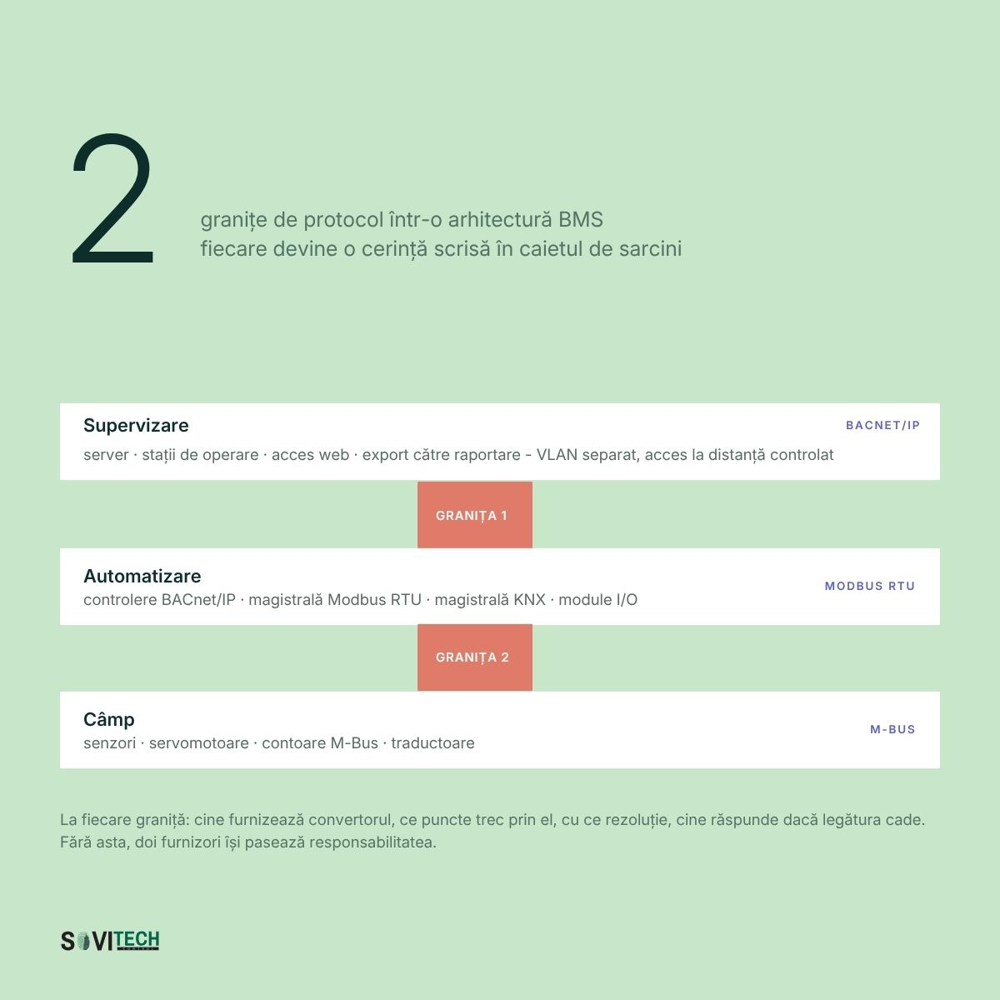
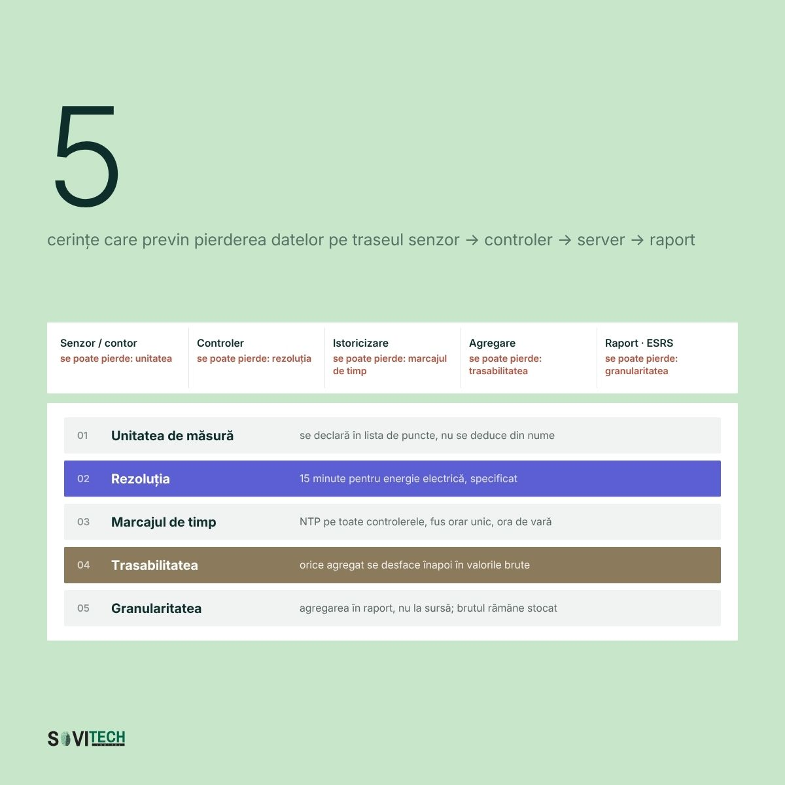

# Article (redesign-2026 branch): Technical specification for a BMS system

> **Unmerged branch content.** This file comes from the branch `redesign-2026` of the SOVITECH website repository, not from `main`. The text is from commit `d2d15d2` (2026-08-24, "Redesign complet: continut editorial, rute noi, identitate vizuala"). The cover and diagrams are from commit `af81353` (2026-08-27, "Materiale vizuale noi: 10 coperti si 15 diagrame"). Owner decision, 2026-09-24: the branch is not SOVITECH's current position and will not be merged. This article is kept for reference only.

This is the full Romanian text of the SOVITECH website article „Caiet de sarcini pentru un sistem BMS”, with its headings, tables, lists, figures, FAQ, sources and page metadata. Source: `components/articles/caiet-de-sarcini-bms.tsx` (body, `meta`, `faq`), rendered at `/ghid/caiet-de-sarcini-bms` by `app/ghid/[slug]/page.tsx`. Page metadata comes from `lib/site-routes.ts`, `lib/article-cards.ts` and `lib/article-covers.ts`. Paths are relative to the website repository root.

## Status of this content

- **Unmerged branch.** This article exists only on the branch `redesign-2026` of the website repository. The branch is not merged into `main`. Owner decision, 2026-09-24: it is not SOVITECH's current position and will not be merged. Keep this article for reference only. It is not what SOVITECH says today. `main` (`e080614`) is the current website, and it does not have this article.
- **Romanian only.** The branch has no English body for this article. The body component has no `t(ro, en)` calls, so the page shows the Romanian text in both site languages. English exists only for the page title, the lead and the category label (from `lib/site-routes.ts`) and the frame labels in `components/article-layout.tsx`.
- **Marketing and editorial copy.** Its figures (costs, percentages, savings, paybacks, point densities, durations, reference ranges) are not verified engineering data and not an approved reference dataset. The app may not use them as values, benchmarks, ranges or prices (guardrails rule 1, section 2.1, rule 9, rule 10, section 10).
- **Legal and standards statements.** The article states laws, thresholds and deadlines as its authors read them on the verification date in its closing note. The app takes legal thresholds and standards only from approved reference data with their edition or date, never from this article (guardrails rule 11). See "Regulatory statements in the articles" in `README.md`.
- **No named author.** The byline is "Echipa de inginerie Sovitech Control". The source file carries the comment `TODO(author): replace with the signing engineer`, so no engineer has signed this text.

## Page facts

| Item | Value |
|------|-------|
| Slug and route | `caiet-de-sarcini-bms`, `/ghid/caiet-de-sarcini-bms` |
| Page type | Pillar guide (`/ghid/`). Registry status `published`, `draft: "drive"`. |
| Editorial id | A05 |
| Category | Modernizare & Retrofit / Modernisation & Retrofit (C6) |
| Personas | P4 Director tehnic / Inginer-șef; P8 Proiectant MEP / Antreprenor general |
| Pillar | none (this is a pillar) |
| H1, RO | Caiet de sarcini pentru un sistem BMS |
| H1, EN | Technical specification for a BMS system |
| Lead, RO | Structura pe 15 secțiuni, lista de puncte, secvențele de funcționare și checklistul de dinaintea licitației. |
| Lead, EN | The 15-section structure, the I/O point list, operating sequences and the pre-tender checklist. |
| `<title>` (RO only) | Caiet de sarcini BMS: ghid complet + model \| Sovitech Control |
| Meta description (RO only, without diacritics as in the source) | Cum se scrie un caiet de sarcini BMS care produce oferte comparabile: structura pe 15 sectiuni, lista de puncte, secvente de functionare si model DOCX. |
| `datePublished` / `dateModified` in `meta` | 2026-08-17 / 2026-08-17. `components/articles/index.ts` calls `dateModified` "the legal-verification date". |
| Card date and read time (`lib/article-cards.ts`) | 17 AUG 2026 / AUG 17, 2026; 20 MIN CITIRE / 20 MIN READ |
| Header line on the page | „Publicat 17.08.2026” (`components/article-layout.tsx`) |
| Author on the page | Rail: „Scris de” / "Written by", „Sovitech Control”, „Echipa de inginerie” / "Engineering team". JSON-LD author and publisher: Organization „Sovitech Control”. No `Person` node. |
| Cover | [`covers/caiet-de-sarcini-bms.jpg`](covers/caiet-de-sarcini-bms.jpg), 1920x1080 JPEG, from `public/coperti/caiet-de-sarcini-bms.jpg`. Card background `#C8E6CA`. Also used as `og:image` and JSON-LD `image`. Alt text on the article page: the RO title. |
| Text on the cover | „15”, „secțiuni într-un caiet de sarcini de BMS”, with the 15 section names in a grid: 01 Domeniu de livrare, 02 Descrierea instalațiilor, 03 Lista de puncte, 04 Arhitectura sistemului, 05 Interoperabilitate, 06 Secvențe de funcționare, 07 Programe orare, 08 Managementul alarmelor, 09 Istoricizare și raportare, 10 Interfața grafică, 11 Securitate OT, 12 Tablouri de automatizare, 13 Punere în funcțiune, 14 Documentație as-built, 15 Criterii de atribuire. Footer „Caiet de sarcini pentru un sistem BMS”. |
| Diagrams | 2, listed below, from `public/diagrame/` |
| FAQ pairs | 5, shown in the body and emitted as `FAQPage` JSON-LD |
| Structured data | `Article` (inLanguage `ro`), `BreadcrumbList` (Acasă > Ghiduri > title), `FAQPage` (`components/article-jsonld.tsx`). Base URL `https://sovitech-website-gaidenic.vercel.app`. |
| Length | About 4,320 words in this Markdown rendering, tables included. |

### Diagrams

| Local copy | Caption in the article (RO, verbatim) |
|------------|----------------------------------------|
| `diagrams/A05-1-arhitectura-caiet-de-sarcini.jpg` | Arhitectura pe trei niveluri a sistemului BMS, cu granițele de protocol și segmentarea rețelei. |
| `diagrams/A05-2-traseul-unui-punct-de-date.jpg` | Traseul unui punct de date, de la senzor sau contor până la linia dintr-un raport de sustenabilitate. |

Text on the diagrams (read from the images): **A05-1** „2 granițe de protocol într-o arhitectură BMS, fiecare devine o cerință scrisă în caietul de sarcini”; Supervizare (BACnet/IP, „VLAN separat, acces la distanță controlat”), Automatizare (Modbus RTU), Câmp (M-Bus); footer „La fiecare graniță: cine furnizează convertorul, ce puncte trec prin el, cu ce rezoluție, cine răspunde dacă legătura cade.” **A05-2** „5 cerințe care previn pierderea datelor pe traseul senzor → controler → server → raport”: unitatea de măsură, rezoluția („15 minute pentru energie electrică, specificat”), marcajul de timp („NTP pe toate controlerele, fus orar unic, ora de vară”), trasabilitatea, granularitatea.

## Article text (RO, verbatim)

How this was rendered: the article's `<h2>` headings are `###` here and its `<h3>` headings are `####`. The lead paragraph (class `standfirst`) and the closing note (class `article-note`) are labelled. Diagrams point to the local copies in `diagrams/`. The FAQ box sits where the page renders it. Internal site links are written as the link text followed by the site path in code, for example „lista de referințe (`/referinte`)”, because root-relative links do not resolve outside the website. Bold and italics are as in the source. Nothing was translated, corrected or shortened.

*Standfirst:* Structura pe 15 secțiuni, lista de puncte, secvențele de funcționare și checklistul de dinaintea licitației.

Un caiet de sarcini BMS este documentul tehnic care descrie ce trebuie să facă sistemul de automatizare, nu ce marcă se cumpără. Descrie funcții verificabile la recepție: puncte de intrare și ieșire, secvențe, protocoale, livrabile, criterii de atribuire. Un document care specifică produse în loc de funcții produce oferte care nu se pot compara.

Costul se plătește de două ori: la ofertare, unde prețurile nu sunt comparabile, și la recepție, unde tot ce nu a fost cerut devine lucrare suplimentară. BMS (Building Management System, a nu se confunda cu Battery Management System) apare în textele legale ca BACS, sisteme de automatizare și control al clădirilor.

<a id="pe-scurt"></a>
### Pe scurt

- Lista de puncte (I/O list) face ofertele comparabile: din ea rezultă controlerele, cablul și orele de programare.
- Diferența de preț între două oferte vine, de cele mai multe ori, din numărul de puncte, nu din marca echipamentelor.
- Legea nr. 372/2005, art. 27 alin. (5), cere automatizare peste 290 kW, cu termen depășit din 31 decembrie 2024.
- Pragul de 70 kW și monitorizarea calității mediului interior vin din Directiva (UE) 2024/1275 și nu sunt încă în legea română.
- Punerea în funcțiune se bugetează separat: ce nu are preț în ofertă dispare din execuție.
- Opt formulări din secțiunea de interoperabilitate decid dacă furnizorul mai poate fi schimbat.

### Cuprins

*Navigation (Cuprins):*

- [Pe scurt](#pe-scurt)
- [Cele șapte defecte care scumpesc licitația de automatizări](#cele-sapte-defecte-care-scumpesc-licitatia)
- [Structura caietului de sarcini BMS, pe 15 secțiuni](#structura-pe-15-sectiuni)
- [Pragul de 290 kW și capabilitățile cerute de Directiva 2024/1275](#pragul-de-290-kw-si-capabilitatile-cerute)
- [Opt formulări care previn blocarea la un singur furnizor](#opt-formulari-impotriva-blocarii-la-un-furnizor)
- [Clauzele de licențe, cod sursă și parole de inginerie](#clauze-licente-cod-sursa-parole-de-inginerie)
- [Caietul de modernizare: patru secțiuni în plus față de construcția nouă](#caietul-de-modernizare-patru-sectiuni-in-plus)
- [Checklist de 20 de puncte înainte de licitație](#checklist-de-20-de-puncte-inainte-de-licitatie)
- [Ce înseamnă pentru directorul tehnic și pentru proiectantul MEP](#ce-inseamna-pentru-directorul-tehnic-si-proiectantul-mep)
- [Întrebări frecvente](#intrebari-frecvente)
- [Concluzie](#concluzie)
- [Modelul DOCX de caiet de sarcini BMS](#modelul-docx-de-caiet-de-sarcini-bms)

<a id="cele-sapte-defecte-care-scumpesc-licitatia"></a>
### Cele șapte defecte care scumpesc licitația de automatizări

Cele șapte defecte de mai jos apar în majoritatea caietelor de sarcini pentru automatizări și fiecare are un cost măsurabil la recepție. Explicația comună: caietele pentru automatizări se scriu sub presiune de timp, la finalul proiectului de instalații.

1. **Descriere copiată din fișa tehnică a unui producător.** Scrie numele produsului fără să îl scrie, iar ofertanții care nu îl vând se retrag.
2. **Lipsa listei de puncte.** Fiecare ofertant își inventează propriul număr de puncte, iar diferența se plătește la final.
3. **„Se va furniza un sistem BMS performant.”** O cerință pe care o comisie nu o poate bifa nu este cerință.
4. **Lipsa secvențelor.** Le scrie programatorul după licitație, în funcție de cât timp îi rămâne.
5. **Punerea în funcțiune nebugetată.** Cine o include pare scump și pierde, cine o omite câștigă și apoi negociază.
6. **Documentația as-built necerută.** Se predau schemele de proiect, nu cele reale.
7. **Licențele nespecificate.** Puncte, utilizatori, drivere, licența de dezvoltare: nescrise, devin facturi anuale.

<a id="structura-pe-15-sectiuni"></a>
### Structura caietului de sarcini BMS, pe 15 secțiuni

Cincisprezece secțiuni, în ordinea în care se scriu.

#### 1. Limitele de livrare: senzori, cablu de automatizare, racorduri și adrese IP

Aici se stabilește unde începe și unde se termină responsabilitatea integratorului. Majoritatea conflictelor de șantier nu sunt despre calitate, ci despre cine trebuia să facă ceva.

- cine furnizează și cine montează senzorii de conductă și de canal;
- cine trage cablul de automatizare și cine cablul de forță;
- cine racordează echipamentele cu automatizare proprie (chillere, cazane, UPS);
- cine asigură alimentarea tablourilor și adresele IP.

#### 2. Descrierea instalațiilor: CTA, surse termice și frigorifice, contoare cu protocol

Descrierea instalațiilor este referința pe care se construiește lista de puncte, pentru că automatizarea nu se poate specifica în absența instalației.

- centralele de tratare a aerului (CTA), cu debite și baterii;
- sursele termice și frigorifice, cu puteri nominale;
- circuitele de distribuție, pompele, ventilarea de desfumare;
- contoarele existente, cu tip și protocol.

#### 3. Lista de puncte (I/O list): DI, DO, AI, AO și punctele software

Lista de puncte transformă o descriere narativă într-o cantitate. Din ea rezultă numărul de controlere, dimensiunea tablourilor, metrii de cablu și orele de programare. Este primul lucru care lipsește din caiete și ultimul care se cere la recepție.

Formatul minim: număr curent, echipament, denumire, tip (DI, DO, AI, AO, SW), semnal, alarmă, istoricizare. Punctele software se listează separat: nu consumă intrări fizice, dar consumă licență și ore de configurare.

| Nr. | Echipament / zonă | Denumire punct | Tip | Semnal | Alarmă | Istoric |
|---|---|---|---|---|---|---|
| 1 | CTA-01 birouri et. 1-3 | Temperatură aer refulare | AI | Ni1000, -20...+80 °C | Da (dev. peste 3 K) | 15 min |
| 2 | CTA-01 | Temperatură aer exterior | AI | Ni1000, -30...+50 °C | Nu | 15 min |
| 3 | CTA-01 | Comandă ventilator refulare | AO | 0-10 V DC | Nu | 1 h |
| 4 | CTA-01 | Confirmare funcționare ventilator | DI | Contact liber | Da (prioritate 2) | Eveniment |
| 5 | CTA-01 | Avarie convertizor de frecvență | DI | Contact NC | Da (prioritate 1) | Eveniment |
| 6 | CTA-01 | Comandă vană baterie încălzire | AO | 0-10 V DC | Nu | 15 min |
| 7 | CTA-01 | Termostat antiîngheț | DI | Contact NC, hardware | Da (prioritate 1) | Eveniment |
| 8 | CTA-01 | Presiune diferențială filtru | DI | Presostat reglabil | Da (prioritate 3) | Eveniment |
| 9 | Open space et. 2 | Concentrație CO2 | AI | 0-10 V, 0-2000 ppm | Da (peste 1000 ppm) | 15 min |
| 10 | CTA-01 | Randament recuperator | SW | 0-100 % | Da (sub 55 %) | 15 min |

Lista reală a unei clădiri de birouri de 15.000 mp are, orientativ, 750-1.350 de puncte fizice, adică 50-90 de puncte la 1.000 mp, estimare din proiecte comparabile. Densitatea aceasta este cea folosită și în calculele de cost pe punct, de 90-320 EUR, din materialele despre prețul unui sistem BMS.

#### 4. Arhitectura pe trei niveluri și granițele de protocol

Trei niveluri: câmp, automatizare și supervizare. Logica de reglaj se cere în controler, nu în server: la căderea serverului, clădirea trebuie să rămână reglată.

- topologia magistralelor și numărul maxim de puncte per controler;
- rezervă de 15-20 % intrări și ieșiri libere;
- comportamentul la pierderea comunicației, redundanța serverului și a alimentării.



*Figure (`/diagrame/A05-1-arhitectura-caiet-de-sarcini.jpg`):* Arhitectura pe trei niveluri a sistemului BMS, cu granițele de protocol și segmentarea rețelei.

#### 5. Interoperabilitate: BACnet/IP nativ, PICS la ofertare, Modbus, KNX, M-Bus

Interoperabilitatea decide dacă furnizorul mai poate fi schimbat peste cinci ani. Se cer capabilități native, verificabile la ofertare, nu compatibilitate declarată. Detalii în materialele despre BMS, SCADA și integrare (`/resurse/bms-scada-integrare`).

- controlere cu BACnet/IP sau MS/TP nativ, cu PICS prezentat la ofertare;
- Modbus pentru echipamente terțe, KNX pentru iluminat, M-Bus pentru contorizare;
- toate punctele expuse ca obiecte BACnet standard, fără licență suplimentară.

#### 6. Secvențele de funcționare, scrise ca text și anexate la caiet

Secvența descrie în text comportamentul instalației în toate regimurile și se atașează ca anexă. Un programator care primește secvențe scrise nu improvizează, iar comisia de recepție are ce verifica. Pentru o centrală de tratare a aerului (CTA):

- condițiile de pornire și oprire, ordinea clapetelor și a ventilatoarelor, temporizările;
- reglajul în cascadă temperatură cameră spre refulare, free cooling, degivrarea recuperatorului;
- protecția la îngheț, interblocarea cu detecția de incendiu, regimul de avarie.

**Exemplu de secvență scrisă corect, CTA-01, protecție la îngheț:**

Termostatul antiîngheț montat după bateria de încălzire acționează pe două căi. Calea hardware: contactul NC deschis oprește direct ventilatoarele de refulare și evacuare, prin cablare independentă de controler, și închide clapetele de aer exterior în maximum 30 de secunde. Calea software: controlerul înregistrează alarma de prioritate 1, deschide vana bateriei la 100 % și pornește pompa de circulație, indiferent de programul orar.

Repornirea nu se face automat. Este necesară confirmarea manuală din interfața de supervizare, după dispariția condiției de alarmă, cu înregistrarea utilizatorului și a momentului în jurnal. Când temperatura pe returul bateriei scade sub 8 °C timp de peste 5 minute în regim oprit, controlerul pornește pompa în regim de protecție, fără ventilatoare.

#### 7. Programe orare și night setback: setpoint ocupat și setpoint neocupat

Aici se scrie cum își reduce clădirea consumul când nu este folosită. Altfel, sistemul livrat funcționează 24/7 la aceiași parametri. Limita de reținut: night setback nu se aplică în spații cu control de umiditate.

- câte programe orare independente și pe ce zone;
- setpoint-urile ocupat și neocupat, pe sezon, cu banda moartă;
- pornirea optimizată, sărbătorile, excepțiile (depozite farmaceutice, camere tehnice).

#### 8. Managementul alarmelor pe patru clase, de la P1 critică la P4 informativă

Un sistem care generează 400 de alarme pe zi nu are management de alarme, are zgomot. Clasificarea se scrie în caiet, nu se lasă pe seama șantierului.

| Clasă | Tip de eveniment | Destinatar | Timp de răspuns | Escaladare |
|---|---|---|---|---|
| P1 critică | Antiîngheț, avarie sursă termică sau frigorifică, pierdere de comunicație | Dispecerat, tehnician de serviciu (SMS) | Imediat, 24/7 | La 15 minute fără confirmare, șef mentenanță |
| P2 majoră | Lipsă confirmare de funcționare, deviație peste 3 K mai mult de 30 de minute | Facility manager (email) | În aceeași tură | La 4 ore fără confirmare, devine P1 |
| P3 mentenanță | Filtru colmatat, ore de funcționare depășite, senzor în afara domeniului | Echipa de mentenanță (raport zilnic) | Intervenția planificată | Raport săptămânal |
| P4 informativă | Schimbare de regim, modificare de setpoint, autentificare | Doar jurnal | Fără | Fără |

Se mai scriu: temporizarea de anti-oscilație, gruparea alarmelor cu aceeași cauză și jurnalul needitabil.

#### 9. Istoricizare la 15 minute și retenție de minimum 24 de luni

Datele care nu se înregistrează acum nu se pot recupera. Istoricizarea decide dacă, peste doi ani, clădirea produce un raport auditabil sau plătește pe cineva să citească contoare manual. Context în ghidul despre datele pentru raportarea ESG (`/ghid/date-esg-cladiri`).

- ce se înregistrează: puncte de energie, temperaturi, stări, alarme;
- rezoluția: 15 minute pentru energie, la eveniment pentru stări;
- păstrare minimum 24 de luni online, export CSV și API;
- rapoarte automate pe zonă, kWh/mp, top 10 alarme, cu destinatari.



*Figure (`/diagrame/A05-2-traseul-unui-punct-de-date.jpg`):* Traseul unui punct de date, de la senzor sau contor până la linia dintr-un raport de sustenabilitate.

#### 10. Interfața grafică: lista sinopticelor și navigare în maximum trei clicuri

Nivelul de detaliu al sinopticelor este o cantitate ofertabilă, deci se cere în cifre. „Interfață grafică intuitivă” nu înseamnă nimic la recepție.

- lista sinopticelor: ansamblu, câte o pagină pe centrală, surse, planuri de etaj, energie, alarme;
- navigare în maximum trei clicuri, denumiri în limba română;
- acces din browser fără plugin, cu drepturi pe roluri.

#### 11. Securitate cibernetică OT: VLAN dedicat, VPN cu doi factori, conturi nominale

Un sistem BMS (Building Management System) este, tehnic, o rețea industrială conectată la rețeaua clădirii. Pentru operatorii din sfera NIS2, transpusă prin [OUG nr. 155/2024](https://legislatie.just.ro/public/DetaliiDocument/293121), aprobată prin Legea nr. 124/2025, obligațiile sunt neutre tehnologic și acoperă sistemele informatice folosite pentru furnizarea serviciului. Aplicarea lor la BMS este o interpretare practică, nu un articol de lege dedicat.

- VLAN dedicat automatizării, cu reguli de firewall documentate;
- fără controlere expuse în internet, acces la distanță doar prin VPN cu doi factori;
- conturi nominale, parole implicite schimbate la punerea în funcțiune;
- lista de adrese IP și servicii active, predată la recepție.

#### 12. Tablourile de automatizare: marcare, separare de forță, rezervă de 20 %

- grad de protecție și clasă de execuție conform standardului aplicabil;
- marcare permanentă a bornelor și conductoarelor, corelată cu schemele;
- separarea circuitelor de forță de cele de semnal, comutatoare manual-oprit-automat;
- sursă neîntreruptibilă, rezervă de spațiu de 20 %, schema electrică în ușă.

#### 13. Punerea în funcțiune bugetată separat, cu FAT și SAT punct cu punct

Punerea în funcțiune se bugetează ca poziție distinctă de deviz, în zile-om. Se cere FAT, testare în atelier pe tablou și pe program, apoi SAT pe instalația reală, punct cu punct.

- verificarea 100 % a punctelor, cu proces-verbal pe fiecare;
- testarea alarmelor prin provocare reală, nu prin forțare de valoare;
- reglaj fin pe două sezoane, cu raport.

La o listă de 1.000 de puncte, verificarea integrală se planifică în săptămâni, nu în zile.

#### 14. Documentația as-built, instruirea și garanția, ca livrabile care condiționează recepția

Documentația se cere ca livrabil condiționat: fără ea, recepția nu se semnează. Sovitech Control, integrator de automatizări cu sediul în București, livrează curent documentație as-built ca parte din scopul de execuție, alături de programele de control.

| Livrabil la recepție | Format | Criteriu de acceptare |
|---|---|---|
| Scheme electrice as-built | DWG + PDF | Corespondență 1:1 cu execuția, sondaj pe 10 % din borne |
| Lista de puncte finală | XLSX editabil | Adresă fizică, adresă de obiect și rezultat de test pe fiecare punct |
| Secvențele implementate | PDF + fișiere sursă | Identice cu anexa din caiet sau cu abateri aprobate în scris |
| Programele de aplicație | Fișiere sursă | Se deschid și se compilează pe stația beneficiarului |
| Configurația de rețea | XLSX + schemă | IP, VLAN, porturi, servicii, conturi |
| Licențe | Certificate nominale | Emise pe numele beneficiarului, nu al integratorului |
| Procese-verbale FAT și SAT | PDF semnat | Toate punctele testate, fără poziții deschise |
| Manual de operare în română | PDF | Acoperă sinopticele și procedurile de alarmă |
| Instruire | Sesiuni la fața locului | Minimum 2 sesiuni x 4 ore, cu listă de prezență |

Se mai cer: durata garanției, timpul de răspuns pe clase de alarmă și prețul mentenanței pe primii trei ani.

#### 15. Criterii de atribuire: preț 60-70 %, cost de operare 15-20 %

Atribuirea exclusiv pe preț livrează exact ce s-a plătit. Calificarea filtrează ofertanții incapabili, atribuirea departajează ofertele valide.

- două proiecte similare ca număr de puncte în ultimii cinci ani, cu recomandări;
- lista de puncte completată și o secvență model, prezentate la ofertare;
- factori orientativi: preț 60-70 %, cost de operare pe cinci ani 15-20 %, interoperabilitate 10-15 %.

<a id="pragul-de-290-kw-si-capabilitatile-cerute"></a>
### Pragul de 290 kW și capabilitățile cerute de Directiva 2024/1275

Legea română în vigoare este [Legea nr. 372/2005](https://legislatie.just.ro/Public/DetaliiDocument/66970). Art. 27 alin. (5): până la 31 decembrie 2024, clădirile nerezidențiale cu sisteme de încălzire, de climatizare, sau combinate cu ventilare, cu putere nominală utilă de peste 290 kW pe familie de sisteme, se echipează, dacă este fezabil tehnic și economic, cu sisteme de automatizare și control al clădirilor. Art. 29 alin. (6) are formulare identică pentru climatizare. Termenul a fost 31 decembrie 2024 și este depășit, iar sancțiunile au fost majorate prin [Legea nr. 238/2024](https://legislatie.just.ro/public/DetaliiDocument/285769).

Capabilitățile cerute sunt enumerate în [Directiva (UE) 2024/1275](https://eur-lex.europa.eu/eli/dir/2024/1275/oj/eng), art. 13 alin. (10): monitorizarea, înregistrarea, analiza și ajustarea continuă a consumului, evaluarea comparativă a eficienței cu detectarea pierderilor și informarea persoanei responsabile, comunicarea cu sistemele tehnice conectate și interoperabilitatea între tehnologii proprietare diferite. Transcrise în caietul de sarcini, devin verificabile: istoricizare la 15 minute pe energie, raport lunar de kWh/mp, alarmă la deviație de randament, obiecte BACnet standard.

Ce vine, dar **nu este încă în legea română**: pragul de 70 kW, cu termen 31 decembrie 2029, provine din Directiva (UE) 2024/1275, art. 13 alin. (9) lit. b), și nu este încă transpus în legea română. Aceeași directivă adaugă, din 29 mai 2026, monitorizarea calității mediului interior (art. 13 alin. (10) lit. d). La 15 iulie 2026, Comisia Europeană a trimis [scrisori de punere în întârziere](https://energy.ec.europa.eu/news/commission-calls-eu-countries-transpose-reinforced-rules-energy-performance-buildings-2026-07-15_en) tuturor celor 27 de state membre. În caietul de sarcini, cerințele acestea se scriu ca opțiuni pregătite: rezervă de puncte pentru senzori de CO2 și umiditate.

Pentru încadrarea unei clădiri concrete se poate cere o verificare a pragului de putere pentru clădirea respectivă (`/contact`), iar contextul de reglementare este strâns în materialele despre reglementări și conformare (`/resurse/reglementari-conformare`).

<a id="opt-formulari-impotriva-blocarii-la-un-furnizor"></a>
### Opt formulări care previn blocarea la un singur furnizor

Opt fraze gata de copiat, fiecare înlocuind o formulare care restrânge concurența.

1. „Controlerele vor comunica nativ BACnet/IP sau BACnet MS/TP, fără gateway intermediar. Ofertantul prezintă documentul PICS al fiecărui tip de controler.”
2. „Toate punctele fizice și software vor fi expuse ca obiecte BACnet standard, citibile de orice client terț, fără licență suplimentară și fără taxă per punct.”
3. „Beneficiarul primește la recepție licența de dezvoltare a aplicației, emisă pe numele său, împreună cu programele sursă în format editabil.”
4. „Orice modificare ulterioară va putea fi realizată de orice integrator instruit pe platforma ofertată. Ofertantul declară condițiile de acces la instruire.”
5. „Istoricul de date va putea fi exportat integral în CSV și prin API documentat, la inițiativa beneficiarului, fără intervenția furnizorului.”
6. „Nu se acceptă protocoale proprietare pe magistrala dintre controlere. Ele sunt admise doar în echipamentele cu automatizare proprie, cu expunerea parametrilor prin Modbus sau BACnet.”
7. „Costul total de deținere pe cinci ani, cu licențe, mentenanță și extindere cu 10 % puncte, se prezintă defalcat și devine factor de atribuire.”
8. „Senzorii și elementele de execuție vor fi standard, cu semnale 0-10 V, 4-20 mA sau Ni1000/Pt1000, înlocuibile cu produse echivalente, fără reprogramare.”

Context: componentele unui sistem BMS (`/ghid/sisteme-bms-cladiri`) și integrarea KNX, DALI, Modbus și M-Bus (`/servicii/integrare-sisteme-knx-dali-modbus-mbus`).

<a id="clauze-licente-cod-sursa-parole-de-inginerie"></a>
### Clauzele de licențe, cod sursă și parole de inginerie

Licențele, codul sursă al aplicației și parolele de nivel inginerie sunt cele trei lucruri care decid dacă beneficiarul deține sistemul de automatizare sau doar îl folosește. Sunt și cele mai ieftin de obținut: costă o clauză scrisă înainte de licitație și devin aproape imposibil de obținut după recepție. Un caiet de sarcini BMS care le omite produce un sistem funcțional și un proprietar captiv.

Clauzele de inclus, formulate ca livrabile verificabile:

- **Licențe nominale.** Toate licențele de server, de client, de driver de protocol și de puncte se emit pe numele beneficiarului, nu al integratorului, și se predau ca certificate la recepție. Cantitatea se scrie în cifre: număr de puncte licențiate, număr de utilizatori simultani, drivere incluse.
- **Licența de dezvoltare.** Beneficiarul primește licența cu care se modifică aplicația, nu doar licența de rulare. Fără ea, orice schimbare de secvență trece obligatoriu prin integratorul inițial.
- **Taxa anuală de software, declarată la ofertare.** Mentenanța de software se cuantifică la ofertare, ca procent din valoarea componentei software, tipic 8-18 % pe an, și intră în costul total de deținere pe cinci ani.
- **Codul sursă al aplicației.** Programele de control, sinopticele și configurațiile se predau în format editabil, cu dovada că se deschid și se compilează pe stația beneficiarului. Un fișier compilat, fără sursă, nu este documentație.
- **Parolele de nivel inginerie.** Se predau la recepție, în plic sigilat sau prin seif de parole, pentru toate nivelurile de acces: controler, server, stație de operare, echipamente de rețea. Se predau și conturile de service ale producătorului, dacă platforma le are.
- **Interdicția blocărilor la distanță.** Fără dispozitive de limitare temporală, fără chei hardware deținute de integrator, fără funcții care opresc sistemul la expirarea contractului de mentenanță.
- **Exportul de date.** Istoricul complet se exportă în CSV și prin API documentat, la inițiativa beneficiarului, fără intervenția furnizorului.

Detaliul care se vede numai în proiecte de modernizare: parola de nivel inginerie lipsește din documentația predată în majoritatea clădirilor cu sistem existent, iar recuperarea ei înseamnă fie negociere cu integratorul care a plecat, fie reprogramarea completă a controlerelor. Sovitech Control a întâlnit situația în modernizări din București destul de des încât clauza aceasta să fie prima verificată la preluarea unui sistem.

<a id="caietul-de-modernizare-patru-sectiuni-in-plus"></a>
### Caietul de modernizare: patru secțiuni în plus față de construcția nouă

La o clădire existentă riscul nu este tehnologia, ci necunoscutul. Caietul de sarcini pentru modernizare adaugă patru secțiuni față de cel pentru construcție nouă.

**Inventarul existent.** Controlere, firmware, protocoale, starea cablajului, licențele și cine le deține. Detaliu de teren: senzorii de CO2 se decalibrează în 2-3 ani și aproape nimeni nu îi verifică, deci „se păstrează” este o decizie care se ia după măsurare.

**Etapizarea.** Ce se înlocuiește și în ce ordine. Regula practică: sursele termice nu se ating iarna, instalația de frig nu se atinge în iulie.

**Funcționarea în paralel.** Cât timp coexistă cele două sisteme, cine răspunde de fiecare zonă și cum se revine.

**Migrarea punctelor.** Corespondența între denumirile vechi și cele noi, importul istoricului. Pașii de evaluare sunt în materialele despre modernizare și retrofit (`/resurse/modernizare-retrofit`), execuția în pagina de modernizare a sistemelor de automatizare (`/servicii/modernizare-sisteme-de-automatizare-si-bms`).

<a id="checklist-de-20-de-puncte-inainte-de-licitatie"></a>
### Checklist de 20 de puncte înainte de licitație

1. Limitele de livrare sunt explicite, inclusiv racordurile electrice.
2. Lista de puncte este completă, cu tip, semnal, alarmă și istoricizare.
3. Punctele software sunt listate separat de cele fizice.
4. Există rezervă de 15-20 % pe intrări și ieșiri.
5. Secvențele de funcționare sunt scrise pentru fiecare tip de echipament.
6. Protecțiile de siguranță au cale hardware, nu doar software.
7. Interblocările cu detecția de incendiu sunt descrise.
8. Cerințele de protocol sunt native, cu PICS cerut la ofertare.
9. Nu apare niciun nume de produs fără mențiunea „sau echivalent”.
10. Licențele sunt cuantificate: puncte, utilizatori, drivere, dezvoltare.
11. Licențele se emit pe numele beneficiarului.
12. Parolele de nivel inginerie și codul sursă sunt cerute ca livrabile la recepție.
13. Exportul de date în CSV și prin API este cerut explicit.
14. Clasele de alarmă, destinatarii și escaladarea sunt definite.
15. Istoricizarea are rezoluție de 15 minute și retenție de minimum 24 de luni.
16. Rapoartele automate sunt listate, cu destinatari și frecvență.
17. Securitatea OT este inclusă: VLAN, VPN, conturi nominale.
18. Punerea în funcțiune este poziție distinctă de deviz.
19. FAT și SAT sunt cerute, cu proces-verbal pe fiecare punct, iar documentația as-built, instruirea și manualul condiționează recepția.
20. Criteriile de atribuire includ costul de operare pe cinci ani.

<a id="ce-inseamna-pentru-directorul-tehnic-si-proiectantul-mep"></a>
### Ce înseamnă pentru directorul tehnic și pentru proiectantul MEP

**Pentru directorul tehnic și inginerul-șef**, secțiunile decisive ale caietului de sarcini BMS sunt lista de puncte, secvențele de funcționare și criteriile de atribuire. Două zile alocate listei de puncte elimină aproape complet negocierea de după semnare. Resurse pe pagina pentru directorul tehnic.

**Pentru proiectantul MEP și antreprenorul general**, caietul de sarcini protejează propriul contract: limitele de livrare scrise prost se întorc ca lucrări neprevăzute. Detalii în secțiunea pentru proiectanți și antreprenori și la proiectare de automatizări și BMS (`/servicii/proiectare-automatizari-bms`).

<a id="intrebari-frecvente"></a>
### Întrebări frecvente

*(FAQ box, rendered from the exported `faq` list; the same pairs feed the FAQPage JSON-LD. Questions verbatim, some without diacritics as in the source.)*

**Cat de lung trebuie sa fie un caiet de sarcini BMS?**

Nu lungimea contează, ci verificabilitatea. Un caiet de 25 de pagini cu listă de puncte și secvențe este mai util decât unul de 80 de pagini cu descrieri generale. Anexele sunt de obicei mai voluminoase decât corpul documentului.

**Se poate cere un anumit producator in caietul de sarcini?**

La achiziții private, da. La achiziții publice, indicarea unei mărci fără mențiunea „sau echivalent” este, în general, restrictivă. Soluția mai bună în ambele cazuri: se specifică funcții verificabile, nu produse. Concurența rămâne deschisă, iar rezultatul tehnic este același.

**Cine ar trebui să scrie lista de puncte?**

Proiectantul de automatizări, împreună cu proiectantul de instalații. Dacă proiectul nu are specialist de automatizări, lista de puncte poate fi elaborată de un integrator ca serviciu de consultanță, separat de execuție, pentru ca autorul specificației să nu fie și singurul ofertant posibil.

**Ce se face dacă instalațiile nu sunt încă proiectate complet?**

Caietul de sarcini se scrie pe listele de echipamente disponibile, cu o clauză de ajustare cantitativă: preț unitar ferm per punct DI, DO, AI, AO și per punct software, aplicabil la diferențele față de lista inițială.

**Ce se intampla daca lipsesc parolele de inginerie la preluarea unui sistem?**

Există două ieșiri, ambele scumpe. Prima: negocierea cu integratorul care a instalat sistemul, aflat acum în poziție de monopol. A doua: reprogramarea controlerelor de la zero, cu reconstruirea secvențelor de funcționare și pierderea istoricului de date. Clauza de predare a parolelor la recepție costă o singură frază în caietul de sarcini.

<a id="concluzie"></a>
### Concluzie

Un caiet de sarcini bun se recunoaște după o singură proprietate: fiecare cerință poate fi bifată de o comisie de recepție cu un instrument sau cu un document în mână. Lista de puncte, secvențele de funcționare, clauzele de licențe și parole și punerea în funcțiune bugetată separat produc mai multă economie decât orice negociere de preț.

<a id="modelul-docx-de-caiet-de-sarcini-bms"></a>
### Modelul DOCX de caiet de sarcini BMS

Modelul DOCX conține cele 15 secțiuni ale caietului de sarcini BMS cu text comentat, tabelul de listă de puncte, cele opt formulări împotriva blocării la un singur furnizor și checklistul de 20 de puncte.

**Cere modelul de caiet de sarcini BMS** (`/contact`). Alternativ, inginerii noștri revizuiesc un caiet existent și returnează observațiile pe secțiuni, înainte de licitație.

*Article note (class `article-note`):* Articol publicat 17.08.2026, actualizat 18.08.2026. Informațiile juridice au fost verificate la 17.08.2026. Legea 372/2005 se reverifică în textul consolidat înainte de publicare, iar articolul se actualizează la transpunerea Directivei (UE) 2024/1275. Autor: Echipa de inginerie Sovitech Control.

## Sources and links in the article

External sources cited (URL, then the anchor text as written):

- <https://legislatie.just.ro/public/DetaliiDocument/293121>: „OUG nr. 155/2024”
- <https://legislatie.just.ro/Public/DetaliiDocument/66970>: „Legea nr. 372/2005”
- <https://legislatie.just.ro/public/DetaliiDocument/285769>: „Legea nr. 238/2024”
- <https://eur-lex.europa.eu/eli/dir/2024/1275/oj/eng>: „Directiva (UE) 2024/1275”
- <https://energy.ec.europa.eu/news/commission-calls-eu-countries-transpose-reinforced-rules-energy-performance-buildings-2026-07-15_en>: „scrisori de punere în întârziere”

Internal links (site path, status on the branch):

- `/resurse/bms-scada-integrare`: published (category archive) in `lib/site-routes.ts`
- `/ghid/date-esg-cladiri`: published (ghid) in `lib/site-routes.ts`
- `/contact`: static page on the branch
- `/resurse/reglementari-conformare`: published (category archive) in `lib/site-routes.ts`
- `/ghid/sisteme-bms-cladiri`: published (ghid) in `lib/site-routes.ts`
- `/servicii/integrare-sisteme-knx-dali-modbus-mbus`: published (servicii) in `lib/site-routes.ts`
- `/resurse/modernizare-retrofit`: published (category archive) in `lib/site-routes.ts`
- `/servicii/modernizare-sisteme-de-automatizare-si-bms`: published (servicii) in `lib/site-routes.ts`
- `/servicii/proiectare-automatizari-bms`: published (servicii) in `lib/site-routes.ts`

The source file lists links that were weakened because their target page is not built yet (`LINKS-TO-REACTIVATE`). Each line gives the anchor text, the interim target and the planned final target. Verbatim:

```text
// LINKS-TO-REACTIVATE:
// materialele despre BMS, SCADA si integrare | interim /resurse/bms-scada-integrare | final /ghid/protocoale-automatizarea-cladirilor
// materialele despre modernizare si retrofit | interim /resurse/modernizare-retrofit | final /ghid/modernizare-bms
// materialele despre reglementari si conformare | interim /resurse/reglementari-conformare | final /ghid/conformare-cladiri-romania
// Cere modelul de caiet de sarcini BMS | interim /contact | final /instrumente/model-caiet-de-sarcini-bms
// cere o verificare a pragului de putere | interim /contact | final /instrumente/test-obligatie-bacs
// pagina pentru directorul tehnic | interim text fara link | final /pentru/director-tehnic
// sectiunea pentru proiectanti si antreprenori | interim text fara link | final /pentru/proiectanti-antreprenori
```

## Notes

- Pillar guide for the specification cluster. It gets its own callout on the branch `/resurse` page.
- The „Pe scurt” list cites only „Legea nr. 372/2005, art. 27 alin. (5)” for the 290 kW rule, without art. 29 alin. (6) and without „pe familie de sisteme”. The body section gives both articles and the per-family wording.
- Life-safety: the installation list names „ventilarea de desfumare”, the operating sequences include „interblocarea cu detecția de incendiu”, and the pre-tender checklist asks that „Interblocările cu detecția de incendiu sunt descrise”. The article does not say which system carries out the interlock. Guardrails rule 11 makes smoke control and fire reactions life-safety: the fire system or a hardwired interlock carries out the reaction, and the BMS only monitors, displays, logs and alarms. The app's proposals do not follow this article on that point.
- NIS2: states that OUG nr. 155/2024 was „aprobată prin Legea nr. 124/2025”. `scada-vs-bms` does not mention the approving law.
- The template it offers („Modelul DOCX”) is a planned tool (`/instrumente/model-caiet-de-sarcini-bms`, status `planned`). The link goes to `/contact` for now.
- Dates: `meta` says 2026-08-17 for both; the closing note says „actualizat 18.08.2026”. The closing note gives a later update date than `meta.dateModified`, so the page header shows no „Actualizat” date. By the comment in `components/articles/index.ts`, `dateModified` is the legal-verification date, which explains the gap but is not what a reader sees.
