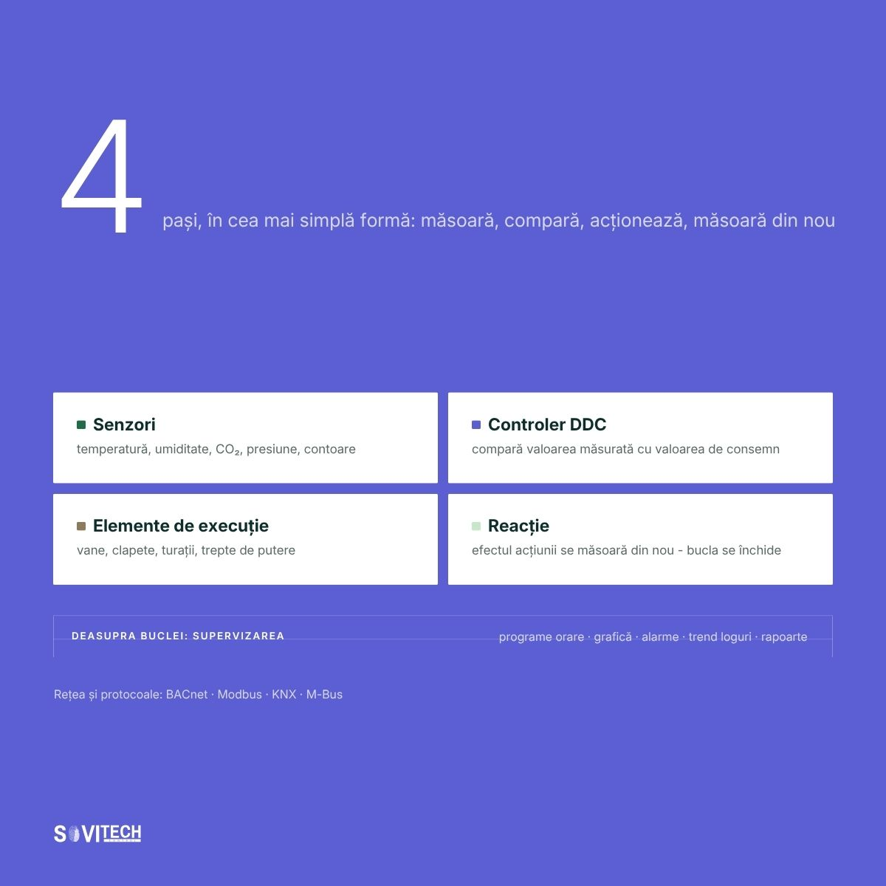

# Article (redesign-2026 branch): What a BMS system is, and what it is not

> **Unmerged branch content.** This file comes from the branch `redesign-2026` of the SOVITECH website repository, not from `main`. The text is from commit `d2d15d2` (2026-08-24, "Redesign complet: continut editorial, rute noi, identitate vizuala"). The cover and diagrams are from commit `af81353` (2026-08-27, "Materiale vizuale noi: 10 coperti si 15 diagrame"). Owner decision, 2026-09-24: the branch is not SOVITECH's current position and will not be merged. This article is kept for reference only.

This is the full Romanian text of the SOVITECH website article „Ce este un sistem BMS și cu ce nu trebuie confundat”, with its headings, tables, lists, figures, FAQ, sources and page metadata. Source: `components/articles/ce-este-un-sistem-bms.tsx` (body, `meta`, `faq`), rendered at `/resurse/ce-este-un-sistem-bms` by `app/resurse/[slug]/page.tsx`. Page metadata comes from `lib/site-routes.ts`, `lib/article-cards.ts` and `lib/article-covers.ts`. Paths are relative to the website repository root.

## Status of this content

- **Unmerged branch.** This article exists only on the branch `redesign-2026` of the website repository. The branch is not merged into `main`. Owner decision, 2026-09-24: it is not SOVITECH's current position and will not be merged. Keep this article for reference only. It is not what SOVITECH says today. `main` (`e080614`) is the current website, and it does not have this article.
- **Romanian only.** The branch has no English body for this article. The body component has no `t(ro, en)` calls, so the page shows the Romanian text in both site languages. English exists only for the page title, the lead and the category label (from `lib/site-routes.ts`) and the frame labels in `components/article-layout.tsx`.
- **Marketing and editorial copy.** Its figures (costs, percentages, savings, paybacks, point densities, durations, reference ranges) are not verified engineering data and not an approved reference dataset. The app may not use them as values, benchmarks, ranges or prices (guardrails rule 1, section 2.1, rule 9, rule 10, section 10).
- **Legal and standards statements.** The article states laws, thresholds and deadlines as its authors read them on the verification date in its closing note. The app takes legal thresholds and standards only from approved reference data with their edition or date, never from this article (guardrails rule 11). See "Regulatory statements in the articles" in `README.md`.
- **No named author.** The byline is "Echipa de inginerie Sovitech Control". The source file carries the comment `TODO(author): replace with the signing engineer`, so no engineer has signed this text.

## Page facts

| Item | Value |
|------|-------|
| Slug and route | `ce-este-un-sistem-bms`, `/resurse/ce-este-un-sistem-bms` |
| Page type | Cluster article (`/resurse/`). Registry status `published`, `draft: "drive"`. |
| Editorial id | A07 |
| Category | BMS, SCADA & Integrare / BMS, SCADA & Integration (C4) |
| Personas | P1 Proprietar / Dezvoltator / Investitor; P3 Facility Manager |
| Pillar | `/ghid/sisteme-bms-cladiri` (Sistem BMS pentru clădiri: ghidul complet), status `published` |
| H1, RO | Ce este un sistem BMS și cu ce nu trebuie confundat |
| H1, EN | What a BMS system is, and what it is not |
| Lead, RO | Definiția, cele trei sensuri ale acronimului, funcțiile, componentele și pragul de obligativitate. |
| Lead, EN | The definition, the three meanings of the acronym, the functions, the components and the compliance threshold. |
| `<title>` (RO only) | Ce este un sistem BMS: definitie si ce nu este \| Sovitech Control |
| Meta description (RO only, without diacritics as in the source) | Un sistem BMS (Building Management System) monitorizeaza si controleaza instalatiile unei cladiri. Vezi ce face, din ce e format si cu ce se confunda. |
| `datePublished` / `dateModified` in `meta` | 2026-08-17 / 2026-08-17. `components/articles/index.ts` calls `dateModified` "the legal-verification date". |
| Card date and read time (`lib/article-cards.ts`) | 17 AUG 2026 / AUG 17, 2026; 14 MIN CITIRE / 14 MIN READ |
| Header line on the page | „Publicat 17.08.2026” (`components/article-layout.tsx`) |
| Author on the page | Rail: „Scris de” / "Written by", „Sovitech Control”, „Echipa de inginerie” / "Engineering team". JSON-LD author and publisher: Organization „Sovitech Control”. No `Person` node. |
| Cover | [`covers/ce-este-un-sistem-bms.jpg`](covers/ce-este-un-sistem-bms.jpg), 1920x1080 JPEG, from `public/coperti/ce-este-un-sistem-bms.jpg`. Card background `#5C5FD4`. Also used as `og:image` and JSON-LD `image`. Alt text on the article page: the RO title. |
| Text on the cover | „100”, „puncte de date, pragul practic pentru un BMS”. Control loop: „Senzor – citește temperatura”, „Automat – compară cu setpointul”, „Element de execuție – modifică debitul”, „Proces – clădirea răspunde”. Box „Sub 100 de puncte – un automat local acoperă operarea”. |
| Diagrams | 1, listed below, from `public/diagrame/` |
| FAQ pairs | 6, shown in the body and emitted as `FAQPage` JSON-LD |
| Structured data | `Article` (inLanguage `ro`), `BreadcrumbList` (Acasă > Resurse > title), `FAQPage` (`components/article-jsonld.tsx`). Base URL `https://sovitech-website-gaidenic.vercel.app`. |
| Length | About 2,692 words in this Markdown rendering, tables included. |

### Diagrams

| Local copy | Caption in the article (RO, verbatim) |
|------------|----------------------------------------|
| `diagrams/A07-1-bucla-de-reglare.jpg` | Bucla de reglare a unui sistem BMS: senzori, controlere DDC și elemente de execuție, legate prin rețea de stația de supervizare. |

Text on the diagram (read from the image): **A07-1** „4 pași, în cea mai simplă formă: măsoară, compară, acționează, măsoară din nou”. Boxes Senzori, Controler DDC, Elemente de execuție, Reacție; band „Deasupra buclei: supervizarea” (programe orare, grafică, alarme, trend loguri, rapoarte); footer „Rețea și protocoale: BACnet · Modbus · KNX · M-Bus”.

## Article text (RO, verbatim)

How this was rendered: the article's `<h2>` headings are `###` here and its `<h3>` headings are `####`. The lead paragraph (class `standfirst`) and the closing note (class `article-note`) are labelled. Diagrams point to the local copies in `diagrams/`. The FAQ box sits where the page renders it. Internal site links are written as the link text followed by the site path in code, for example „lista de referințe (`/referinte`)”, because root-relative links do not resolve outside the website. Bold and italics are as in the source. Nothing was translated, corrected or shortened.

*Standfirst:* Definiția, cele trei sensuri ale acronimului, funcțiile, componentele și pragul de obligativitate.

**Un sistem BMS (Building Management System) este sistemul de automatizare și supervizare care măsoară, comandă și înregistrează centralizat funcționarea instalațiilor tehnice ale unei clădiri: încălzire, ventilare, climatizare, iluminat, pompe și contorizare. Nu are legătură cu Battery Management System, electronica de supraveghere a unui acumulator, care ocupă primele poziții în căutările în limba română. În legislația română și europeană, aceeași categorie de sisteme apare sub denumirea BACS, sisteme de automatizare și control al clădirilor.**

Acronimul este folosit în trei domenii fără legătură între ele. Building Management System înseamnă instalațiile unei clădiri, Battery Management System înseamnă electronica unui acumulator, iar a treia utilizare, ca nume comercial, nu are conținut tehnic. De aici vine confuzia din rezultatele de căutare.

| Ce înseamnă BMS | Domeniu | Despre ce este vorba |
|---|---|---|
| **Building Management System** (subiectul acestui articol) | Clădiri, instalații, facility management | Sistemul care controlează instalațiile unei clădiri: HVAC, centrale termice, chillere, iluminat, contorizare. Termenul legal echivalent este **BACS**. |
| **Battery Management System** | Electronică de putere, stocare de energie, vehicule electrice | Electronica ce supraveghează celulele unui acumulator: tensiune, curent, temperatură, echilibrare. Nicio legătură cu instalațiile unei clădiri. |
| **Denumiri comerciale fără legătură** | Business, software, servicii | În mediul de business românesc, BMS apare ca abreviere pentru nume de firme sau pentru „business management system". Context comercial, fără conținut tehnic. |

Articolul se referă exclusiv la prima linie.

### Pe scurt

- BMS înseamnă Building Management System. Battery Management System este alt domeniu.
- Termenul din Legea 372/2005 și din directivele europene este BACS, sisteme de automatizare și control al clădirilor.
- Un BMS măsoară, reglează, programează, alarmează, înregistrează și raportează.
- Legea 372/2005 cere sisteme de automatizare și control la clădirile nerezidențiale cu sisteme de încălzire, de climatizare, sau combinate cu ventilare, cu putere nominală utilă de peste 290 kW pe familie de sisteme. Termenul a fost 31 decembrie 2024 și este depășit.
- Pragul de 70 kW, cu termen 31 decembrie 2029, provine din Directiva (UE) 2024/1275, art. 13 alin. (9) lit. b), și nu este încă transpus în legea română.
- Un termostat inteligent, un smart home și un tablou de automatizare nu sunt BMS.

### Definiția unui sistem BMS: senzori, controlere, supervizare

Un sistem BMS (Building Management System) leagă senzorii, controlerele și stația de supervizare într-un singur lanț. Într-o clădire fără BMS, fiecare instalație funcționează izolat, iar oprirea unui ventilator se află de la primul chiriaș care sună. Cu BMS, aceleași echipamente sunt măsurate, comandate după program și supravegheate din același loc.

Lanțul este simplu: senzorii măsoară, rețeaua transportă valorile, controlerele decid și comandă, iar stația de supervizare este locul din care se intervine.

Aceeași categorie de sisteme apare în documentație sub mai multe denumiri:

- **BACS**, Building Automation and Control System. Termenul din legislația română și europeană, cuvântul de căutat într-un text de lege.
- **BAS**, Building Automation System. Sinonim din piața nord-americană.
- **BEMS**, Building Energy Management System. Accent pe energie.
- **BMCS**, Building Management and Control System. Formulare din caiete de sarcini.

Acronimele domeniului sunt definite în dicționarul tehnic.

### Cele șase funcții: măsoară, reglează, programează, alarmează, înregistrează, raportează

Un sistem BMS face șase lucruri: măsoară, reglează, programează, alarmează, înregistrează și raportează. Fără ultimele două, clădirea nu are nici istoric, nici rapoarte de consum, deci nu are cu ce răspunde la o cerere de raportare. Un sistem care doar pornește și oprește instalațiile după un orar acoperă două funcții din șase.

| Funcție | Ce înseamnă concret |
|---|---|
| **Măsoară** | Citește permanent valori: temperaturi, umiditate, CO₂, presiuni, debite, stări, energie. |
| **Reglează** | Comandă echipamentele ca valorile să ajungă la consemn: deschide o vană, modulează un ventilator. |
| **Programează** | Pornește și oprește instalațiile după orare: zi de lucru, weekend, sărbători, regim de noapte. |
| **Alarmează** | Semnalează abaterile în timp real, cu prioritate, și le trimite către dispecerat sau echipa de mentenanță. |
| **Înregistrează** | Salvează istoricul valorilor și al evenimentelor, pentru comparații între luni, sezoane și ani. |
| **Raportează** | Transformă datele în rapoarte de consum, disponibilitate și conformare, exportabile către alte sisteme. |

Primele trei țin de operare. Ultimele trei transformă clădirea într-un activ măsurabil și sunt, de regulă, cele care lipsesc din caietul de sarcini.

### Cele cinci componente: senzori, controlere DDC, execuție, rețea, supervizare

Un sistem BMS are cinci categorii de componente: senzori și traductoare, controlere DDC (Direct Digital Control), elemente de execuție, rețeaua cu protocoalele ei și stația de supervizare. Controlerele DDC păstrează logica de reglare local, deci instalația continuă să funcționeze și dacă rețeaua cade. Protocoalele uzuale de transport al datelor sunt BACnet, Modbus, KNX și M-Bus.

| Componentă | Rol | Exemple |
|---|---|---|
| Senzori și traductoare | Măsoară mărimile fizice | Sonde de temperatură, senzori CO₂, presostate, contoare |
| Controlere (DDC) | Execută logica de reglare local, chiar dacă rețeaua cade | Automate de clădire, controlere de zonă, module I/O |
| Elemente de execuție | Acționează fizic asupra instalației | Servomotoare, vane cu motor, convertizoare de frecvență |
| Rețea și protocoale | Transportă datele către supervizare | BACnet, Modbus, KNX, M-Bus, rețea IP dedicată |
| Stația de supervizare | Interfața din care se vede și se comandă clădirea | Server BMS, sinoptice HMI, dispecerat, acces web |



*Figure (`/diagrame/A07-1-bucla-de-reglare.jpg`):* Bucla de reglare a unui sistem BMS: senzori, controlere DDC și elemente de execuție, legate prin rețea de stația de supervizare.

Elementul care decide dimensiunea sistemului nu apare în tabel: lista de puncte. Este primul lucru care lipsește din caietele de sarcini și ultimul care se cere la recepție, deși diferența de preț dintre două oferte vine, de regulă, din numărul de puncte, nu din marcă. Redundanța și dimensionarea punctelor sunt detaliate în ghidul complet despre sistemele BMS pentru clădiri (`/ghid/sisteme-bms-cladiri`), iar alegerea protocoalelor în materialele despre BMS, SCADA și integrare (`/resurse/bms-scada-integrare`).

### HVAC comandat direct, detecția incendiului și controlul accesului doar integrate

Un sistem BMS nu controlează tot ce are curent electric. Comandă direct instalațiile HVAC (încălzire, ventilare, climatizare), centralele termice, chillerele, centralele de tratare a aerului (CTA), iluminatul tehnic și pompele. Cu detecția incendiului, controlul accesului, supravegherea video, ascensoarele, grupurile electrogene și detecția gazelor doar schimbă informații: preia stări și alarme, fără să le înlocuiască logica proprie.

| Ce controlează direct | Ce integrează, dar nu înlocuiește |
|---|---|
| Instalațiile HVAC: încălzire, ventilare, climatizare | Detecția incendiului: BMS preia alarma și oprește ventilația, dar centrala rămâne autonomă |
| Centrale termice, cazane, schimbătoare | Controlul accesului: BMS poate primi starea ușilor, fără să administreze drepturile |
| Chillere, turnuri de răcire, circuite de apă răcită | Supravegherea video (CCTV): sistem separat, se corelează evenimentele |
| Centrale de tratare a aerului (CTA), ventiloconvectoare, VAV | Ascensoare: se preiau stări și alarme din controlerul liftului |
| Iluminat tehnic și de zonă, prin DALI sau KNX | Grupuri electrogene și UPS: monitorizare, fără comandă |
| Pompe, stații de hidrofor, contorizarea energiei și a apei | Detecția gazelor: interblocare, cu logică proprie păstrată |

Regula practică: instalațiile cu funcție de siguranța vieții își păstrează logica proprie. BMS le vede și reacționează, fără să le înlocuiască.

### Termostatul inteligent, smart home și tabloul de automatizare nu sunt BMS

Cinci sisteme sunt confundate curent cu un BMS: termostatul inteligent, smart home-ul, sistemul de securitate, software-ul de facility management (CAFM sau CMMS) și tabloul de automatizare. Niciunul nu are, simultan, supervizare centrală, istoricizare și alarme prioritizate pentru o echipă de operare. Tabloul de automatizare este o componentă a sistemului, nu sistemul.

| Se confundă cu | Ce face de fapt | De ce nu este BMS |
|---|---|---|
| Termostat inteligent | Reglează temperatura într-un spațiu, cu program orar și aplicație | Un singur punct, fără supervizare centrală, istoric sau integrare |
| Smart home | Automatizează confortul într-o locuință: lumini, prize, jaluzele | Proiectat pentru un utilizator, nu pentru o echipă de operare. Fără alarme prioritizate sau raportare |
| Sistem de securitate | Detectează efracția, controlează accesul, înregistrează video | Alt obiectiv, alte standarde. Se integrează cu BMS, dar rămâne distinct |
| Software de facility management (CAFM / CMMS) | Gestionează cereri de intervenție, contracte, mentenanță | Lucrează cu procese și documente, nu cu echipamente în timp real. Ideal, primește alarmele din BMS |
| Tablou de automatizare | Conține aparatajul și circuitele de forță ale unei instalații | Este o componentă, nu sistemul. Fără supervizare și istoricizare rămâne automatizare locală |

În cererile de ofertă pe care Sovitech Control le primește la București, cea mai frecventă confuzie nu este cea cu SCADA, ci cea cu sistemul de detecție și semnalizare a incendiului. Caietul de sarcini cere ca BMS-ul să „gestioneze" incendiul, deși centrala de incendiu rămâne autonomă, iar sistemul BMS preia semnalul și oprește ventilația. Diferența se vede la buget: interfața de preluare a alarmei costă cât câteva puncte de date, în timp ce o centrală de incendiu este un contract separat, cu alt proiectant și altă recepție.

**Pragul practic de la care o clădire are nevoie de sistem propriu se măsoară în puncte de date, nu în metri pătrați, și stă în jurul a 100 de puncte.** Cifra este o estimare de practică Sovitech Control, din evaluări de instrumentare, nu o valoare preluată dintr-o sursă publicată. Sub 100 de puncte, ele aparțin de regulă unui singur agregat, iar un controler local cu program orar și afișaj propriu acoperă operarea: o persoană parcurge toată lista pe ecran și leagă o abatere de echipamentul care a produs-o, fără să aibă nevoie de supervizare.

Peste acest prag, punctele se împart pe mai multe agregate și pe mai multe zone, nimeni nu le mai urmărește manual, iar istoricizarea și alarmele prioritizate devin singurul mod de a ști ce s-a întâmplat noaptea trecută. La densitatea uzuală de 50-90 de puncte la 1.000 mp dintr-o clădire de birouri clasa A, pragul cade undeva între 1.100 și 2.000 mp. Este un prag de operare, nu unul economic: justificarea financiară se calculează separat, pe numărul de puncte, în articolul despre cât costă un sistem BMS (`/resurse/cost-sistem-bms`).

### Diferența BMS și SCADA: clădiri față de procese industriale

Ambele sunt sisteme de supervizare și achiziție de date, dar vin din medii diferite. BMS vine din lumea clădirilor, optimizat pentru HVAC, confort, orare și energie. SCADA (Supervisory Control and Data Acquisition) vine din industrie, mai generic, potrivit pentru procese tehnologice, unde continuitatea și trasabilitatea contează mai mult decât confortul.

În practică, o clădire de birouri primește BMS, o fabrică primește SCADA, iar un spital sau o platformă pharma le are pe amândouă. Comparația detaliată este în articolul SCADA vs BMS (`/resurse/scada-vs-bms`).

### Ce cer de la BMS proprietarul, facility managerul și managerul ESG

**Pentru proprietar și investitor**, sistemul BMS dă consumurile reale ale activului și susține raportările cerute la vânzare sau la refinanțare.

**Pentru facility manager**, este instrumentul zilnic: alarma ajunge înainte de telefonul chiriașului. Un sistem prost configurat produce însă sute de alarme pe care nu le mai citește nimeni.

**Pentru managerul ESG**, sistemul este sursa primară de date: consumuri pe utilități și pe chiriași, ore de funcționare, indicatori de eficiență. Într-o clădire fără contorizare secundară, repartiția pe chiriaș rămâne o estimare, oricât de bun ar fi softul.

### Obligația din Legea 372/2005: peste 290 kW, termen 31 decembrie 2024

Obligația există și are un termen deja depășit. [Legea 372/2005](https://legislatie.just.ro/Public/DetaliiDocument/66970), la art. 27 alin. (5) și, cu formulare identică pentru climatizare, la art. 29 alin. (6), cere ca clădirile nerezidențiale cu sisteme de încălzire, de climatizare, sau combinate cu ventilare, cu putere nominală utilă de peste 290 kW pe familie de sisteme, să fie echipate cu sisteme de automatizare și control pentru clădiri, dacă este fezabil tehnic și economic. Termenul a fost 31 decembrie 2024 și este depășit.

Legea nu cere o cutie, ci trei capabilități: monitorizarea, înregistrarea, analiza și ajustarea continuă a consumului de energie; evaluarea eficienței, detectarea pierderilor și informarea persoanei responsabile; comunicarea cu sistemele tehnice conectate și interoperabilitatea între tehnologii proprietare diferite. Un sistem care doar pornește și oprește instalațiile după un orar nu îndeplinește niciuna dintre cele trei. A patra capabilitate, monitorizarea calității mediului interior, se adaugă de la 29 mai 2026 prin [Directiva (UE) 2024/1275](https://eur-lex.europa.eu/eli/dir/2024/1275/oj/eng), art. 13 alin. (10) lit. d), și nu se află încă în legea română.

Textul integral și sancțiunile sunt în articolul despre obligația BACS din Legea 372/2005 (`/resurse/obligatie-bacs-legea-372-2005`). Separat, pragul de 70 kW, cu termen 31 decembrie 2029, provine din Directiva (UE) 2024/1275, art. 13 alin. (9) lit. b), și nu este încă transpus în legea română.

### Costul unui BMS: 4-18 EUR/mp și 90-320 EUR pe punct

Nu există un preț pe metru pătrat valabil universal: costul depinde de numărul de puncte, de complexitatea instalațiilor și de infrastructura existentă. Ca **estimare**, un sistem nou complet costă 4-18 EUR/mp (`/resurse/cost-sistem-bms`), bandă agregată care acoperă retail, birouri clasa B, birouri clasa A și hotel fără control pe cameră, iar un punct de date costă între 90 și 320 EUR, în funcție de volum. O modernizare care păstrează cablarea și elementele de execuție costă semnificativ mai puțin decât un sistem nou.

Logica de preț, cu intervale pe tipuri de clădiri, este în articolul despre cât costă un sistem BMS în România (`/resurse/cost-sistem-bms`).

### Întrebări frecvente

*(FAQ box, rendered from the exported `faq` list; the same pairs feed the FAQPage JSON-LD. Questions verbatim, some without diacritics as in the source.)*

**BMS ce inseamna, mai exact?**

BMS înseamnă Building Management System, sistemul de management al clădirii. A nu se confunda cu Battery Management System, electronica de supraveghere a acumulatorilor. În textele legale românești apare denumirea BACS: sisteme de automatizare și control al clădirilor.

**Ce diferenta este intre BMS si automatizarea unei centrale termice?**

Automatizarea centralei termice controlează un singur echipament, local. Un BMS coordonează mai multe instalații, înregistrează istoricul și generează alarme și rapoarte la nivel de clădire. Automatizarea locală poate fi integrată ulterior, dacă are protocol deschis.

**O clădire mică are nevoie de BMS?**

Decizia ține de instalații, nu de suprafață. Cu o centrală murală și încălzire electrică, sistemul nu se justifică. Cu centrale de tratare a aerului, chiller sau contorizare pe chiriași, se justifică oricât de mică ar fi clădirea. Ca reper de practică, sub circa 100 de puncte de date un controler local acoperă de regulă operarea.

**Un BMS reduce factura la energie?**

Da, prin operare. Economia vine din orare corecte, valori de consemn revizuite, oprirea instalațiilor care funcționează în gol și detectarea defectelor ascunse. Un sistem lăsat pe setările din fabrică produce puțin. Rezultatele apar când cineva citește datele lunar.

**Se poate integra un BMS cu echipamente de la producători diferiți?**

Da, dacă echipamentele comunică prin protocoale deschise precum BACnet, Modbus, KNX, DALI sau M-Bus. Problemele apar la sistemele proprietare închise, unde e nevoie de gateway-uri sau de înlocuirea controlerului.

**Cine proiectează și cine execută un sistem BMS?**

Proiectarea revine unui inginer de automatizări, iar execuția unui integrator care realizează tabloul, cablarea, programarea, interfața grafică și punerea în funcțiune. Ideal, aceeași echipă asigură și mentenanța, pentru că sistemul are nevoie de reglaj continuu.

### Concluzie

Cea mai scumpă confuzie nu este cea dintre BMS și SCADA, ci dintre un sistem de management al clădirii și un set de automatizări locale care nu comunică între ele. A doua variantă costă aproape la fel și nu produce nici date, nici rapoarte, nici conformare. Diferența se vede la prima cerere de raportare energetică, când cineva trebuie să spună de unde vine cifra.

### Discută proiectul cu un inginer Sovitech

Nivelul următor de detaliu, de la arhitectură la criteriile de alegere a furnizorului, este în ghidul complet despre sistemele BMS pentru clădiri (`/ghid/sisteme-bms-cladiri`). Pentru pragul legal, cere o verificare a pragului de putere pentru clădire (`/contact`), iar pentru etapa de implementare, pagina despre execuția unui sistem BMS (`/servicii/executie-sisteme-bms`).

*Article note (class `article-note`):* Articol publicat 17.08.2026. Actualizat 19.08.2026. Informațiile juridice au fost verificate la 17.08.2026, pe textul Legii 372/2005 și pe Directiva (UE) 2024/1275, netranspusă la data verificării. Intervalul de cost este aliniat la /resurse/cost-sistem-bms. Pragul de circa 100 de puncte de date este o estimare de practică proprie, nu o cifră preluată dintr-o sursă publicată. Autor: Echipa de inginerie Sovitech Control.

## Sources and links in the article

External sources cited (URL, then the anchor text as written):

- <https://legislatie.just.ro/Public/DetaliiDocument/66970>: „Legea 372/2005”
- <https://eur-lex.europa.eu/eli/dir/2024/1275/oj/eng>: „Directiva (UE) 2024/1275”

Internal links (site path, status on the branch):

- `/ghid/sisteme-bms-cladiri`: published (ghid) in `lib/site-routes.ts`
- `/resurse/bms-scada-integrare`: published (category archive) in `lib/site-routes.ts`
- `/resurse/cost-sistem-bms`: published (resurse) in `lib/site-routes.ts`
- `/resurse/scada-vs-bms`: published (resurse) in `lib/site-routes.ts`
- `/resurse/obligatie-bacs-legea-372-2005`: published (resurse) in `lib/site-routes.ts`
- `/contact`: static page on the branch
- `/servicii/executie-sisteme-bms`: published (servicii) in `lib/site-routes.ts`

The source file lists links that were weakened because their target page is not built yet (`LINKS-TO-REACTIVATE`). Each line gives the anchor text, the interim target and the planned final target. Verbatim:

```text
// LINKS-TO-REACTIVATE:
//   materialele despre BMS, SCADA si integrare | interim /resurse/bms-scada-integrare | final /ghid/protocoale-automatizarea-cladirilor
//   cere o verificare a pragului de putere pentru cladire | interim /contact | final /instrumente/test-obligatie-bacs
//   dictionarul tehnic (text fara link) | interim (fara link) | final /dictionar
//   proprietarilor si investitorilor (text fara link) | interim (fara link) | final /pentru/proprietari-si-investitori
//   facility manageri (text fara link) | interim (fara link) | final /pentru/facility-manager
//   rolul de manager ESG (text fara link) | interim (fara link) | final /pentru/esg-sustenabilitate
```

## Notes

- The 100-point threshold is labelled in the text and in the closing note as SOVITECH's own practice estimate, „nu o cifră preluată dintr-o sursă publicată”. The 1.100-2.000 mp range is derived from it with the 50-90 points per 1.000 mp density. Neither is usable as an app rule or benchmark (rules 1 and 9).
- Life-safety: the integration table says „Detecția incendiului: BMS preia alarma și oprește ventilația, dar centrala rămâne autonomă”, and a later paragraph says „sistemul BMS preia semnalul și oprește ventilația”. This conflicts with `sisteme-bms-cladiri`, whose FAQ says the BMS „nu preia funcții de comandă în regim de securitate la incendiu”. Guardrails rule 11 makes smoke control and fire reactions life-safety: the fire system or a hardwired interlock carries out the reaction, and the BMS only monitors, displays, logs and alarms. The app's proposals do not follow this article on that point.
- Gas detection is listed as „interblocare, cu logică proprie păstrată”. Gas detection and shut-off are life-safety under rule 11.
- Says „Legea nu cere o cutie, ci trei capabilități” and lists them as requirements of Legea 372/2005. See the README for how other articles attribute them to the Directive instead.
- Dates: `meta` says 2026-08-17 for both; the closing note says „Actualizat 19.08.2026”. The closing note gives a later update date than `meta.dateModified`, so the page header shows no „Actualizat” date. By the comment in `components/articles/index.ts`, `dateModified` is the legal-verification date, which explains the gap but is not what a reader sees.
