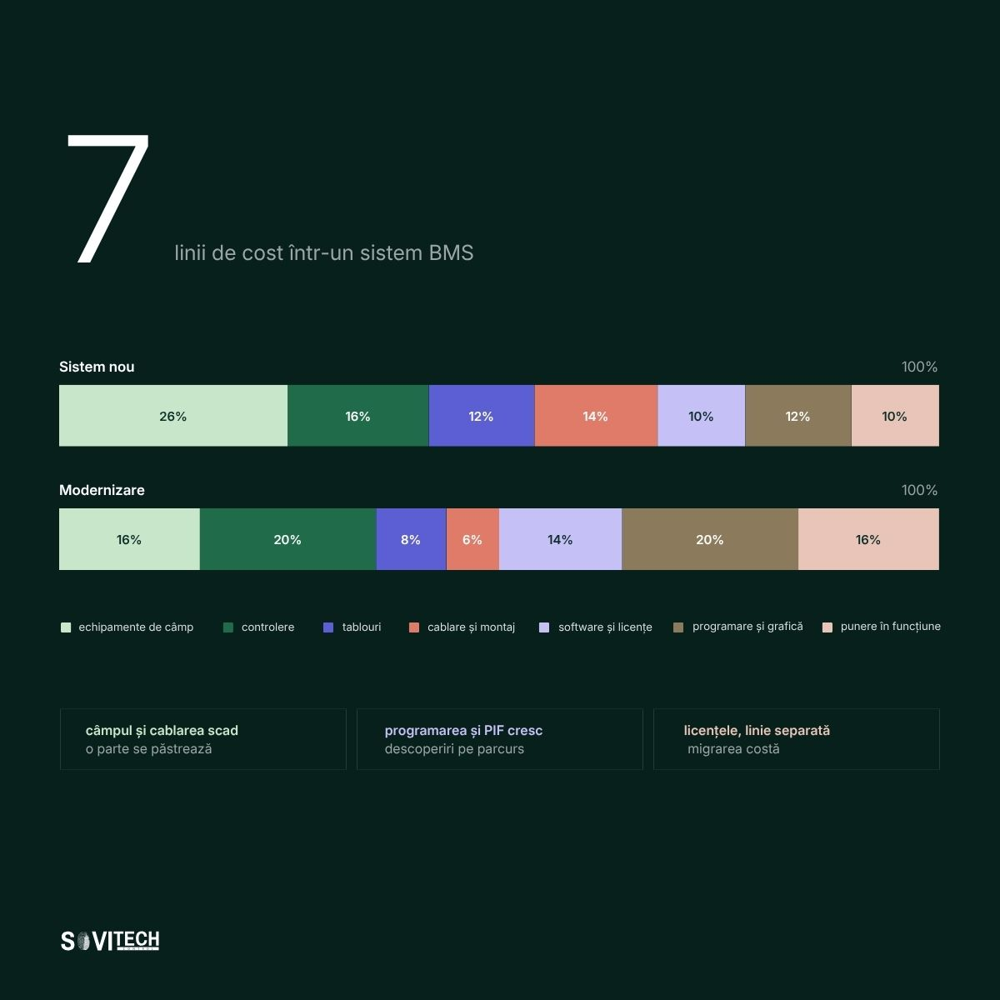

# Article (redesign-2026 branch): What a BMS system costs in Romania

> **Unmerged branch content.** This file comes from the branch `redesign-2026` of the SOVITECH website repository, not from `main`. The text is from commit `d2d15d2` (2026-08-24, "Redesign complet: continut editorial, rute noi, identitate vizuala"). The cover and diagrams are from commit `af81353` (2026-08-27, "Materiale vizuale noi: 10 coperti si 15 diagrame"). Owner decision, 2026-09-24: the branch is not SOVITECH's current position and will not be merged. This article is kept for reference only.

This is the full Romanian text of the SOVITECH website article „Cât costă un sistem BMS în România”, with its headings, tables, lists, figures, FAQ, sources and page metadata. Source: `components/articles/cost-sistem-bms.tsx` (body, `meta`, `faq`), rendered at `/resurse/cost-sistem-bms` by `app/resurse/[slug]/page.tsx`. Page metadata comes from `lib/site-routes.ts`, `lib/article-cards.ts` and `lib/article-covers.ts`. Paths are relative to the website repository root.

## Status of this content

- **Unmerged branch.** This article exists only on the branch `redesign-2026` of the website repository. The branch is not merged into `main`. Owner decision, 2026-09-24: it is not SOVITECH's current position and will not be merged. Keep this article for reference only. It is not what SOVITECH says today. `main` (`e080614`) is the current website, and it does not have this article.
- **Romanian only.** The branch has no English body for this article. The body component has no `t(ro, en)` calls, so the page shows the Romanian text in both site languages. English exists only for the page title, the lead and the category label (from `lib/site-routes.ts`) and the frame labels in `components/article-layout.tsx`.
- **Marketing and editorial copy.** Its figures (costs, percentages, savings, paybacks, point densities, durations, reference ranges) are not verified engineering data and not an approved reference dataset. The app may not use them as values, benchmarks, ranges or prices (guardrails rule 1, section 2.1, rule 9, rule 10, section 10).
- **Legal and standards statements.** The article states laws, thresholds and deadlines as its authors read them on the verification date in its closing note. The app takes legal thresholds and standards only from approved reference data with their edition or date, never from this article (guardrails rule 11). See "Regulatory statements in the articles" in `README.md`.
- **No named author.** The byline is "Echipa de inginerie Sovitech Control". The source file carries the comment `TODO(author): replace with the signing engineer`, so no engineer has signed this text.

## Page facts

| Item | Value |
|------|-------|
| Slug and route | `cost-sistem-bms`, `/resurse/cost-sistem-bms` |
| Page type | Cluster article (`/resurse/`). Registry status `published`, `draft: "drive"`. |
| Editorial id | A04 |
| Category | BMS, SCADA & Integrare / BMS, SCADA & Integration (C4) |
| Personas | P1 Proprietar / Dezvoltator / Investitor; P2 Property & Asset Manager |
| Pillar | `/ghid/sisteme-bms-cladiri` (Sistem BMS pentru clădiri: ghidul complet), status `published` |
| H1, RO | Cât costă un sistem BMS în România |
| H1, EN | What a BMS system costs in Romania |
| Lead, RO | Intervale pe punct de date, pe mp și ca procent din instalații, trei exemple lucrate și cum compari două oferte. |
| Lead, EN | Ranges per data point, per sqm and as a share of plant value, three worked examples, and how to compare two bids. |
| `<title>` (RO only) | Cat costa un sistem BMS: structura de pret \| Sovitech Control |
| Meta description (RO only, without diacritics as in the source) | Cat costa un sistem BMS in 2026: intervale pe punct de date, pe mp si ca procent din instalatii, trei exemple lucrate si cum compari doua oferte. |
| `datePublished` / `dateModified` in `meta` | 2026-08-16 / 2026-08-16. `components/articles/index.ts` calls `dateModified` "the legal-verification date". |
| Card date and read time (`lib/article-cards.ts`) | 16 AUG 2026 / AUG 16, 2026; 20 MIN CITIRE / 20 MIN READ |
| Header line on the page | „Publicat 16.08.2026” (`components/article-layout.tsx`) |
| Author on the page | Rail: „Scris de” / "Written by", „Sovitech Control”, „Echipa de inginerie” / "Engineering team". JSON-LD author and publisher: Organization „Sovitech Control”. No `Person` node. |
| Cover | [`covers/cost-sistem-bms.jpg`](covers/cost-sistem-bms.jpg), 1920x1080 JPEG, from `public/coperti/cost-sistem-bms.jpg`. Card background `#07201C`. Also used as `og:image` and JSON-LD `image`. Alt text on the article page: the RO title. |
| Text on the cover | „4-18”, „EUR/mp, bandă agregată patru tipuri de clădiri”. Tags „90–320 EUR pe punct fizic”, „50–90 puncte la 1.000 mp”, „mentenanță 4–7% pe an”. Bar chart „BANDĂ AGREGATĂ 4-18 EUR/MP”: Retail 4–9, Birouri clasa B 5–10, Hotel 6–13, Birouri clasa A 9–18. |
| Diagrams | 1, listed below, from `public/diagrame/` |
| FAQ pairs | 6, shown in the body and emitted as `FAQPage` JSON-LD |
| Structured data | `Article` (inLanguage `ro`), `BreadcrumbList` (Acasă > Resurse > title), `FAQPage` (`components/article-jsonld.tsx`). Base URL `https://sovitech-website-gaidenic.vercel.app`. |
| Length | About 4,367 words in this Markdown rendering, tables included. |

### Diagrams

| Local copy | Caption in the article (RO, verbatim) |
|------------|----------------------------------------|
| `diagrams/A04-1-structura-costului.jpg` | Structura costului unui sistem BMS pe cele nouă linii, în varianta de sistem nou și în varianta de retrofit. |

Text on the diagram (read from the image): **A04-1** „7 linii de cost într-un sistem BMS”. Two stacked bars. „Sistem nou”: echipamente de câmp 26%, controlere 16%, tablouri 12%, cablare și montaj 14%, software și licențe 10%, programare și grafică 12%, punere în funcțiune 10%. „Modernizare”: 16%, 20%, 8%, 6%, 14%, 20%, 16%. Notes: „câmpul și cablarea scad”, „programarea și PIF cresc”, „licențele, linie separată”.

## Article text (RO, verbatim)

How this was rendered: the article's `<h2>` headings are `###` here and its `<h3>` headings are `####`. The lead paragraph (class `standfirst`) and the closing note (class `article-note`) are labelled. Diagrams point to the local copies in `diagrams/`. The FAQ box sits where the page renders it. Internal site links are written as the link text followed by the site path in code, for example „lista de referințe (`/referinte`)”, because root-relative links do not resolve outside the website. Bold and italics are as in the source. Nothing was translated, corrected or shortened.

*Standfirst:* Metode de estimare, benzi de preț pe punct și pe metru pătrat, linii de cost, mentenanță anuală și compararea a două oferte.

**Prețul unui sistem BMS se calculează pe numărul și tipul de puncte de date, nu pe metru pătrat. Pentru retail, birouri clasa B, birouri clasa A și hoteluri fără control pe cameră, ordinul de mărime orientativ pentru 2026 este 4-18 EUR/mp sau 4-11% din valoarea instalațiilor HVAC și electrice. Pharma și hotelurile cu control pe cameră depășesc semnificativ aceste valori.**

BMS înseamnă Building Management System, a nu se confunda cu Battery Management System. În reglementări apare ca BACS, sisteme de automatizare și control al clădirilor.

Toate cifrele din acest articol sunt ordine de mărime orientative pentru anul 2026, exprimate în EUR fără TVA. Ele variază semnificativ de la proiect la proiect, în funcție de instalațiile existente, de nivelul de integrare cerut și de starea documentației. Nu sunt ofertă și nu pot fi folosite ca bază contractuală.

### Pe scurt

- Un preț real iese dintr-o listă de puncte, nu dintr-o suprafață: două clădiri de birouri de 8.000 mp pot diferi cu 60% în buget.
- Banda orientativă pe punct fizic complet coboară de la 180-320 EUR sub 150 de puncte la 90-160 EUR peste 1.500 de puncte.
- Pe metru pătrat, banda agregată pentru retail, birouri clasa B, birouri clasa A și hotel fără control pe cameră este de 4-18 EUR/mp.
- Punerea în funcțiune valorează 6-12% din investiție și este prima linie tăiată la negociere.
- Mentenanța anuală se așază la 4-7% din valoarea sistemului pentru un contract de bază și la 7-12% pentru unul extins, plus 8-18% din valoarea licențelor ca taxă anuală de software.
- Un retrofit costă frecvent 40-60% dintr-un sistem nou echivalent, cu condiția ca peste 40% din instalația existentă să fie refolosibilă.
- Diferența dintre două oferte vine de cele mai multe ori din numărul de puncte incluse, nu din marca echipamentelor.

### Cuprins

*Navigation (Cuprins):*

- [Cele șase informații din care iese un preț](#datele-din-care-iese-un-pret)
- [Costul unui BMS: 4-18 EUR/mp și 90-320 EUR pe punct](#cele-trei-metode-de-estimare)
- [Cele nouă linii de cost: echipamente 20-30%, punere în funcțiune 6-12%](#structura-interna-a-costului)
- [Opt costuri uitate în buget: licențele și taxa anuală de 8-18%](#costuri-uitate-in-bugetele-de-investitie)
- [Mentenanța anuală: 4-7% contract de bază, 7-12% extins](#costul-anual-al-mentenantei)
- [Trei scenarii: birouri 8.000 mp, hotel 120 de camere, hală 12.000 mp](#trei-scenarii-ilustrative-de-buget)
- [Modernizarea costă 40-60% dintr-un sistem nou echivalent](#modernizare-sau-sistem-nou)
- [Cele zece verificări la compararea a două oferte](#compararea-a-doua-oferte)
- [Finanțare de 150 mil. EUR și pragul legal de 290 kW](#finantare-si-context-de-reglementare)
- [Ce înseamnă pentru proprietar și asset manager: rezervă de 8-12%](#ce-inseamna-asta-pentru-proprietar-si-pentru-asset-manager)
- [Întrebări frecvente](#intrebari-frecvente)

<a id="datele-din-care-iese-un-pret"></a>
### Cele șase informații din care iese un preț

Prețul unui sistem BMS iese din șase informații despre clădire, iar suprafața nu este niciuna dintre ele. Întrebarea „cât costă un BMS pentru 8.000 de metri pătrați" nu conține informația care determină prețul. O clădire are două centrale de tratare a aerului, CTA, și ventiloconvectoare, alta are patru CTA, recuperare de căldură, VAV pe zonă și contorizare pe chiriaș. Suprafața e aceeași, bugetul diferă cu 60%.

Pentru o ofertă serioasă, cineva trebuie să fi văzut cel puțin următoarele:

- **Lista de puncte**: inventarul intrărilor și ieșirilor, agregat cu agregat. Singurul document din care iese un preț real și primul care lipsește din caietele de sarcini.
- **Schema instalațiilor**: HVAC, termic, sanitar, electric. Ce agregate există, ce debite, câte zone.
- **Tablourile existente**: dacă se refolosesc, dacă mai au spațiu, dacă aparatajul e conform.
- **Ce se integrează**: chiller, centrale termice, UPS, generator, contoare, ascensoare, detecție de incendiu. Fiecare integrare prin protocol are cost și risc propriu.
- **Nivelul de grafică**: sinoptice simple sau planuri de etaj navigabile, cu stări în timp real.
- **Cerințele de raportare**: un dashboard operațional costă altceva decât rapoarte auditabile pentru ESG, cu istoricizare pe ani și export.

În proiectele de modernizare executate de Sovitech Control, lista de puncte a lipsit din documentația predată în majoritatea cazurilor, iar refacerea ei a fost prima lucrare plătită înainte de orice ofertă.

Un preț dat fără aceste informații nu este ofertă, ci un semn de intrare pe listă. Diferența se plătește ulterior, la lucrări suplimentare. Documentele sunt detaliate în ghidul de caiet de sarcini pentru un sistem BMS (`/ghid/caiet-de-sarcini-bms`).

<a id="cele-trei-metode-de-estimare"></a>
### Costul unui BMS: 4-18 EUR/mp și 90-320 EUR pe punct

Costul unui sistem BMS se estimează prin trei metode. Pe punct de date, la 90-320 EUR pe punct fizic complet. Pe metru pătrat, la 4-18 EUR/mp pentru retail, birouri și hoteluri fără control pe cameră. Ca procent din valoarea instalațiilor, la 4-11% pentru o clădire nerezidențială obișnuită.

#### Estimarea pe punct de date: 90-320 EUR pe punct

Un punct este o singură informație schimbată între clădire și sistem. Există patru tipuri fizice, DI, DO, AI și AO, plus punctele citite prin protocol.

| Tip de punct | Ce înseamnă | Exemplu concret |
|---|---|---|
| DI, intrare digitală | O stare de tip da/nu | Confirmare de funcționare ventilator, presostat de filtru murdar, stare disjunctor |
| DO, ieșire digitală | O comandă de tip pornit/oprit | Pornirea unei pompe, comanda unui contactor de iluminat |
| AI, intrare analogică | O valoare măsurată continuu | Temperatură tur, CO2 în sală, presiune diferențială, umiditate |
| AO, ieșire analogică | O comandă proporțională | Poziția unui servomotor de vană, turația unui ventilator prin invertor |
| Punct de bus sau virtual | O valoare citită prin protocol, fără cablu propriu | Contor de energie pe M-Bus, chiller pe Modbus, invertor pe BACnet |

Prețul pe punct scade cu volumul, pentru că o parte din cost este fixă: stația de supervizare, licența de bază, proiectul, deplasările, documentația. Pe un sistem mic, aceste costuri se împart la 100 de puncte. Pe unul mare, la 2.000. Banda merge de la 180-320 EUR pe punct sub 150 de puncte până la 90-160 EUR peste 1.500 de puncte, iar un punct citit prin protocol costă 25-70 EUR.

| Volum total de puncte | Ordin de mărime EUR/punct fizic, complet (echipament de câmp, cablare, I/O, programare, punere în funcțiune) | Observație |
|---|---|---|
| sub 150 | 180-320 | Costurile fixe domină; sub 60-80 de puncte, un BMS clasic rareori se justifică economic |
| 150-500 | 140-240 | Zona tipică pentru o clădire de birouri medie sau un hotel fără automatizare pe cameră |
| 500-1.500 | 110-190 | Efectul de scară devine vizibil; costul de programare pe punct scade cel mai mult |
| peste 1.500 | 90-160 | Se justifică standardizarea pe tipuri de agregate și biblioteci reutilizabile |
| puncte citite prin protocol | 25-70 | Nu au cablu și senzor propriu; costul este de configurare și testare a comunicației |

Prețul pe punct urcă la trasee dificile în clădire existentă, execuție în etape cu clădirea în funcțiune, senzori speciali de CO2 sau debit, zone clasificate și redundanță. Coboară la agregate repetitive, tablouri noi cu spațiu, un singur protocol pe toată clădirea și execuție într-o singură etapă.

#### Estimarea pe metru pătrat: banda agregată de 4-18 EUR/mp

Un sistem BMS costă 9-18 EUR/mp la birouri clasa A, 5-10 EUR/mp la birouri clasa B, 6-13 EUR/mp la hotel fără control pe cameră și 4-9 EUR/mp la retail, ceea ce dă banda agregată de 4-18 EUR/mp. Densitatea de puncte care produce aceste valori este de 50-90 de puncte la 1.000 mp la birouri clasa A și de 15-35 la retail.

Metoda pe metru pătrat servește la prescreening, nu la contractare: arată dacă un buget avut în minte se află în galaxia corectă și atât. Densitatea de puncte, nu suprafața, este ceea ce diferă între tipurile de clădiri.

| Tip de clădire | Densitate uzuală de puncte / 1.000 mp | Ordin de mărime EUR/mp arie utilă |
|---|---|---|
| Birouri clasa A, sistem nou complet | 50-90 | 9-18 |
| Birouri clasa B, automatizare de bază pe agregate | 25-45 | 5-10 |
| Hotel, fără automatizare pe cameră | 30-55 | 6-13 |
| Hotel, cu control pe fiecare cameră | 90-160 | 18-38 |
| Retail sau centru comercial | 15-35 | 4-9 |
| Industrial, utilități și contorizare | 10-30 | 3-8 |
| Pharma, zone clasificate, monitorizare de mediu | 100-250 | 30-80 |

Banda de 30-80 EUR/mp pentru pharma nu este o eroare de tipar. Acolo nu se plătește automatizare, ci trasabilitate: istoricizare, audit trail, calificare documentată.

#### Estimarea ca procent din valoarea instalațiilor: 4-11%

Un sistem BMS reprezintă 4-7% din valoarea instalațiilor HVAC, adică încălzire, ventilare și climatizare, și electrice la o clădire nouă cu automatizare standard, și 7-11% la cerințe ridicate de contorizare și de raportare. Este metoda folosită în bugetarea de proiect, când există deja o estimare pentru instalații.

| Situație | BMS ca % din valoarea instalațiilor HVAC + electrice |
|---|---|
| Clădire nouă, automatizare standard pe agregate | 4-7% |
| Clădire cu cerințe ridicate: contorizare fină, raportare ESG, detectarea defectelor | 7-11% |
| Industrial cu utilități și contorizare pe linii | 3-6% |
| Pharma cu monitorizare de mediu și calificare | 10-18% |

O ofertă care iese la 2% din valoarea instalațiilor pentru o clădire de birouri nu este o afacere, ci o ofertă din care lipsește ceva: punerea în funcțiune, grafica sau licențele.

<a id="structura-interna-a-costului"></a>
### Cele nouă linii de cost: echipamente 20-30%, punere în funcțiune 6-12%

Investiția într-un sistem BMS se împarte pe nouă linii de cost. Echipamentele de câmp iau 20-30%, cablarea și montajul de câmp 12-20%, programarea și grafica 10-18%, iar punerea în funcțiune 6-12%.

| Linie de cost | Pondere orientativă | Ce include și ce o mișcă |
|---|---|---|
| Echipamente de câmp | 20-30% | Senzori, traductoare, servomotoare, vane de reglaj. Vanele mari de la centrala termică pot singure să mute procentul cu câteva puncte. |
| Controlere | 12-18% | Automate libere programabile și module de I/O. Aici se decide capacitatea de extindere: o rezervă de 15-20% costă puțin acum și mult mai târziu. |
| Tablouri de automatizare | 10-18% | Dulapuri, aparataj, cablaj intern, etichetare, verificări. Scade dacă se refolosesc tablourile existente, crește dacă forța și automatizarea intră în același dulap. |
| Cablare și montaj de câmp | 12-20% | Cel mai imprevizibil capitol într-o clădire existentă. Trasee, tuburi, jgheaburi, manoperă la înălțime, lucru în afara programului. |
| Software de supervizare și licențe | 5-12% | Stația de supervizare, licența pe număr de puncte sau de utilizatori, modulele de raportare și de acces web. |
| Programare, configurare, grafică | 10-18% | Secvențele de funcționare, alarmele, orarele, sinopticele. Grafica pe planuri de etaj costă vizibil mai mult decât sinopticele standard. |
| Punere în funcțiune și reglaj | 6-12% | Testarea fiecărui punct, verificarea sensului de acțiune, reglajul buclelor. Capitolul cel mai des tăiat din ofertele ieftine și cel care decide dacă sistemul chiar economisește energie. |
| Documentație as-built și instruire | 2-5% | Scheme conforme cu execuția, lista finală de puncte, manual de operare, sesiuni cu echipa tehnică. |
| Management de proiect și garanție | 3-6% | Coordonarea cu ceilalți executanți, testele de recepție, perioada de garanție. |



*Figure (`/diagrame/A04-1-structura-costului.jpg`):* Structura costului unui sistem BMS pe cele nouă linii, în varianta de sistem nou și în varianta de retrofit.

Punerea în funcțiune este prima linie tăiată la negociere, pentru că nu se vede ca obiect fizic în listă, și prima care se plătește ulterior, în ore de intervenție facturate separat, când bucla oscilează și nimeni nu a verificat sensul de acțiune al vanei.

<a id="costuri-uitate-in-bugetele-de-investitie"></a>
### Opt costuri uitate în buget: licențele și taxa anuală de 8-18%

Opt linii lipsesc frecvent din bugetul de investiție al unui sistem BMS, iar cea mai costisitoare dintre ele este taxa anuală de mentenanță software, 8-18% din valoarea licențelor, pe an.

- **Licențele pe punct sau pe utilizator.** Multe platforme se licențiază pe număr de puncte, iar valoarea lor apare în ofertă abia la a doua rundă de clarificări. Extinderea cu 200 de puncte peste cinci ani poate însemna o treaptă nouă de licență, peste costul de hardware.
- **Taxa anuală de mentenanță software.** Uzual 8-18% din valoarea licențelor, pe an. Fără ea, actualizarea se blochează la un moment dat, iar o migrare forțată costă mult mai mult.
- **Protocoalele proprietare.** Un chiller sau un grup de pompare poate cere o placă de comunicație opțională, comandată separat de la producător.
- **Gateway-urile.** Fiecare protocol străin adus în sistem înseamnă o conversie. Echipamentele cu protocoale deschise, BACnet sau Modbus, evită plata de două ori a aceleiași informații; criteriile de alegere sunt tratate în materialele despre protocoale și integrare (`/resurse/bms-scada-integrare`).
- **Refacerea documentației lipsă.** În clădirile de peste 10 ani, releveul tablourilor și al traseelor este o lucrare reală, nu o formalitate.
- **Orele de reglaj fin după punerea în funcțiune.** Un sistem pus în funcțiune în februarie nu a fost niciodată testat pe regim de răcire. Bugetul trebuie să prevadă o revenire în sezonul opus.
- **Extinderile ulterioare.** Rezerva de I/O, spațiul în tablou și capacitatea de licență sunt ieftine la montaj și scumpe la adăugare.
- **Rețeaua și accesul la distanță.** Switch-uri industriale, segmentare, VPN. Nu sunt buget de IT, sunt parte din sistem.

<a id="costul-anual-al-mentenantei"></a>
### Mentenanța anuală: 4-7% contract de bază, 7-12% extins

Mentenanța anuală a unui sistem BMS costă 4-7% din valoarea sistemului pentru un contract de bază și 7-12% pentru unul extins, cu reglaj sezonier și raportare lunară. La ambele se adaugă taxa de software, 8-18% din valoarea licențelor.

| Formă de întreținere | Ce include | Cost anual orientativ (% din valoarea sistemului) |
|---|---|---|
| Fără contract, intervenții punctuale | Doar reparații la cerere, tarif de urgență, deplasare facturată separat | 3-15%, imprevizibil, plus energia pierdută între defecțiuni |
| Contract de bază | 2 vizite planificate pe an, verificare hardware, backup-uri, actualizări critice, suport telefonic | 4-7% |
| Contract extins | 4 vizite pe an, reglaj sezonier, analiza alarmelor, raport lunar de performanță, timp de intervenție garantat | 7-12% |
| Taxa de software, separat | Actualizări de platformă și de securitate | 8-18% din valoarea licențelor |

Un contract iese mai ieftin decât intervențiile punctuale din trei motive. Tariful planificat este sub cel de urgență. Un sistem neîntreținut derivează: setpointuri modificate manual și niciodată readuse, senzori dezetalonați, orare dezactivate „temporar" acum trei ani, iar derivația se plătește lunar în factura de energie, nu în cea de service. Fără backup verificat, o defecțiune de controler se transformă din intervenție de două ore în reprogramare de o săptămână. Acoperirea exactă este descrisă la contractul de întreținere pentru sisteme BMS (`/servicii/intretinere-sisteme-bms`).

<a id="trei-scenarii-ilustrative-de-buget"></a>
### Trei scenarii: birouri 8.000 mp, hotel 120 de camere, hală 12.000 mp

Cele trei scenarii lucrate se așază între 45.000 și 260.000 EUR, la 350-2.500 de puncte de date, cu amortizare orientativă de 3-6 ani pentru o modernizare de capital.

Scenariile de mai jos sunt exerciții ilustrative construite pentru acest articol, nu oferte și nu proiecte reale. Economiile sunt estimative și depind de starea instalațiilor, de prețul energiei și de disciplina de operare.

| Scenariu | Ce se automatizează | Ordin de mărime puncte | Bandă de cost orientativă | Economie anuală estimată, cu domeniul declarat | Amortizare orientativă |
|---|---|---|---|---|---|
| **A. Birouri, aproximativ 8.000 mp**, cu 2 centrale de tratare a aerului, CTA, chiller, centrală termică | Cele 2 CTA cu recuperare, chillerul și pompele, centrala termică și circuitele, zonele de ventiloconvectoare, contorizare electrică și termică, iluminatul zonelor comune, orare și regim redus de noapte | 450-700 | 70.000-130.000 EUR | 10-20% din consumul HVAC, acolo unde reglajul era deficitar, adică aproximativ 12.000-28.000 EUR/an | 3-6 ani |
| **B. Hotel de 4 stele, aproximativ 120 de camere** | CTA zone comune, spa și piscină, centrală termică, chiller, ventilație bucătărie, hidrofor, contorizare. Varianta extinsă adaugă control pe fiecare cameră, cu regim de neocupare | 500-800 fără control pe cameră; 1.500-2.500 cu control pe cameră | 60.000-110.000 EUR fără cameră; 140.000-260.000 EUR cu cameră | 5-15% din consumul total al clădirii pe zonele comune; 10-20% din consumul HVAC pe camerele neocupate, adică aproximativ 15.000-45.000 EUR/an | 3-6 ani |
| **C. Hală de producție, aproximativ 12.000 mp**, utilități și contorizare | Compresoare de aer, aeroterme și centrale termice, ventilație, stații de pompare, contorizare electrică pe linii, aer comprimat, apă, gaz, alarmare pe parametri critici | 350-600 | 45.000-95.000 EUR | 5-15% din consumul total al clădirii: detectarea pierderilor de aer comprimat, oprirea utilităților în afara schimburilor, alocarea pe centre de cost, adică aproximativ 15.000-40.000 EUR/an | 3-6 ani |

Benzile de economie folosite în cele trei scenarii sunt cele canonice, cu domeniul declarat lângă fiecare cifră: 5-15% din consumul total al clădirii, valoare măsurată în literatura independentă (Crowe et al. 2020, LBNL), și 10-20% din consumul HVAC acolo unde programele orare, calibrarea senzorilor sau reglajul erau deficitare (ACEEE). Amortizarea de 3-6 ani este banda pentru o modernizare BACS de capital, adică pentru sisteme de automatizare și control al clădirilor înlocuite integral, nu pentru o simplă optimizare de setări, care se amortizează mai repede.

Ipotezele proprii se verifică pe datele reale ale clădirii: cere un calcul de economie de energie pentru clădire (`/contact`). Proiecte comparabile apar în lista de referințe (`/referinte`). Particularități de segment: clădiri de birouri (`/expertiza/cladiri-de-birouri`), HORECA (`/expertiza/horeca`) și industrial (`/expertiza/industrial`).

<a id="modernizare-sau-sistem-nou"></a>
### Modernizarea costă 40-60% dintr-un sistem nou echivalent

Un retrofit costă frecvent 40-60% dintr-un sistem nou echivalent. Motivul este simplu: în majoritatea clădirilor se păstrează partea scumpă la montaj, adică cablarea de câmp, o parte din senzori, vanele și servomotoarele mari, uneori dulapurile. Se înlocuiesc controlerele, supervizarea, grafica și logica de funcționare, exact partea care s-a învechit.

Retrofitul nu merge peste tot. Sub pragul de 40% instalație refolosibilă devine mai scump decât pare, pentru că fiecare surpriză se decontează în manoperă. Semnalele clare: cablare fără documentație și fără etichetare, echipamente de câmp mai vechi de 15-20 de ani, un bus proprietar pentru care producătorul nu mai livrează nici piese, nici gateway, tablouri neconforme care oricum trebuie refăcute. Etapizarea investiției este tratată în materialele despre modernizare și retrofit (`/resurse/modernizare-retrofit`).

<a id="compararea-a-doua-oferte"></a>
### Cele zece verificări la compararea a două oferte

O diferență de 30% între două oferte de sistem BMS este aproape întotdeauna o diferență de conținut, nu de preț, și vine din numărul de puncte incluse, nu din marca echipamentelor. Verificarea se face în această ordine:

1. **Același număr de puncte.** Lista de puncte anexată la ofertă este obligatorie; fără ea, comparația nu există.
2. **Aceleași agregate.** Centrala termică, chillerul, contorizarea și iluminatul sunt incluse în ambele sau doar în una.
3. **Licențele.** Pe câte puncte, pe câți utilizatori, pe câte sesiuni web simultane.
4. **Grafica și nivelul ei.** Sinoptice de agregat sau și planuri de etaj navigabile.
5. **Punerea în funcțiune, cotată separat.** Câte zile-om și cine testează fiecare punct.
6. **Documentația as-built și instruirea.** Câte ore de instruire și pentru câte persoane.
7. **Protocoale deschise sau dependență de furnizor.** Dacă un alt integrator poate prelua sistemul peste cinci ani fără să reînceapă de la zero.
8. **Garanția și componentele acoperite.** Hardware, software și manoperă pot avea termene diferite.
9. **Timpul de intervenție asumat.** În ore, în scris, cu program de acoperire.
10. **Costul anului doi.** Valoarea contractului de întreținere și a taxei de software, cerută explicit înainte de semnare.

Cerințele sunt deja formulate în modelul editabil de caiet de sarcini pentru BMS, ca ofertele să vină comparabile: cere modelul de caiet de sarcini BMS (`/contact`).

<a id="finantare-si-context-de-reglementare"></a>
### Finanțare de 150 mil. EUR și pragul legal de 290 kW

Finanțare există pentru anumite categorii. Programul de 150 de milioane de euro al Ministerului Energiei, din Fondul pentru Modernizare, se adresează operatorilor economici industriali participanți la EU-ETS, cu până la 30 de milioane de euro pe proiect, iar activele eligibile includ explicit „sisteme integrate de management al consumului de energie" ([sursa: Ministerul Energiei](https://energie.gov.ro/ministerul-energiei-lanseaza-cel-mai-ambitios-program-pentru-eficientizarea-energetica-a-industriei-romanesti-sprijinit-din-fondul-pentru-modernizare-cu-un-buget-total-de-150-de-milioane-de-euro/)). Programul a fost anunțat în 2025, cu ghidul în consultare, deci statusul se verifică la zi. Pentru clădirile publice, programele regionale au apeluri dedicate; în Regiunea Sud-Est, apelul 2.1.B a fost lansat la 4 iunie 2026 ([sursa: ADR Sud-Est](https://regiosudest.ro/ghiduri/prioritatea-2/apeluri-active/apel-lansat-2-1-b-cresterii-eficientei-energetice-a-cladirilor-publice-04-06-2026)), cu apeluri echivalente în celelalte programe regionale.

Un element de context pentru bugetare: legea română cere deja sisteme de automatizare și control al clădirilor, BACS, pentru clădirile nerezidențiale cu sisteme de încălzire, de climatizare, sau combinate cu ventilare, cu putere nominală utilă de peste 290 kW pe familie de sisteme. Termenul a fost 31 decembrie 2024 și este depășit ([Legea 372/2005, art. 27 alin. (5) și art. 29 alin. (6)](https://legislatie.just.ro/Public/DetaliiDocument/66970)). Pragul de 70 kW, cu termen 31 decembrie 2029, provine din [Directiva (UE) 2024/1275, art. 13 alin. (9) lit. b)](https://eur-lex.europa.eu/eli/dir/2024/1275/oj/eng) și nu este încă transpus în legea română.

<a id="ce-inseamna-asta-pentru-proprietar-si-pentru-asset-manager"></a>
### Ce înseamnă pentru proprietar și asset manager: rezervă de 8-12%

Proprietarul și investitorul folosesc procentul din valoarea instalațiilor pentru bugetul de fezabilitate și rezervă 8-12% peste estimare pentru surprizele din clădirea existentă. Valoarea anului doi, întreținere plus software, se cere de la început: intră în randamentul activului, nu în CapEx. Detalii pe pagina pentru proprietari și investitori.

Property managerul și asset managerul cer lista de puncte ca anexă obligatorie și o transformă în criteriu de comparație. Este singurul mod de a arăta proprietarului că oferta mai scumpă este, pe punct, mai ieftină. Detalii pe pagina de asset manager și în ghidul complet despre sistemele BMS (`/ghid/sisteme-bms-cladiri`).

<a id="intrebari-frecvente"></a>
### Întrebări frecvente

*(FAQ box, rendered from the exported `faq` list; the same pairs feed the FAQPage JSON-LD. Questions verbatim, some without diacritics as in the source.)*

**Cat costa un sistem BMS pentru o cladire de birouri?**

Ca ordin de mărime orientativ pentru 2026, între 5 și 18 EUR pe metru pătrat de arie utilă, domeniu restrâns la clădirile de birouri: 5-10 EUR/mp la birouri clasa B și 9-18 EUR/mp la birouri clasa A, în funcție de câte agregate se automatizează și de cât de fină este contorizarea. Valorile stau în banda agregată de 4-18 EUR/mp folosită la începutul articolului pentru retail, birouri și hoteluri fără control pe cameră. Pentru o clădire de 8.000 mp cu instalații standard, banda uzuală este de 70.000-130.000 EUR fără TVA.

**Se poate da un preț pe metru pătrat?**

Ca verificare rapidă, da. Ca bază de contract, nu. Metrul pătrat nu spune nimic despre numărul de agregate, despre protocoale sau despre starea tablourilor, iar acestea determină bugetul. Prețul pe metru pătrat este util pentru a respinge o cifră aberantă, nu pentru a semna una.

**Cât durează până la o ofertă fermă?**

Cu planuri și listă de echipamente, o estimare pe intervale se face în 48 de ore. O ofertă fermă cere vizită în clădire și listă de puncte agreată, deci uzual una până la trei săptămâni, în funcție de mărimea clădirii și de documentația existentă.

**Cât costă mentenanța anuală a unui BMS?**

Orientativ 4-7% din valoarea sistemului pe an pentru un contract de bază și 7-12% pentru unul extins, cu reglaj sezonier și raportare. Se adaugă taxa de software, de regulă 8-18% din valoarea licențelor. Intervențiile punctuale ies aproape întotdeauna mai scump pe termen de trei ani.

**O ofertă mai ieftină cu 30% este o afacere bună?**

Doar dacă are aceeași listă de puncte. În practică, diferența vine din punerea în funcțiune cotată simbolic, grafica redusă la sinoptice generice, licențe limitate sau documentație lipsă. Comparația se face pe punct de date și pe conținut, cu cele zece verificări din acest articol.

**Cât economisește, concret, o clădire după instalare?**

Într-o clădire fără automatizare funcțională, reducerea uzuală este de 10-20% din consumul de energie asociat instalațiilor HVAC, sau de 5-15% din consumul total al clădirii, cu amortizare orientativă de 3-6 ani pentru o modernizare de capital. Economia reală depinde de disciplina de operare după punerea în funcțiune, la fel de mult ca de echipamentele montate.

### Concluzie

Bugetul unui sistem BMS se apără cu o listă de puncte, nu cu o negociere de procente. Cine intră în discuția de preț fără acest document plătește diferența mai târziu: lucrări suplimentare, licențe descoperite pe parcurs, ore de reglaj nefacturate inițial. Cele trei metode de aici validează un ordin de mărime, nu fixează o cifră. Cifra reală apare după inventarul punctelor și o vizită în clădire.

### Cere o estimare de buget în 48 de ore

Pe baza planurilor de arhitectură, a schemei instalațiilor sau, în lipsa lor, a unei liste cu agregatele principale și suprafața clădirii rezultă, în 48 de ore, o estimare pe trei scenarii, minim funcțional, recomandat și extins cu contorizare și raportare, fiecare cu interval de cost, listă preliminară de puncte și estimarea costului anual de operare. Cere o estimare de buget (`/contact`).

*Toate valorile din acest articol sunt ordine de mărime orientative pentru 2026, în EUR fără TVA. Ele nu constituie ofertă. Prețul real al unui sistem se poate stabili numai pe baza unei liste de puncte agreate și a unei vizite în clădire.*

*Article note (class `article-note`):* Articol publicat 16.08.2026, actualizat 19.08.2026. Informațiile juridice au fost verificate la 16.08.2026. Autor: Echipa de inginerie Sovitech Control.

## Sources and links in the article

External sources cited (URL, then the anchor text as written):

- <https://energie.gov.ro/ministerul-energiei-lanseaza-cel-mai-ambitios-program-pentru-eficientizarea-energetica-a-industriei-romanesti-sprijinit-din-fondul-pentru-modernizare-cu-un-buget-total-de-150-de-milioane-de-euro/>: „sursa: Ministerul Energiei”
- <https://regiosudest.ro/ghiduri/prioritatea-2/apeluri-active/apel-lansat-2-1-b-cresterii-eficientei-energetice-a-cladirilor-publice-04-06-2026>: „sursa: ADR Sud-Est”
- <https://legislatie.just.ro/Public/DetaliiDocument/66970>: „Legea 372/2005, art. 27 alin. (5) și art. 29 alin. (6)”
- <https://eur-lex.europa.eu/eli/dir/2024/1275/oj/eng>: „Directiva (UE) 2024/1275, art. 13 alin. (9) lit. b)”

Internal links (site path, status on the branch):

- `/ghid/caiet-de-sarcini-bms`: published (ghid) in `lib/site-routes.ts`
- `/resurse/bms-scada-integrare`: published (category archive) in `lib/site-routes.ts`
- `/servicii/intretinere-sisteme-bms`: published (servicii) in `lib/site-routes.ts`
- `/contact`: static page on the branch
- `/referinte`: static page on the branch
- `/expertiza/cladiri-de-birouri`: published (expertiza) in `lib/site-routes.ts`
- `/expertiza/horeca`: published (expertiza) in `lib/site-routes.ts`
- `/expertiza/industrial`: published (expertiza) in `lib/site-routes.ts`
- `/resurse/modernizare-retrofit`: published (category archive) in `lib/site-routes.ts`
- `/ghid/sisteme-bms-cladiri`: published (ghid) in `lib/site-routes.ts`

The source file lists links that were weakened because their target page is not built yet (`LINKS-TO-REACTIVATE`). Each line gives the anchor text, the interim target and the planned final target. Verbatim:

```text
// LINKS-TO-REACTIVATE:
//   materialele despre protocoale si integrare | interim /resurse/bms-scada-integrare | final /ghid/protocoale-automatizarea-cladirilor
//   materialele despre modernizare si retrofit | interim /resurse/modernizare-retrofit | final /ghid/modernizare-bms
//   cere un calcul de economie de energie pentru cladire | interim /contact | final /instrumente/calculator-economie-energie-bms
//   cere modelul de caiet de sarcini BMS | interim /contact | final /instrumente/model-caiet-de-sarcini-bms
//   pagina pentru proprietari si investitori (text fara link) | interim (fara link) | final /pentru/proprietari-si-investitori
//   pagina de asset manager (text fara link) | interim (fara link) | final /pentru/property-asset-manager
```

## Notes

- Every price in this article is marketing copy: EUR/mp bands by building type, 90-320 EUR per point, 4-11% of HVAC and electrical plant value, three worked scenarios with savings and payback, cost-line shares and maintenance percentages. Rule 10 forbids the app from showing these as prices, and rule 9 forbids using them as benchmarks. SOVITECH pricing for the app needs its own approved reference data.
- Diagram and text disagree: the text and the caption say „Cele nouă linii de cost” and the table has nine rows; diagram A04-1 says „7 linii de cost” and leaves out documentation and project management. Each of the diagram's seven „Sistem nou” shares falls inside the text's range for that line, but together they make 100% without the two missing lines.
- The branch's legacy article page `app/resurse/articole/eficienta-bms/page.tsx` links to this article as „Cât costă un sistem BMS în România: structura de preț”, dated „Aug 19, 2026” with „10 min”. The card data in `lib/article-cards.ts` says 16 AUG 2026 and 20 MIN.
- Funding claims (programme names, 150 mil. EUR, launch dates) are dated statements by the article. They are not reference data.
- Dates: `meta` says 2026-08-16 for both; the closing note says „actualizat 19.08.2026”. The closing note gives a later update date than `meta.dateModified`, so the page header shows no „Actualizat” date. By the comment in `components/articles/index.ts`, `dateModified` is the legal-verification date, which explains the gap but is not what a reader sees.
