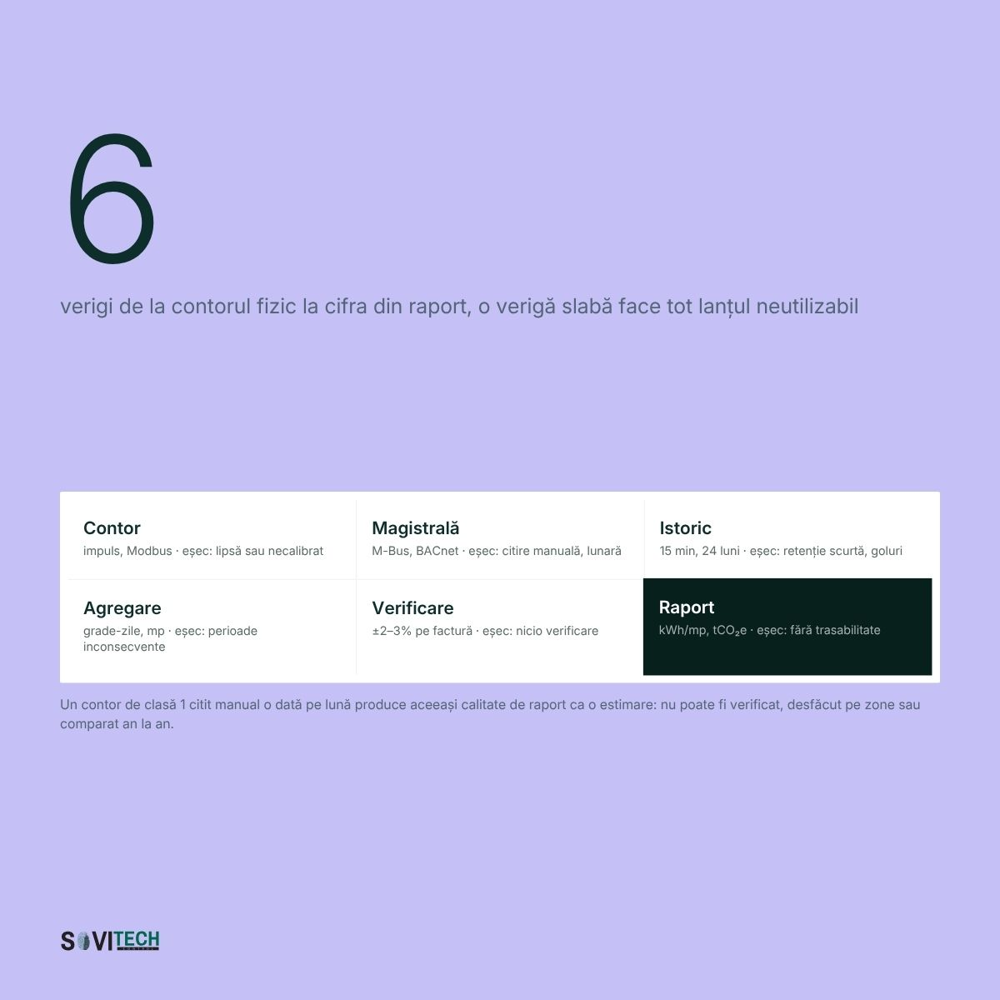
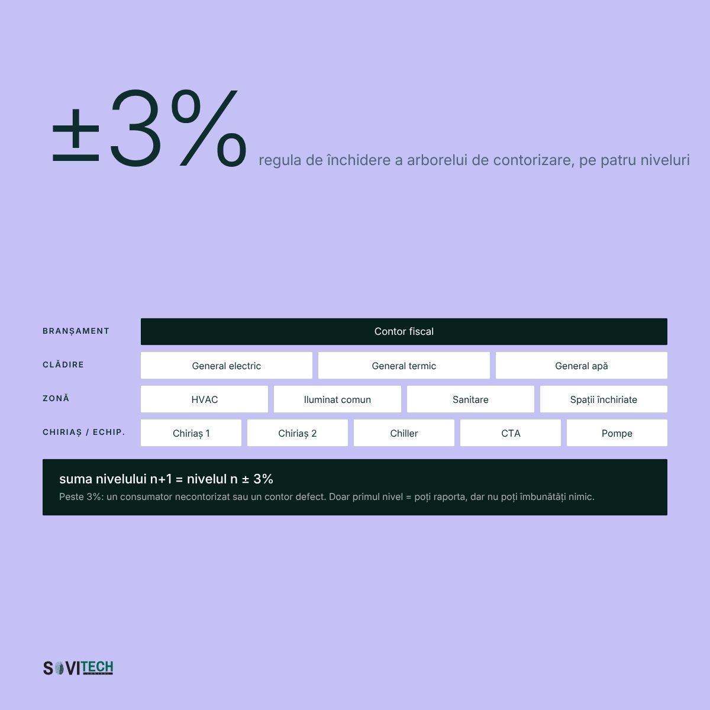

# Article (redesign-2026 branch): Where a building's ESG reporting data comes from

> **Unmerged branch content.** This file comes from the branch `redesign-2026` of the SOVITECH website repository, not from `main`. The text is from commit `d2d15d2` (2026-08-24, "Redesign complet: continut editorial, rute noi, identitate vizuala"). The cover and diagrams are from commit `af81353` (2026-08-27, "Materiale vizuale noi: 10 coperti si 15 diagrame"). Owner decision, 2026-09-24: the branch is not SOVITECH's current position and will not be merged. This article is kept for reference only.

This is the full Romanian text of the SOVITECH website article „De unde vin datele pentru raportarea ESG a unei clădiri”, with its headings, tables, lists, figures, FAQ, sources and page metadata. Source: `components/articles/date-esg-cladiri.tsx` (body, `meta`, `faq`), rendered at `/ghid/date-esg-cladiri` by `app/ghid/[slug]/page.tsx`. Page metadata comes from `lib/site-routes.ts`, `lib/article-cards.ts` and `lib/article-covers.ts`. Paths are relative to the website repository root.

## Status of this content

- **Unmerged branch.** This article exists only on the branch `redesign-2026` of the website repository. The branch is not merged into `main`. Owner decision, 2026-09-24: it is not SOVITECH's current position and will not be merged. Keep this article for reference only. It is not what SOVITECH says today. `main` (`e080614`) is the current website, and it does not have this article.
- **Romanian only.** The branch has no English body for this article. The body component has no `t(ro, en)` calls, so the page shows the Romanian text in both site languages. English exists only for the page title, the lead and the category label (from `lib/site-routes.ts`) and the frame labels in `components/article-layout.tsx`.
- **Marketing and editorial copy.** Its figures (costs, percentages, savings, paybacks, point densities, durations, reference ranges) are not verified engineering data and not an approved reference dataset. The app may not use them as values, benchmarks, ranges or prices (guardrails rule 1, section 2.1, rule 9, rule 10, section 10).
- **Legal and standards statements.** The article states laws, thresholds and deadlines as its authors read them on the verification date in its closing note. The app takes legal thresholds and standards only from approved reference data with their edition or date, never from this article (guardrails rule 11). See "Regulatory statements in the articles" in `README.md`.
- **No named author.** The byline is "Echipa de inginerie Sovitech Control". The source file carries the comment `TODO(author): replace with the signing engineer`, so no engineer has signed this text.

## Page facts

| Item | Value |
|------|-------|
| Slug and route | `date-esg-cladiri`, `/ghid/date-esg-cladiri` |
| Page type | Pillar guide (`/ghid/`). Registry status `published`, `draft: "drive"`. |
| Editorial id | A09 |
| Category | ESG, Energie & Raportare / ESG, Energy & Reporting (C2) |
| Personas | P5 Manager ESG / Sustenabilitate; P2 Property & Asset Manager |
| Pillar | none (this is a pillar) |
| H1, RO | De unde vin datele pentru raportarea ESG a unei clădiri |
| H1, EN | Where a building's ESG reporting data comes from |
| Lead, RO | Cele șase verigi ale lanțului de date, cum se rupe fiecare și ce poate produce infrastructura tehnică. |
| Lead, EN | The six links in the data chain, how each one breaks, and what the technical infrastructure can actually produce. |
| `<title>` (RO only) | Raportare ESG cladiri: de unde vin datele \| Sovitech Control |
| Meta description (RO only, without diacritics as in the source) | Raportare ESG cladiri: datele de consum vin dintr-un lant cu 6 verigi, de la contor la indicator. Vezi unde se rupe si ce poate produce o cladire. |
| `datePublished` / `dateModified` in `meta` | 2026-08-17 / 2026-08-18. `components/articles/index.ts` calls `dateModified` "the legal-verification date". |
| Card date and read time (`lib/article-cards.ts`) | 17 AUG 2026 / AUG 17, 2026; 22 MIN CITIRE / 22 MIN READ |
| Header line on the page | „Publicat 17.08.2026” · „Actualizat 18.08.2026” (`components/article-layout.tsx`) |
| Author on the page | Rail: „Scris de” / "Written by", „Sovitech Control”, „Echipa de inginerie” / "Engineering team". JSON-LD author and publisher: Organization „Sovitech Control”. No `Person` node. |
| Cover | [`covers/date-esg-cladiri.jpg`](covers/date-esg-cladiri.jpg), 1920x1080 JPEG, from `public/coperti/date-esg-cladiri.jpg`. Card background `#C5C0F6`. Also used as `og:image` and JSON-LD `image`. Alt text on the article page: the RO title. |
| Text on the cover | „6”, „verigi de la contorul fizic la cifra din raport”. Links: Contor („impuls, Modbus”), Magistrală („M-Bus, BACnet”), Istoric („15 min, 24 luni”), Agregare („grade-zile, mp”), Verificare („±2–3% pe factură”), Raport („kWh/mp, tCO2e”). |
| Diagrams | 2, listed below, from `public/diagrame/` |
| FAQ pairs | 5, shown in the body and emitted as `FAQPage` JSON-LD |
| Structured data | `Article` (inLanguage `ro`), `BreadcrumbList` (Acasă > Ghiduri > title), `FAQPage` (`components/article-jsonld.tsx`). Base URL `https://sovitech-website-gaidenic.vercel.app`. |
| Length | About 4,464 words in this Markdown rendering, tables included. |

### Diagrams

| Local copy | Caption in the article (RO, verbatim) |
|------------|----------------------------------------|
| `diagrams/A09-1-lantul-de-date-esg.jpg` | Lanțul de date ESG: cele șase verigi, de la punctul de măsură la raportare, cu modul tipic de eșec al fiecăreia. |
| `diagrams/A09-2-arborele-de-contorizare.jpg` | Arborele de contorizare al unei clădiri, pe cinci niveluri, cu regula de închidere la plus minus 3%. |

Text on the diagrams (read from the images): **A09-1** „6 verigi de la contorul fizic la cifra din raport, o verigă slabă face tot lanțul neutilizabil”, each with its failure mode; footer „Un contor de clasă 1 citit manual o dată pe lună produce aceeași calitate de raport ca o estimare: nu poate fi verificat, desfăcut pe zone sau comparat an la an.” **A09-2** „±3%”, „regula de închidere a arborelui de contorizare, pe patru niveluri”; rows Branșament (Contor fiscal), Clădire, Zonă, Chiriaș / Echip.; „suma nivelului n+1 = nivelul n ± 3%”.

## Article text (RO, verbatim)

How this was rendered: the article's `<h2>` headings are `###` here and its `<h3>` headings are `####`. The lead paragraph (class `standfirst`) and the closing note (class `article-note`) are labelled. Diagrams point to the local copies in `diagrams/`. The FAQ box sits where the page renders it. Internal site links are written as the link text followed by the site path in code, for example „lista de referințe (`/referinte`)”, because root-relative links do not resolve outside the website. Bold and italics are as in the source. Nothing was translated, corrected or shortened.

*Standfirst:* Cele șase verigi ale lanțului de date, cum se rupe fiecare și ce poate produce infrastructura tehnică a unei clădiri.

**Datele pentru raportarea ESG a unei clădiri vin dintr-un lanț cu șase verigi: punctul de măsură, achiziția, istoricizarea, agregarea, verificarea și raportarea. Facturile acoperă doar ultima verigă. Consumul pe surse, intensitatea energetică și emisiile Scope 1-2 se produc în infrastructura tehnică a clădirii: contoare, controlere, BMS (Building Management System) și istoric de date.**

Fiecare raport de sustenabilitate are o notă de subsol care spune de unde vine cifra de kWh. Într-o bună parte din cazuri, răspunsul real este: din douăsprezece facturi adunate într-un fișier de calcul.

### Pe scurt: șase verigi, 15 minute, 24 de luni

- Datele de consum trec prin șase verigi: punct de măsură, achiziție, istoricizare, agregare, verificare, raportare.
- Factura acoperă o singură verigă și produce douăsprezece valori de consum pe an, agregate pe branșament.
- Rezoluția de referință pentru energia electrică este de 15 minute, cu retenție de minimum 24 de luni la rezoluție completă, pentru toate categoriile de puncte.
- Infrastructura tehnică a clădirii acoperă integral energia, apa și calitatea mediului interior, parțial emisiile și deloc deșeurile.
- Directiva (UE) 2026/470 restrânge sfera raportării CSRD la întreprinderile cu peste 1.000 de angajați și peste 450 de milioane EUR cifră de afaceri netă, ambele condiții cumulativ, cu prima raportare pentru exercițiile financiare începute de la 1 ianuarie 2027.

### Cele șase verigi: de la punctul de măsură la kWh/mp/an

Între un cazan care arde gaz și rândul din raportul de sustenabilitate există un traseu cu șase verigi: punctul de măsură, achiziția pe magistrală, istoricizarea, agregarea și normalizarea, verificarea și raportarea. Fiecare se rupe în felul ei, iar când se rupe, cifra rămâne acolo. Doar că nu mai înseamnă ce pare.



*Figure (`/diagrame/A09-1-lantul-de-date-esg.jpg`):* Lanțul de date ESG: cele șase verigi, de la punctul de măsură la raportare, cu modul tipic de eșec al fiecăreia.

### Veriga 1, punctul de măsură: contor electric, de gaz, de apă, sondă

Prima verigă a lanțului de date ESG este punctul de măsură: un contor de energie pe un plecare din tabloul general, un contor de gaz pe branșament, un debitmetru pe apă, o sondă pe tur. Dacă mărimea nu este măsurată aici, niciun software din amonte nu o poate produce.

**Ce merge prost la punctul de măsură:** lipsește contorul pe consumatorul relevant; contorul are afișaj, dar nu și ieșire de comunicație; transformatoarele de curent supradimensionate pierd precizia la sarcini mici; clasa de precizie nu este documentată.

### Veriga 2, achiziția: Modbus, M-Bus, BACnet, KNX și DALI

A doua verigă a lanțului de date ESG este achiziția pe magistrală: un controler interoghează automat contoarele instalate la veriga 1, prin **Modbus** (RTU pe RS-485 sau TCP) pentru contoare și forță, **M-Bus** pentru energie termică și apă, **BACnet** pentru automatizare, plus KNX și DALI. Comparația între protocoale se află în materialele despre BMS, SCADA și integrare (`/resurse/bms-scada-integrare`).

**Ce merge prost la achiziție:** harta de registre lipsește; magistrala supraîncărcată produce timeout-uri și goluri în șirul de valori; după doi ani nimeni nu mai știe ce alimentează „Contor 7”; se citește doar puterea instantanee, nu indexul de energie cumulată, iar reconcilierea cu factura devine imposibilă.

### Veriga 3, istoricizarea la 15 minute, cu retenție de 24 de luni

A treia verigă a lanțului de date ESG este istoricizarea, iar aici se decid trei lucruri care nu se mai repară retroactiv: rezoluția de salvare, durata de retenție și comportamentul sistemului când este oprit. Referința practică este de 15 minute pentru energia electrică și o retenție de minimum 24 de luni la rezoluție completă, pentru că sub 24 de luni nu există comparație an la an. O clădire care salvează la 15 minute poate răspunde la întrebarea despre consumul de noapte. Una care salvează o valoare pe zi, nu.

**Ce merge prost la istoricizare:** rezoluție zilnică în loc de 15 minute; retenție de trei luni, deci fără comparație an la an; serverul s-a oprit în august, nimeni nu a observat, iar golul din șirul de valori este acum o gaură în raportul anual. Cât timp se păstrează datele și la ce rezoluție, în materialele despre istoricizare și arhitectura sistemelor (`/resurse/bms-scada-integrare`).

### Veriga 4, agregarea și normalizarea: grade-zile, ore de ocupare, suprafață

A patra verigă a lanțului de date ESG este agregarea cu normalizarea, pentru că un consum brut nu spune nimic singur. 1.400 MWh de energie finală pe an, pentru întreaga clădire, înseamnă mult sau puțin? Răspunsul cere trei normalizări. **Grade-zilele** corectează severitatea climatică a anului; fără ele, o iarnă blândă arată ca o îmbunătățire de performanță. **Orele de ocupare** explică de ce „economia” din 2020-2021 a fost, în multe portofolii, doar absența oamenilor. **Suprafața** transformă consumul în intensitate energetică, exprimată în kWh/mp/an.

**Ce merge prost la agregare:** se amestecă suprafețe de tipuri diferite la același numitor; se raportează kWh/mp/an fără să se precizeze dacă include consumul chiriașilor; comparația se face cu repere construite pe altă convenție de suprafață. Reperele de consum și metoda de comparație sunt tratate în materialele despre performanța clădirii (`/resurse/performanta-cladirii`).

### Veriga 5, verificarea: reconcilierea cu factura, la 2-3% diferență

A cincea verigă a lanțului de date ESG este verificarea, iar instrumentul ei principal este **reconcilierea cu factura**: suma indexurilor de energie citite pe contoarele proprii trebuie să se apropie de cantitatea facturată de furnizor pentru aceeași perioadă. O diferență de 2-3% între suma contoarelor proprii și cantitatea facturată este explicabilă; una de 18% arată că lipsește un consumator din schema de contorizare sau că un contor citește greșit.

**Detecția valorilor imposibile** cere cinci sau șase reguli automate aplicate pe șirul de valori istoricizate: index de energie care scade, putere negativă fără producție locală, temperatură de tur de 240 °C.

**Ce merge prost la verificare:** nimeni nu compară suma contoarelor cu factura, erorile se compensează reciproc și par plauzibile, iar un an întreg de date se corectează manual în foaia de calcul, fără urmă a corecției.

### Veriga 6, raportarea: kWh/mp/an și tCO₂e

A șasea verigă a lanțului de date ESG este raportarea, iar abia acum se produc indicatorii finali: intensitatea energetică în kWh/mp/an și emisiile în tCO₂e. Consultantul ESG și platforma de raportare nu creează date, le formatează.

**Ce merge prost la raportare:** export manual, o dată pe an, făcut de o persoană care apoi pleacă din companie; nicio pistă de audit; factorul de emisie folosit fără sursă și fără an de referință; ceea ce se raportează drept „măsurat” este, de fapt, estimat.

Fiecare dintre cele șase verigi se verifică în zece minute, cu o singură cerere adresată echipei tehnice:

| Verigă | Cum se verifică în 10 minute |
|---|---|
| 1. Punct de măsură | Se cere schema de contorizare. Dacă nu există, răspunsul e dat. |
| 2. Achiziție | Se întreabă cine urcă în tablou să citească un index. |
| 3. Istoricizare | Se cere graficul consumului pentru o zi de acum 14 luni. |
| 4. Agregare | Se întreabă ce suprafață stă la numitorul kWh/mp/an. |
| 5. Verificare | Se cere ultima reconciliere contor-factură, în scris. |
| 6. Raportare | Se cere fișierul-sursă al raportului de anul trecut. |

### Limitele facturii: 12 valori pe an, agregate pe branșament

Factura de energie are patru limite structurale ca sursă de date de performanță, chiar dacă este un document contabil corect.

- **Este lunară.** Douăsprezece valori de consum pe an nu arată consumul de noapte și nici pornirile la ora 4 dimineața. Un profil la rezoluție de 15 minute înseamnă circa 35.000 de valori pe an, pentru același contor.
- **Este agregată pe branșament.** Arată cât a intrat în clădire, nu cât a consumat HVAC-ul, iluminatul sau chiriașul de la etajul 3. Vezi materialele despre contorizare și raportare (`/resurse/esg-energie-raportare`).
- **Este întârziată.** Ajunge la 15-45 de zile după consum. O anomalie descoperită atunci a avut o lună să producă costuri.
- **Nu conține cauze.** Fără temperaturi de tur, poziții de clapete, ore de funcționare a pompelor sau setpoint-uri modificate manual în februarie și uitate acolo.

**Cu facturi se poate raporta, dar nu se poate îmbunătăți.**

### Ce poate produce infrastructura tehnică: energie, apă, mediu interior

Infrastructura tehnică a unei clădiri, adică punctele de măsură plus BMS-ul (Building Management System), acoperă integral consumul de energie pe surse, consumul de apă și calitatea mediului interior, acoperă parțial emisiile și ponderea regenerabilelor și nu acoperă deloc deșeurile. Cerințele care nu apar cu „Da” în tabelul de mai jos rămân colectare administrativă, oricâte contoare s-ar monta.

| Ce se cere | Ce înseamnă la nivel de clădire | Poate produce infrastructura tehnică? |
|---|---|---|
| Consum de energie, pe surse | Electricitate, gaz, termie din SACET, combustibil de generator, producție locală | **Da**, cu contoare comunicante pe fiecare sursă |
| Pondere din surse regenerabile | Producție fotovoltaică autoconsumată plus componenta contractuală | **Parțial.** Producția locală da; originea energiei din rețea vine din contract |
| Intensitate energetică la suprafață | kWh/mp/an, cu convenție declarată | **Da**, dacă suprafața e definită o dată și folosită consecvent |
| Intensitate energetică la cifra de afaceri | MWh / milion EUR venituri | **Nu.** Numărătorul da, numitorul vine din contabilitate |
| Emisii pe categorii (Scope 1, 2, 3) | Conversia consumurilor în tCO₂e | **Parțial.** Datele de activitate da; factorii de emisie, nu |
| Consum de apă | Apă rece, apă caldă menajeră, apă de adaos, turnuri de răcire | **Da**, cu contoare cu impuls sau M-Bus. În practică lipsesc |
| Deșeuri | Cantități pe fracții, destinație | **Nu.** Nu există instrumentație |
| Calitatea mediului interior | CO₂, temperatură, umiditate în zonele ocupate | **Da**, cu senzori în încăperi, nu pe tubulatura de retur |

Cerința ca o ofertă care promite „rezolvarea ESG-ului” să se încadreze pe rândurile tabelului de mai sus scurtează discuția comercială.

### Scope 1, 2 și 3 la nivel de clădire: gaz, rețea, chiriași

- **Scope 1, ardere directă pe amplasament.** Gazul ars în centrala proprie, motorina din generator, flota proprie, scăpările de agent frigorific din chillere și VRF. Date: contor de gaz, jurnalul generatorului, fișe de intervenție.
- **Scope 2, energie achiziționată.** Electricitatea din rețea și energia termică din termoficare. Date: indexuri de contor, ideal la rezoluția de 15 minute folosită pentru energia electrică sau, cel puțin, orară.
- **Scope 3, restul lanțului valoric.** Consumul chiriașilor, naveta angajaților, deșeurile, emisiile încorporate în materiale.

Într-o clădire de birouri închiriată, cea mai mare parte a consumului se produce în spații pe care proprietarul nu le operează. Proprietarul are obligația de a raporta consumul chiriașilor la Scope 3, dar nu are nici contorul, nici accesul, nici pârghia contractuală. Consumul chiriașilor se estimează atunci prin repartizare pe suprafață, o ficțiune utilă, nu o măsurătoare: un chiriaș cu sală de servere și program non-stop este tratat identic cu unul care are birouri goale trei zile pe săptămână.

Soluția tehnică pentru consumul chiriașilor este contorizarea separată pe unitate locativă, iar cea contractuală este clauza verde de închiriere. Contorizarea separată și clauza verde se decid devreme, fiindcă retrofitul într-o clădire ocupată e scump. Împărțirea pe Scope 1, 2 și 3 este detaliată în materialele despre ESG, energie și raportare (`/resurse/esg-energie-raportare`).

### Cine raportează CSRD: peste 1.000 de angajați și 450 mil. EUR

#### Sfera europeană după Directiva (UE) 2026/470, în vigoare din 18 martie 2026

[Directiva (UE) 2026/470](https://eur-lex.europa.eu/eli/dir/2026/470/oj/eng) din 24 februarie 2026, publicată în Jurnalul Oficial la 26 februarie 2026, a intrat în vigoare la **18 martie 2026**. Sfera nouă a raportării de sustenabilitate: întreprinderile mari cu **peste 1.000 de angajați ȘI peste 450 de milioane EUR cifră de afaceri netă**, ambele condiții cumulativ. **IMM-urile listate sunt exceptate integral.** Prima raportare: exercițiile financiare care încep de la **1 ianuarie 2027** (rapoarte în 2028). Termen de transpunere: **19 martie 2027**.

#### ESRS revizuit, încă în scrutin, pentru exerciții din 1 ianuarie 2027

Comisia a adoptat actele delegate privind **ESRS revizuit** și standardul voluntar la începutul lunii iulie 2026 ([anunț EFRAG, 3 iulie 2026](https://www.efrag.org/en/news-and-calendar/news/european-commission-publishes-delegated-act-on-revised-esrs-and-voluntary-sustainability-reporting)). Actele delegate privind ESRS revizuit se află în **perioada de scrutin al Parlamentului European și al Consiliului, deci nu sunt încă definitive**. Aplicare vizată: exercițiile financiare care încep de la 1 ianuarie 2027, cu adoptare timpurie posibilă pentru 2026. Standardele sectoriale au fost eliminate.

#### România: transpunerea Directivei (UE) 2026/470 până la 19 martie 2027

CSRD a fost transpusă în România prin [OMF nr. 85/2024](https://legislatie.just.ro/Public/DetaliiDocument/278502). OMF nr. 1421/2025, publicat la 22 august 2025, a aplicat „stop-the-clock”: valul 2 amânat la 2028 (exercițiul 2027), valul 3 la 2029 (exercițiul 2028). **România nu a transpus încă Directiva (UE) 2026/470**, termenul de transpunere fiind 19 martie 2027.

Numărul companiilor obligate direct s-a redus prin pragul de 1.000 de angajați și 450 de milioane EUR, iar calendarul s-a mutat mai departe. Cererea de date nu a scăzut. Evoluția sferei de raportare este urmărită în categoria ESG, energie și raportare (`/resurse/esg-energie-raportare`).

### Cererea de date în afara pragului de 1.000 de angajați: trei căi

Chiar și pentru o companie aflată sub pragul CSRD de 1.000 de angajați și 450 de milioane EUR cifră de afaceri netă, cererea de date ajunge la proprietarul clădirii pe trei căi. O companie care raportează are nevoie de datele furnizorilor pentru propriul Scope 3, deci chestionarul vine indiferent de prag. Într-o refinanțare, performanța energetică a clădirii intră în due diligence, iar în lipsa datelor se lucrează cu ipoteze conservatoare, adică în preț. Un chiriaș corporate cere date pentru spațiul închiriat, uneori ca anexă contractuală.

Niciunul dintre aceste trei canale nu produce amenzi. Toate produc, în timp, cost de capital.

### Șapte moduri de a produce date ESG proaste

1. **Contorizare doar pe branșamentul general.** Un total raportabil, fără atribuire pe zone și fără cauze.
2. **Contoare necitite automat.** Pentru raportare, echivalentul unei facturi: douăsprezece valori pe an.
3. **Puncte necalibrate.** La contoarele de energie termică nu se știe adesea dacă perechea de sonde a fost potrivită. Cifra există, fără trasabilitate.
4. **Goluri în istoric.** Se completează prin interpolare, iar interpolarea nu e marcată nicăieri. Raportul spune „măsurat” unde realitatea e „estimat”.
5. **Suprafețe raportate inconsistent.** Cea mai frecventă și mai invizibilă eroare. GLA, GIA, suprafața utilă și cea încălzită pot diferi între ele cu 15-30% pentru aceeași clădire, iar o schimbare de convenție de suprafață între doi ani consecutivi „îmbunătățește” intensitatea energetică în kWh/mp/an fără ca vreo instalație să fi fost atinsă.
6. **Lipsa separării pe chiriași.** Fără contorizare pe unități locative, costurile nu se recuperează corect.
7. **Imposibilitatea exportului.** Fără export automat, fără API, fără acces la baza de date. Datele există și sunt inaccesibile.

### Elementele unei infrastructuri de date: cinci niveluri, 15 minute, 24 de luni

#### Arborele de contorizare pe cinci niveluri, cu închidere la plus minus 3%

Contorizarea unei clădiri se construiește ca un arbore cu cinci niveluri, nu ca o colecție de contoare: branșament, clădire, zonă sau sistem, chiriaș și echipament major. Fiecare nivel răspunde la altă întrebare, iar regula de închidere care ține arborele în picioare este simplă: **suma contoarelor de pe nivelul n+1 trebuie să fie egală cu valoarea citită pe nivelul n, cu o toleranță de plus minus 3%.** Dacă suma contoarelor de zonă nu se închide în contorul general al clădirii cu această toleranță, lipsește un contor din schemă sau unul dintre ele citește greșit.



*Figure (`/diagrame/A09-2-arborele-de-contorizare.jpg`):* Arborele de contorizare al unei clădiri, pe cinci niveluri, cu regula de închidere la plus minus 3%.

| Nivel | Ce se contorizează | Ce întrebare permite | Rezoluție minimă |
|---|---|---|---|
| 0: Branșament | Contorul fiscal al furnizorului | Cât se plătește și cât se facturează? | Lunar; orar cu curba de sarcină |
| 1: Clădire | Contor general propriu pe fiecare sursă | Cât consumă clădirea și se potrivește cu factura? | 15 min electric; orar termic și apă |
| 2: Zonă / sistem | HVAC, iluminat, prize comune, pompe, ascensoare | Pe ce se duce energia? Care sistem crește? | 15 minute |
| 3: Chiriaș | Fiecare spațiu închiriat, separat | Ce controlează proprietarul și ce controlează chiriașul? | 15 min (orar la apă și termie) |
| 4: Echipament major | Chiller, centrală de tratare a aerului (CTA), cazan, compresor, pompă de căldură | Funcționează la eficiența proiectată? | 1-15 min, plus mărimi de proces |

În clădirile de birouri din București în care Sovitech Control a refăcut contorizarea, nivelul care lipsea aproape întotdeauna era nivelul 2, zona: existau contorul fiscal și contorul general al clădirii, dar nimic între ele și echipamente, deci nicio cale de a spune pe ce sistem crește consumul.

#### Rezoluția de 15 minute și retenția de 24 de luni

**Rezoluția de 15 minute pentru energia electrică** este referința practică: se aliniază cu intervalul de decontare din piața de energie și arată profilul de ocupare, vârfurile și consumul de bază de noapte. Pentru energia termică și pentru apă, intervalul orar este de obicei suficient. Retenția minimă este de **24 de luni la rezoluție completă**, pentru toate categoriile de puncte, inclusiv cele de mediu interior, plus o arhivă agregată de 5-10 ani. Sub 24 de luni nu există comparație an la an, iar comparația an la an este cerința de bază a oricărei raportări. Rezoluția și retenția se decid la punerea în funcțiune, pentru că datele nesalvate nu se recuperează.

#### Exportul automat, prin CSV, API sau acces la baza de date

Datele trebuie să iasă din sistem fără intervenție umană: export programat în CSV, acces la baza de date sau API. Dacă raportul anual depinde de disponibilitatea unei persoane, procesul nu este auditabil.

Pentru orice cifră publicată trebuie să se poată spune din ce puncte de măsură provine, ce corecții i s-au aplicat și cine le-a făcut. Marcarea datelor estimate față de cele măsurate nu este o slăbiciune, este exact ce caută un verificator.

#### Guvernanța: un responsabil, reconciliere lunară, convenție de suprafață scrisă

Guvernanța datelor înseamnă un responsabil desemnat, reconciliere lunară a contoarelor cu factura, o procedură scrisă de tratare a golurilor din istoric și o convenție de suprafață fixată în scris. Partea care nu costă nimic și lipsește cel mai des.

### Zece întrebări pentru firma de mentenanță, cu răspuns în scris

Într-o clădire cu BMS (Building Management System, a nu se confunda cu Battery Management System) jumătate din infrastructura de date există deseori deja. Cele zece întrebări de mai jos se trimit firmei de mentenanță, cu răspuns în scris.

1. Câte puncte de măsură de energie sunt integrate și pe ce niveluri ale arborelui de contorizare?
2. La ce interval sunt salvate valorile de energie și unde se verifică asta?
3. Cât timp se păstrează datele la rezoluție completă?
4. Se poate obține graficul consumului electric pe o zi de acum 14 luni, fără pregătire prealabilă?
5. Există goluri în istoricul ultimelor 24 de luni? Cât de mari și când?
6. Se poate exporta automat un set de date, fără ca cineva să deschidă interfața?
7. Sistemul are API, acces la baza de date sau interfață de integrare documentată?
8. Se citește indexul de energie cumulată sau doar puterea instantanee?
9. Există un document care leagă fiecare contor de consumatorul măsurat?
10. Cine a comparat ultima dată suma contoarelor cu factura și când?

Dacă răspunsul la întrebarea despre graficul de acum 14 luni durează peste 24 de ore, problema este la veriga 3, istoricizarea la 15 minute cu retenție de 24 de luni. Verificarea credibilității datelor produse de un BMS este tratată în materialele despre date și raportare (`/resurse/esg-energie-raportare`), iar arhitectura sistemelor, în ghidul complet BMS (`/ghid/sisteme-bms-cladiri`).

### Același buget, două obligații: BACS la 290 kW și datele ESG

[Directiva (UE) 2024/1275](https://eur-lex.europa.eu/eli/dir/2024/1275/oj/eng), art. 13 alin. (10), cere ca un sistem de automatizare și control al clădirilor (BACS, Building Automation and Control System) să asigure: (a) monitorizarea, înregistrarea, analiza și ajustarea continuă a consumului; (b) benchmarking-ul eficienței, detectarea pierderilor și informarea persoanei responsabile; (c) comunicarea cu sistemele tehnice conectate și interoperabilitatea între tehnologii proprietare diferite; iar din 29 mai 2026, (d) monitorizarea calității mediului interior.

Lista de capabilități se suprapune peste lanțul de date ESG: monitorizarea și înregistrarea continuă a consumului este veriga 3, istoricizarea; benchmarking-ul și detectarea pierderilor sunt verigile 4 și 5, agregarea cu normalizarea și verificarea prin reconciliere cu factura; interoperabilitatea este veriga 2, achiziția pe magistrală.

În legea română, obligația de echipare există deja: Legea 372/2005, art. 27 alin. (5) și art. 29 alin. (6) (`/resurse/obligatie-bacs-legea-372-2005`) cere echiparea cu sisteme de automatizare și control a clădirilor nerezidențiale cu sisteme de încălzire, de climatizare, sau combinate cu ventilare, cu putere nominală utilă de peste 290 kW pe familie de sisteme. Termenul a fost 31 decembrie 2024 și este depășit. Pragul de 70 kW, cu termen 31 decembrie 2029, provine din Directiva (UE) 2024/1275, art. 13 alin. (9) lit. b), și **nu este încă transpus în legea română**. Contextul complet, în materialele despre reglementări și conformare (`/resurse/reglementari-conformare`).

[Directiva (UE) 2023/1791](https://eur-lex.europa.eu/eli/dir/2023/1791/oj?locale=ro) leagă auditul energetic de praguri de consum, iar auditul cere aceleași date de contorizare ca raportarea ESG. Nici Directiva (UE) 2023/1791 nu este transpusă în România; Legea 121/2014 rămâne în vigoare, cu pragul de 1.000 tep/an pentru manager energetic atestat și audit energetic la 4 ani.

**Argumentul de buget:** dacă echiparea cu BACS la pragul de 290 kW pe familie de sisteme este oricum necesară, contoarele și istoricizarea montate acolo sunt exact sursa datelor pentru raportarea ESG. Un proiect, două obligații. Invers nu funcționează.

### Plan în cinci pași, de la inventarul punctelor la rutina lunară

1. **Inventarul punctelor de măsură existente (1-2 săptămâni).** Ce contoare există fizic, ce comunică, ce se citește manual, ce lipsește. Rezultat: o schemă de contorizare. Fără ea, orice ofertă e o ghicitoare.
2. **Definirea indicatorilor țintă (1 săptămână).** Se pornește de la ce trebuie raportat și se merge înapoi: ce indicatori, ce numitori, ce granularitate. Convenția de suprafață pentru kWh/mp/an se fixează în scris.
3. **Analiza de diferență și arhitectura (2-3 săptămâni).** Rezultă lista punctelor de măsură lipsă, pe cele cinci niveluri ale arborelui de contorizare, plus protocoalele, rezoluția de 15 minute și retenția de 24 de luni. Livrabilul e un caiet de sarcini.
4. **Execuția pe etape (2-6 luni).** Prioritatea 1: nivelul clădire, pe toate sursele, care dă imediat reconcilierea cu factura. Apoi zona, apoi chiriașii și echipamentele majore.
5. **Rutina lunară.** Reconciliere contor-factură, verificarea golurilor din istoric, controlul valorilor imposibile, un raport de o pagină.

### Ce înseamnă cele șase verigi pentru managerul ESG și property manager

Pentru managerul ESG, acțiunea utilă nu este citirea unui standard, ci cererea adresată echipei tehnice pentru graficul consumului electric pe o zi de acum 14 luni, adică testul verigii 3. Un fișier cu douăsprezece rânduri, adică douăsprezece valori de consum pe an, înseamnă estimări prezentate ca măsurători, iar riscul îl semnează managerul ESG.

Pentru property managerul sau asset managerul unei clădiri, infrastructura de contorizare pe cinci niveluri rezolvă trei sarcini din fișa postului: raportul lunar către proprietar, repartizarea utilităților către chiriași și chestionarele chiriașilor corporate. Nu sunt trei proiecte, e unul singur. Context, pe pagina managerilor ESG.

### Întrebări frecvente

*(FAQ box, rendered from the exported `faq` list; the same pairs feed the FAQPage JSON-LD. Questions verbatim, some without diacritics as in the source.)*

**Sunt suficiente facturile pentru raportarea ESG a unei cladiri?**

Pentru un total anual de consum, de multe ori da. Pentru orice altceva, nu. Factura este lunară, adică douăsprezece valori pe an, agregată pe branșament, întârziată cu 15-45 de zile și fără cauze. Risipa nu se identifică, consumul chiriașilor nu se separă, iar o îmbunătățire reală nu se poate demonstra.

**Ce rezoluție trebuie să aibă datele de consum?**

15 minute pentru energia electrică, fiindcă se aliniază cu intervalul de decontare din piața de energie și arată profilul de ocupare, vârfurile și consumul de bază de noapte. Pentru energie termică și apă, intervalul orar este de obicei suficient. Retenția minimă este de 24 de luni la rezoluție completă. Datele zilnice sau lunare nu permit analiză de cauză.

**Cine trebuie să raporteze CSRD după pachetul Omnibus?**

Conform Directivei (UE) 2026/470, în vigoare din 18 martie 2026: întreprinderile mari cu peste 1.000 de angajați și peste 450 de milioane EUR cifră de afaceri netă, ambele condiții cumulativ. IMM-urile listate sunt exceptate integral. Prima raportare vizează exercițiile financiare care încep de la 1 ianuarie 2027, iar termenul de transpunere este 19 martie 2027.

**Sunt standardele ESRS revizuite definitive?**

Nu. Comisia a adoptat actele delegate privind ESRS revizuit și standardul voluntar la începutul lunii iulie 2026, dar ele se află în perioada de scrutin al Parlamentului European și al Consiliului, deci nu sunt încă definitive. Cerințele detaliate rămân susceptibile de modificare.

**Ce se face cu consumul chiriașilor, în lipsa contoarelor separate?**

Consumul chiriașilor se estimează prin repartizare pe suprafață, cu marcare explicită în raport a metodei și a faptului că este o estimare. Acceptabil ca soluție temporară. Soluția durabilă este contorizarea separată pe unitate locativă, plus o clauză de partajare a datelor în contractul de închiriere.

### Concluzie: cele șase verigi se verifică în câteva ore

Raportarea ESG a unei clădiri este o problemă de instrumentație înainte de a fi una de reglementare. O platformă cumpărată peste o clădire fără contorizare produce rapoarte, nu date. Verificarea celor șase verigi, de la punctul de măsură la raportarea în kWh/mp/an, durează câteva ore și nu costă nimic. Rezultatul ei arată dacă cifrele semnate anul trecut ar fi rezistat la o verificare independentă.

### Discută lanțul de date cu un inginer Sovitech

Parcurgem cele șase verigi pe clădirea în cauză și livrăm un document de două pagini: punctele de măsură lipsă, pe cele cinci niveluri ale arborelui de contorizare, și indicatorul pe care îl face posibil fiecare. **Evaluarea este gratuită și durează o vizită plus o discuție de două ore.**

Vezi și serviciul de consultanță (`/servicii/consultanta`), integrarea KNX, DALI, Modbus și M-Bus (`/servicii/integrare-sisteme-knx-dali-modbus-mbus`) pentru veriga 2, achiziția pe magistrală, și cere reperul de consum kWh/mp pentru clădiri de birouri (`/contact`).

*Article note (class `article-note`):* Articol publicat 17.08.2026, revizuit 18.08.2026. Informațiile juridice au fost verificate la 17.08.2026. Statusul actelor delegate ESRS și al transpunerii Directivei (UE) 2026/470 se modifică; sursele citate se verifică înainte de o decizie. Autor: Echipa de inginerie Sovitech Control.

## Sources and links in the article

External sources cited (URL, then the anchor text as written):

- <https://eur-lex.europa.eu/eli/dir/2026/470/oj/eng>: „Directiva (UE) 2026/470”
- <https://www.efrag.org/en/news-and-calendar/news/european-commission-publishes-delegated-act-on-revised-esrs-and-voluntary-sustainability-reporting>: „anunț EFRAG, 3 iulie 2026”
- <https://legislatie.just.ro/Public/DetaliiDocument/278502>: „OMF nr. 85/2024”
- <https://eur-lex.europa.eu/eli/dir/2024/1275/oj/eng>: „Directiva (UE) 2024/1275”
- <https://eur-lex.europa.eu/eli/dir/2023/1791/oj?locale=ro>: „Directiva (UE) 2023/1791”

Internal links (site path, status on the branch):

- `/resurse/bms-scada-integrare`: published (category archive) in `lib/site-routes.ts`
- `/resurse/performanta-cladirii`: published (category archive) in `lib/site-routes.ts`
- `/resurse/esg-energie-raportare`: published (category archive) in `lib/site-routes.ts`
- `/ghid/sisteme-bms-cladiri`: published (ghid) in `lib/site-routes.ts`
- `/resurse/obligatie-bacs-legea-372-2005`: published (resurse) in `lib/site-routes.ts`
- `/resurse/reglementari-conformare`: published (category archive) in `lib/site-routes.ts`
- `/servicii/consultanta`: published (servicii) in `lib/site-routes.ts`
- `/servicii/integrare-sisteme-knx-dali-modbus-mbus`: published (servicii) in `lib/site-routes.ts`
- `/contact`: static page on the branch

The source file lists links that were weakened because their target page is not built yet (`LINKS-TO-REACTIVATE`). Each line gives the anchor text, the interim target and the planned final target. Verbatim:

```text
// LINKS-TO-REACTIVATE:
// materialele despre BMS, SCADA si integrare (veriga 2, protocoale) | interim /resurse/bms-scada-integrare | final /ghid/protocoale-automatizarea-cladirilor
// materialele despre istoricizare si arhitectura sistemelor (veriga 3) | interim /resurse/bms-scada-integrare | final /resurse/istoricizare-date-bms-cat-timp
// materialele despre performanta cladirii (veriga 4, repere de consum) | interim /resurse/performanta-cladirii | final /resurse/benchmark-kwh-mp-birouri-romania
// materialele despre contorizare si raportare (limitele facturii) | interim /resurse/esg-energie-raportare | final /resurse/submetering-cladiri-multi-tenant
// materialele despre ESG, energie si raportare (Scope 1, 2 si 3) | interim /resurse/esg-energie-raportare | final /resurse/scope-1-2-3-date-cladire
// categoria ESG, energie si raportare (cine raporteaza) | interim /resurse/esg-energie-raportare | final /resurse/csrd-omnibus-cine-raporteaza
// materialele despre date si raportare (calitatea datelor din BMS) | interim /resurse/esg-energie-raportare | final /resurse/bms-date-credibile-esg
// materialele despre reglementari si conformare | interim /resurse/reglementari-conformare | final /ghid/conformare-cladiri-romania
// cere reperul de consum kWh/mp pentru cladiri de birouri | interim /contact | final /instrumente/benchmark-kwh-mp
// pagina managerilor ESG | interim text fara link | final /pentru/esg-sustenabilitate
```

## Notes

- Pillar guide for the ESG cluster. A comment in `lib/site-routes.ts` says this article „alone points at 7 not-yet-written pages”.
- Diagram and text disagree: the text and the caption say the metering tree has five levels (branșament, clădire, zonă sau sistem, chiriaș, echipament major). Diagram A09-2 says „pe patru niveluri” and merges tenant and equipment into one row.
- Reporting law it cites: Directive (EU) 2026/470 (CSRD Omnibus, over 1.000 employees and over 450 mil. EUR net turnover, first reports for years from 1 January 2027, transposition by 19 March 2027); OMF nr. 85/2024 and OMF nr. 1421/2025 („stop-the-clock”); revised ESRS delegated acts „încă în scrutin”; Directive (EU) 2023/1791 not transposed; Legea 121/2014 with 1.000 tep/an. These are dated statements, not reference data.
- The ±3% closure rule, the ±2-3% bill check, 15-minute resolution and 24-month retention are engineering rules of thumb in marketing copy. The app does not take tolerances from them (rule 9).
- Dates: `meta` says published 2026-08-17 and modified 2026-08-18, matching „revizuit 18.08.2026” in the closing note. „Publicat” dates of 16-17 August 2026 predate the branch commit (24 August 2026). The branch is unmerged, so the repo does not show that the article was ever published.
