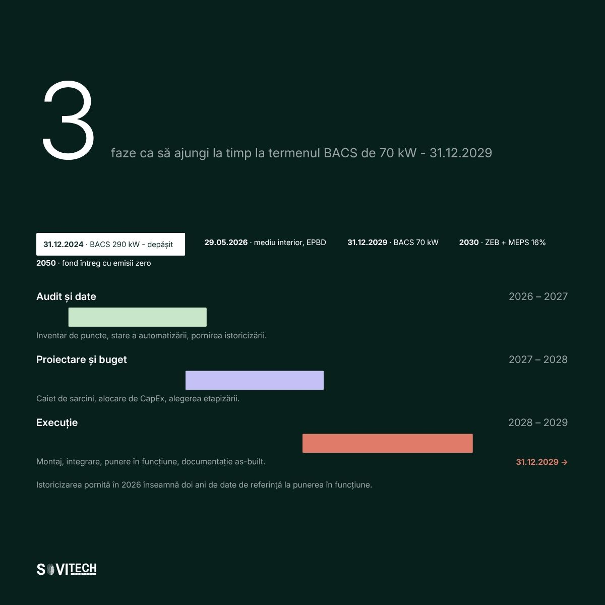

# Article (redesign-2026 branch): EPBD 2024: what changes for non-residential buildings in Romania

> **Unmerged branch content.** This file comes from the branch `redesign-2026` of the SOVITECH website repository, not from `main`. The text is from commit `d2d15d2` (2026-08-24, "Redesign complet: continut editorial, rute noi, identitate vizuala"). The cover and diagrams are from commit `af81353` (2026-08-27, "Materiale vizuale noi: 10 coperti si 15 diagrame"). Owner decision, 2026-09-24: the branch is not SOVITECH's current position and will not be merged. This article is kept for reference only.

This is the full Romanian text of the SOVITECH website article „EPBD 2024: ce se schimbă pentru clădirile nerezidențiale din România”, with its headings, tables, lists, figures, FAQ, sources and page metadata. Source: `components/articles/epbd-2024-romania.tsx` (body, `meta`, `faq`), rendered at `/resurse/epbd-2024-romania` by `app/resurse/[slug]/page.tsx`. Page metadata comes from `lib/site-routes.ts`, `lib/article-cards.ts` and `lib/article-covers.ts`. Paths are relative to the website repository root.

## Status of this content

- **Unmerged branch.** This article exists only on the branch `redesign-2026` of the website repository. The branch is not merged into `main`. Owner decision, 2026-09-24: it is not SOVITECH's current position and will not be merged. Keep this article for reference only. It is not what SOVITECH says today. `main` (`e080614`) is the current website, and it does not have this article.
- **Romanian only.** The branch has no English body for this article. The body component has no `t(ro, en)` calls, so the page shows the Romanian text in both site languages. English exists only for the page title, the lead and the category label (from `lib/site-routes.ts`) and the frame labels in `components/article-layout.tsx`.
- **Marketing and editorial copy.** Its figures (costs, percentages, savings, paybacks, point densities, durations, reference ranges) are not verified engineering data and not an approved reference dataset. The app may not use them as values, benchmarks, ranges or prices (guardrails rule 1, section 2.1, rule 9, rule 10, section 10).
- **Legal and standards statements.** The article states laws, thresholds and deadlines as its authors read them on the verification date in its closing note. The app takes legal thresholds and standards only from approved reference data with their edition or date, never from this article (guardrails rule 11). See "Regulatory statements in the articles" in `README.md`.
- **No named author.** The byline is "Echipa de inginerie Sovitech Control". The source file carries the comment `TODO(author): replace with the signing engineer`, so no engineer has signed this text.

## Page facts

| Item | Value |
|------|-------|
| Slug and route | `epbd-2024-romania`, `/resurse/epbd-2024-romania` |
| Page type | Cluster article (`/resurse/`). Registry status `published`, `draft: "drive"`. |
| Editorial id | A06 |
| Category | Reglementări & Conformare / Regulation & Compliance (C1) |
| Personas | P1 Proprietar / Dezvoltator / Investitor; P5 Manager ESG / Sustenabilitate |
| Pillar | `/ghid/conformare-cladiri-romania` (Harta conformării pentru clădiri în România), status `planned`. The page does not show a pillar link while the pillar is planned (`components/entry-shell.tsx`). |
| H1, RO | EPBD 2024: ce se schimbă pentru clădirile nerezidențiale din România |
| H1, EN | EPBD 2024: what changes for non-residential buildings in Romania |
| Lead, RO | Pragul de 70 kW, ZEB, MEPS și calitatea mediului interior, cu ce este deja lege și ce încă nu este. |
| Lead, EN | The 70 kW threshold, ZEB, MEPS and indoor environmental quality, separating enacted law from pending obligations. |
| `<title>` (RO only) | EPBD 2024 Romania: cladiri nerezidentiale \| Sovitech Control |
| Meta description (RO only, without diacritics as in the source) | Directiva EPBD 2024/1275 nu e inca transpusa in Romania. Vezi ce obligatii apar pentru cladirile nerezidentiale: BACS 70 kW, MEPS, ZEB si calendarul pe ani. |
| `datePublished` / `dateModified` in `meta` | 2026-08-17 / 2026-08-17. `components/articles/index.ts` calls `dateModified` "the legal-verification date". |
| Card date and read time (`lib/article-cards.ts`) | 17 AUG 2026 / AUG 17, 2026; 17 MIN CITIRE / 17 MIN READ |
| Header line on the page | „Publicat 17.08.2026” (`components/article-layout.tsx`) |
| Author on the page | Rail: „Scris de” / "Written by", „Sovitech Control”, „Echipa de inginerie” / "Engineering team". JSON-LD author and publisher: Organization „Sovitech Control”. No `Person` node. |
| Cover | [`covers/epbd-2024-romania.jpg`](covers/epbd-2024-romania.jpg), 1920x1080 JPEG, from `public/coperti/epbd-2024-romania.jpg`. Card background `#07201C`. Also used as `og:image` and JSON-LD `image`. Alt text on the article page: the RO title. |
| Text on the cover | „29.05.2026”, „obligație UE, netranspusă în legea română”. Box „ÎN VIGOARE ÎN ROMÂNIA”: „BACS 290 kW”, „termen depășit, 31.12.2024”. „4 obligații UE în așteptare”. Timeline: „CALITATEA MEDIULUI INTERIOR · 29.05.2026”, „ZEB · 2028 PUBLIC”, „BACS 70 KW · 31.12.2029”, „MEPS · 16% ÎN 2030”. |
| Diagrams | 1, listed below, from `public/diagrame/` |
| FAQ pairs | 5, shown in the body and emitted as `FAQPage` JSON-LD |
| Structured data | `Article` (inLanguage `ro`), `BreadcrumbList` (Acasă > Resurse > title), `FAQPage` (`components/article-jsonld.tsx`). Base URL `https://sovitech-website-gaidenic.vercel.app`. |
| Length | About 3,732 words in this Markdown rendering, tables included. |

### Diagrams

| Local copy | Caption in the article (RO, verbatim) |
|------------|----------------------------------------|
| `diagrams/A06-1-cronologie-si-fereastra-de-actiune.jpg` | Cronologia obligațiilor EPBD 2024-2050 și fereastra de acțiune pentru audit, buget și execuție. |

Text on the diagram (read from the image): **A06-1** „3 faze ca să ajungi la timp la termenul BACS de 70 kW - 31.12.2029”. Timeline: 31.12.2024 BACS 290 kW, depășit; 29.05.2026 mediu interior, EPBD; 31.12.2029 BACS 70 kW; 2030 ZEB + MEPS 16%; 2050 fond întreg cu emisii zero. Phases: „Audit și date” 2026–2027, „Proiectare și buget” 2027–2028, „Execuție” 2028–2029. Footer „Istoricizarea pornită în 2026 înseamnă doi ani de date de referință la punerea în funcțiune.”

## Article text (RO, verbatim)

How this was rendered: the article's `<h2>` headings are `###` here and its `<h3>` headings are `####`. The lead paragraph (class `standfirst`) and the closing note (class `article-note`) are labelled. Diagrams point to the local copies in `diagrams/`. The FAQ box sits where the page renders it. Internal site links are written as the link text followed by the site path in code, for example „lista de referințe (`/referinte`)”, because root-relative links do not resolve outside the website. Bold and italics are as in the source. Nothing was translated, corrected or shortened.

*Standfirst:* Ce se aplică deja prin legea română, ce rămâne obligație UE și calendarul până în 2050.

**EPBD 2024 este Directiva (UE) 2024/1275 privind performanța energetică a clădirilor, încă netranspusă în legea română. Pragul de 70 kW, cu termen 31 decembrie 2029, provine din Directiva (UE) 2024/1275, art. 13 alin. (9) lit. b), și nu este încă transpus în legea română.**

**Pentru clădirile nerezidențiale, directiva aduce cinci obligații: pragul BACS coborât la 70 kW, cele patru capabilități cerute sistemului de automatizare, praguri minime de performanță energetică (MEPS) pentru cele mai slabe 16% până în 2030, standardul de clădire cu emisii zero din 1 ianuarie 2028 și monitorizarea calității mediului interior din 29 mai 2026.**

La 15 iulie 2026, Comisia Europeană a trimis scrisori de punere în întârziere tuturor celor 27 de state membre, inclusiv României, pentru netranspunerea directivei. Termenul expirase la 29 mai 2026, iar statele au două luni pentru a răspunde ([comunicatul Comisiei Europene, 15.07.2026](https://energy.ec.europa.eu/news/commission-calls-eu-countries-transpose-reinforced-rules-energy-performance-buildings-2026-07-15_en)). Din toată directiva, România a transpus până acum un singur element: art. 17 alin. (15), prin OG 16/2025.

<a id="pe-scurt"></a>
### Pe scurt

- Singura obligație BACS sancționabilă astăzi în România este pragul de 290 kW din Legea 372/2005; termenul a fost 31 decembrie 2024 și este depășit.
- Pragul de 70 kW, cu termen 31 decembrie 2029, provine din Directiva (UE) 2024/1275, art. 13 alin. (9) lit. b), și nu este încă transpus în legea română.
- Capabilitatea de monitorizare a calității mediului interior are termen propriu, 29 mai 2026, separat de restul cerințelor pentru BACS.
- MEPS vizează cele mai slabe 16% din fondul nerezidențial până în 2030 și cele mai slabe 26% până în 2033, cu referință la 1 ianuarie 2020.
- Standardul de clădire cu emisii zero se aplică din 1 ianuarie 2028 clădirilor publice noi și din 1 ianuarie 2030 tuturor clădirilor noi.
- Amenzile majorate prin Legea 238/2024 merg până la 20.000 lei pentru operatori și până la 30.000 lei pentru autoritățile locale.

### Cuprins

*Navigation (Cuprins):*

- [Pe scurt](#pe-scurt)
- [Stadiul transpunerii în România: termen 29 mai 2026, depășit](#stadiul-transpunerii-termen-29-mai-2026)
- [Cele cinci obligații EPBD care schimbă economia clădirii nerezidențiale](#cele-cinci-obligatii-epbd)
- [Calendarul obligațiilor EPBD, de la 31.12.2024 la 2050](#calendarul-obligatiilor-2024-2050)
- [EPBD peste pragul de 70 kW: birouri, industrie si sector public](#epbd-peste-pragul-de-70-kw-birouri-industrie-sector-public)
- [Legătura cu ESG: CSRD peste 1.000 de angajați și 450 mil. EUR](#legatura-cu-esg-csrd-1000-angajati-450-mil-eur)
- [Șase acțiuni pentru următoarele 12 luni](#sase-actiuni-pentru-urmatoarele-12-luni)
- [Ce urmărim după punerea în întârziere din 15 iulie 2026](#ce-urmarim-dupa-punerea-in-intarziere-15-iulie-2026)
- [Întrebări frecvente](#intrebari-frecvente)
- [Concluzie](#concluzie)
- [Abonare la alertele de reglementare](#abonare-la-alertele-de-reglementare)

<a id="stadiul-transpunerii-termen-29-mai-2026"></a>
### Stadiul transpunerii în România: termen 29 mai 2026, depășit

Termenul de transpunere a Directivei (UE) 2024/1275 a fost 29 mai 2026 și este depășit, iar procedura de infringement a început. Două planuri se confundă des.

**Planul UE.** Directiva (UE) 2024/1275 este în vigoare. Termenul de transpunere a fost 29 mai 2026, conform art. 35 alin. (1), cu o singură excepție: 1 ianuarie 2025 pentru art. 17 alin. (15) ([sinteza oficială a directivei](https://eur-lex.europa.eu/legal-content/EN/TXT/HTML/?uri=OJ:C_202506438)).

**Planul național.** Sancțiunile pe care le poate primi astăzi un proprietar din România nu vin din directivă, ci din [Legea 372/2005](https://legislatie.just.ro/Public/DetaliiDocument/66970), așa cum a fost modificată prin [Legea 238/2024](https://legislatie.just.ro/public/DetaliiDocument/285769) (adoptată 19.07.2024, publicată în M. Of. la 25.07.2024). Legea 238/2024 a majorat amenzile cu până la aproximativ 400%: tranșe de 5.000-7.500 lei, 7.500-10.000 lei, 10.000-20.000 lei și 5.000-30.000 lei pentru autoritățile locale, plus sancțiunea complementară de suspendare 12-24 de luni pentru auditori.

Regula practică: controlul și amenda se aplică pe textul românesc în vigoare. Ce este deja în Legea 372/2005 se sancționează acum; ce se află doar în Directiva (UE) 2024/1275 devine sancționabil la transpunere, iar transpunerea nu resetează termenele. Imaginea completă a obligațiilor suprapuse pe o clădire din România se construiește din materialele despre reglementări și conformare (`/resurse/reglementari-conformare`).

<a id="cele-cinci-obligatii-epbd"></a>
### Cele cinci obligații EPBD care schimbă economia clădirii nerezidențiale

#### Pragul BACS: de la 290 kW la 70 kW, termen 31.12.2029

BACS înseamnă „sisteme de automatizare și control al clădirilor”, termenul legal din Directiva (UE) 2024/1275 și din legea română. Art. 13 alin. (9) stabilește două praguri pentru clădirile nerezidențiale cu sisteme de încălzire, de climatizare, sau combinate cu ventilare, pe familie de sisteme:

- **peste 290 kW putere nominală utilă, până la 31 decembrie 2024;**
- **peste 70 kW putere nominală utilă, până la 31 decembrie 2029.**

Ambele sunt condiționate de fezabilitatea tehnică și economică ([textul Directivei (UE) 2024/1275](https://eur-lex.europa.eu/eli/dir/2024/1275/oj/eng)). Condiția nu este o portiță: se documentează, nu se presupune.

Diferența care contează: pragul de 290 kW este deja în legea română, la art. 27 alin. (5) și art. 29 alin. (6) din Legea 372/2005; termenul a fost 31 decembrie 2024 și este depășit. Pragul de 70 kW, cu termen 31 decembrie 2029, provine din Directiva (UE) 2024/1275, art. 13 alin. (9) lit. b), și nu este încă transpus în legea română.

> „Până la data de 31 decembrie 2024, clădirile nerezidențiale care au sisteme de încălzire sau sisteme combinate de încălzire și de ventilare a spațiului cu o putere nominală utilă de peste 290 kW vor fi echipate, dacă acest lucru este fezabil din punct de vedere tehnic și economic, cu sisteme de automatizare și de control pentru clădiri”
>
> Legea 372/2005, art. 27 alin. (5)

Textul integral, formularea identică de la art. 29 alin. (6) pentru climatizare și discuția despre sancțiuni sunt în articolul dedicat: obligația BACS și pragul de 290 kW (`/resurse/obligatie-bacs-legea-372-2005`).

Coborârea pragului la 70 kW multiplică populația de clădiri vizate. O clădire de birouri de 3.000-5.000 mp, un hotel de talie medie, o hală cu birouri administrative sau o clinică trec pragul fără efort. Puterea nominală utilă nu se citește dintr-o bază de date: se adună de pe plăcuțele cazanelor, chillerelor și centralelor de tratare a aerului, iar la clădirile cu mai multe surse însumarea pe familie de sisteme este prima sursă de dispută cu un organ de control. Pentru o clădire concretă se poate cere o verificare a pragului de putere pentru clădire (`/contact`).

#### Cele patru capabilități cerute sistemului, cu litera d) din 29 mai 2026

Directiva (UE) 2024/1275 nu cere un echipament, ci funcții. Art. 13 alin. (10) lit. a) la d) enumeră capabilitățile pe care trebuie să le aibă sistemul instalat.

| Literă | Capabilitate cerută | Ce înseamnă în practică |
|---|---|---|
| a) | Monitorizarea, înregistrarea, analiza și ajustarea continuă a consumului de energie | Contorizare pe zone și pe utilități, istoricizare, buclă de reglaj care se corectează, nu simplă afișare |
| b) | Benchmarking al eficienței, detectarea pierderilor și informarea responsabilului | Valori de referință, alarme de derivă, un destinatar nominalizat pentru notificări |
| c) | Comunicarea cu sistemele tehnice conectate și interoperabilitate între tehnologii proprietare diferite | Protocoale deschise, BACnet, Modbus, KNX, M-Bus, și date exportabile |
| d) | **Monitorizarea calității mediului interior, din 29 mai 2026** | Senzori de CO2, temperatură și umiditate, cu înregistrare, nu simplu afișaj local |

Monitorizarea calității mediului interior, cerută de art. 13 alin. (10) lit. d), are dată proprie, 29 mai 2026, deja trecută la nivel de directivă. Un sistem BMS, Building Management System, a nu se confunda cu Battery Management System, instalat acum fără senzori de calitate a aerului se completează ulterior, cu instalația în funcțiune și cu cost dublu.

Din integrările executate de Sovitech Control, integrator de automatizări cu sediul în București, litera b) lipsește din aproape orice sistem pus în funcțiune înainte de 2018, chiar și acolo unde hardware-ul este în regulă: există trend loguri, dar nu și valori de referință, alarme de derivă sau un destinatar nominalizat. Litera c) decide dacă activul rămâne liber: un sistem de automatizare care nu comunică în afara ecosistemului producătorului blochează fiecare extindere (materialele despre BMS, SCADA și integrare (`/resurse/bms-scada-integrare`)).

#### MEPS: cele mai slabe 16% în 2030, 26% în 2033

MEPS, standardele minime de performanță energetică, sunt obligația care schimbă cel mai mult economia unui portofoliu. Art. 9 alin. (1) din Directiva (UE) 2024/1275 cere statelor membre praguri minime, astfel încât:

- **cele mai slabe 16%** din fondul național de clădiri nerezidențiale să fie renovate **până în 2030**;
- **cele mai slabe 26%**, **până în 2033**;
- referința de calcul rămâne starea fondului la **1 ianuarie 2020**.

Mecanismul este relativ, nu absolut. Nu contează consumul în valoare absolută, ci poziția față de restul fondului național. O clădire care astăzi pare acceptabilă poate ajunge în ultimele 16% pentru simplul motiv că restul pieței se modernizează mai repede.

De aici vine expresia „risc de activ blocat” (*stranded asset*). Pentru proprietar înseamnă o clădire oprită de la închiriere sau tranzacționare până la renovare, cu CapEx neplanificat și pierdere de venit. Pentru finanțator înseamnă altceva: băncile și fondurile evaluează deja portofoliile după expunerea la MEPS, iar o clădire în zona de risc primește condiții mai proaste. Efectul asupra valorii se produce înainte de termenul legal, când riscul devine vizibil în due diligence.

Singura reacție utilă pentru proprietar este să știe unde se află față de cele mai slabe 16%, iar asta cere date normalizate, nu estimări. Limita de recunoscut: fără contorizare secundară, consumul pe chiriaș și pe zonă rămâne o estimare, oricât de bun ar fi softul. Punctul de plecare este consumul normalizat pe mp, cu istoric: se poate cere o comparație a consumului clădirii cu valorile de referință din piață (`/contact`).

#### Clădirile cu emisii zero: 1 ianuarie 2028 și 1 ianuarie 2030

Directiva (UE) 2024/1275 înlocuiește treptat nZEB cu ZEB, clădirea cu emisii zero. Calendarul:

- **1 ianuarie 2028**, clădirile noi deținute de organisme publice;
- **1 ianuarie 2030**, toate clădirile noi;
- **2050**, transformarea fondului existent.

Există și o cerință tehnică punctuală, ușor de trecut cu vederea. Art. 13 alin. (5) prevede că clădirile nerezidențiale cu emisii zero se echipează cu dispozitive de măsurare și control al calității aerului interior, iar la clădirile existente cerința se aplică la renovare majoră, unde este fezabil.

La orice renovare majoră planificată în următorii ani, calitatea aerului interior intră în pachetul de conformare, nu în lista de opțiuni de confort. Costul de a o include în proiect este mic; costul de a o adăuga peste doi ani, cu tavanele închise, nu este.

#### Calitatea mediului interior, cerință UE cu termen 29 mai 2026

Art. 13 alin. (4) din Directiva (UE) 2024/1275 cere standarde adecvate de calitate a mediului interior. Împreună cu art. 13 alin. (10) lit. d), cu termen 29 mai 2026, și cu art. 13 alin. (5), direcția este clară: clădirea demonstrează cu date înregistrate că mediul interior este controlat.

Pentru proprietar, calitatea mediului interior este singura obligație din EPBD cu beneficiu comercial direct. Nivelurile de CO2 și temperatura sunt primele două reclamații ale chiriașilor, iar un istoric de date închide discuția în locul unei negocieri. Aceleași date alimentează indicatorii sociali din raportarea managerului ESG. O limită de care se lovește oricine operează astfel de senzori: elementele de CO2 se decalibrează în 2-3 ani, iar o cerință de monitorizare fără plan de recalibrare produce date, nu conformare.

<a id="calendarul-obligatiilor-2024-2050"></a>
### Calendarul obligațiilor EPBD, de la 31.12.2024 la 2050

Coloana din dreapta separă riscul imediat de planificare: un singur rând este lege română în vigoare, restul sunt obligații UE netranspuse.

| Termen | Obligație | Temei | Statut în România |
|---|---|---|---|
| 31.12.2024 | BACS la clădiri nerezidențiale peste 290 kW pe familie de sisteme (dacă e fezabil tehnic și economic) | L. 372/2005, art. 27 alin. (5) și art. 29 alin. (6); EPBD art. 13 alin. (9) | **Lege română în vigoare, termen depășit** |
| 29.05.2026 | Capabilitate de monitorizare a calității mediului interior în sistemul BACS | EPBD art. 13 alin. (10) lit. d) | Obligație UE, netranspusă |
| 29.05.2026 | Termen de transpunere a directivei | EPBD art. 35 alin. (1) | **Depășit, punere în întârziere la 15.07.2026** |
| 01.01.2028 | Clădiri publice noi, standard ZEB | EPBD, cap. ZEB | Obligație UE, netranspusă |
| 31.12.2029 | BACS la clădiri nerezidențiale peste 70 kW pe familie de sisteme | EPBD art. 13 alin. (9) lit. b) | Obligație UE, netranspusă |
| 01.01.2030 | Toate clădirile noi, standard ZEB | EPBD, cap. ZEB | Obligație UE, netranspusă |
| 2030 | MEPS, renovarea celor mai slabe 16% din fondul nerezidențial | EPBD art. 9 alin. (1) | Obligație UE, netranspusă |
| 2033 | MEPS, cele mai slabe 26% | EPBD art. 9 alin. (1) | Obligație UE, netranspusă |
| 2050 | Transformarea fondului existent în clădiri cu emisii zero | EPBD | Obligație UE, netranspusă |



*Figure (`/diagrame/A06-1-cronologie-si-fereastra-de-actiune.jpg`):* Cronologia obligațiilor EPBD 2024-2050 și fereastra de acțiune pentru audit, buget și execuție.

<a id="epbd-peste-pragul-de-70-kw-birouri-industrie-sector-public"></a>
### EPBD peste pragul de 70 kW: birouri, industrie si sector public

#### Proprietarul unei clădiri de birouri închiriate, peste pragul de 70 kW

Expunerea vine pe trei fronturi simultan. MEPS poate bloca activul, chiriașii corporativi cer deja date de consum pe spațiul lor, iar pragul de 70 kW se atinge aproape sigur. Prioritatea nu este echipamentul, ci lanțul de date: contorizare pe chiriaș, consum normalizat pe mp, istoric de cel puțin 12 luni. Detalii pe pagina clădiri de birouri (`/expertiza/cladiri-de-birouri`).

#### Operatorul industrial: hale cu CTA peste pragul de 70 kW

Partea de clădire, adică birouri, vestiare și hale cu HVAC (încălzire, ventilare și climatizare), intră sub EPBD, iar partea de proces intră sub alte regimuri. Pragul de 70 kW se atinge ușor la o hală cu centrale de tratare a aerului (CTA). Infrastructura de automatizare există deja de regulă, dar nu produce date consolidate, ci insule de trend loguri pe fiecare utilaj. Detalii în expertiza industrială (`/expertiza/industrial`).

#### Instituția publică: ZEB din 1 ianuarie 2028, amenzi până la 30.000 lei

Calendarul este cel mai strâns: clădirile publice noi trebuie să fie clădiri cu emisii zero (ZEB) de la 1 ianuarie 2028, iar autoritățile locale au tranșa de amendă cea mai mare din Legea 238/2024, între 5.000 și 30.000 lei. Finanțarea, în schimb, este activă acum, nu ipotetică.

<a id="legatura-cu-esg-csrd-1000-angajati-450-mil-eur"></a>
### Legătura cu ESG: CSRD peste 1.000 de angajați și 450 mil. EUR

Datele cerute de Directiva (UE) 2024/1275 sunt aceleași date pe care le cere raportarea de sustenabilitate. Consum pe utilitate și pe zonă, serie temporală, valori de referință, detectarea abaterilor, calitatea mediului interior: art. 13 alin. (10) descrie, fără să o spună, infrastructura de colectare pentru un raport ESG credibil.

Asta schimbă modul în care se justifică investiția. Un sistem BACS (sisteme de automatizare și control al clădirilor) instalat pentru conformare EPBD produce, ca efect secundar, datele auditabile pentru Scope 1 și 2. Legătura dintre sursele de date și indicatorii raportați este explicată în ghidul despre datele pentru raportarea ESG (`/ghid/date-esg-cladiri`).

Contextul de raportare s-a mai relaxat între timp. [Directiva (UE) 2026/470](https://eur-lex.europa.eu/eli/dir/2026/470/oj/eng) („pachetul Omnibus”, în vigoare din 18.03.2026) restrânge sfera CSRD la întreprinderile cu peste 1.000 de angajați *și* peste 450 mil. EUR cifră de afaceri netă, iar [OMF 85/2024, modificat prin OMF 1421/2025](https://legislatie.just.ro/Public/DetaliiDocument/278502), a amânat valurile 2 și 3 în România. Relaxarea privește cine raportează formal, nu cererea de date, care vine din lanțul de aprovizionare, de la bănci și de la chiriași.

**Finanțare disponibilă, pe scurt.** Pentru clădiri publice: apelul 2.1.B „Creșterea eficienței energetice a clădirilor publice” din Programele Regionale, lansat la 04.06.2026 în Regiunea Sud-Est, cu apeluri echivalente în celelalte șapte programe regionale ([ghidul apelului](https://regiosudest.ro/ghiduri/prioritatea-2/apeluri-active/apel-lansat-2-1-b-cresterii-eficientei-energetice-a-cladirilor-publice-04-06-2026)). Pentru industrie: programul de 150 mil. EUR din Fondul pentru Modernizare al Ministerului Energiei, pentru operatori industriali participanți la EU-ETS, până la 30 mil. EUR pe proiect, cu active eligibile care includ explicit „sisteme integrate de management al consumului de energie” ([anunțul Ministerului Energiei](https://energie.gov.ro/ministerul-energiei-lanseaza-cel-mai-ambitios-program-pentru-eficientizarea-energetica-a-industriei-romanesti-sprijinit-din-fondul-pentru-modernizare-cu-un-buget-total-de-150-de-milioane-de-euro/)); ghidul era în consultare, deci statusul se verifică înainte de bugetare. PNRR C5 „Valul Renovării” este, dimpotrivă, în fază terminală de implementare: o fereastră care se închide.

<a id="sase-actiuni-pentru-urmatoarele-12-luni"></a>
### Șase acțiuni pentru următoarele 12 luni

Niciuna dintre cele șase acțiuni de mai jos nu presupune ca legea română de transpunere să fie deja publicată.

| Nr. | Acțiune | De ce acum | Orizont |
|---|---|---|---|
| 1 | Inventarierea puterii nominale utile a sistemelor de încălzire, ventilare și climatizare, per clădire și pe familie de sisteme | Fără cifra asta nu se știe dacă o clădire este peste 290 kW (obligație actuală) sau doar peste 70 kW (obligație 2029) | 30 de zile |
| 2 | Verificarea capabilităților din art. 13 alin. (10) lit. a) la d) pe sistemul existent | De regulă lipsesc b) și d), benchmarking și calitatea mediului interior | 60 de zile |
| 3 | Pornirea colectării de consum normalizat pe mp, cu istoric | Poziția față de MEPS se demonstrează cu serii de date, nu cu declarații | 3 luni |
| 4 | Documentarea analizei de fezabilitate tehnică și economică acolo unde nu se instalează BACS | Excepția din lege se probează cu un document, nu se invocă verbal, și se face pe clădire, nu pe portofoliu | 6 luni |
| 5 | Includerea senzorilor de calitate a aerului interior în orice proiect de renovare aflat pe masă | Cost marginal mic acum, cost integral după 2028 | La următorul proiect |
| 6 | Alinierea bugetului de CapEx la fereastra 2028-2029 și verificarea eligibilității pentru finanțare | Termenul de 31.12.2029 înseamnă execuție în 2028-2029, deci decizie de buget în 2027 | 12 luni |

Pentru sistemele mai vechi de 10-12 ani, discuția nu este despre completare, ci despre modernizarea sistemului de automatizare (`/servicii/modernizare-sisteme-de-automatizare-si-bms`), pentru că platformele vechi nu susțin cerințele de interoperabilitate de la art. 13 alin. (10) lit. c).

<a id="ce-urmarim-dupa-punerea-in-intarziere-15-iulie-2026"></a>
### Ce urmărim după punerea în întârziere din 15 iulie 2026

- **Răspunsul României la scrisoarea de punere în întârziere** din 15.07.2026 și pasul următor al Comisiei, avizul motivat.
- **Proiectul de lege de transpunere**, în special formularea pragului de 70 kW și criteriile de fezabilitate tehnică și economică.
- **Definirea națională a pragului MEPS**, care va spune concret ce clădiri intră în cele mai slabe 16%.

Articolul se actualizează la publicarea în Monitorul Oficial a legii de transpunere și la orice modificare a termenelor. Data ultimei verificări juridice este afișată la final.

<a id="intrebari-frecvente"></a>
### Întrebări frecvente

*(FAQ box, rendered from the exported `faq` list; the same pairs feed the FAQPage JSON-LD. Questions verbatim, some without diacritics as in the source.)*

**Trebuie sa fac ceva acum, daca legea romana nu s-a schimbat inca?**

Da. Obligația de la 290 kW este deja în Legea 372/2005; termenul a fost 31 decembrie 2024 și este depășit. Pentru restul, acțiunea utilă acum este inventarul puterilor instalate și colectarea de date, lucruri care durează luni și pe care le cere orice variantă de transpunere.

**Pragul de 70 kW se aplică deja în România?**

Nu. Pragul de 70 kW, cu termen 31 decembrie 2029, provine din Directiva (UE) 2024/1275, art. 13 alin. (9) lit. b), și nu este încă transpus în legea română. Legea 372/2005 conține în prezent doar pragul de 290 kW, cu termen 31 decembrie 2024.

**Ce înseamnă „fezabil din punct de vedere tehnic și economic”?**

Este condiția din art. 13 alin. (9) al Directivei (UE) 2024/1275, preluată și în Legea 372/2005. Nu este o exceptare automată: proprietarul trebuie să poată prezenta o analiză care arată de ce instalarea nu se justifică. În lipsa documentului, condiția nu poate fi invocată în fața unui control.

**Cum se știe dacă o clădire intră în cele mai slabe 16% vizate de MEPS?**

Încă nu se poate ști. Art. 9 alin. (1) definește pragul relativ la fondul național, cu referință la 1 ianuarie 2020, iar clasificarea se va face prin legea de transpunere. Măsura utilă acum este consumul normalizat pe mp, comparat cu valori de referință din piață.

**Amenzile din Legea 238/2024 se aplică și pentru neinstalarea BACS?**

Legea 238/2024 a majorat regimul sancționator al Legii 372/2005, cu tranșe între 5.000 și 30.000 lei în funcție de faptă și de subiect. Încadrarea se face pe textul consolidat al legii, verificat pentru situația fiecărei clădiri.

<a id="concluzie"></a>
### Concluzie

Statutul de directivă netranspusă amână sancțiunea, nu calendarul. Termenele rămân valabile indiferent de data la care România adoptă legea de transpunere, ceea ce lasă unui proprietar cu clădiri peste 70 kW aproximativ trei ani pentru audit, buget și execuție. Cine începe cu inventarul puterilor și cu seria de date ajunge la transpunere cu o listă de lucrări. Cine așteaptă textul de lege ajunge la ea cu o listă de întrebări.

<a id="abonare-la-alertele-de-reglementare"></a>
### Abonare la alertele de reglementare

Urmărirea Monitorului Oficial nu este o sarcină de proprietar. Trimitem o alertă scurtă la fiecare schimbare care afectează clădirile nerezidențiale din România, cu o frază despre efectul practic. Cere înscrierea la alertele de reglementare (`/contact`). Materialele publicate până acum sunt în arhiva de reglementări și conformare (`/resurse/reglementari-conformare`), iar pentru portofolii există o evaluare de expunere (`/servicii/consultanta`).

*Article note (class `article-note`):* Articol publicat 17.08.2026, actualizat 19.08.2026. Informațiile juridice au fost verificate la 17.08.2026. Statutul transpunerii se poate schimba, deci sursele citate se verifică înainte de o decizie de investiție. Autor: Echipa de inginerie Sovitech Control.

## Sources and links in the article

External sources cited (URL, then the anchor text as written):

- <https://energy.ec.europa.eu/news/commission-calls-eu-countries-transpose-reinforced-rules-energy-performance-buildings-2026-07-15_en>: „comunicatul Comisiei Europene, 15.07.2026”
- <https://eur-lex.europa.eu/legal-content/EN/TXT/HTML/?uri=OJ:C_202506438>: „sinteza oficială a directivei”
- <https://legislatie.just.ro/Public/DetaliiDocument/66970>: „Legea 372/2005”
- <https://legislatie.just.ro/public/DetaliiDocument/285769>: „Legea 238/2024”
- <https://eur-lex.europa.eu/eli/dir/2024/1275/oj/eng>: „textul Directivei (UE) 2024/1275”
- <https://eur-lex.europa.eu/eli/dir/2026/470/oj/eng>: „Directiva (UE) 2026/470”
- <https://legislatie.just.ro/Public/DetaliiDocument/278502>: „OMF 85/2024, modificat prin OMF 1421/2025”
- <https://regiosudest.ro/ghiduri/prioritatea-2/apeluri-active/apel-lansat-2-1-b-cresterii-eficientei-energetice-a-cladirilor-publice-04-06-2026>: „ghidul apelului”
- <https://energie.gov.ro/ministerul-energiei-lanseaza-cel-mai-ambitios-program-pentru-eficientizarea-energetica-a-industriei-romanesti-sprijinit-din-fondul-pentru-modernizare-cu-un-buget-total-de-150-de-milioane-de-euro/>: „anunțul Ministerului Energiei”

Internal links (site path, status on the branch):

- `/resurse/reglementari-conformare`: published (category archive) in `lib/site-routes.ts`
- `/resurse/obligatie-bacs-legea-372-2005`: published (resurse) in `lib/site-routes.ts`
- `/contact`: static page on the branch
- `/resurse/bms-scada-integrare`: published (category archive) in `lib/site-routes.ts`
- `/expertiza/cladiri-de-birouri`: published (expertiza) in `lib/site-routes.ts`
- `/expertiza/industrial`: published (expertiza) in `lib/site-routes.ts`
- `/ghid/date-esg-cladiri`: published (ghid) in `lib/site-routes.ts`
- `/servicii/modernizare-sisteme-de-automatizare-si-bms`: published (servicii) in `lib/site-routes.ts`
- `/servicii/consultanta`: published (servicii) in `lib/site-routes.ts`

The source file lists links that were weakened because their target page is not built yet (`LINKS-TO-REACTIVATE`). Each line gives the anchor text, the interim target and the planned final target. Verbatim:

```text
// LINKS-TO-REACTIVATE: materialele despre reglementări și conformare (secțiunea „Stadiul transpunerii”) | interim /resurse/reglementari-conformare | final /ghid/conformare-cladiri-romania
// LINKS-TO-REACTIVATE: arhiva de reglementări și conformare (blocul de CTA) | interim /resurse/reglementari-conformare | final /ghid/conformare-cladiri-romania
// LINKS-TO-REACTIVATE: materialele despre BMS, SCADA și integrare | interim /resurse/bms-scada-integrare | final /ghid/protocoale-automatizarea-cladirilor
// LINKS-TO-REACTIVATE: cere o verificare a pragului de putere pentru clădire | interim /contact | final /instrumente/test-obligatie-bacs
// LINKS-TO-REACTIVATE: cere o comparație a consumului clădirii cu valorile de referință din piață | interim /contact | final /instrumente/benchmark-kwh-mp
// LINKS-TO-REACTIVATE: Cere înscrierea la alertele de reglementare | interim /contact | final pagina de abonare dedicată (inexistentă încă)
```

## Notes

- Core regulatory article of the set. Its main legal statements are quoted in `README.md`, section "Regulatory statements in the articles".
- Legal opinions stated as fact: „Termenele rămân valabile indiferent de data la care România adoptă legea de transpunere” and „transpunerea nu resetează termenele”. They are the authors' reading. The app does not take deadlines from them.
- „Pe scurt” calls the 290 kW rule „Singura obligație BACS sancționabilă astăzi în România”. `monitorizare-calitate-aer-epbd` says Legea 238/2024 raised fines „în general, fără o tranșă dedicată BACS”, and `obligatie-bacs-legea-372-2005` says the tranche must be read from the consolidated law. No article names the sanctioning article.
- Funding (Regio call 2.1.B launched 04.06.2026, a 150 mil. EUR Modernisation Fund programme, PNRR C5) and CSRD Omnibus thresholds are dated statements, not reference data.
- Says CO₂ sensor elements drift in 2-3 years, as `monitorizare-calitate-aer-epbd` does.
- Dates: `meta` says 2026-08-17 for both; the closing note says „actualizat 19.08.2026”. The closing note gives a later update date than `meta.dateModified`, so the page header shows no „Actualizat” date. By the comment in `components/articles/index.ts`, `dateModified` is the legal-verification date, which explains the gap but is not what a reader sees.
