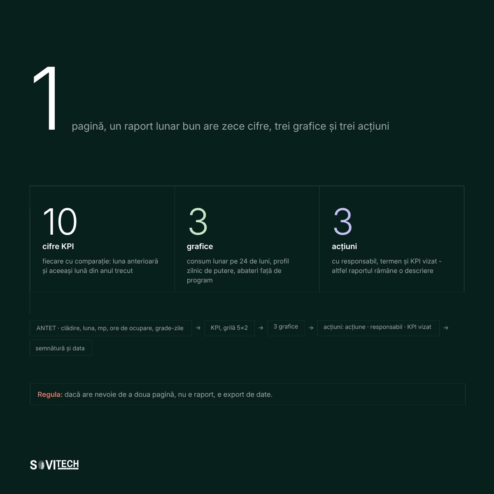
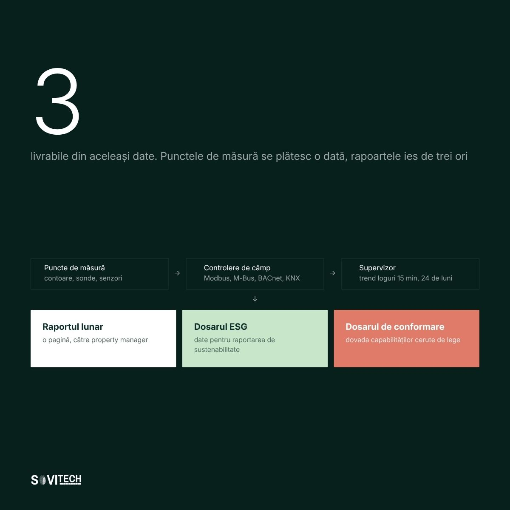

# Article (redesign-2026 branch): 10 KPIs every commercial building should track

> **Unmerged branch content.** This file comes from the branch `redesign-2026` of the SOVITECH website repository, not from `main`. The text is from commit `d2d15d2` (2026-08-24, "Redesign complet: continut editorial, rute noi, identitate vizuala"). The cover and diagrams are from commit `af81353` (2026-08-27, "Materiale vizuale noi: 10 coperti si 15 diagrame"). Owner decision, 2026-09-24: the branch is not SOVITECH's current position and will not be merged. This article is kept for reference only.

This is the full Romanian text of the SOVITECH website article „10 indicatori (KPI) pentru orice clădire comercială”, with its headings, tables, lists, figures, FAQ, sources and page metadata. Source: `components/articles/kpi-performanta-cladire.tsx` (body, `meta`, `faq`), rendered at `/resurse/kpi-performanta-cladire` by `app/resurse/[slug]/page.tsx`. Page metadata comes from `lib/site-routes.ts`, `lib/article-cards.ts` and `lib/article-covers.ts`. Paths are relative to the website repository root.

## Status of this content

- **Unmerged branch.** This article exists only on the branch `redesign-2026` of the website repository. The branch is not merged into `main`. Owner decision, 2026-09-24: it is not SOVITECH's current position and will not be merged. Keep this article for reference only. It is not what SOVITECH says today. `main` (`e080614`) is the current website, and it does not have this article.
- **Romanian only.** The branch has no English body for this article. The body component has no `t(ro, en)` calls, so the page shows the Romanian text in both site languages. English exists only for the page title, the lead and the category label (from `lib/site-routes.ts`) and the frame labels in `components/article-layout.tsx`.
- **Marketing and editorial copy.** Its figures (costs, percentages, savings, paybacks, point densities, durations, reference ranges) are not verified engineering data and not an approved reference dataset. The app may not use them as values, benchmarks, ranges or prices (guardrails rule 1, section 2.1, rule 9, rule 10, section 10).
- **Legal and standards statements.** The article states laws, thresholds and deadlines as its authors read them on the verification date in its closing note. The app takes legal thresholds and standards only from approved reference data with their edition or date, never from this article (guardrails rule 11). See "Regulatory statements in the articles" in `README.md`.
- **No named author.** The byline is "Echipa de inginerie Sovitech Control". The source file carries the comment `TODO(author): replace with the signing engineer`, so no engineer has signed this text.

## Page facts

| Item | Value |
|------|-------|
| Slug and route | `kpi-performanta-cladire`, `/resurse/kpi-performanta-cladire` |
| Page type | Cluster article (`/resurse/`). Registry status `published`, `draft: "drive"`. |
| Editorial id | A08 |
| Category | Performanța Clădirii / Building Performance (C3) |
| Personas | P2 Property & Asset Manager; P3 Facility Manager; P5 Manager ESG / Sustenabilitate |
| Pillar | `/ghid/sisteme-bms-cladiri` (Sistem BMS pentru clădiri: ghidul complet), status `published` |
| H1, RO | 10 indicatori (KPI) pentru orice clădire comercială |
| H1, EN | 10 KPIs every commercial building should track |
| Lead, RO | Pentru fiecare indicator: ce măsoară, formula, sursa datelor din BMS și ce se face la abatere. |
| Lead, EN | For each indicator: what it measures, the formula, the BMS data source, and what to do when it drifts. |
| `<title>` (RO only) | KPI cladire comerciala: 10 indicatori de urmarit \| Sovitech Control |
| Meta description (RO only, without diacritics as in the source) | Cei 10 KPI pe care ar trebui sa ii urmareasca orice cladire comerciala din Romania: formula, sursa datelor din BMS, interval de referinta si ce se face la abatere. |
| `datePublished` / `dateModified` in `meta` | 2026-08-17 / 2026-08-19. `components/articles/index.ts` calls `dateModified` "the legal-verification date". |
| Card date and read time (`lib/article-cards.ts`) | 17 AUG 2026 / AUG 17, 2026; 16 MIN CITIRE / 16 MIN READ |
| Header line on the page | „Publicat 17.08.2026” · „Actualizat 19.08.2026” (`components/article-layout.tsx`) |
| Author on the page | Rail: „Scris de” / "Written by", „Sovitech Control”, „Echipa de inginerie” / "Engineering team". JSON-LD author and publisher: Organization „Sovitech Control”. No `Person` node. |
| Cover | [`covers/kpi-performanta-cladire.jpg`](covers/kpi-performanta-cladire.jpg), 1920x1080 JPEG, from `public/coperti/kpi-performanta-cladire.jpg`. Card background `#07201C`. Also used as `og:image` and JSON-LD `image`. Alt text on the article page: the RO title. |
| Text on the cover | „10”, „indicatori care spun dacă o clădire merge bine”. Ten tiles with sample values: Intensitate 148 kWh/mp/an; Consum/oră −4% lună/lună; Bază 27% din vârf; Cost 31% din OPEX; COP sezonier 3.8; Ore funcț. +2% vs. program; Încălzire+răcire 0 h pe lună; Alarme 7 active; Mediu interior 96% în interval; Completitudine 98.4% puncte. The values are illustrative and belong to no named building. „3.8” and „98.4%” use a decimal point, not the Romanian comma. |
| Diagrams | 2, listed below, from `public/diagrame/` |
| FAQ pairs | 4, shown in the body and emitted as `FAQPage` JSON-LD |
| Structured data | `Article` (inLanguage `ro`), `BreadcrumbList` (Acasă > Resurse > title), `FAQPage` (`components/article-jsonld.tsx`). Base URL `https://sovitech-website-gaidenic.vercel.app`. |
| Length | About 3,229 words in this Markdown rendering, tables included. |

### Diagrams

| Local copy | Caption in the article (RO, verbatim) |
|------------|----------------------------------------|
| `diagrams/A08-1-macheta-raport-lunar.jpg` | Machetă de raport lunar pe o pagină: antet contextual, grila celor 10 KPI, trei grafice și tabelul de acțiuni. |
| `diagrams/A08-2-flux-punct-de-masura-livrabil.jpg` | Fluxul datelor pe patru straturi: puncte de măsură, controlere de câmp, supervizor cu trend loguri și cele trei livrabile. |

Text on the diagrams (read from the images): **A08-1** „1 pagină, un raport lunar bun are zece cifre, trei grafice și trei acțiuni”; header, KPI grid 5×2, 3 graphs („consum lunar pe 24 de luni, profil zilnic de putere, abateri față de program”), actions, signature; „Regula: dacă are nevoie de a doua pagină, nu e raport, e export de date.” **A08-2** „3 livrabile din aceleași date. Punctele de măsură se plătesc o dată, rapoartele ies de trei ori”: Raportul lunar, Dosarul ESG, „Dosarul de conformare – dovada capabilităților cerute de lege”; supervisor with „trend loguri 15 min, 24 de luni”.

## Article text (RO, verbatim)

How this was rendered: the article's `<h2>` headings are `###` here and its `<h3>` headings are `####`. The lead paragraph (class `standfirst`) and the closing note (class `article-note`) are labelled. Diagrams point to the local copies in `diagrams/`. The FAQ box sits where the page renders it. Internal site links are written as the link text followed by the site path in code, for example „lista de referințe (`/referinte`)”, because root-relative links do not resolve outside the website. Bold and italics are as in the source. Nothing was translated, corrected or shortened.

*Standfirst:* Pentru fiecare indicator: ce măsoară, formula, sursa datelor din BMS, intervalul orientativ și ce se face la abatere.

**O clădire comercială din România, birouri, retail sau hotel, poate fi condusă cu zece indicatori de performanță (KPI, key performance indicators): intensitatea energetică în kWh/mp/an, consumul pe oră ocupată, consumul de bază, costul pe metru pătrat, randamentul instalației de frig, orele de funcționare, orele de încălzire și răcire simultană, rata de alarme, calitatea mediului interior și completitudinea datelor. Restul sunt detalii.**

Toate cele zece se citesc dintr-un sistem BMS (Building Management System, sistemul de management al clădirii, a nu se confunda cu Battery Management System) sau din contoarele conectate la el. Intervalele de referință din articol sunt estimări de piață: pentru clădirile comerciale din România nu există un benchmark publicat pe clase de clădiri.

### Pe scurt

- Cei zece indicatori de performanță (KPI) acoperă energia, costul, funcționarea tehnică, confortul și datele.
- Consumul de bază, puterea trasă când clădirea este goală, se configurează într-o oră și arată prima risipă.
- Intervalele de referință sunt estimări de piață: un benchmark public românesc pe clase de clădiri comerciale nu există.
- KPI 10, completitudinea datelor, decide dacă celelalte nouă sunt cifre sau opinii.
- Din 29 mai 2026, Directiva (UE) 2024/1275 cere ca BACS să monitorizeze și calitatea mediului interior, obligație UE netranspusă în legea română.
- Fiecare indicator are un singur proprietar: facility manager, asset manager sau responsabil ESG.

### Două roluri, două seturi de cifre: facility manager și asset manager

Scena se repetă în orice clădire de birouri din România. Facility managerul spune că a reglat programele orare și că instalația merge bine. Asset managerul se uită la factură și vede o creștere de 9%.

Amândoi au dreptate. Unul măsoară comportamentul instalației, celălalt costul. Unul se uită la o săptămână, celălalt la douăsprezece luni. Unul citește din sistemul BMS (Building Management System) (`/ghid/sisteme-bms-cladiri`), celălalt din contabilitate.

Setul de zece indicatori de mai jos este puntea dintre cele două roluri. Intervalele de referință sunt **estimări de piață**, până la publicarea unui benchmark kWh/mp pentru birourile din România. Vezi și materialele despre performanța clădirii (`/resurse/performanta-cladirii`).

### Energie și cost: KPI 1-4, de la kWh/mp la lei/mp

#### KPI 1. Intensitatea energetică, 120-180 kWh/mp/an

- **Ce măsoară:** consumul clădirii raportat la suprafața deservită.
- **Formulă:** energie anuală (kWh) / suprafață (mp), separat electric și termic.
- **Sursa datelor:** contorul general electric și cel termic, citite prin M-Bus sau Modbus și istoricizate în sistemul BMS (Building Management System); suprafața din fișa tehnică, nu din contract.
- **Referință, estimare de piață:** orientativ 120-180 kWh/mp/an pentru birouri clasa A din București, ca **energie finală, pe întreaga clădire, inclusiv părțile comune și spațiile închiriate, raportată la aria construită desfășurată**, cu electric și termic însumate; clădirile prost reglate depășesc 220 kWh/mp/an.
- **La abatere:** se defalcă electric și termic. Abaterea pe electric trimite la consumul de bază (KPI 3) și la randamentul instalației de frig (KPI 5), cea pe termic la orele de funcționare (KPI 6) și la încălzirea și răcirea simultană (KPI 7).

Intervalul de 120-180 kWh/mp/an este o **estimare de piață**, nu un reper publicat, pentru că pentru Europa Centrală și de Est nu există un benchmark publicat pe clase de clădiri. Reperul extern verificabil cel mai apropiat este [Real Estate Environmental Benchmark 2023 al Better Buildings Partnership](https://www.betterbuildingspartnership.co.uk/sites/default/files/media/attachment/REEB%202023%20Benchmarks_0.pdf), care dă 120 kWh/mp/an mediană pentru un birou climatizat, pe 472 de clădiri, cu domeniul declarat identic: energie finală, întreaga clădire, arie construită. Formula de mai sus cere calculul separat pe electric și pe termic, iar comparația cu ambele referințe se face pe suma celor două.

#### KPI 2. Consumul specific, în kWh pe oră ocupată și pe utilizator

- **Ce măsoară:** consumul clădirii pentru fiecare oră de folosire efectivă.
- **Formulă:** kWh lunar / ore de ocupare și kWh lunar / utilizatori.
- **Sursa datelor:** contorul general; orele de ocupare din programul orar al sistemului BMS sau, mai bine, din senzorii de prezență.
- **Referință, estimare:** indicatorul se compară cu el însuși. Țintă: variație sub 10% de la lună la lună, în plus sau în minus.
- **La abatere:** se compară orele de ocupare declarate cu orele reale de funcționare a echipamentelor (KPI 6).

#### KPI 3. Consumul de bază (baseload), sub 25-30% din vârf

- **Ce măsoară:** cât trage clădirea când nu e nimeni în ea. Arată risipa direct.
- **Formulă:** putere medie între 01:00 și 04:00 în zilele nelucrătoare (kW), ca procent din vârful zilei lucrătoare.
- **Sursa datelor:** un trend log de putere activă pe contorul general, la 15 minute, pe 30 de zile. Ideal, și pe plecările principale.
- **Referință, estimare:** orientativ sub 25-30% din vârf pentru birouri fără funcțiuni continue; peste 40% este aproape întotdeauna risipă.
- **La abatere:** se caută ce nu se oprește niciodată: centrale de tratare a aerului (CTA) permanente, pompe fără comandă de oprire, iluminat fără senzori.

#### KPI 4. Costul energetic, în lei pe mp și în procent din OPEX

- **Ce măsoară:** traducerea în bani a intensității energetice (KPI 1) și legătura cu service charge-ul.
- **Formulă:** cost energie / mp / an și cost energie / cost total OPEX (%).
- **Sursa datelor:** facturile furnizorilor și contorizarea secundară pe chiriași, tratată în materialele despre contorizare și raportare (`/resurse/esg-energie-raportare`). Fără ea, repartiția pe cotă-parte rămâne contestabilă.
- **Referință, estimare:** orientativ, energia reprezintă 25-40% din costul de operare al unei clădiri de birouri din România, în funcție de prețul contractat.
- **La abatere:** se recalculează anul curent la prețul anului anterior. Dacă diferența rămâne, problema este tehnică.

### Funcționare tehnică: KPI 5-8, de la COP la rata de alarme

#### KPI 5. Randamentul instalației de frig, în kWh frig pe kWh electric

- **Ce măsoară:** energia frigorifică livrată pe kWh electric consumat, exprimată ca COP sau EER sezonier.
- **Formulă:** kWh frig livrat / kWh electric la chiller și auxiliare, lunar și sezonier.
- **Sursa datelor:** contor de energie termică pe apa răcită și contor electric dedicat pe chiller. Dacă unul lipsește, indicatorul nu se poate calcula.
- **Referință, estimare:** orientativ 3,0-5,0 în regim sezonier la chillere răcite cu aer. Valorile de catalog sunt sistematic mai mari decât cele reale.
- **La abatere:** se verifică consemnul pe apa răcită, sarcina parțială, curățenia condensatoarelor și debitul pompelor.

#### KPI 6. Orele de funcționare, în ore pe lună și abatere în procente

- **Ce măsoară:** cât au funcționat echipamentele față de cât ar fi trebuit.
- **Formulă:** ore de funcționare pe lună per echipament și abatere = (ore reale minus ore programate) / ore programate (%).
- **Sursa datelor:** contorizarea orelor din controlerele de câmp, pe confirmarea de funcționare (releu de curent sau presostat), nu pe comandă. Comanda spune ce s-a cerut, confirmarea ce s-a întâmplat.
- **Referință, estimare:** abatere sub 5%, în plus sau în minus. Peste 15% înseamnă funcționare manuală neînregistrată sau programe orare suprascrise local.
- **La abatere:** se revizuiesc programele orare și se limitează comenzile manuale. Regimul redus de noapte nu se aplică în spații cu control de umiditate.

#### KPI 7. Încălzirea și răcirea simultană, în ore pe lună

- **Ce măsoară:** câte ore pe lună aceeași centrală de tratare a aerului (CTA) încălzește și răcește simultan. Risipă invizibilă pe factură.
- **Formulă:** ore/lună în care poziția vanei de baterie caldă și cea de baterie rece depășesc simultan un prag (de exemplu 5%), pe același agregat.
- **Sursa datelor:** trend logurile pe comenzile celor două vane din CTA, la 5-15 minute, plus temperatura de refulare.
- **Referință, estimare:** ținta este zero, în afara tranzițiilor scurte. Peste 20 de ore pe lună indică o buclă de reglaj greșit configurată, subiect tratat în materialele despre reglajul și performanța clădirii (`/resurse/performanta-cladirii`).
- **La abatere:** se reconfigurează secvența cu zonă neutră și se verifică dacă vanele închid complet la comandă zero.

#### KPI 8. Rata de alarme, în număr de alarme și ore până la închidere

- **Ce măsoară:** cât zgomot produce sistemul de automatizare și cât de repede reacționează echipa. Indicator al operării, nu al instalației.
- **Formulă:** alarme active la sfârșit de lună, repetate (aceeași sursă de peste trei ori), confirmate fără acțiune (%), timp mediu de închidere.
- **Sursa datelor:** jurnalul de alarme al supervizorului, exportat lunar. Fără marcaj de confirmare și de închidere, indicatorul nu se poate construi.
- **Referință, estimare:** sub 10 alarme active permanente, sub 5% repetate, închidere medie sub 48 de ore la cele necritice. Estimări din practica de întreținere (`/servicii/intretinere-sisteme-bms`).
- **La abatere:** întâi curățenie în praguri și în alarmele false, apoi prioritizare. O listă cu 400 de alarme active înseamnă zero alarme.

### Confort și date: KPI 9-10, calitatea mediului interior și completitudinea

#### KPI 9. Calitatea mediului interior, în procent din orele ocupate

- **Ce măsoară:** dacă spațiul livrat respectă parametrii contractați de calitate a mediului interior (IEQ, indoor environmental quality) și cât de des se plâng oamenii.
- **Formulă:** % din orele ocupate cu CO2 sub 1.000 ppm, cu temperatura de zonă în banda contractată și cu umiditatea în interval; reclamații / 1.000 mp / lună.
- **Sursa datelor:** senzori de CO2 (la Sauter, seria EGQ), sonde de temperatură și de umiditate istoricizate în sistemul BMS (Building Management System), plus reclamațiile din helpdesk.
- **Referință, estimare:** peste 95% din orele ocupate în interval. Sub 90% înseamnă că cineva se plânge deja, chiar dacă nu a scris încă.
- **La abatere:** se verifică debitul de aer proaspăt, poziția senzorului (unul montat lângă ușă sau în soare minte constant) și calibrarea. Senzorii de CO2 se decalibrează în 2-3 ani și aproape nimeni nu îi verifică.

Calitatea mediului interior este acum și cerință europeană. Directiva (UE) 2024/1275 prevede la **art. 13 alin. (10) lit. d)** că, **din 29 mai 2026**, sistemele BACS (sisteme de automatizare și control al clădirilor) trebuie să asigure și monitorizarea calității mediului interior. Tot art. 13 cere, la **alin. (4)**, standarde adecvate de calitate a mediului interior, iar la **alin. (5)**, ca **clădirile nerezidențiale cu emisii zero să aibă dispozitive de măsurare și control al calității aerului**, cele existente la renovare majoră, unde este fezabil ([textul directivei](https://eur-lex.europa.eu/eli/dir/2024/1275/oj/eng)).

Este o **obligație UE, nu o prevedere din legea română în vigoare**: România nu a transpus încă Directiva (UE) 2024/1275 și a primit, la 15 iulie 2026, o scrisoare de punere în întârziere de la Comisia Europeană ([comunicatul Comisiei](https://energy.ec.europa.eu/news/commission-calls-eu-countries-transpose-reinforced-rules-energy-performance-buildings-2026-07-15_en)). Pe larg, în articolul despre monitorizarea calității aerului interior (`/resurse/monitorizare-calitate-aer-epbd`).

#### KPI 10. Completitudinea datelor, peste 98% din punctele de măsură

- **Ce măsoară:** ce procent din punctele de măsură ale clădirii au raportat valori valide pe toată luna.
- **Formulă:** (puncte cu serie completă și plauzibilă / total puncte definite) x 100; separat, % de valori lipsă și respinse la validare.
- **Sursa datelor:** baza de date de istoricizare a sistemului BMS: intervale lipsă, valori blocate, valori negative pe contoare cumulative, salturi imposibile.
- **Referință, estimare:** peste 98% pentru punctele care intră în raportare. Sub 95%, orice cifră derivată din ele se prezintă cu rezervă explicită.
- **La abatere:** se identifică punctele problemă, se verifică comunicația și se documentează perioada afectată.

Un consum de 143 kWh/mp/an calculat dintr-o serie cu 12% valori lipsă nu este 143, ci o estimare cu eroare necunoscută. Într-un raport de sustenabilitate, diferența dintre „măsurat" și „estimat" este o problemă de auditabilitate.

### Tabelul de sinteză al celor 10 KPI și proprietarul fiecărei cifre

| Nr. | Indicator | Unitate | Sursa datelor | Frecvență | Cine urmărește |
|---|---|---|---|---|---|
| 1 | Intensitate energetică | kWh/mp/an | Contor general electric + termic | Lunar și anual | AM, ESG |
| 2 | Consum pe oră ocupată / utilizator | kWh/h ocupată; kWh/utilizator | Contor general + program orar BMS | Lunar | AM, FM |
| 3 | Consum de bază (baseload) | kW și % din vârf | Trend log putere activă, 15 min | Lunar și săptămânal | FM |
| 4 | Cost energetic pe mp și pondere în OPEX | lei-EUR/mp/an; % | Facturi + contorizare secundară | Lunar și anual | AM |
| 5 | Randament instalație de frig | kWh frig / kWh el. | Contor termic apă răcită + contor electric chiller | Lunar, în sezon | FM, AM |
| 6 | Ore de funcționare și abatere de program | h; % | Confirmare de funcționare din controlere | Lunar | FM |
| 7 | Încălzire și răcire simultană | h/lună | Trend log poziții vane baterie caldă / rece | Lunar | FM |
| 8 | Rata de alarme | nr.; %; h | Jurnal de alarme al supervizorului | Lunar și săptămânal | FM |
| 9 | Calitatea mediului interior + reclamații | % ore în interval; nr./1.000 mp | Senzori CO2, temperatură, umiditate; helpdesk | Lunar | FM, AM, ESG |
| 10 | Completitudinea datelor | % | Baza de date de istoricizare | Lunar, la raport | ESG, AM |

*FM = facility manager · AM = property & asset manager · ESG = responsabil sustenabilitate.* Primul rol menționat răspunde de cifră, al doilea o folosește.

### Structura unui raport lunar: o pagină, 10 cifre, 3 grafice

O pagină. Zece cifre. Trei grafice. Trei acțiuni.

- **Antet:** luna, suprafața utilă, orele de ocupare, gradele-zi. Fără corecție climatică, comparațiile lună la lună nu spun nimic.
- **Blocul de cifre:** cei zece indicatori de performanță (KPI), fiecare cu valoarea lunii, luna anterioară, aceeași lună din anul precedent și un semn de stare.
- **Cele trei grafice:** profilul zilnic de putere pe 24 de ore, cu ziua lucrătoare și cea nelucrătoare suprapuse; consumul pe ultimele 24 de luni; orele de confort pe zone.
- **Cele trei acțiuni:** ce se face luna următoare, cine răspunde și ce cifră trebuie să se miște. Un raport fără ele este un fișier, nu un instrument de management.



*Figure (`/diagrame/A08-1-macheta-raport-lunar.jpg`):* Machetă de raport lunar pe o pagină: antet contextual, grila celor 10 KPI, trei grafice și tabelul de acțiuni.

### Cele cinci cauze pentru care majoritatea clădirilor nu pot raporta

Infrastructura de date a fost gândită pentru comandă, nu pentru raportare. Cinci cauze acoperă aproape toate cazurile. În evaluările de instrumentare pe care Sovitech Control le-a făcut în clădiri comerciale din București, prima dintre ele, lipsa contorizării secundare, a apărut în majoritatea cazurilor.

| Problema | Cum se manifestă | Ce se face |
|---|---|---|
| Lipsa contorizării secundare | Un singur contor general. Chiriașii nu se pot separa de zonele comune. Costul energetic (KPI 4) și randamentul instalației de frig (KPI 5) devin imposibile. | Arbore de contorizare: general, zone comune, chiriași, consumatori mari. Rezolvă și repartiția. |
| Puncte necalibrate sau montate greșit | Două sonde pe același circuit arată 3 °C diferență. Senzorul de CO2 este lângă ușă. | Verificare pe teren, recalibrare, relocare. Ieftin, cu efect mare asupra credibilității. |
| Date care nu se istoricizează | Valorile se văd live, dar nu se salvează. Peste o lună nu mai există. | Trend loguri pe punctele care intră în KPI, cu retenție de minimum 24 de luni la rezoluție completă. |
| Rezoluție prea mică | Citiri o dată pe oră sau doar indexuri lunare. Consumul de bază și încălzirea sau răcirea simultană nu se pot calcula. | Trecerea la 5-15 minute pe punctele relevante. |
| Sisteme care nu exportă | Supervizor proprietar, fără export automat. Datele se copiază manual, cu erori. | Integrare pe protocoale deschise (`/servicii/integrare-sisteme-knx-dali-modbus-mbus`) și export programat. |

Toate cinci se rezolvă, de regulă, fără înlocuirea sistemului de automatizare, printr-un proiect de modernizare pe etape (`/servicii/modernizare-sisteme-de-automatizare-si-bms`).

### De la cei 10 KPI la Scope 1 și Scope 2

Cei zece indicatori de performanță (KPI) sunt stratul fizic al raportării de sustenabilitate. Consumul pe purtător de energie este intrarea pentru emisiile Scope 1 și Scope 2, iar intensitatea energetică în kWh/mp/an este cerută de raportările de portofoliu și de evaluările GRESB.

Diferența dintre un raport care trece de audit și unul care nu trece stă în trasabilitate: din ce contor a venit cifra, la ce interval a fost citită și cine a validat-o. Un auditor nu întreabă „cât ați consumat", ci „de unde știți". Lanțul complet, în ghidul despre datele pentru raportarea ESG (`/ghid/date-esg-cladiri`).

### Ce urmărește fiecare rol: facility manager, asset manager, responsabil ESG

- **Facility managerul** începe cu consumul de bază (KPI 3), orele de funcționare (KPI 6), încălzirea și răcirea simultană (KPI 7) și rata de alarme (KPI 8), toate citibile din sistemul BMS existent într-o zi de lucru.
- **Property sau asset managerul** cere intensitatea energetică (KPI 1), consumul specific (KPI 2), costul energetic (KPI 4) și calitatea mediului interior (KPI 9) în raportul lunar, mereu în același format. Consecvența valorează mai mult decât precizia din prima lună.
- **Responsabilul de sustenabilitate** nu acceptă niciun indicator fără completitudinea datelor (KPI 10) și deschide raportul cu rata de completitudine.



*Figure (`/diagrame/A08-2-flux-punct-de-masura-livrabil.jpg`):* Fluxul datelor pe patru straturi: puncte de măsură, controlere de câmp, supervizor cu trend loguri și cele trei livrabile.

### Întrebări frecvente

*(FAQ box, rendered from the exported `faq` list; the same pairs feed the FAQPage JSON-LD. Questions verbatim, some without diacritics as in the source.)*

**De unde se incepe daca nu exista niciun KPI configurat?**

Din consumul de bază. Este nevoie de un trend log de putere activă pe contorul general, la 15 minute, timp de 30 de zile. Se configurează într-o oră și arată imediat cât consumă clădirea când este goală.

**Există un benchmark românesc oficial pe clase de clădiri?**

Nu există un benchmark public pe clase de clădiri comerciale din România și nici un reper publicat pentru Europa Centrală și de Est. Intervalele din articol sunt estimări de piață, din proiecte proprii și din literatura tehnică internațională. Este în lucru un benchmark kWh/mp pe portofoliu anonimizat, iar rezultatele se pot cere la publicare.

**Se pot calcula acești indicatori fără un sistem BMS?**

Parțial. Cu contoare inteligente și citiri automate se obțin intensitatea energetică (KPI 1), consumul de bază (KPI 3) și costul energetic (KPI 4). Randamentul instalației de frig, orele de funcționare și încălzirea și răcirea simultană cer poziții de vane, confirmări de funcționare și temperaturi pe circuite, disponibile doar într-un sistem de automatizare cu istoricizare.

**Cine răspunde de acești KPI într-o clădire?**

Facility managerul răspunde de indicatorii tehnici, asset managerul de cost și de intensitatea energetică, responsabilul de sustenabilitate de completitudinea datelor. Fiecare cifră are un proprietar declarat și cel puțin un utilizator. Fără proprietar, indicatorul dispare din raport după trei luni.

### Concluzie

Diferența dintre o clădire condusă și una doar întreținută se vede în raportul lunar. Cele zece cifre nu cer, de regulă, echipamente noi, ci configurarea corectă a ceea ce există și un proprietar pentru fiecare indicator. Obstacolul obișnuit nu este bugetul, ci faptul că nimeni nu a cerut aceleași cifre, în același format, două luni la rând.

### Cere template-ul de raport lunar

Cei zece indicatori de performanță sunt structurați într-un template de raport lunar al clădirii (XLSX), cu formule și foaie separată pentru completitudinea datelor. Cere template-ul de raport lunar (`/contact`). Dacă jumătate din câmpuri nu se pot completa din sistemul actual, aceea este lista de lucru pentru o evaluare a instrumentării clădirii (`/servicii/consultanta`).

*Article note (class `article-note`):* Articol publicat 17.08.2026, actualizat 19.08.2026. Informațiile juridice au fost verificate la 17.08.2026. Surse citate: Directiva (UE) 2024/1275, comunicatul Comisiei Europene din 15.07.2026 privind netranspunerea acesteia și Real Estate Environmental Benchmark 2023 al Better Buildings Partnership. Autor: Echipa de inginerie Sovitech Control.

## Sources and links in the article

External sources cited (URL, then the anchor text as written):

- <https://www.betterbuildingspartnership.co.uk/sites/default/files/media/attachment/REEB%202023%20Benchmarks_0.pdf>: „Real Estate Environmental Benchmark 2023 al Better Buildings Partnership”
- <https://eur-lex.europa.eu/eli/dir/2024/1275/oj/eng>: „textul directivei”
- <https://energy.ec.europa.eu/news/commission-calls-eu-countries-transpose-reinforced-rules-energy-performance-buildings-2026-07-15_en>: „comunicatul Comisiei”

Internal links (site path, status on the branch):

- `/ghid/sisteme-bms-cladiri`: published (ghid) in `lib/site-routes.ts`
- `/resurse/performanta-cladirii`: published (category archive) in `lib/site-routes.ts`
- `/resurse/esg-energie-raportare`: published (category archive) in `lib/site-routes.ts`
- `/servicii/intretinere-sisteme-bms`: published (servicii) in `lib/site-routes.ts`
- `/resurse/monitorizare-calitate-aer-epbd`: published (resurse) in `lib/site-routes.ts`
- `/servicii/integrare-sisteme-knx-dali-modbus-mbus`: published (servicii) in `lib/site-routes.ts`
- `/servicii/modernizare-sisteme-de-automatizare-si-bms`: published (servicii) in `lib/site-routes.ts`
- `/ghid/date-esg-cladiri`: published (ghid) in `lib/site-routes.ts`
- `/contact`: static page on the branch
- `/servicii/consultanta`: published (servicii) in `lib/site-routes.ts`

The source file lists links that were weakened because their target page is not built yet (`LINKS-TO-REACTIVATE`). Each line gives the anchor text, the interim target and the planned final target. Verbatim:

```text
// LINKS-TO-REACTIVATE:
//   Cere template-ul de raport lunar | interim /contact | final /instrumente/template-raport-lunar-cladire
//   cere la publicare (rezultatele de benchmark) | interim /contact | final /instrumente/benchmark-kwh-mp
//   materialele despre performanta cladirii (sectiunea introductiva) | interim /resurse/performanta-cladirii | final /resurse/benchmark-kwh-mp-birouri-romania
//   materialele despre reglajul si performanta cladirii (KPI 7) | interim /resurse/performanta-cladirii | final /resurse/incalzire-si-racire-simultana
//   materialele despre contorizare si raportare (KPI 4) | interim /resurse/esg-energie-raportare | final /resurse/submetering-cladiri-multi-tenant
//   Facility managerul (text fara link) | interim (fara link) | final /pentru/facility-manager
//   Property sau asset managerul (text fara link) | interim (fara link) | final /pentru/property-asset-manager
//   Responsabilul de sustenabilitate (text fara link) | interim (fara link) | final /pentru/esg-sustenabilitate
```

## Notes

- KPI reference ranges (for example 120-180 kWh/mp/an for class A offices in Bucharest, above 95% of occupied hours in the comfort band) are labelled „estimări de piață”. The one external benchmark cited is the Better Buildings Partnership REEB 2023 (120 kWh/mp/an median, 472 buildings). None of these is an app benchmark (rule 9, section 10). The article itself says a Romanian kWh/mp benchmark is „în lucru”.
- Names the SAUTER EGQ series as an example CO₂ sensor.
- Area basis: KPI 1 states its basis explicitly („energie finală, pe întreaga clădire ... raportată la aria construită desfășurată”). Guardrails rule 8 also requires the area basis to be stated.
- Dates: `meta` says published 2026-08-17 and modified 2026-08-19, matching the closing note. „Publicat” dates of 16-17 August 2026 predate the branch commit (24 August 2026). The branch is unmerged, so the repo does not show that the article was ever published.
