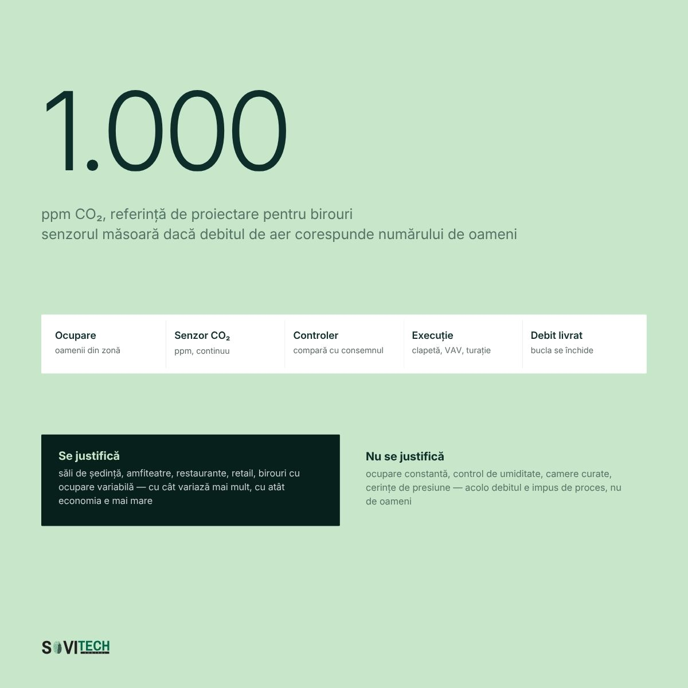

# Article (redesign-2026 branch): Indoor air quality monitoring: what EPBD requires

> **Unmerged branch content.** This file comes from the branch `redesign-2026` of the SOVITECH website repository, not from `main`. The text is from commit `d2d15d2` (2026-08-24, "Redesign complet: continut editorial, rute noi, identitate vizuala"). The cover and diagrams are from commit `af81353` (2026-08-27, "Materiale vizuale noi: 10 coperti si 15 diagrame"). Owner decision, 2026-09-24: the branch is not SOVITECH's current position and will not be merged. This article is kept for reference only.

This is the full Romanian text of the SOVITECH website article „Monitorizarea calității aerului interior: ce prevede EPBD”, with its headings, tables, lists, figures, FAQ, sources and page metadata. Source: `components/articles/monitorizare-calitate-aer-epbd.tsx` (body, `meta`, `faq`), rendered at `/resurse/monitorizare-calitate-aer-epbd` by `app/resurse/[slug]/page.tsx`. Page metadata comes from `lib/site-routes.ts`, `lib/article-cards.ts` and `lib/article-covers.ts`. Paths are relative to the website repository root.

## Status of this content

- **Unmerged branch.** This article exists only on the branch `redesign-2026` of the website repository. The branch is not merged into `main`. Owner decision, 2026-09-24: it is not SOVITECH's current position and will not be merged. Keep this article for reference only. It is not what SOVITECH says today. `main` (`e080614`) is the current website, and it does not have this article.
- **Romanian only.** The branch has no English body for this article. The body component has no `t(ro, en)` calls, so the page shows the Romanian text in both site languages. English exists only for the page title, the lead and the category label (from `lib/site-routes.ts`) and the frame labels in `components/article-layout.tsx`.
- **Marketing and editorial copy.** Its figures (costs, percentages, savings, paybacks, point densities, durations, reference ranges) are not verified engineering data and not an approved reference dataset. The app may not use them as values, benchmarks, ranges or prices (guardrails rule 1, section 2.1, rule 9, rule 10, section 10).
- **Legal and standards statements.** The article states laws, thresholds and deadlines as its authors read them on the verification date in its closing note. The app takes legal thresholds and standards only from approved reference data with their edition or date, never from this article (guardrails rule 11). See "Regulatory statements in the articles" in `README.md`.
- **No named author.** The byline is "Echipa de inginerie Sovitech Control". The source file carries the comment `TODO(author): replace with the signing engineer`, so no engineer has signed this text.

## Page facts

| Item | Value |
|------|-------|
| Slug and route | `monitorizare-calitate-aer-epbd`, `/resurse/monitorizare-calitate-aer-epbd` |
| Page type | Cluster article (`/resurse/`). Registry status `published`, `draft: "drive"`. |
| Editorial id | A10 |
| Category | Reglementări & Conformare / Regulation & Compliance (C1) |
| Personas | P1 Proprietar / Dezvoltator / Investitor; P3 Facility Manager |
| Pillar | `/ghid/conformare-cladiri-romania` (Harta conformării pentru clădiri în România), status `planned`. The page does not show a pillar link while the pillar is planned (`components/entry-shell.tsx`). |
| H1, RO | Monitorizarea calității aerului interior: ce prevede EPBD |
| H1, EN | Indoor air quality monitoring: what EPBD requires |
| Lead, RO | Ce cere art. 13 din EPBD, ce se măsoară, de la ce dată și ce este în vigoare în România. |
| Lead, EN | What EPBD article 13 requires, what gets measured, from when, and what is actually in force in Romania. |
| `<title>` (RO only) | Monitorizare calitate aer interior: ce cere EPBD \| Sovitech Control |
| Meta description (RO only, without diacritics as in the source) | Din 29 mai 2026 sistemele BACS trebuie sa poata monitoriza calitatea mediului interior. Ce se masoara, ce cere EPBD si ce nu e inca in legea romana. |
| `datePublished` / `dateModified` in `meta` | 2026-08-17 / 2026-08-17. `components/articles/index.ts` calls `dateModified` "the legal-verification date". |
| Card date and read time (`lib/article-cards.ts`) | 17 AUG 2026 / AUG 17, 2026; 15 MIN CITIRE / 15 MIN READ |
| Header line on the page | „Publicat 17.08.2026” (`components/article-layout.tsx`) |
| Author on the page | Rail: „Scris de” / "Written by", „Sovitech Control”, „Echipa de inginerie” / "Engineering team". JSON-LD author and publisher: Organization „Sovitech Control”. No `Person` node. |
| Cover | [`covers/monitorizare-calitate-aer-epbd.jpg`](covers/monitorizare-calitate-aer-epbd.jpg), 1920x1080 JPEG, from `public/coperti/monitorizare-calitate-aer-epbd.jpg`. Card background `#C8E6CA`. Also used as `og:image` and JSON-LD `image`. Alt text on the article page: the RO title. |
| Text on the cover | „1.000”, „ppm CO2, referință de proiectare pentru birouri”. Chart labels „fără reglare după cerere”, „CO2 cu ventilație controlată”, „1.000 PPM · REFERINȚĂ”, „debit de aer proaspăt, comandat de CO2”. |
| Diagrams | 1, listed below, from `public/diagrame/` |
| FAQ pairs | 5, shown in the body and emitted as `FAQPage` JSON-LD |
| Structured data | `Article` (inLanguage `ro`), `BreadcrumbList` (Acasă > Resurse > title), `FAQPage` (`components/article-jsonld.tsx`). Base URL `https://sovitech-website-gaidenic.vercel.app`. |
| Length | About 3,059 words in this Markdown rendering, tables included. |

### Diagrams

| Local copy | Caption in the article (RO, verbatim) |
|------------|----------------------------------------|
| `diagrams/A10-1-bucla-ventilatie-co2.jpg` | Bucla de reglare DCV: ocupare, senzor de CO₂, controler BMS, element de execuție, debit livrat. |

Text on the diagram (read from the image): **A10-1** „1.000 ppm CO₂, referință de proiectare pentru birouri”, „senzorul măsoară dacă debitul de aer corespunde numărului de oameni”. Loop: Ocupare, Senzor CO₂, Controler, Execuție („clapetă, VAV, turație”), Debit livrat. „Se justifică”: săli de ședință, amfiteatre, restaurante, retail, birouri cu ocupare variabilă. „Nu se justifică”: ocupare constantă, control de umiditate, camere curate, cerințe de presiune.

## Article text (RO, verbatim)

How this was rendered: the article's `<h2>` headings are `###` here and its `<h3>` headings are `####`. The lead paragraph (class `standfirst`) and the closing note (class `article-note`) are labelled. Diagrams point to the local copies in `diagrams/`. The FAQ box sits where the page renders it. Internal site links are written as the link text followed by the site path in code, for example „lista de referințe (`/referinte`)”, because root-relative links do not resolve outside the website. Bold and italics are as in the source. Nothing was translated, corrected or shortened.

*Standfirst:* Ce cere art. 13 din EPBD, ce se măsoară, de la ce dată și ce este în vigoare în România.

Directiva (UE) 2024/1275 cere ca, din 29 mai 2026, sistemele de automatizare și control al clădirilor (BACS) să fie capabile de monitorizarea calității mediului interior. În practică: senzori de CO₂, temperatură și umiditate, citiți în BMS, cu istoric și cu alarme. Cerința se aplică sistemului, nu fiecărei încăperi.

România nu a transpus prevederea. La 15 iulie 2026, Comisia Europeană a trimis scrisori de punere în întârziere tuturor celor 27 de state membre, inclusiv României.

### Pe scurt

- Art. 13 alin. (10) lit. d) din Directiva (UE) 2024/1275 adaugă monitorizarea calității mediului interior în lista capabilităților BACS, din 29 mai 2026. Este a patra capabilitate, alături de cele trei existente.
- Art. 13 alin. (4) lasă pragurile numerice în seama statelor membre: directiva nu fixează valori, iar toate valorile numerice din articol sunt repere de proiectare, orientative, nu praguri legale.
- Art. 13 alin. (5) cere dispozitive de măsurare și control al calității aerului în clădirile nerezidențiale cu emisii zero, iar la cele existente la renovare majoră, unde e fezabil tehnic și economic.
- Nimic din aceste prevederi nu este transpus în legea română. În vigoare rămâne obligația din Legea 372/2005 pentru clădirile nerezidențiale cu sisteme de încălzire, de climatizare, sau combinate cu ventilare, cu putere nominală utilă de peste 290 kW pe familie de sisteme; termenul a fost 31 decembrie 2024 și este depășit.
- Datele de mediu interior se istoricizează la 5-15 minute și se păstrează minimum 24 de luni la rezoluție completă: sub 24 de luni nu există comparație an la an.
- Senzorii NDIR de CO₂ se decalibrează în 2-3 ani, iar verificarea lipsește din majoritatea contractelor de mentenanță.

### Art. 13 alin. (10) lit. d): monitorizarea IEQ din 29 mai 2026

Nu există un articol separat „BACS” în directivă. Cerințele stau în **art. 13 alin. (9) și (10)** din [Directiva (UE) 2024/1275](https://eur-lex.europa.eu/eli/dir/2024/1275/oj/eng), la capitolul despre sistemele tehnice ale clădirilor. Alineatul (10) enumeră capabilitățile sistemului, iar litera d) este cea nouă: **din 29 mai 2026, sistemul trebuie să fie capabil de monitorizarea calității mediului interior (IEQ, Indoor Environmental Quality)**. Două prevederi completează imaginea:

- **Art. 13 alin. (4):** statele membre stabilesc cerințe pentru standarde adecvate de calitate a mediului interior. Pragurile concrete se fixează la nivel național.
- **Art. 13 alin. (5):** clădirile nerezidențiale cu emisii zero se echipează cu dispozitive de măsurare și control al calității aerului interior. La cele *existente*, cerința se aplică la renovare majoră, unde este fezabil tehnic și economic.

Distincția contează la buget: lit. d) vizează *capabilitatea sistemului*, alin. (5) *dispozitivele fizice*.

### Legea 372/2005 în vigoare, EPBD netranspusă în legea română

**Nimic din cele de mai sus nu este în vigoare în România.** Din Directiva 2024/1275 a fost preluat doar art. 17 alin. (15), prin OG 16/2025. Scrisoarea de punere în întârziere din 15 iulie 2026 a mers către toate cele 27 de state membre ([comunicatul Comisiei](https://energy.ec.europa.eu/news/commission-calls-eu-countries-transpose-reinforced-rules-energy-performance-buildings-2026-07-15_en)).

În vigoare rămâne obligația de BACS din [Legea 372/2005](https://legislatie.just.ro/Public/DetaliiDocument/66970), art. 27 alin. (5):

> „Până la data de 31 decembrie 2024, clădirile nerezidențiale care au sisteme de încălzire sau sisteme combinate de încălzire și de ventilare a spațiului cu o putere nominală utilă de peste 290 kW vor fi echipate, dacă acest lucru este fezabil din punct de vedere tehnic și economic, cu sisteme de automatizare și de control pentru clădiri.”
>
> Legea 372/2005, art. 27 alin. (5)

Formularea de reținut, aceeași în toate materialele: clădirile nerezidențiale cu sisteme de încălzire, de climatizare, sau combinate cu ventilare, cu putere nominală utilă de peste 290 kW pe familie de sisteme. Termenul a fost 31 decembrie 2024 și este depășit. Pragul de 70 kW, cu termen 31 decembrie 2029, provine din Directiva (UE) 2024/1275, art. 13 alin. (9) lit. b), și nu este încă transpus în legea română. Formularea identică de la art. 29 alin. (6), pentru climatizare, este tratată în articolul despre obligația BACS și pragul de 290 kW (`/resurse/obligatie-bacs-legea-372-2005`).

Pentru proprietari și investitori: cerința de monitorizare a calității mediului interior nu este opozabilă prin lege națională, iar [Legea 238/2024](https://legislatie.just.ro/public/DetaliiDocument/285769) a majorat regimul sancționator al Legii 372/2005 *în general*, fără o tranșă dedicată BACS. Context complet, în materialele despre reglementări și conformare (`/resurse/reglementari-conformare`).

### Parametrii IEQ și valorile orientative: CO₂ sub 1.000 ppm, 20-26 °C

Textul român folosește „calitatea mediului interior”, adică IEQ (Indoor Environmental Quality), termen mai larg decât IAQ: aerul, confortul termic, umiditatea și, după cerințele naționale, iluminatul și acustica.

Reperele uzuale de proiectare, toate orientative: aerul exterior are 400-450 ppm CO₂, un spațiu bine ventilat stă sub 800-1.000 ppm, iar peste circa 1.400 ppm ventilația este insuficientă față de numărul de ocupanți. Temperatura operativă se ține la 20-24 °C iarna și 23-26 °C vara, iar umiditatea relativă între 30% și 60% în birouri. Pentru particule, COV, radon și zgomot, tabelul dă ordinul de mărime, nu o valoare de conformare.

| Parametru | De ce contează | Cum se măsoară | Unde se amplasează senzorul | Ordin de mărime (orientativ) |
|---|---|---|---|---|
| CO₂ | Indicator indirect al ratei de aer proaspăt pe ocupant | Senzor NDIR, în zonă sau pe retur | Perete, la 1,1-1,7 m, departe de uși | Exterior 400-450 ppm; bine ventilat sub 800-1.000 ppm; peste circa 1.400 ppm, ventilație insuficientă |
| Temperatură operativă | Cauza numărul unu a reclamațiilor | Senzor de aer sau de glob | Zona ocupată, ferit de soare | Iarnă 20-24 °C, vară 23-26 °C |
| Umiditate relativă | Prea joasă: disconfort. Prea înaltă: condens | Senzor capacitiv, în corp comun cu temperatura | Ca la temperatură | 30-60% în birouri |
| Particule PM2.5 / PM10 | Trafic, șantiere; arată starea filtrelor | Senzor optic; gravimetric pentru referință | Zona ocupată și priza de aer proaspăt | Unități sau zeci de µg/m³; EPBD nu stabilește praguri pentru clădiri |
| COV (compuși organici volatili) | Emisii din mobilier, finisaje, curățenie | Senzor MOS sau PID, nespecific: măsoară o sumă | Spații nou amenajate | Sute de µg/m³ ca TVOC; se urmărește tendința, nu cifra izolată |
| Radon | Relevant la subsol și la parter | Detectoare pasive, expuse luni de zile | Subsol, parter | Bq/m³; cerințe naționale separate de EPBD |
| Zgomot | Confort perceput; adesea din instalație | Sonometru, campanii punctuale | Open space, sub tubulatură | 35-45 dB(A) ca reper de proiectare |

**Valorile sunt orientative, nu praguri legale.** Pragurile naționale urmează să fie stabilite în baza art. 13 alin. (4). Până atunci servesc ca referință de proiectare, nu ca test de conformare.

### CO₂ ca indicator al aerului proaspăt: 400-450 ppm în exterior

CO₂ nu se măsoară pentru că ar fi toxic; la concentrațiile dintr-un birou nu este un contaminant periculos. Se măsoară pentru că aproximează, indirect, rata de ventilație pe ocupant, plecând de la valoarea din exterior, 400-450 ppm.

Fiecare persoană expiră CO₂ într-un ritm relativ constant. Când concentrația crește, se produce mai mult CO₂ decât se evacuează, deci debitul pe persoană este prea mic. Numărul de ocupanți nu trebuie cunoscut: concentrația dă direct rezultatul. De aici pornește lanțul care contează financiar: CO₂, debit de aer proaspăt, consum.

### Ventilatia controlata dupa cerere (DCV): debitul urmeaza ocuparea

Ventilația controlată după cerere (DCV, Demand Controlled Ventilation) pleacă de la ce arată un senzor de CO₂: dacă debitul de aer proaspăt corespunde numărului de oameni din încăpere. Concentrația care urcă peste valoarea din exterior, 400-450 ppm, înseamnă prea puțin aer proaspăt pe ocupant, iar una care rămâne joasă într-un spațiu gol înseamnă aer introdus degeaba. Senzorul de CO₂ încetează astfel să fie un cost de conformare și devine intrarea unei bucle care scade consumul: debitul urmează ocuparea, fără să coboare sub minimul garantat.

DCV se justifică acolo unde raportul dintre ocuparea de vârf și cea medie este mare: săli de ședințe, amfiteatre, săli de curs, retail. Nu se justifică în spații tehnice, depozite și arhive, unde programul orar este mai ieftin, și nu se aplică în pharma, medical și laboratoare, unde debitul și cascada de presiuni sunt impuse de proces.



*Figure (`/diagrame/A10-1-bucla-ventilatie-co2.jpg`):* Bucla de reglare DCV: ocupare, senzor de CO₂, controler BMS, element de execuție, debit livrat.

| Tip de spațiu | Tipar de ocupare | Potrivire DCV | De ce |
|---|---|---|---|
| Săli de ședințe | Goale ore întregi, apoi pline | Foarte bună | Cel mai mare raport vârf/medie din clădire |
| Amfiteatre, săli de curs, conferințe | Intensă, pe intervale scurte | Foarte bună | Debit de proiect mare, folosit rar |
| Open space de birouri | Variabilă pe zile și zone | Bună, pe zone | Un senzor pe etaj mediază și pierde efectul |
| Retail, restaurante | Variabilă, cu vârfuri previzibile | Bună | CO₂ nu acoperă mirosurile |
| Spații tehnice, depozite, arhive | Ocupare aproape nulă | Slabă | Nu există ce reduce; programul orar e mai ieftin |
| Pharma, medical, laboratoare | Constantă prin proiectare | Nu se aplică | Debitul și cascada de presiuni sunt impuse de proces |

### Patru măsuri: reglaj pe CO₂, recuperare, programe orare, free cooling

Peste un debit rezonabil pe ocupant, CO₂ nu mai scade semnificativ, dar factura crește liniar. Patru măsuri țin echilibrul.

- **Reglaj pe CO₂, pe zone**, cu debit minim garantat.
- **Recuperare de căldură.** Multe recuperatoare merg cu by-pass-ul blocat deschis și nimeni nu observă până la analiza consumului.
- **Programe orare curate.** Ventilare cu o oră înainte de ocupare, oprire la final, regim redus în weekend. În multe clădiri programul nu a mai fost revizuit de la punerea în funcțiune.
- **Free cooling**, când aerul exterior permite.

### Cele patru capabilități BACS din art. 13 alin. (10)

Un afișaj cu valoarea de CO₂ în lobby nu înseamnă monitorizare. Art. 13 alin. (10) cere patru capabilități: monitorizarea, înregistrarea, analiza și ajustarea continuă a consumului de energie (lit. a); evaluarea eficienței, detectarea pierderilor și informarea persoanei responsabile (lit. b); comunicarea cu sistemele tehnice conectate și interoperabilitatea între tehnologii proprietare diferite (lit. c); iar din 29 mai 2026, monitorizarea calității mediului interior (lit. d). Litera d) se sprijină pe celelalte trei: fără istoricizare, fără alarmare și fără protocol deschis, senzorul rămâne un afișaj.

| Capabilitate | Ce cere | Ce înseamnă pentru IEQ |
|---|---|---|
| a) | Monitorizarea, înregistrarea, analiza și ajustarea continuă a consumului de energie | Datele de IEQ corelate cu consumul: cât costă o reducere de ppm. |
| b) | Benchmarking al eficienței, detectarea pierderilor, informarea responsabilului | Comparare cu o referință și **alarmare**: senzor blocat, valoare înghețată, zonă sub setpoint. |
| c) | Comunicare cu sistemele conectate și interoperabilitate între tehnologii proprietare diferite | Senzorii trebuie citibili din BMS prin BACnet, Modbus, KNX sau M-Bus, protocoale comparate în materialele despre BMS, SCADA și integrare (`/resurse/bms-scada-integrare`), nu blocați într-o aplicație separată. |
| d) | Din 29.05.2026: monitorizarea calității mediului interior | Măsurare, istoricizare, comparare, alarmare și, unde are sens, reglare automată. |

Fără istoricizare nu există nici raportare, nici dovadă.

### Opt puncte de verificare: integrare în BMS, istoricizare 24 de luni, calibrare

În inventarele de senzori pe care Sovitech Control le-a făcut în clădiri de birouri din București, rezultatul cel mai frecvent nu a fost lipsa senzorilor, ci senzori montați și neintegrați în sistemul BMS: valoarea se vede pe display, dar nu există punct în BMS, deci nu există nici istoric, nici alarmă, nici export. Cele opt verificări de mai jos se fac în această ordine.

1. **Există senzori de CO₂?** Verificarea se face fizic, nu în caietul de sarcini. Multe clădiri au senzori montați și nepuși în funcțiune.
2. **În ce zone sunt montați?** Un senzor pe returul comun al unei CTA (centrală de tratare a aerului) care deservește etajul nu dă informație pe zonă.
3. **Sunt integrați în BMS sau doar afișați local?** Un display fără punct în BMS nu produce date.
4. **Se istoricizează?** Trend log activ, eșantionare la 5-15 minute, retenție de minimum 24 de luni la rezoluție completă. Sub 24 de luni nu există comparație an la an, deci nu se poate arăta dacă un sezon a fost mai bun decât cel precedent.
5. **Se folosesc în reglare?** Sau doar se afișează, iar clapetele merg pe program fix? Aici stă diferența dintre cost și economie.
6. **Sunt calibrați?** Senzorii NDIR derivează. Se verifică autocalibrarea și dacă mediul o permite.
7. **Când au fost verificați ultima dată?** Se cer data și documentul. „Nu știm” este deja un rezultat.
8. **Sunt în contractul de mentenanță?** Verificarea periodică trebuie să fie poziție explicită în contractul de întreținere BMS (`/servicii/intretinere-sisteme-bms`), cu frecvență și raport scris.

Cere checklistul de audit BMS (`/contact`) pentru varianta extinsă a acestor verificări.

### Limitele monitorizării: derivă de 200 ppm la 2-3 ani și amplasare greșită

Senzorii de CO₂ se decalibrează în 2-3 ani și aproape nimeni nu îi verifică. Un senzor cu derivă de 200 ppm ține clapeta deschisă degeaba sau lasă sala de ședințe subventilată, iar raportul arată la fel de bine în ambele cazuri.

Amplasarea contează cât precizia. Într-o clădire cu senzori montați pe perete lângă ușă, valorile descriu aerul de pe hol, nu zona ocupată; sala plină de la capătul celălalt al etajului rămâne invizibilă în trend log. Două limite se recunosc de la început:

- CO₂ nu acoperă mirosurile, COV-urile din finisaje sau particulele din exterior. Un spațiu la 600 ppm poate avea o problemă de filtrare.
- În spații cu control de umiditate sau cu cascadă de presiuni, debitul este impus de proces, iar reglarea pe CO₂ nu se aplică.

### Raportarea ESG: export de date IEQ pe 24 de luni

„E aer stătut în sala mare” este a doua reclamație ca frecvență, după cele de temperatură. Cu un trend log de CO₂ pe 30 de zile discuția devine tehnică: fie se confirmă problema, fie se arată că ventilația a lucrat în parametri. Vezi și clădirile de birouri (`/expertiza/cladiri-de-birouri`).

Aceiași senzori produc date cerute la due diligence și în raportare. O clădire care livrează un export de date IEQ pe 24 de luni răspunde altfel decât una care trimite pe cineva să citească un display. Un export pe 12 luni arată un singur sezon și nu permite comparația an la an, care este cerința de bază a oricărei raportări. Contează lanțul: senzor, controler, BMS, istoric, export. Detaliat în ghidul despre datele pentru raportarea ESG a unei clădiri (`/ghid/date-esg-cladiri`).

### Primele 12 luni: inventar, calibrare, istoricizare, DCV

1. **Inventarul senzorilor:** tip, poziție, an de montaj, integrare în BMS. O zi de teren pentru o clădire medie.
2. **Verificarea și calibrarea** a ceea ce există. Cea mai ieftină acțiune din listă și cea care rezolvă adesea jumătate din reclamații.
3. **Pornirea istoricizării** pentru toate punctele de IEQ, cu retenție de minimum 24 de luni la rezoluție completă. Sub 24 de luni nu există comparație an la an, iar punctele de mediu interior alimentează același lanț de raportare ca și cele de energie, unde retenția de 24 de luni este deja regula.
4. **Completarea acoperirii** pe zonele cu ocupare variabilă: săli de ședințe, conferințe, retail. Nu peste tot.
5. **Trecerea de la afișare la reglare** unde DCV se justifică, cu măsurarea efectului pe un sezon. Vezi ce presupune o modernizare a automatizărilor (`/servicii/modernizare-sisteme-de-automatizare-si-bms`).

Primele trei puncte se acoperă cu sistemul BMS (`/ghid/sisteme-bms-cladiri`) existent, de regulă prin facility manager (BMS, Building Management System, a nu se confunda cu Battery Management System).

### Întrebări frecvente

*(FAQ box, rendered from the exported `faq` list; the same pairs feed the FAQPage JSON-LD. Questions verbatim, some without diacritics as in the source.)*

**Este obligatorie monitorizarea calitatii aerului in cladiri in Romania?**

Nu încă. Cerința vine din art. 13 alin. (10) lit. d) al Directivei (UE) 2024/1275 și se aplică de la 29 mai 2026 la nivel european. România nu a transpus directiva și a primit scrisoare de punere în întârziere la 15 iulie 2026. În legea română rămâne doar obligația de BACS peste 290 kW pe familie de sisteme.

**Ce nivel de CO₂ este normal într-un birou?**

Aerul exterior are 400-450 ppm. Într-un spațiu bine ventilat, valorile stau de regulă sub 800-1.000 ppm, iar peste circa 1.400 ppm indică ventilație insuficientă față de numărul de ocupanți. Sunt repere orientative: pragurile naționale nu au fost încă stabilite.

**Cat timp se pastreaza datele de calitate a aerului?**

Minimum 24 de luni la rezoluție completă, cu eșantionare la 5-15 minute, plus arhivă agregată pe termen lung. Sub 24 de luni nu există comparație an la an, iar un singur sezon nu arată dacă o intervenție a schimbat ceva. Este aceeași regulă ca la punctele de energie, fiindcă alimentează același lanț de raportare.

**Cât de des trebuie verificați senzorii de CO₂?**

Senzorii NDIR derivează în timp, de regulă la 2-3 ani de la montaj. O verificare anuală, cu gaz de referință sau prin comparație cu un aparat etalonat, este practica uzuală. Autocalibrarea ajută doar în spații care ajung periodic la valori apropiate de cele exterioare.

**Monitorizarea calității aerului crește sau scade factura?**

Depinde de ce se face cu datele. Dacă valoarea doar se afișează, este un cost. Dacă intră în bucla de reglare a debitului de aer proaspăt, consumul scade, pentru că ventilarea urmează ocuparea reală. Economia se măsoară pe un sezon complet.

### Concluzie

Cerința scoate la iveală cât de puțin se știe despre ce măsoară deja clădirea. Aproape orice clădire de birouri modernă are senzori montați, dar puține pot exporta date pe 24 de luni. Diferența se acoperă cu o zi de inventar și o revizuire de contract, nu cu o investiție nouă. Transpunerea va veni cu un termen scurt, așa cum s-a întâmplat cu pragul de 290 kW.

### Discută evaluarea senzorilor cu un inginer Sovitech

Evaluarea acoperă inventarul pe zone al senzorilor de CO₂, temperatură și umiditate, integrarea în BMS, istoricizarea, calibrarea și un raport față de art. 13 alin. (10) lit. d). O zi de teren pentru o clădire medie, iar rezultatul este o listă de lucrări, nu o ofertă.

*Article note (class `article-note`):* Articol publicat 17.08.2026. Actualizat 19.08.2026. Informațiile juridice au fost verificate la 17.08.2026. Se actualizează la transpunerea Directivei (UE) 2024/1275 în legea română. Autor: Echipa de inginerie Sovitech Control.

## Sources and links in the article

External sources cited (URL, then the anchor text as written):

- <https://eur-lex.europa.eu/eli/dir/2024/1275/oj/eng>: „Directiva (UE) 2024/1275”
- <https://energy.ec.europa.eu/news/commission-calls-eu-countries-transpose-reinforced-rules-energy-performance-buildings-2026-07-15_en>: „comunicatul Comisiei”
- <https://legislatie.just.ro/Public/DetaliiDocument/66970>: „Legea 372/2005”
- <https://legislatie.just.ro/public/DetaliiDocument/285769>: „Legea 238/2024”

Internal links (site path, status on the branch):

- `/resurse/obligatie-bacs-legea-372-2005`: published (resurse) in `lib/site-routes.ts`
- `/resurse/reglementari-conformare`: published (category archive) in `lib/site-routes.ts`
- `/resurse/bms-scada-integrare`: published (category archive) in `lib/site-routes.ts`
- `/servicii/intretinere-sisteme-bms`: published (servicii) in `lib/site-routes.ts`
- `/contact`: static page on the branch
- `/expertiza/cladiri-de-birouri`: published (expertiza) in `lib/site-routes.ts`
- `/ghid/date-esg-cladiri`: published (ghid) in `lib/site-routes.ts`
- `/servicii/modernizare-sisteme-de-automatizare-si-bms`: published (servicii) in `lib/site-routes.ts`
- `/ghid/sisteme-bms-cladiri`: published (ghid) in `lib/site-routes.ts`

The source file lists links that were weakened because their target page is not built yet (`LINKS-TO-REACTIVATE`). Each line gives the anchor text, the interim target and the planned final target. Verbatim:

```text
// LINKS-TO-REACTIVATE: materialele despre reglementări și conformare | interim /resurse/reglementari-conformare | final /ghid/conformare-cladiri-romania
// LINKS-TO-REACTIVATE: materialele despre BMS, SCADA și integrare | interim /resurse/bms-scada-integrare | final /ghid/protocoale-automatizarea-cladirilor
// LINKS-TO-REACTIVATE: Cere checklistul de audit BMS | interim /contact | final /instrumente/checklist-audit-bms
// LINKS-TO-REACTIVATE: proprietari și investitori (text fără link în corp) | interim (fără link) | final /pentru/proprietari-si-investitori
// LINKS-TO-REACTIVATE: facility manager (text fără link în corp) | interim (fără link) | final /pentru/facility-manager
```

## Notes

- IEQ values (CO₂ 400-450 ppm outdoors, under 800-1.000 ppm well ventilated, about 1.400 ppm insufficient; 20-24 °C winter, 23-26 °C summer; 30-60% RH; 35-45 dB(A)) are labelled „orientative, nu praguri legale”. The cover and diagram present 1.000 ppm as „referință de proiectare pentru birouri”. None is an app threshold; national thresholds are still to be set under EPBD art. 13 alin. (4), as the article says.
- Sampling: this article says IEQ data is logged every 5-15 minutes. `caiet-de-sarcini-bms`, `date-esg-cladiri` and the diagrams use 15 minutes. Both keep 24 months.
- Sanctions: says Legea 238/2024 raised fines „în general, fără o tranșă dedicată BACS”. See the README for how this sits against `epbd-2024-romania`.
- Dates: `meta` says 2026-08-17 for both; the closing note says „Actualizat 19.08.2026”. The closing note gives a later update date than `meta.dateModified`, so the page header shows no „Actualizat” date. By the comment in `components/articles/index.ts`, `dateModified` is the legal-verification date, which explains the gap but is not what a reader sees.
