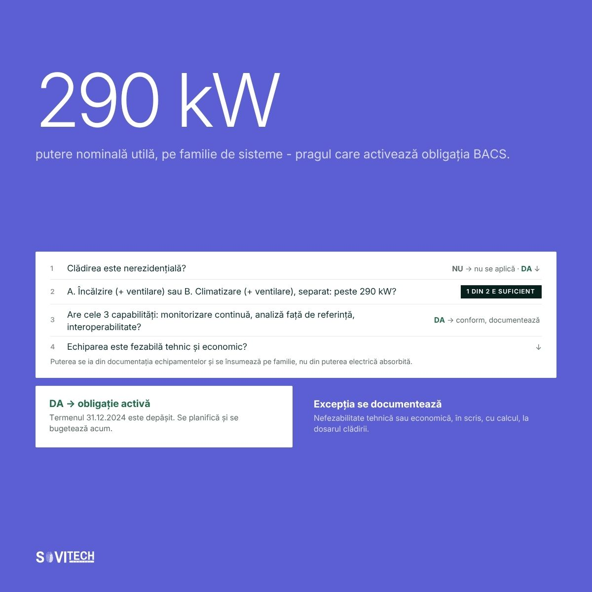
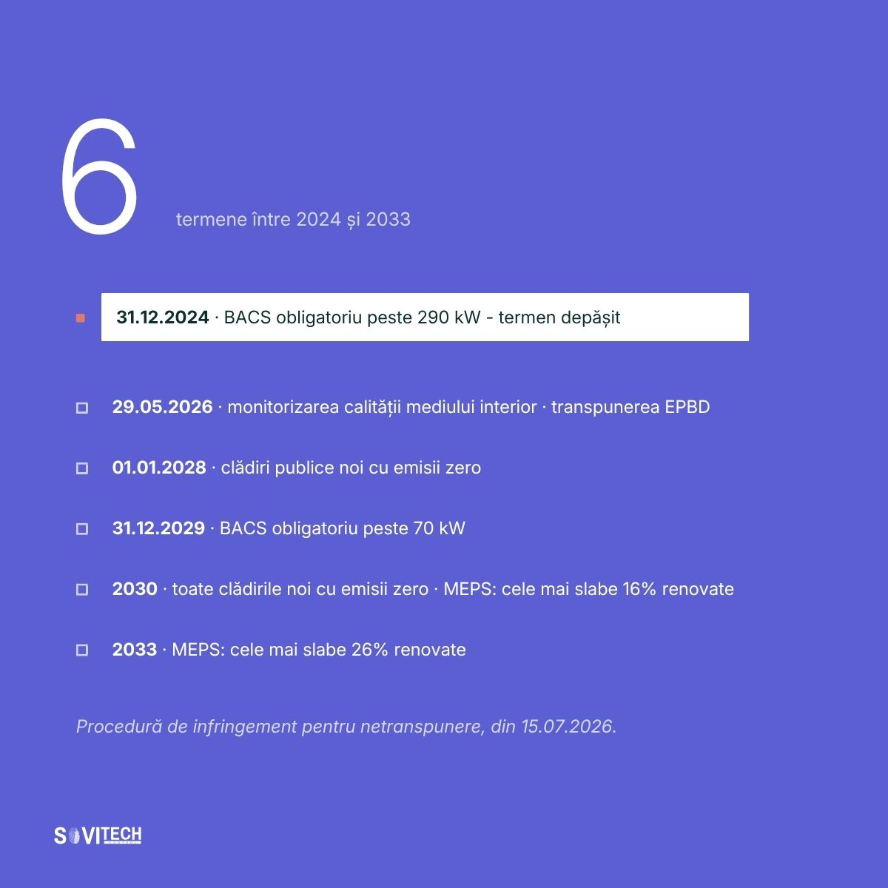

# Article (redesign-2026 branch): The BACS obligation: Law 372/2005 and the 290 kW threshold

> **Unmerged branch content.** This file comes from the branch `redesign-2026` of the SOVITECH website repository, not from `main`. The text is from commit `d2d15d2` (2026-08-24, "Redesign complet: continut editorial, rute noi, identitate vizuala"). The cover and diagrams are from commit `af81353` (2026-08-27, "Materiale vizuale noi: 10 coperti si 15 diagrame"). Owner decision, 2026-09-24: the branch is not SOVITECH's current position and will not be merged. This article is kept for reference only.

This is the full Romanian text of the SOVITECH website article „Obligația BACS: Legea 372/2005 și pragul de 290 kW”, with its headings, tables, lists, figures, FAQ, sources and page metadata. Source: `components/articles/obligatie-bacs-legea-372-2005.tsx` (body, `meta`, `faq`), rendered at `/resurse/obligatie-bacs-legea-372-2005` by `app/resurse/[slug]/page.tsx`. Page metadata comes from `lib/site-routes.ts`, `lib/article-cards.ts` and `lib/article-covers.ts`. Paths are relative to the website repository root.

## Status of this content

- **Unmerged branch.** This article exists only on the branch `redesign-2026` of the website repository. The branch is not merged into `main`. Owner decision, 2026-09-24: it is not SOVITECH's current position and will not be merged. Keep this article for reference only. It is not what SOVITECH says today. `main` (`e080614`) is the current website, and it does not have this article.
- **Romanian only.** The branch has no English body for this article. The body component has no `t(ro, en)` calls, so the page shows the Romanian text in both site languages. English exists only for the page title, the lead and the category label (from `lib/site-routes.ts`) and the frame labels in `components/article-layout.tsx`.
- **Marketing and editorial copy.** Its figures (costs, percentages, savings, paybacks, point densities, durations, reference ranges) are not verified engineering data and not an approved reference dataset. The app may not use them as values, benchmarks, ranges or prices (guardrails rule 1, section 2.1, rule 9, rule 10, section 10).
- **Legal and standards statements.** The article states laws, thresholds and deadlines as its authors read them on the verification date in its closing note. The app takes legal thresholds and standards only from approved reference data with their edition or date, never from this article (guardrails rule 11). See "Regulatory statements in the articles" in `README.md`.
- **No named author.** The byline is "Echipa de inginerie Sovitech Control". The source file carries the comment `TODO(author): replace with the signing engineer`, so no engineer has signed this text.

## Page facts

| Item | Value |
|------|-------|
| Slug and route | `obligatie-bacs-legea-372-2005`, `/resurse/obligatie-bacs-legea-372-2005` |
| Page type | Cluster article (`/resurse/`). Registry status `published`, `draft: "drive"`. |
| Editorial id | A02 |
| Category | Reglementări & Conformare / Regulation & Compliance (C1) |
| Personas | P1 Proprietar / Dezvoltator / Investitor; P4 Director tehnic / Inginer-șef |
| Pillar | `/ghid/conformare-cladiri-romania` (Harta conformării pentru clădiri în România), status `planned`. The page does not show a pillar link while the pillar is planned (`components/entry-shell.tsx`). |
| H1, RO | Obligația BACS: Legea 372/2005 și pragul de 290 kW |
| H1, EN | The BACS obligation: Law 372/2005 and the 290 kW threshold |
| Lead, RO | Pragul, cine intră sub obligație, capabilitățile cerute, sancțiunile și ce se documentează la nefezabilitate. |
| Lead, EN | The threshold, who it covers, the required capabilities, the penalties, and what to document when it is not feasible. |
| `<title>` (RO only) | Obligatia BACS: Legea 372/2005 si pragul de 290 kW \| Sovitech Control |
| Meta description (RO only, without diacritics as in the source) | Cladirile nerezidentiale cu sisteme de peste 290 kW pe familie de sisteme trebuiau echipate cu automatizare pana la 31.12.2024. Cine intra sub obligatie. |
| `datePublished` / `dateModified` in `meta` | 2026-08-16 / 2026-08-16. `components/articles/index.ts` calls `dateModified` "the legal-verification date". |
| Card date and read time (`lib/article-cards.ts`) | 16 AUG 2026 / AUG 16, 2026; 20 MIN CITIRE / 20 MIN READ |
| Header line on the page | „Publicat 16.08.2026” (`components/article-layout.tsx`) |
| Author on the page | Rail: „Scris de” / "Written by", „Sovitech Control”, „Echipa de inginerie” / "Engineering team". JSON-LD author and publisher: Organization „Sovitech Control”. No `Person` node. |
| Cover | [`covers/obligatie-bacs-legea-372-2005.jpg`](covers/obligatie-bacs-legea-372-2005.jpg), 1920x1080 JPEG, from `public/coperti/obligatie-bacs-legea-372-2005.jpg`. Card background `#5C5FD4`. Also used as `og:image` and JSON-LD `image`. Alt text on the article page: the RO title. |
| Text on the cover | „290 kW”, „putere nominală utilă, pe familie de sisteme”. Worked example box „Puterea nominală utilă, pe familie de sisteme”: „Sistem de încălzire 340 kW PESTE”, „Sistem de climatizare 180 kW SUB”, leading to „Intră sub obligație” and „1 din 2 familii de sisteme”. The 340 kW and 180 kW values are an illustration, not a real building. |
| Diagrams | 2, listed below, from `public/diagrame/` |
| FAQ pairs | 5, shown in the body and emitted as `FAQPage` JSON-LD |
| Structured data | `Article` (inLanguage `ro`), `BreadcrumbList` (Acasă > Resurse > title), `FAQPage` (`components/article-jsonld.tsx`). Base URL `https://sovitech-website-gaidenic.vercel.app`. |
| Length | About 4,176 words in this Markdown rendering, tables included. |

### Diagrams

| Local copy | Caption in the article (RO, verbatim) |
|------------|----------------------------------------|
| `diagrams/A02-1-arbore-decizie-bacs.jpg` | Arbore de decizie: cum se stabilește dacă o clădire intră sub obligația BACS de la 290 kW. |
| `diagrams/A02-2-cronologie-2024-2033.jpg` | Cronologia 2024-2033: termenul depășit din legea română și obligațiile UE netranspuse. |

Text on the diagrams (read from the images): **A02-1** „290 kW”, „putere nominală utilă, pe familie de sisteme - pragul care activează obligația BACS.” Four questions: nonresidential?; „A. Încălzire (+ ventilare) sau B. Climatizare (+ ventilare), separat: peste 290 kW?” (tag „1 DIN 2 E SUFICIENT”); „Are cele 3 capabilități: monitorizare continuă, analiză față de referință, interoperabilitate?” with „DA → conform, documentează”; „Echiparea este fezabilă tehnic și economic?”. Note: „Puterea se ia din documentația echipamentelor și se însumează pe familie, nu din puterea electrică absorbită.” Outcomes: „DA → obligație activă. Termenul 31.12.2024 este depășit. Se planifică și se bugetează acum.” and „Excepția se documentează. Nefezabilitate tehnică sau economică, în scris, cu calcul, la dosarul clădirii.” **A02-2** „6 termene între 2024 și 2033”: 31.12.2024 BACS peste 290 kW, termen depășit; 29.05.2026 calitatea mediului interior, transpunerea EPBD; 01.01.2028 clădiri publice noi cu emisii zero; 31.12.2029 BACS peste 70 kW; 2030 toate clădirile noi cu emisii zero, MEPS 16%; 2033 MEPS 26%; footnote „Procedură de infringement pentru netranspunere, din 15.07.2026.”

## Article text (RO, verbatim)

How this was rendered: the article's `<h2>` headings are `###` here and its `<h3>` headings are `####`. The lead paragraph (class `standfirst`) and the closing note (class `article-note`) are labelled. Diagrams point to the local copies in `diagrams/`. The FAQ box sits where the page renders it. Internal site links are written as the link text followed by the site path in code, for example „lista de referințe (`/referinte`)”, because root-relative links do not resolve outside the website. Bold and italics are as in the source. Nothing was translated, corrected or shortened.

*Standfirst:* Pragul, cine intră sub obligație, capabilitățile cerute sistemului, sancțiunile, calendarul termenelor și ce se documentează atunci când echiparea nu este fezabilă.

**Clădirile nerezidențiale cu sisteme de încălzire, de climatizare, sau combinate cu ventilare, cu putere nominală utilă de peste 290 kW pe familie de sisteme trebuiau echipate, până la 31 decembrie 2024, cu sisteme de automatizare și control al clădirilor (BACS, Building Automation and Control System), dacă acest lucru este fezabil tehnic și economic. Obligația este în Legea 372/2005, art. 27 alin. (5) și art. 29 alin. (6). Termenul a fost 31 decembrie 2024 și este depășit.**

Aproape tot ce s-a scris în România despre automatizarea obligatorie a clădirilor vorbește despre 2029 și despre pragul de 70 kW. Este o discuție prematură. Faptul relevant nu este 2029, ci că un termen din legea română a expirat la 31 decembrie 2024 și că majoritatea clădirilor vizate nu l-au respectat, în bună parte pentru că proprietarii lor nu știu că obligația există.

### Pe scurt: 290 kW, 31 decembrie 2024, trei capabilități

- Obligația în vigoare în România se aplică la o putere nominală utilă de peste 290 kW pe familie de sisteme, cu termen 31 decembrie 2024, depășit (Legea 372/2005, art. 27 alin. (5) și art. 29 alin. (6)).
- Pragul de 290 kW se evaluează separat pentru încălzire și pentru climatizare. Cele două familii de sisteme nu se însumează.
- Puterea nominală utilă se citește pe plăcuțele echipamentelor și în cartea tehnică, nu pe factura de energie.
- Legea cere trei capabilități cumulative: monitorizare și ajustare continuă a consumului, benchmarking cu detectarea pierderilor de eficiență, interoperabilitate între tehnologii proprietare diferite.
- Excepția de fezabilitate tehnică și economică din art. 27 alin. (5) există, dar se demonstrează printr-un dosar datat, nu se presupune.
- Pragul de 70 kW, cu termen 31 decembrie 2029, provine din Directiva (UE) 2024/1275, art. 13 alin. (9) lit. b), și nu este încă transpus în legea română.

### BACS: termenul juridic din Legea 372/2005

**BACS** este acronimul pentru *Building Automation and Control System*, tradus în legislația românească prin **„sisteme de automatizare și de control pentru clădiri”**. Este termenul juridic. Apare ca atare în Legea 372/2005 și în directiva europeană din care provine.

În piață, același lucru se numește de obicei **BMS**, *Building Management System*, a nu se confunda cu Battery Management System. Diferența nu este tehnică, ci de registru: BMS este cuvântul comercial, BACS este cuvântul din lege. Fundamentele tehnice sunt în ghidul despre ce este un sistem BMS pentru clădiri (`/ghid/sisteme-bms-cladiri`).

Distincția contează practic: obligația nu se satisface cumpărând ceva care se *numește* „BMS”, ci ceva care *face* lucrurile pe care legea le enumeră.

### Textul din art. 27 alin. (5) și art. 29 alin. (6)

Obligația apare de două ori în Legea 372/2005, în articole diferite, pentru familii de sisteme diferite. Prima dată la articolul 27, pentru încălzire.

> „Până la data de 31 decembrie 2024, clădirile nerezidențiale care au sisteme de încălzire sau sisteme combinate de încălzire și de ventilare a spațiului cu o putere nominală utilă de peste 290 kW vor fi echipate, dacă acest lucru este fezabil din punct de vedere tehnic și economic, cu sisteme de automatizare și de control pentru clădiri...”
>
> Legea 372/2005, art. 27 alin. (5)

A doua oară la articolul 29, cu o formulare identică, pentru climatizare. Art. 29 alin. (6) reia aceeași cerință pentru clădirile nerezidențiale care au **sisteme de climatizare sau sisteme combinate de climatizare și de ventilare a spațiului** cu o putere nominală utilă de peste 290 kW.

Sursa: [Legea 372/2005 privind performanța energetică a clădirilor, pe portalul legislativ](https://legislatie.just.ro/Public/DetaliiDocument/66970). Înainte de construirea unui argument juridic pe acest text, se verifică forma consolidată la zi. Legea a fost modificată de mai multe ori.

#### Pragul de 290 kW se evaluează pe familie de sisteme

**Pragul de 290 kW se evaluează pe fiecare familie de sisteme separat, nu pe clădire.** Legea tratează distinct instalațiile de încălzire și cele de climatizare, fiecare cu propriul articol și cu propriul regim de inspecție, iar puterea nominală utilă se compară cu pragul în interiorul fiecărei familii.

| Articol | Ce sisteme acoperă | Prag | Termen |
|---|---|---|---|
| Art. 27 alin. (5) | Sisteme de încălzire; sisteme combinate de încălzire și ventilare a spațiului | peste 290 kW putere nominală utilă, pe această familie de sisteme | 31 decembrie 2024 |
| Art. 29 alin. (6) | Sisteme de climatizare; sisteme combinate de climatizare și ventilare a spațiului | peste 290 kW putere nominală utilă, pe această familie de sisteme | 31 decembrie 2024 |

O clădire poate intra sub obligație pe un singur articol, cazul unui hotel cu centrală termică mare și climatizare modestă, sau pe amândouă. Încălzirea nu se însumează cu climatizarea pentru a trece pragul de 290 kW; se evaluează fiecare familie de sisteme la puterea ei nominală utilă instalată.

### Cine intră sub obligație: clădiri nerezidențiale peste 290 kW

Trei condiții, cumulative:

1. **Clădirea este nerezidențială:** birouri, retail, hoteluri, spitale, școli, clădiri industriale cu spații ocupate, clădiri publice. Blocurile de locuințe nu intră.
2. **Puterea nominală utilă a familiei de sisteme depășește 290 kW.** Nu consumul anual, nu puterea contractată la rețea, nu suma pe clădire a încălzirii și climatizării.
3. **Echiparea este fezabilă tehnic și economic.** Singura poartă de ieșire lăsată deschisă de lege, și nu funcționează prin simpla afirmație.

#### Puterea nominală utilă se citește pe plăcuță, nu pe factură

Puterea nominală utilă nu se citește pe factura de energie, ci pe echipament și în documentația tehnică. Ordinea în care merită căutată:

- plăcuțele de identificare ale cazanelor, chillerelor, pompelor de căldură și rooftop-urilor;
- cartea tehnică și proiectul de instalații HVAC;
- documentația *as-built* a ultimei modernizări, de obicei mai apropiată de realitate decât proiectul inițial;
- certificatul de performanță energetică și raportul de audit energetic, dacă există.

În evaluările de conformare pe care Sovitech Control le face în clădiri aflate în exploatare, plăcuța și proiectul se contrazic mai des decât s-ar crede: cazanul înlocuit acum opt ani nu are aceeași putere ca cel din proiect, iar nimeni nu a actualizat cartea tehnică. Fotografia plăcuței, cu dată, valorează mai mult într-un dosar decât un tabel refăcut din memorie.

Ce se însumează în calculul pragului de 290 kW și ce nu, regula practică aplicată în evaluări:

| Element | Intră în calculul pragului de 290 kW? | Observație |
|---|---|---|
| Cazanele care alimentează sistemul de încălzire | Da, însumat | Inclusiv cazanul de rezervă, dacă poate funcționa în paralel. |
| Pompe de căldură pentru încălzire | Da, la putere termică nominală | Puterea termică nu se confundă cu puterea electrică absorbită. |
| Chillere și climatizare centralizată | Da, dar la art. 29 alin. (6), nu la art. 27 alin. (5) | Se evaluează separat de încălzire, ca familie de sisteme distinctă. |
| Centrale de tratare a aerului (CTA) cu baterii de încălzire sau răcire | Da, la sistemul combinat corespunzător | Legea spune explicit „sisteme combinate ... și de ventilare a spațiului”. |
| Ventilație pură, fără tratare termică | Nu, luată singură | Relevantă doar ca parte a unui sistem combinat. |
| Procese industriale (abur tehnologic, răcire de proces) | În principiu nu | Legea vizează încălzirea și climatizarea *spațiului*. Delimitarea se documentează. |
| Puterea electrică contractată | Nu | Confuzia cea mai frecventă. Nu are legătură cu pragul de 290 kW. |

Arborele de decizie, în proză, pentru cine îl citește o singură dată: dacă clădirea nu este nerezidențială, obligația nu se aplică; dacă este, se calculează separat puterea nominală utilă pe încălzire, inclusiv încălzire plus ventilare, și pe climatizare, inclusiv climatizare plus ventilare, iar fiecare familie care trece 290 kW generează o obligație distinctă; pentru fiecare obligație distinctă se verifică apoi dacă sistemul existent îndeplinește cele trei capabilități din art. 27 alin. (5), caz în care clădirea este conformă și rămâne de documentat, iar dacă nu le îndeplinește se verifică fezabilitatea tehnică și economică, cu două ieșiri posibile: obligație activă cu termen depășit din 31 decembrie 2024, sau excepție de fezabilitate, care se documentează în scris.



*Figure (`/diagrame/A02-1-arbore-decizie-bacs.jpg`):* Arbore de decizie: cum se stabilește dacă o clădire intră sub obligația BACS de la 290 kW.

#### Clădiri care trec pragul de 290 kW: birouri, hoteluri, retail

Încadrările de mai jos sunt **estimative**, bazate pe puterile instalate întâlnite curent în proiecte de acest tip în România. Nu înlocuiesc verificarea plăcuțelor din clădirea evaluată.

| Tip de clădire | Situație tipică | Verdict orientativ față de pragul de 290 kW |
|---|---|---|
| Clădire de birouri, 10.000-15.000 mp | Chillere de câteva sute de kW, centrale de tratare a aerului pe zone, centrală termică pentru încălzire și apă caldă | Trece pragul aproape sigur, adesea pe ambele articole |
| Hotel de 150-250 de camere | Centrală termică dimensionată și pentru apă caldă menajeră, climatizare pe camere și spații comune | Trece pragul la încălzire; climatizarea depinde de soluție |
| Hipermarket sau retail park | Rooftop-uri multiple, perdele de aer, instalație frigorifică comercială separată | Trece pragul la climatizare plus ventilare; atenție la delimitarea de frigul comercial |
| Hală de producție cu zone administrative | Încălzire de spațiu pe aeroterme sau centrale de tratare a aerului, plus utilități de proces | Depinde de separarea dintre încălzirea spațiului și procesul tehnologic |
| Școală, grădiniță, sediu administrativ mic | Centrală termică sub 290 kW | De regulă sub prag astăzi, dar intră sub pragul de 70 kW din Directiva (UE) 2024/1275 |

#### Excepția de fezabilitate din art. 27 alin. (5) se documentează

Excepția de fezabilitate tehnică și economică se demonstrează cu un dosar datat, nu se presupune. Este condiția pe care majoritatea proprietarilor o invocă implicit și pe care aproape nimeni nu o pune pe hârtie. Legea nu prezumă nefezabilitatea; o tratează ca pe o excepție. Susținerea că echiparea nu este fezabilă are nevoie de un dosar care arată *de ce*:

- constrângeri tehnice concrete: instalații fără posibilitate de reglaj, echipamente la final de viață;
- o analiză economică ce raportează investiția la economia estimată și la durata rămasă de exploatare;
- o decizie datată, asumată de administrator.

Un dosar coerent este o poziție apărabilă. Absența oricărui dosar nu este. Diferența se vede abia la un control sau la un due diligence, adică exact atunci când nu mai poate fi construită retroactiv.

### Cele trei capabilități cerute de art. 27 alin. (5)

Legea cere trei capabilități cumulative, nu una: monitorizarea și ajustarea continuă a consumului de energie, benchmarking-ul eficienței cu detectarea pierderilor și informarea unui responsabil, și interoperabilitatea între tehnologii proprietare diferite. Aici se rupe cel mai des lanțul. Multe clădiri au „automatizare” în sensul că un tablou pornește și oprește cazanul după un program orar, ceea ce nu acoperă niciuna dintre cele trei cerințe complet.

| Cerința din lege | Ce înseamnă la nivel de echipament | Ce înseamnă la nivel de software |
|---|---|---|
| **(a)** Monitorizarea, înregistrarea, analizarea și ajustarea continuă a consumului de energie | Contoare de energie pe consumatorii principali; senzori de temperatură, presiune și debit; elemente de execuție modulante (vane cu servomotor, variatoare de turație), nu doar contactoare | Istoricizare cu pas fin, păstrată pe termen lung; reglaj după sarcină, nu doar după orar; valori de consemn modificabile central |
| **(b)** Benchmarking al eficienței energetice, detectarea pierderilor de eficiență și informarea persoanei responsabile | Contorizare secundară destul de granulară încât o derivă să fie localizabilă pe un subsistem, nu doar pe clădire | Indicatori normalizați (kWh/mp/an, comparabili în timp); reguli de detectare a abaterilor; alarmare activă către un destinatar nominalizat |
| **(c)** Comunicarea cu sistemele tehnice conectate și interoperabilitatea între tehnologii proprietare diferite | Controlere cu protocoale deschise; gateway-uri către echipamentele cu protocol propriu | Integrare în aceeași platformă de supervizare, cu punctele de date expuse și exportabile |

Sursa cerințelor funcționale: [Directiva (UE) 2024/1275, art. 13 alin. (10)](https://eur-lex.europa.eu/eli/dir/2024/1275/oj/eng), care preia și continuă formularea din directiva anterioară transpusă în legea română.

#### Pornit-oprit nu acoperă cele trei capabilități cerute de lege

Un automat de pornire și oprire satisface, cel mult, parțial prima cerință din art. 27 alin. (5), și nici pe aceea, pentru că „ajustarea continuă” presupune modulare, nu comutare. Nu produce înregistrări utilizabile, deci nu permite analiza. Nu are cu ce să compare, deci nu face benchmarking.

Nu detectează nici pierderile de eficiență: o vană rămasă 15% deschisă vara, o centrală de tratare a aerului care încălzește și răcește simultan, un cazan care ciclează scurt. Îi lipsesc indicatorii și regulile. Și nu informează pe nimeni.

Testul practic, de zece minute, fără consultant: se cere administratorului clădirii graficul de consum al ultimei luni, defalcat pe subsisteme, și lista alarmelor de eficiență din ultimul trimestru. Dacă nu există, sistemul nu îndeplinește cele trei capabilități cerute de lege, indiferent cum se numește. Punctele de verificare detaliate sunt grupate într-un checklist de audit BMS. Cere checklistul de audit BMS (`/contact`).

Cerința (c), interoperabilitatea, este cea mai subestimată. O clădire tipică are chillere de la un producător, centrale de tratare a aerului de la altul, contoare pe M-Bus, iluminat pe DALI și tablouri pe Modbus. Fără o strategie de integrare, fiecare rămâne o insulă. Vezi materialele despre BMS, SCADA și integrare (`/resurse/bms-scada-integrare`).

### EPBD 2024/1275: pragul de 70 kW și termenul 31 decembrie 2029

Directiva (UE) 2024/1275, reformarea EPBD, modifică regimul sistemelor de automatizare și control al clădirilor (BACS) în două privințe. Ambele sunt, la data acestui articol, **obligații europene care nu se regăsesc încă în legea română**.

**Pragul coboară de la 290 kW la 70 kW, cu termen 31 decembrie 2029.** Aceeași obligație, aceeași condiție de fezabilitate, aplicată unei populații de clădiri mult mai mari: majoritatea clădirilor de birouri medii, a școlilor, a hotelurilor mici și a sediilor administrative aflate astăzi sub pragul de 290 kW vor intra sub obligație. Sursa: [Directiva (UE) 2024/1275, art. 13 alin. (9) lit. b)](https://eur-lex.europa.eu/eli/dir/2024/1275/oj/eng).

**Se adaugă o a patra capabilitate: monitorizarea calității mediului interior, de la 29 mai 2026.** În practică, senzori de CO2, temperatură și umiditate în spațiile ocupate, cu date istoricizate (art. 13 alin. (10) lit. d)). Tot acolo, art. 13 alin. (5) cere ca noile clădiri nerezidențiale cu emisii zero să fie echipate cu dispozitive de măsurare și control al calității aerului interior, iar clădirile existente la renovare majoră, unde este fezabil.

**Ce nu s-a întâmplat încă.** Termenul de transpunere a Directivei (UE) 2024/1275 este 29 mai 2026 (art. 35 alin. 1), iar România nu a transpus directiva integral, ci doar art. 17 alin. (15), prin OG 16/2025. La **15 iulie 2026, Comisia Europeană a trimis scrisori de punere în întârziere tuturor celor 27 de state membre**, inclusiv României, cu termen de două luni pentru răspuns ([comunicatul Comisiei](https://energy.ec.europa.eu/news/commission-calls-eu-countries-transpose-reinforced-rules-energy-performance-buildings-2026-07-15_en)).

Concluzia operațională: **obligația legală de astăzi este la 290 kW pe familie de sisteme, nu la 70 kW.** Pragul de 70 kW va ajunge însă în legea română, iar arhitectura aleasă acum decide dacă va urma o extindere sau o reluare de la zero. Contextul complet este în materialele despre reglementări și conformare (`/resurse/reglementari-conformare`).

### Amenzile din Legea 238/2024: de la 5.000 la 30.000 lei

Legea nr. 238/2024, adoptată la 19 iulie 2024 și publicată în Monitorul Oficial la 25 iulie 2024, modifică Legea 372/2005 și majorează amenzile cu până la aproximativ 400% față de nivelurile anterioare. Tranșele merg de la 5.000-7.500 lei până la 10.000-20.000 lei în regimul general, cu o tranșă distinctă de 5.000-30.000 lei pentru autoritățile administrației publice locale:

| Tranșă | Cui se adresează |
|---|---|
| 5.000-7.500 lei | Contravenții privind obligațiile proprietarilor, administratorilor și celorlalți participanți la construire și exploatare, potrivit faptelor enumerate în articolul de sancțiuni |
| 7.500-10.000 lei | Tranșă intermediară, pentru faptele mai grave din aceeași categorie |
| 10.000-20.000 lei | Tranșa superioară din regimul general al legii |
| 5.000-30.000 lei | Tranșă distinctă, pentru autoritățile administrației publice locale |
| Suspendare 12-24 de luni (complementară) | Auditori energetici pentru clădiri, pentru abateri profesionale |

Sursa: [Legea nr. 238/2024](https://legislatie.just.ro/public/DetaliiDocument/285769).

O precizare pe care alte texte o sar. **Încadrarea fiecărei fapte într-o tranșă sau alta se face prin articolul de contravenții din legea consolidată, care trebuie citit direct înainte de orice evaluare de risc.** Neechiparea cu sisteme de automatizare și control al clădirilor nu atrage automat tranșa maximă și nici invers. Cert este că regimul sancționator al Legii 372/2005 a fost întărit substanțial în 2024, în același an cu expirarea termenului de echipare.

Pentru un proprietar instituțional, riscul financiar direct al amenzii nu este cel mai mare. Mai relevante sunt:

- constatarea neconformității într-un audit de due diligence la vânzare sau refinanțare;
- dificultatea de a răspunde cerințelor de raportare ale chiriașilor corporativi;
- imposibilitatea de a documenta performanța energetică atunci când este cerută.

O clădire care nu își poate demonstra datele se evaluează mai prost.

### Calendarul termenelor: 31 decembrie 2024, 29 mai 2026, 31 decembrie 2029

Două termene contează pentru bugetul următorilor ani: termenul de echipare la 290 kW pe familie de sisteme a fost 31 decembrie 2024 și este depășit, iar pragul de 70 kW, cu termen 31 decembrie 2029, provine din Directiva (UE) 2024/1275, art. 13 alin. (9) lit. b), și nu este încă transpus în legea română. Între ele stă 29 mai 2026, termenul de transpunere a directivei, nerespectat de România.

| Termen | Ce se întâmplă | Sursă juridică | Status în România |
|---|---|---|---|
| **31.12.2024** | Clădiri nerezidențiale cu putere nominală utilă de peste 290 kW pe familie de sisteme: obligația de echipare cu sisteme de automatizare și control | Legea 372/2005, art. 27 alin. (5) și art. 29 alin. (6) | **În vigoare, termen depășit** |
| **29.05.2026** | Termen de transpunere a EPBD reformate; apare cerința de monitorizare a calității mediului interior | Dir. (UE) 2024/1275, art. 35 alin. (1) și art. 13 alin. (10) lit. d) | Netranspusă; punere în întârziere din 15.07.2026 |
| **01.01.2028** | Clădirile noi ale organismelor publice: clădiri cu emisii zero (ZEB) | Dir. (UE) 2024/1275 (capitolul privind ZEB) | Obligație UE, netranspusă |
| **31.12.2029** | Pragul BACS coboară la 70 kW | Dir. (UE) 2024/1275, art. 13 alin. (9) lit. b) | Obligație UE, netranspusă |
| **01.01.2030** | Toate clădirile noi trebuie să fie clădiri cu emisii zero (ZEB) | Dir. (UE) 2024/1275 (capitolul privind ZEB) | Obligație UE, netranspusă |
| **2030** | MEPS: cele mai slabe 16% din fondul nerezidențial (referință 01.01.2020) | Dir. (UE) 2024/1275, art. 9 alin. (1) | Obligație UE, netranspusă |
| **2033** | MEPS: cele mai slabe 26% din fondul nerezidențial | Dir. (UE) 2024/1275, art. 9 alin. (1) | Obligație UE, netranspusă |



*Figure (`/diagrame/A02-2-cronologie-2024-2033.jpg`):* Cronologia 2024-2033: termenul depășit din legea română și obligațiile UE netranspuse.

### Șase pași, de la puterea nominală utilă la caietul de sarcini

1. **Stabilirea puterii nominale utile instalate**, separat pentru încălzire (inclusiv încălzire plus ventilare) și pentru climatizare (inclusiv climatizare plus ventilare), pentru că pragul de 290 kW se aplică pe familie de sisteme. Sursa este plăcuța echipamentului și cartea tehnică, nu factura. Cifrele se notează într-un document datat.
2. **Inventarul automatizării existente.** Ce controlere există, ce protocoale vorbesc, ce puncte de date sunt efectiv citite, ce se istoricizează și pe ce perioadă, cine primește alarmele.
3. **Evaluarea sistemului față de cele trei capabilități din art. 27 alin. (5)**, punct cu punct. Rezultatul nu este „da sau nu”, ci o listă de lipsuri concrete: lipsesc contoare pe două circuite, nu există istoricizare peste 30 de zile, alarmele nu ajung la nimeni.
4. **Documentarea nefezabilității, dacă aceasta este poziția asumată.** Analiză tehnică, analiză economică cu cifre, decizie datată și semnată. Un dosar întocmit după un control valorează mult mai puțin.
5. **Planificarea bugetului pe două orizonturi:** conformarea la 290 kW, care este restantă din 31 decembrie 2024, și extinderea la pragul de 70 kW, cu termen 31 decembrie 2029, plus monitorizarea calității mediului interior. O arhitectură deschisă, cu protocoale standard, face din a doua etapă o extindere, nu o refacere.
6. **Transformarea concluziilor într-o specificație tehnică** înainte de cererea de oferte. Fără cerințe funcționale scrise, ofertele nu sunt comparabile. Structura se găsește în ghidul de caiet de sarcini pentru un sistem BMS (`/ghid/caiet-de-sarcini-bms`).

### Ce înseamnă pragul de 290 kW pentru proprietar și director tehnic

**Pentru proprietar, dezvoltator și investitor.** Un portofoliu obișnuit conține cel puțin o clădire care trebuia echipată până la 31 decembrie 2024, pentru că trece pragul de 290 kW pe cel puțin una dintre familiile de sisteme. Riscul imediat nu este amenda, ci ce se întâmplă la următoarea tranzacție sau refinanțare, când neconformitatea apare în due diligence și devine punct de negociere. Primul pas nu este cererea de oferte, ci aflarea cifrei, puterea nominală utilă, pentru fiecare activ. Vezi și abordarea pentru clădirile de birouri (`/expertiza/cladiri-de-birouri`).

**Pentru directorul tehnic.** Întrebările care vin de sus sunt cât costă și de ce nu s-a făcut. Răspunsul cere trei documente producibile în câteva săptămâni: inventarul puterilor instalate pe fiecare familie de sisteme, evaluarea automatizării existente față de cele trei capabilități din art. 27 alin. (5) și un plan etapizat cu buget orientativ. Discuția se mută astfel de la vină la calendar. Pentru un sistem funcțional dar incomplet, drumul obișnuit este modernizarea automatizării existente (`/servicii/modernizare-sisteme-de-automatizare-si-bms`), nu înlocuirea. Alte resurse sunt grupate pe pagina dedicată directorilor tehnici.

### Întrebări frecvente

*(FAQ box, rendered from the exported `faq` list; the same pairs feed the FAQPage JSON-LD. Questions verbatim, some without diacritics as in the source.)*

**Pragul de 70 kW este deja obligatoriu in Romania?**

Nu. Pragul de 70 kW, cu termen 31 decembrie 2029, provine din Directiva (UE) 2024/1275, art. 13 alin. (9) lit. b), și nu este încă transpus în legea română. Obligația în vigoare astăzi în România rămâne cea de la 290 kW pe familie de sisteme, cu termen 31 decembrie 2024, din Legea 372/2005.

**O clădire cu centrală termică de 250 kW este în afara obligației?**

Astăzi, la încălzire, da: pragul din Legea 372/2005 este „peste 290 kW”, evaluat pe familia de sisteme de încălzire. Climatizarea se verifică însă separat, la art. 29 alin. (6), ca familie de sisteme distinctă. La transpunerea Directivei (UE) 2024/1275 pragul coboară la 70 kW, iar clădirea intră sub obligație.

**Ce înseamnă exact „putere nominală utilă”?**

Este puterea nominală a sistemului de încălzire, respectiv de climatizare, așa cum rezultă din documentația tehnică și din plăcuțele echipamentelor. Nu consumul anual de energie și nici puterea electrică contractată cu furnizorul. Se însumează sursele care alimentează aceeași familie de sisteme, iar rezultatul se compară cu pragul de 290 kW.

**Un sistem BMS instalat în 2012 este suficient?**

Depinde de ce face, nu de vechimea lui. Se verifică dacă înregistrează și analizează continuu consumul, dacă produce indicatori comparabili în timp, dacă detectează pierderile de eficiență și anunță un responsabil și dacă poate comunica cu echipamente de la producători diferiți. Dacă lipsește una dintre cele trei capabilități cerute de art. 27 alin. (5), sistemul nu acoperă cerința.

**Dacă echiparea chiar nu este fezabilă economic, ce se face?**

Se documentează. Legea 372/2005 permite excepția de fezabilitate tehnică și economică, dar nu o prezumă. Sunt necesare o analiză tehnică a limitărilor instalației, un calcul economic care raportează investiția la economia estimată și la durata rămasă de exploatare și o decizie datată și asumată de administrator.

### Concluzie: obligația de la 290 kW este o restanță din 2024

Obligația de echipare la o putere nominală utilă de peste 290 kW pe familie de sisteme nu este o temă de viitor, este o restanță. Termenul a fost 31 decembrie 2024 și este depășit, iar efectele apar în fiecare due diligence și în fiecare discuție de refinanțare. Cine își cunoaște puterea nominală utilă și starea reală a automatizării poate trata subiectul ca pe un plan de buget. Cine nu, îl va trata ca pe o surpriză, la un moment ales de altcineva.

### Discută conformarea cu un inginer Sovitech

Prima întrebare de lămurit este dacă o clădire intră sub obligație, iar răspunsul stă în puterea nominală utilă instalată, evaluată separat pe încălzire și pe climatizare. **Cere o verificare a pragului de putere pentru clădirea evaluată** (`/contact`). Pe baza plăcuțelor de identificare și a cărții tehnice rezultă încadrarea față de pragul de 290 kW și lista documentelor de pregătit.

Pentru cifrele deja adunate și o evaluare a lipsurilor față de cerințele legale, discutăm punctual prin serviciul de consultanță (`/servicii/consultanta`). Rezultatul evaluării este o listă de lipsuri și un buget orientativ, nu o ofertă.

*Article note (class `article-note`):* Articol publicat la 16 august 2026, revizuit la 18 august 2026. Informațiile juridice au fost verificate la 16 august 2026, pe baza textelor publicate pe portalul legislativ al Ministerului Justiției și în Jurnalul Oficial al Uniunii Europene. Legea 372/2005 este un act modificat de mai multe ori: forma consolidată la zi se verifică înainte ca acest text să fie folosit într-o decizie de investiție sau într-un răspuns la control. Autor: Echipa de inginerie Sovitech Control.

## Sources and links in the article

External sources cited (URL, then the anchor text as written):

- <https://legislatie.just.ro/Public/DetaliiDocument/66970>: „Legea 372/2005 privind performanța energetică a clădirilor, pe portalul legislativ”
- <https://eur-lex.europa.eu/eli/dir/2024/1275/oj/eng>: „Directiva (UE) 2024/1275, art. 13 alin. (10)”; „Directiva (UE) 2024/1275, art. 13 alin. (9) lit. b)”
- <https://energy.ec.europa.eu/news/commission-calls-eu-countries-transpose-reinforced-rules-energy-performance-buildings-2026-07-15_en>: „comunicatul Comisiei”
- <https://legislatie.just.ro/public/DetaliiDocument/285769>: „Legea nr. 238/2024”

Internal links (site path, status on the branch):

- `/ghid/sisteme-bms-cladiri`: published (ghid) in `lib/site-routes.ts`
- `/contact`: static page on the branch
- `/resurse/bms-scada-integrare`: published (category archive) in `lib/site-routes.ts`
- `/resurse/reglementari-conformare`: published (category archive) in `lib/site-routes.ts`
- `/ghid/caiet-de-sarcini-bms`: published (ghid) in `lib/site-routes.ts`
- `/expertiza/cladiri-de-birouri`: published (expertiza) in `lib/site-routes.ts`
- `/servicii/modernizare-sisteme-de-automatizare-si-bms`: published (servicii) in `lib/site-routes.ts`
- `/servicii/consultanta`: published (servicii) in `lib/site-routes.ts`

The source file lists links that were weakened because their target page is not built yet (`LINKS-TO-REACTIVATE`). Each line gives the anchor text, the interim target and the planned final target. Verbatim:

```text
// LINKS-TO-REACTIVATE: reglementări și conformare | interim /resurse/reglementari-conformare | final /ghid/conformare-cladiri-romania
// LINKS-TO-REACTIVATE: materialele despre BMS, SCADA și integrare | interim /resurse/bms-scada-integrare | final /ghid/protocoale-automatizarea-cladirilor
// LINKS-TO-REACTIVATE: Cere checklistul de audit BMS | interim /contact | final /instrumente/checklist-audit-bms
// LINKS-TO-REACTIVATE: Cere o verificare a pragului de putere pentru clădirea evaluată | interim /contact | final /instrumente/test-obligatie-bacs
// LINKS-TO-REACTIVATE: pagina dedicată directorilor tehnici (text fără link în corp) | interim (fără link) | final /pentru/director-tehnic
```

## Notes

- Core regulatory article of the set. Its main legal statements are quoted in `README.md`, section "Regulatory statements in the articles".
- Compliance verdict: the decision tree in the text („caz în care clădirea este conformă și rămâne de documentat”) and in diagram A02-1 („DA → conform, documentează”) declares a building compliant. Rule 11 says the app never attests compliance; the parties the law names do that.
- The three capabilities are attributed to „art. 27 alin. (5)” throughout, but the table of requirements cites Directive (EU) 2024/1275 art. 13 alin. (10) as „Sursa cerințelor funcționale”. See the README for the cross-article inconsistency.
- The building-type table (offices 10.000-15.000 mp, hotels 150-250 rooms, and so on) is labelled „estimative”. It is not a basis for deciding whether a real building is covered; the app keeps that Unknown until an engineer verifies the rated output (rule 11).
- The fines table describes tranches in general terms. The article itself says the tranche for a given fact must be read in the consolidated law, and it does not name the article that sanctions non-installation of BACS.
- Dates: `meta` says 2026-08-16 for both; the closing note says „revizuit la 18 august 2026”. „Publicat” dates of 16-17 August 2026 predate the branch commit (24 August 2026). The branch is unmerged, so the repo does not show that the article was ever published.
