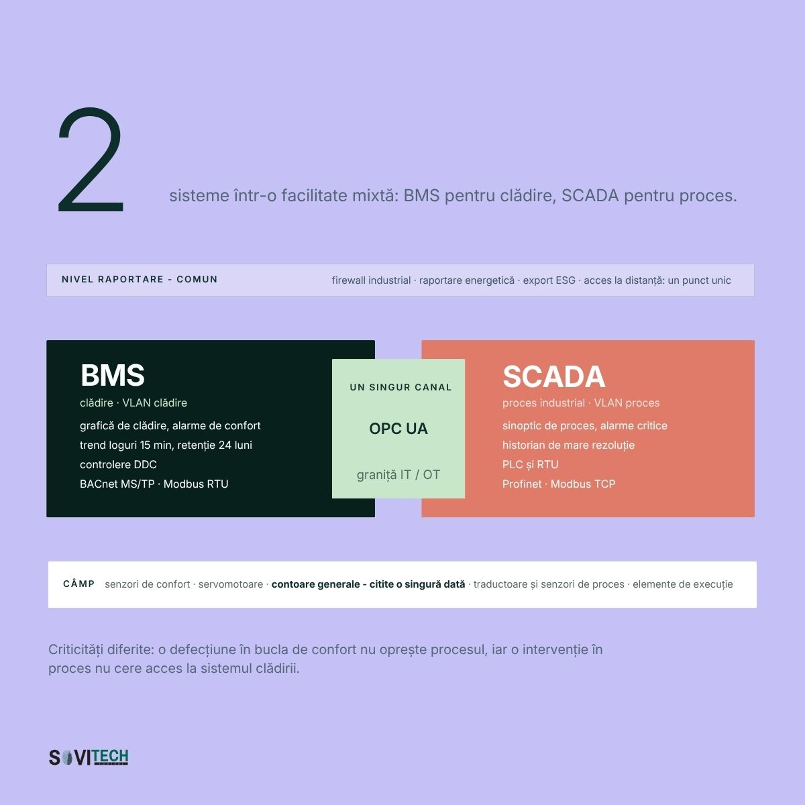

# Article (redesign-2026 branch): SCADA vs BMS: the differences and when to use each

> **Unmerged branch content.** This file comes from the branch `redesign-2026` of the SOVITECH website repository, not from `main`. The text is from commit `d2d15d2` (2026-08-24, "Redesign complet: continut editorial, rute noi, identitate vizuala"). The cover and diagrams are from commit `af81353` (2026-08-27, "Materiale vizuale noi: 10 coperti si 15 diagrame"). Owner decision, 2026-09-24: the branch is not SOVITECH's current position and will not be merged. This article is kept for reference only.

This is the full Romanian text of the SOVITECH website article „SCADA vs BMS: diferențe și când se folosește fiecare”, with its headings, tables, lists, figures, FAQ, sources and page metadata. Source: `components/articles/scada-vs-bms.tsx` (body, `meta`, `faq`), rendered at `/resurse/scada-vs-bms` by `app/resurse/[slug]/page.tsx`. Page metadata comes from `lib/site-routes.ts`, `lib/article-cards.ts` and `lib/article-covers.ts`. Paths are relative to the website repository root.

## Status of this content

- **Unmerged branch.** This article exists only on the branch `redesign-2026` of the website repository. The branch is not merged into `main`. Owner decision, 2026-09-24: it is not SOVITECH's current position and will not be merged. Keep this article for reference only. It is not what SOVITECH says today. `main` (`e080614`) is the current website, and it does not have this article.
- **Romanian only.** The branch has no English body for this article. The body component has no `t(ro, en)` calls, so the page shows the Romanian text in both site languages. English exists only for the page title, the lead and the category label (from `lib/site-routes.ts`) and the frame labels in `components/article-layout.tsx`.
- **Marketing and editorial copy.** Its figures (costs, percentages, savings, paybacks, point densities, durations, reference ranges) are not verified engineering data and not an approved reference dataset. The app may not use them as values, benchmarks, ranges or prices (guardrails rule 1, section 2.1, rule 9, rule 10, section 10).
- **Legal and standards statements.** The article states laws, thresholds and deadlines as its authors read them on the verification date in its closing note. The app takes legal thresholds and standards only from approved reference data with their edition or date, never from this article (guardrails rule 11). See "Regulatory statements in the articles" in `README.md`.
- **No named author.** The byline is "Echipa de inginerie Sovitech Control". The source file carries the comment `TODO(author): replace with the signing engineer`, so no engineer has signed this text.

## Page facts

| Item | Value |
|------|-------|
| Slug and route | `scada-vs-bms`, `/resurse/scada-vs-bms` |
| Page type | Cluster article (`/resurse/`). Registry status `published`, `draft: "drive"`. |
| Editorial id | A03 |
| Category | BMS, SCADA & Integrare / BMS, SCADA & Integration (C4) |
| Personas | P4 Director tehnic / Inginer-șef; P6 Manager industrial / Pharma; P7 IT / OT Manager |
| Pillar | `/ghid/sisteme-bms-cladiri` (Sistem BMS pentru clădiri: ghidul complet), status `published` |
| H1, RO | SCADA vs BMS: diferențe și când se folosește fiecare |
| H1, EN | SCADA vs BMS: the differences and when to use each |
| Lead, RO | Tabel comparativ pe 14 criterii, arbore de decizie și modul de legare a celor două într-o facilitate mixtă. |
| Lead, EN | A 14-criterion comparison, a decision tree, and how to bridge the two in a mixed facility. |
| `<title>` (RO only) | SCADA vs BMS: diferente si cand se foloseste \| Sovitech Control |
| Meta description (RO only, without diacritics as in the source) | BMS optimizeaza confortul si energia intr-o cladire, SCADA supervizeaza un proces industrial. Vezi tabelul comparativ pe 14 criterii si arborele de decizie. |
| `datePublished` / `dateModified` in `meta` | 2026-08-16 / 2026-08-16. `components/articles/index.ts` calls `dateModified` "the legal-verification date". |
| Card date and read time (`lib/article-cards.ts`) | 16 AUG 2026 / AUG 16, 2026; 17 MIN CITIRE / 17 MIN READ |
| Header line on the page | „Publicat 16.08.2026” (`components/article-layout.tsx`) |
| Author on the page | Rail: „Scris de” / "Written by", „Sovitech Control”, „Echipa de inginerie” / "Engineering team". JSON-LD author and publisher: Organization „Sovitech Control”. No `Person` node. |
| Cover | [`covers/scada-vs-bms.jpg`](covers/scada-vs-bms.jpg), 1920x1080 JPEG, from `public/coperti/scada-vs-bms.jpg`. Card background `#C5C0F6`. Also used as `og:image` and JSON-LD `image`. Alt text on the article page: the RO title. |
| Text on the cover | „14”, „criterii pe care se decide între BMS și SCADA”. BMS panel („clădire”): „HVAC, iluminat, contorizare”, „BACnet, KNX, DALI, M-Bus”, „disponibilitate, nu milisecunde”. Middle „ZONA GRI”: contorizare, pompare, chillere. SCADA panel („proces industrial”): „linii, utilități, energie”, „Modbus, OPC UA, PLC”, „milisecunde, redundanță”. |
| Diagrams | 1, listed below, from `public/diagrame/` |
| FAQ pairs | 5, shown in the body and emitted as `FAQPage` JSON-LD |
| Structured data | `Article` (inLanguage `ro`), `BreadcrumbList` (Acasă > Resurse > title), `FAQPage` (`components/article-jsonld.tsx`). Base URL `https://sovitech-website-gaidenic.vercel.app`. |
| Length | About 3,357 words in this Markdown rendering, tables included. |

### Diagrams

| Local copy | Caption in the article (RO, verbatim) |
|------------|----------------------------------------|
| `diagrams/A03-1-arhitectura-bms-scada.jpg` | Arhitectură combinată BMS și SCADA într-o facilitate mixtă, pe patru niveluri, cu granița IT/OT marcată. |

Text on the diagram (read from the image): **A03-1** „2 sisteme într-o facilitate mixtă: BMS pentru clădire, SCADA pentru proces.” A shared reporting level („firewall industrial · raportare energetică · export ESG · acces la distanță: un punct unic”); „UN SINGUR CANAL OPC UA” at the IT/OT boundary; BMS with „trend loguri 15 min, retenție 24 luni” and „BACnet MS/TP · Modbus RTU”; SCADA with „PLC și RTU” and „Profinet · Modbus TCP”; field level with „contoare generale - citite o singură dată”.

## Article text (RO, verbatim)

How this was rendered: the article's `<h2>` headings are `###` here and its `<h3>` headings are `####`. The lead paragraph (class `standfirst`) and the closing note (class `article-note`) are labelled. Diagrams point to the local copies in `diagrams/`. The FAQ box sits where the page renders it. Internal site links are written as the link text followed by the site path in code, for example „lista de referințe (`/referinte`)”, because root-relative links do not resolve outside the website. Bold and italics are as in the source. Nothing was translated, corrected or shortened.

*Standfirst:* Definiții, tabel comparativ pe 14 criterii, arbore de decizie și modul de legare a celor două sisteme într-o facilitate mixtă.

BMS înseamnă sistem de management al clădirii: optimizează confortul și energia într-un imobil. SCADA înseamnă supervizare și achiziție de date pentru un proces industrial sau o infrastructură distribuită. Tehnologic se suprapun. Diferă la scop, la viteza de reacție și la consecința unei erori: disconfort, într-un caz, oprirea producției, în celălalt.

BMS vine de la Building Management System, a nu se confunda cu Battery Management System. În textele de reglementare, sistemul apare sub numele de BACS, sisteme de automatizare și control al clădirilor.

### Pe scurt

- Tehnologia se suprapune aproape complet: ambele familii citesc senzori, execută logică, afișează sinoptice și scriu istoric.
- Criteriul de departajare este consecința unei opriri de 10 minute: reclamații sau șarjă pierdută.
- Controlerul DDC vine cu biblioteci HVAC gata făcute; PLC-ul are ciclu de scanare determinist.
- Licențierea decide bugetul mai des decât funcțiile: un SCADA pe tag-uri devine scump la câteva mii de puncte de confort.
- În facilitățile mixte răspunsul corect este „amândouă", legate prin BACnet, Modbus TCP sau OPC UA.
- OUG nr. 155/2024 nu conține un articol dedicat sistemelor OT, iar aplicabilitatea la SCADA și BMS rămâne o interpretare.

### Originea BMS: controlere DDC, BACnet, KNX, DALI, M-Bus

Sistemul BMS (Building Management System) controlează și supraveghează instalațiile unei clădiri: încălzire, ventilare, climatizare, iluminat, contorizare de utilități, uneori pompare sau surse de rezervă. Toată familia pleacă de la o singură întrebare: cum se menține un mediu interior stabil cu un consum cât mai mic.

Istoric, BMS-ul a crescut din instalațiile de clădiri, prin bucle de reglaj întâi pneumatice, apoi electronice, apoi digitale. Din anii '80 au apărut controlerele DDC (Direct Digital Control), cu funcții de clădire deja în bibliotecă: reglaj pe cameră, secvențe de CTA (centrală de tratare a aerului), curbe de încălzire, programe orare. În 1995 a apărut [BACnet](https://bacnet.org/) și, odată cu el, așteptarea că sistemul unui producător poate citi punctele altuia. Alături de BACnet, protocoalele uzuale ale lumii clădirilor sunt Modbus, KNX, DALI și M-Bus. Contextul complet este în ghidul despre sistemele BMS pentru clădiri (`/ghid/sisteme-bms-cladiri`).

Aceeași categorie de sisteme este și reglementată. În legea română apare ca BACS (Building Automation and Control System) și este obligatorie la clădirile nerezidențiale cu sisteme de încălzire, de climatizare, sau combinate cu ventilare, cu putere nominală utilă de peste 290 kW pe familie de sisteme, conform Legii 372/2005, art. 27 alin. (5) și art. 29 alin. (6). Termenul a fost 31 decembrie 2024 și este depășit. Legea cere trei capabilități: monitorizarea, înregistrarea, analiza și ajustarea continuă a consumului de energie; evaluarea eficienței, detectarea pierderilor și informarea persoanei responsabile; comunicarea cu sistemele tehnice conectate și interoperabilitatea între tehnologii proprietare diferite. A patra capabilitate, monitorizarea calității mediului interior, se adaugă de la 29 mai 2026 prin Directiva (UE) 2024/1275, art. 13 alin. (10) lit. d), și nu este încă transpusă în legea română. Tot de acolo vine și pragul de 70 kW, cu termen 31 decembrie 2029, art. 13 alin. (9) lit. b), netranspus.

### Originea SCADA: PLC, RTU, Modbus și OPC UA

SCADA înseamnă Supervisory Control and Data Acquisition, adică supervizare și achiziție de date. Este stratul de deasupra automatizării de proces: colectează date de la PLC-uri și RTU-uri, prin Modbus, OPC UA, Profinet sau protocoale de telemetrie precum IEC 60870-5-104 și DNP3, le afișează în sinoptice, gestionează alarmele, scrie istoric și permite comenzi de supervizare. Un detaliu care se pierde des: SCADA nu execută, de regulă, bucla rapidă de reglaj. Acolo lucrează PLC-ul, iar SCADA îl supraveghează.

Rădăcinile stau în telemetrie. În anii '60 și '70, companiile de apă, gaz și energie trebuiau să comande stații aflate la zeci de kilometri. De acolo vin trăsăturile rămase până azi: toleranța la legături slabe, RTU-uri autonome când linia cade, obsesia pentru istoricizare și pentru jurnalul de evenimente.

Un semn practic că un sistem este SCADA doar cu numele: sinopticele arată bine, dar historianul nu păstrează nimic peste 30 de zile și nimeni nu poate reconstitui ultima oprire.

### Tabel comparativ pe 14 criterii: scop, criticitate, protocoale, licențiere

Diferența esențială, în proză: sistemul BMS urmărește confortul și energia unei clădiri, cu bucle de secunde până la minute și cu tendințe la 5-15 minute, iar o defecțiune produce disconfort și reclamații. SCADA urmărește continuitatea unui proces, cu bucle de milisecunde până la secunde executate în PLC, iar o defecțiune se măsoară în minute de producție pierdută. Restul diferențelor, de la protocoale la modul de licențiere, decurg din aceste două scopuri.

Tabelul descrie utilizarea tipică, nu limitele tehnice. Orice criteriu poate fi contrazis de un proiect anume.

| Criteriu | BMS / BACS | SCADA |
|---|---|---|
| 1. Scop principal | Confort, calitatea aerului, eficiență energetică, cost de operare | Continuitatea și controlul unui proces, disponibilitatea instalației |
| 2. Obiect controlat | Un imobil sau un campus: CTA, cazane, chillere, ventiloconvectoare, iluminat, contoare | Un proces sau o infrastructură: linii de producție, pompare, tratare apă, distribuție energie |
| 3. Tip de proces | Lent, continuu, cu inerție termică mare | Rapid sau discret, cu secvențe, interblocări și stări de siguranță |
| 4. Rezoluție temporală / rată de eșantionare | Bucle de secunde până la minute; tendințe la 5-15 minute | Bucle de milisecunde până la secunde în PLC; achiziție la secundă sau sub secundă |
| 5. Criticitate și consecința unei defecțiuni | Disconfort, consum crescut, reclamații ale chiriașilor. Rareori pierdere directă de bani în prima oră | Oprire de producție, șarjă pierdută, rebut, risc de siguranță sau de mediu. Costul se măsoară pe minut |
| 6. Tip de controler | DDC: controler digital dedicat clădirii, cu biblioteci de funcții HVAC gata făcute | PLC: controler logic programabil, cu ciclu de scanare determinist, plus RTU pentru puncte îndepărtate |
| 7. Interfața de operare | Grafică de clădire: planuri de etaj, secțiuni prin instalație, zone colorate pe temperatură | Sinoptic de proces: schema P&ID vie, cu stări de utilaj, debite, presiuni și comenzi |
| 8. Protocoale tipice | BACnet IP și MS/TP, Modbus, KNX, DALI, M-Bus, LON | Modbus RTU/TCP, OPC UA, Profinet, Profibus, EtherNet/IP, IEC 60870-5-104, DNP3 |
| 9. Istoricizare și rezoluția datelor | Tendințe pe intervale largi, agregate orare și zilnice, păstrate luni sau ani pentru raportare energetică | Historian dedicat, rezoluție fină, compresie pe valoare, interogare pe eveniment și analiză post-incident |
| 10. Managementul alarmelor | Câteva sute de alarme, prioritizate pe confort și pe defect de echipament; notificare prin e-mail | Mii de alarme, cu confirmare obligatorie, ierarhizare pe siguranță, sortare pe cauză primă și rapoarte de flux de alarme |
| 11. Redundanță | Rareori dublată; server unic, controlere autonome care păstrează logica locală dacă serverul cade | Frecvent dublată: servere redundante, rețele inelare, PLC-uri în configurație redundantă, UPS dimensionat |
| 12. Cerințe de validare / reglementare | Reglementări de performanță energetică și de calitate a mediului interior; documentație as-built | Frecvent validare formală: calificare, audit trail, semnătură electronică, control al versiunilor și al accesului |
| 13. Cine îl operează | Facility manager, echipa tehnică a clădirii, uneori un dispecerat de portofoliu | Operator de tură în camera de comandă, inginer de proces, mentenanță industrială. Program de lucru continuu |
| 14. Mod de licențiere | De obicei pe număr de puncte de date sau pe stație de operare, cu abonament de mentenanță software | Pe tag-uri, pe client conectat, pe server sau pe nod de dezvoltare. Costul crește rapid cu numărul de puncte |

### Zona gri dintre BMS și SCADA: contorizare, pompare, chillere de proces

Zona gri are șase situații recurente: contorizarea generală de utilități, stațiile de pompare, compresoarele de aer, chillerele industriale, HVAC-ul de proces din camerele curate și grupurile electrogene cu UPS. Tehnologia din spate face parte din aceeași familie: senzori, module de intrări și ieșiri, o magistrală, un controler, un server, o interfață grafică. Un SCADA modern controlează o CTA foarte bine, iar un sistem BMS modern supraveghează o stație de pompare. Diferența stă în cât costă folosirea fiecăruia în afara zonei proprii.

| Zona gri | Cine o preia de obicei | Ce înclină decizia |
|---|---|---|
| Contorizare generală de utilități (energie, apă, gaz, agent termic) | Ambele, frecvent duplicat | Cine emite raportul lunar. Contorul se citește o singură dată și se distribuie, nu se cablează de două ori |
| Stații de pompare și de ridicare a presiunii | SCADA dacă sunt distribuite sau critice; BMS dacă deservesc clădirea | Distanța geografică și consecința unei opriri |
| Compresoare de aer | SCADA în industrie, BMS în clădiri comerciale | Dacă aerul comprimat intră în produs sau doar acționează clapete |
| Chillere industriale și răcire de proces | SCADA când răcirea este parte din proces | Toleranța admisă la abaterea de temperatură și viteza de reacție cerută |
| HVAC de proces: camere curate, incinte climatizate, zone cu presiune controlată | Sistem dedicat, adesea numit EMS, cu cerințe de validare | Existența unei cerințe de audit trail și de monitorizare continuă a parametrilor critici |
| Grupuri electrogene, UPS, tablouri generale | BMS pentru semnalizare; SCADA electric acolo unde există distribuție proprie de medie tensiune | Cine răspunde de rețeaua electrică internă |

Regula practică: dacă un echipament apare în două sisteme, se decide o dată cine îl *controlează*, iar celălalt îl *citește*. Dublarea comenzii este sursa clasică de conflict între două regulatoare care se luptă pe același setpoint. Contorul dublat produce, la finalul lunii, două valori care nu se potrivesc.

### Arborele de decizie în 8 pași: consecința unei opriri de 10 minute

Întrebările se parcurg în ordine. Un singur răspuns nu decide nimic; contează de câte ori se ajunge în aceeași parte.

1. **Ce se protejează: confortul oamenilor sau continuitatea unui proces?** Confortul: BMS. Procesul: SCADA. Ambele, în zone diferite: ambele.
2. **Ce se întâmplă dacă sistemul cade 10 minute?** Nimeni nu observă sau apar reclamații: BMS. Se oprește o linie sau se pierde o șarjă: SCADA.
3. **Cât de repede trebuie să reacționeze bucla?** Minute, cu inerție termică: BMS. Sub o secundă, cu interblocări: SCADA cu PLC.
4. **Este necesar un audit trail validat?** Da, în pharma sau în alt domeniu reglementat: SCADA sau EMS dedicat. Nu: BMS.
5. **Există puncte distribuite geografic, în afara unei singure clădiri?** Stații de pompare, puțuri, posturi de transformare: SCADA. Totul într-un campus compact: BMS.
6. **Cine se uită la ecran și cât de des?** Un facility manager care intră de câteva ori pe zi: BMS. Un operator de tură, permanent în fața sinopticului: SCADA.
7. **Care este întrebarea principală pusă sistemului?** „Câtă energie s-a consumat și de ce?": BMS. „De ce s-a oprit utilajul la 03:14?": SCADA.
8. **Cine plătește și din ce buget?** OPEX de clădire: BMS. Buget de producție sau de mentenanță industrială, justificat prin downtime evitat: SCADA.

Când răspunsurile se împart aproximativ egal, nu există o dilemă de alegere, ci o facilitate mixtă, care are nevoie de amândouă și de o interfață între ele.

Arborele nu acoperă bine două situații: centrele de date și clădirile cu producție proprie de energie. Acolo decizia se ia pe redundanță și pe contractul de disponibilitate, nu pe tipul de sistem.

### Arhitectura mixtă: BACnet, Modbus TCP și OPC UA la interfață

Într-o facilitate mixtă, cele două sisteme se leagă la nivel de date prin trei căi: BACnet pentru punctele de clădire, Modbus TCP pentru echipamentele cu registre simple și OPC UA pentru schimbul structurat între SCADA și supervizarea de clădire. Situațiile în care răspunsul corect este „amândouă" apar des:

- **Hală de producție cu corp de birouri.** Procesul, utilitățile tehnologice și aerul comprimat stau pe SCADA. Birourile, CTA-urile și contorizarea pe chiriaș stau pe BMS. Punctul comun: energia electrică și termică.
- **Spital.** Saloanele, iluminatul și ventilarea generală sunt BMS. Blocurile operatorii, presiunile diferențiale și gazele medicale cer tratament de tip proces, cu alarmare severă și redundanță.
- **Fabrică pharma.** BMS pentru zonele administrative, sistem dedicat de monitorizare a mediului pentru camerele curate, SCADA pentru proces. Cele trei nu se contopesc, pentru că cerințele de validare diferă.
- **Hotel cu piscină și cogenerare.** Camerele, CTA-urile și zonele publice sunt BMS clasic. Tratarea apei de piscină și cogenerarea sunt instalații de proces, cu furnizorul lor.

Legătura se face la nivel de date, nu prin înlocuirea unui sistem cu celălalt. Trei căi acoperă aproape tot: **BACnet** pentru punctele de clădire, **Modbus TCP** pentru echipamente cu registre simple și [**OPC UA**](https://opcfoundation.org/) pentru schimbul structurat între SCADA și supervizarea de clădire. Criteriile de alegere sunt tratate în materialele despre protocoale și integrare (`/resurse/bms-scada-integrare`), iar execuția este descrisă în pagina de integrare de sisteme (`/servicii/integrare-sisteme-knx-dali-modbus-mbus`).

Partea consumatoare de timp nu este montarea gateway-ului, ci maparea punctelor: denumiri, unități de măsură, sensuri de acțiune, ce se scrie și ce se citește doar. În integrările pe care Sovitech Control le-a executat în București, negocierea listei de puncte între doi furnizori a durat, de regulă, mai mult decât configurarea propriu-zisă a interfeței. Un gateway nu repară o documentație absentă: fără listă de puncte se face întâi releveul.

Un singur sistem forțat pentru tot costă în ambele sensuri. Un SCADA pe tag-uri devine scump la câteva mii de puncte de confort, iar un BMS împins în secvențe de proces se plătește în ore de programare nestandard, pe care nimeni nu le mai întreține peste cinci ani.



*Figure (`/diagrame/A03-1-arhitectura-bms-scada.jpg`):* Arhitectură combinată BMS și SCADA într-o facilitate mixtă, pe patru niveluri, cu granița IT/OT marcată.

### Granița IT/OT: segmentare, IEC 62443 și OUG 155/2024

Granița IT/OT se trasează la nivelul rețelei, nu al furnizorului. Sistemul BMS și sistemul SCADA sunt amândouă sisteme OT (tehnologie operațională), dar profilul de risc diferă. Un sistem BMS stă pe rețeaua de clădire, are stații de operare pe Windows, are frecvent acces de la distanță pentru furnizorul de mentenanță și trăiește 10-15 ani cu actualizări rare. Un SCADA industrial este mai bine izolat, însă consecința unei intruziuni este mai gravă.

Trei măsuri acoperă cea mai mare parte a riscului real, în ambele lumi:

- **Segmentarea.** Rețele separate pentru IT, BMS și SCADA, nu un singur VLAN „tehnic". Modelul de zone și conduite din [seria IEC 62443](https://www.iec.ch/blog/understanding-iec-62443) este referința uzuală pentru partea industrială.
- **Accesul la distanță controlat.** Un singur punct de intrare, cu autentificare cu mai mulți factori, conturi nominale și jurnalizare, nu un client de acces lăsat pornit pe stația de operare.
- **Inventarul.** Ce dispozitive există, cu ce firmware și cine le poate atinge. În clădirile cu mai mulți furnizori, inventarul lipsește aproape întotdeauna.

Pe partea de reglementare, NIS2 a fost transpusă în România prin [OUG nr. 155/2024](https://legislatie.just.ro/public/DetaliiDocument/293121), cu DNSC ca autoritate. Un aspect merită spus corect: actul normativ nu conține un articol dedicat sistemelor OT, SCADA sau BMS. Obligațiile sunt formulate neutru tehnologic și privesc rețelele și sistemele informatice folosite pentru furnizarea serviciului. **Interpretarea rezonabilă**, prezentată aici ca interpretare și nu ca text citabil de lege, este că un SCADA care ține în funcțiune un serviciu esențial sau un BMS de care depinde furnizarea serviciului intră în acest perimetru. Operatorii aflați în această situație clarifică întrebarea cu juristul și cu echipa responsabilă de IT/OT, pe baza textului oficial.

### Trei greșeli frecvente: SCADA în birouri, proces critic pe BMS

- **SCADA cumpărat pentru o clădire de birouri.** Apare când specificația este scrisă de cineva cu formație industrială. Rezultatul: licențiere pe tag-uri care explodează la câteva mii de puncte de confort, sinoptice construite de la zero pentru lucruri pe care orice DDC le are în bibliotecă.
- **Proces critic controlat dintr-un BMS.** Apare când o instalație tehnologică este adăugată târziu și „mai încape" pe controlerul existent. Problemele ies la interblocări, la timpii de scanare și după o repornire a serverului. Un proces care nu are voie să se oprească are nevoie de logică deterministă, în PLC.
- **Două sisteme fără interfață comună.** Cea mai costisitoare pe termen lung, pentru că este invizibilă. Două istorice, două seturi de contoare, iar raportul lunar se face manual în Excel. La raportarea de date ESG (`/ghid/date-esg-cladiri`), lipsa interfeței devine o problemă de auditabilitate.

### Ce decid directorul tehnic, managerul pharma și responsabilul IT/OT

#### Directorul tehnic: împărțirea pe zone de criticitate, înainte de ofertare

Decizia se ia la nivel de arhitectură, înainte de cererea de oferte. Facilitatea se împarte pe zone de criticitate, iar caietul de sarcini spune explicit cine deține fiecare punct de date și prin ce protocol se schimbă informația la graniță. Modelul de caiet de sarcini Sovitech are un capitol dedicat interfeței cu sistemele terțe: cere modelul de caiet de sarcini BMS (`/contact`). Contextul de rol stă pe pagina pentru directorul tehnic.

#### Managerul pharma: ce zone intră în validare și audit trail

Întrebarea de pus nu este „SCADA sau BMS", ci ce anume trebuie validat. Zonele cu cerințe de audit trail se separă de la început de cele fără, altfel validarea se extinde peste tot și scumpește fiecare modificare de secvență. Abordarea pe segmente este descrisă pentru facilități pharma (`/expertiza/pharma`) și pentru proiecte industriale (`/expertiza/industrial`).

#### Responsabilul IT/OT: schema de rețea înaintea listei de echipamente

Schema de rețea se cere înaintea listei de echipamente. Contează unde stă granița IT/OT, cine are acces la distanță și ce se jurnalizează. Un BMS bine făcut și un SCADA bine făcut arată identic din această perspectivă: segmentate, inventariate, cu un singur punct de acces.

### Întrebări frecvente

*(FAQ box, rendered from the exported `faq` list; the same pairs feed the FAQPage JSON-LD. Questions verbatim, some without diacritics as in the source.)*

**Poate un BMS să înlocuiască un SCADA?**

În instalații lente și necritice, da. Un BMS modern citește Modbus, afișează sinoptice și scrie istoric. Nu se folosește însă pentru bucle rapide, interblocări de siguranță sau procese care nu au voie să se oprească: acolo este nevoie de PLC.

**Ce diferenta este intre DDC si PLC?**

DDC-ul este un controler proiectat pentru clădiri, cu funcții HVAC gata făcute și configurare rapidă. PLC-ul este generic, cu ciclu de scanare determinist și programare standardizată. DDC-ul câștigă la viteza de implementare, PLC-ul câștigă la proces și la interblocări.

**Cât costă în plus legarea celor două sisteme?**

Estimativ, interfața între un BMS și un SCADA existente înseamnă între câteva zile și câteva săptămâni de lucru: gateway sau server OPC UA, maparea punctelor, testare și documentație. Intervalul este orientativ și depinde de numărul de puncte schimbate.

**Este nevoie de SCADA pentru o clădire de birouri?**

În marea majoritate a cazurilor, nu. Un BMS acoperă HVAC, iluminatul, contorizarea și raportarea energetică mai ieftin și mai rapid. Excepțiile apar la clădirile cu producție proprie de energie, cu stație de tratare a apei sau cu centru de date.

**Cine ar trebui să dețină sistemul: echipa tehnică sau IT-ul?**

Operarea rămâne la echipa tehnică, pentru că ea înțelege instalația. Rețeaua, conturile, accesul la distanță și copiile de siguranță aparțin IT-ului. Modelul care eșuează cel mai des este cel în care nimeni nu deține explicit partea de rețea a sistemelor OT.

### Concluzie

Alegerea între SCADA și BMS nu este o competiție între tehnologii, ci o decizie de arhitectură luată o singură dată, pe criteriul consecinței unei opriri. Facilitățile mixte au nevoie de amândouă, iar banii se pierd în interfața dintre ele, nu în sisteme. Un proiect care nu spune cine deține fiecare punct de date plătește diferența mai târziu, în ore de integrare.

### Discută arhitectura cu un inginer Sovitech

Sovitech proiectează și execută ambele părți: proiectare de automatizări și BMS (`/servicii/proiectare-automatizari-bms`) și integrare cu sisteme de proces existente, de la birouri și hoteluri până la fabrici pharma, în lista de referințe (`/referinte`). Pe baza schemei instalațiilor, un inginer răspunde cu o propunere de împărțire pe zone, cu punctele schimbate între sisteme și cu protocolul recomandat.

*Article note (class `article-note`):* Articol publicat 16.08.2026. Actualizat 19.08.2026. Informațiile juridice au fost verificate la 16.08.2026. Referința la OUG nr. 155/2024 este redată ca atare; interpretarea privind aplicabilitatea la sistemele SCADA și BMS este opinia autorului, nu text de lege. Sursele primare citate sunt paginile oficiale ale organizațiilor emitente: bacnet.org, opcfoundation.org, iec.ch și portalul legislativ. Autor: Echipa de inginerie Sovitech Control.

## Sources and links in the article

External sources cited (URL, then the anchor text as written):

- <https://bacnet.org/>: „BACnet”
- <https://opcfoundation.org/>: „**OPC UA**”
- <https://www.iec.ch/blog/understanding-iec-62443>: „seria IEC 62443”
- <https://legislatie.just.ro/public/DetaliiDocument/293121>: „OUG nr. 155/2024”

Internal links (site path, status on the branch):

- `/ghid/sisteme-bms-cladiri`: published (ghid) in `lib/site-routes.ts`
- `/resurse/bms-scada-integrare`: published (category archive) in `lib/site-routes.ts`
- `/servicii/integrare-sisteme-knx-dali-modbus-mbus`: published (servicii) in `lib/site-routes.ts`
- `/ghid/date-esg-cladiri`: published (ghid) in `lib/site-routes.ts`
- `/contact`: static page on the branch
- `/expertiza/pharma`: published (expertiza) in `lib/site-routes.ts`
- `/expertiza/industrial`: published (expertiza) in `lib/site-routes.ts`
- `/servicii/proiectare-automatizari-bms`: published (servicii) in `lib/site-routes.ts`
- `/referinte`: static page on the branch

The source file lists links that were weakened because their target page is not built yet (`LINKS-TO-REACTIVATE`). Each line gives the anchor text, the interim target and the planned final target. Verbatim:

```text
// LINKS-TO-REACTIVATE:
//   materialele despre protocoale si integrare | interim /resurse/bms-scada-integrare | final /ghid/protocoale-automatizarea-cladirilor
//   cere modelul de caiet de sarcini BMS | interim /contact | final /instrumente/model-caiet-de-sarcini-bms
//   echipa responsabila de IT/OT (text fara link) | interim (fara link) | final /pentru/it-ot
//   pagina pentru directorul tehnic (text fara link) | interim (fara link) | final /pentru/director-tehnic
```

## Notes

- NIS2: the article says NIS2 was transposed by OUG nr. 155/2024 with DNSC as authority, and that the OUG has no article dedicated to OT systems. Its closing note labels the applicability to SCADA and BMS as „opinia autorului, nu text de lege”.
- Cites the IEC 62443 series as the usual reference for zones and conduits. It does not give an edition.
- Dates: `meta` says 2026-08-16 for both; the closing note says „Actualizat 19.08.2026”. The closing note gives a later update date than `meta.dateModified`, so the page header shows no „Actualizat” date. By the comment in `components/articles/index.ts`, `dateModified` is the legal-verification date, which explains the gap but is not what a reader sees.
