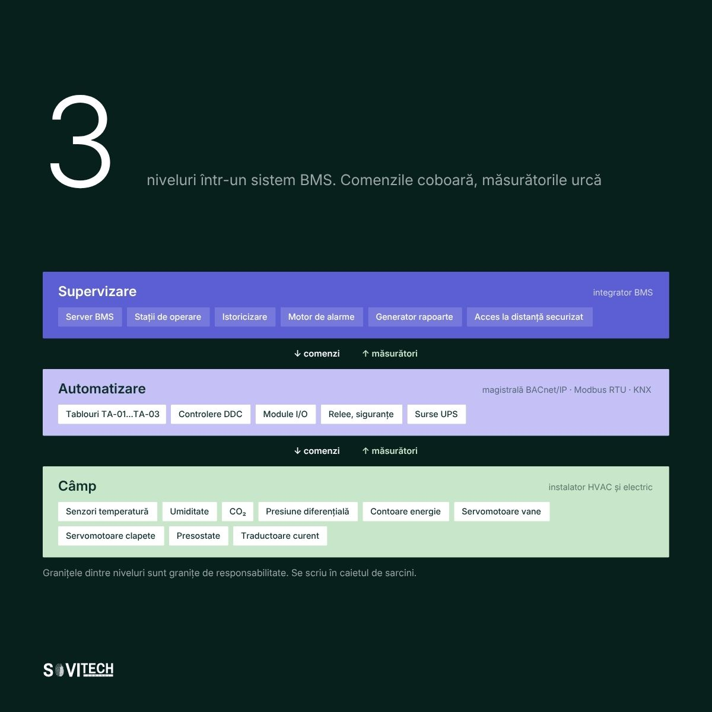
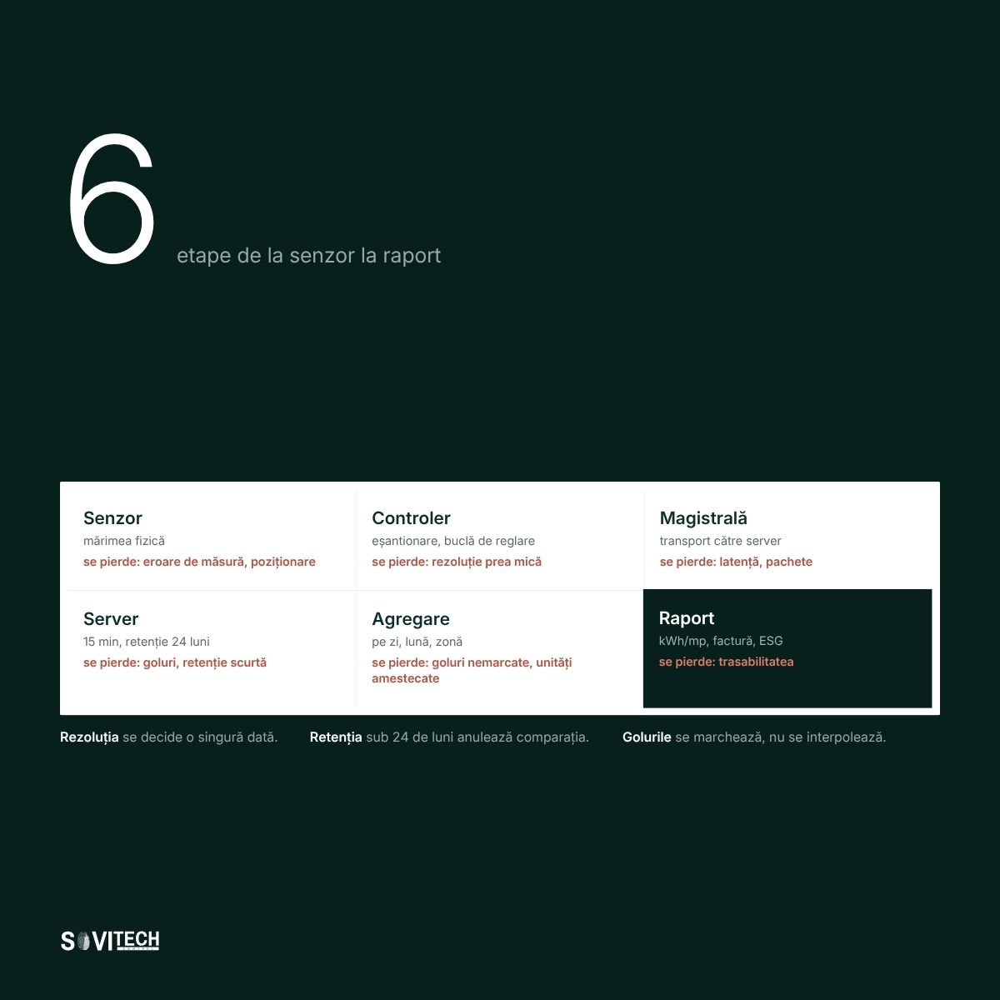

# Article (redesign-2026 branch): BMS systems for buildings: the complete guide

> **Unmerged branch content.** This file comes from the branch `redesign-2026` of the SOVITECH website repository, not from `main`. The text is from commit `d2d15d2` (2026-08-24, "Redesign complet: continut editorial, rute noi, identitate vizuala"). The cover and diagrams are from commit `af81353` (2026-08-27, "Materiale vizuale noi: 10 coperti si 15 diagrame"). Owner decision, 2026-09-24: the branch is not SOVITECH's current position and will not be merged. This article is kept for reference only.

This is the full Romanian text of the SOVITECH website article „Sistem BMS pentru clădiri: ghidul complet”, with its headings, tables, lists, figures, FAQ, sources and page metadata. Source: `components/articles/sisteme-bms-cladiri.tsx` (body, `meta`, `faq`), rendered at `/ghid/sisteme-bms-cladiri` by `app/ghid/[slug]/page.tsx`. Page metadata comes from `lib/site-routes.ts`, `lib/article-cards.ts` and `lib/article-covers.ts`. Paths are relative to the website repository root.

## Status of this content

- **Unmerged branch.** This article exists only on the branch `redesign-2026` of the website repository. The branch is not merged into `main`. Owner decision, 2026-09-24: it is not SOVITECH's current position and will not be merged. Keep this article for reference only. It is not what SOVITECH says today. `main` (`e080614`) is the current website, and it does not have this article.
- **Romanian only.** The branch has no English body for this article. The body component has no `t(ro, en)` calls, so the page shows the Romanian text in both site languages. English exists only for the page title, the lead and the category label (from `lib/site-routes.ts`) and the frame labels in `components/article-layout.tsx`.
- **Marketing and editorial copy.** Its figures (costs, percentages, savings, paybacks, point densities, durations, reference ranges) are not verified engineering data and not an approved reference dataset. The app may not use them as values, benchmarks, ranges or prices (guardrails rule 1, section 2.1, rule 9, rule 10, section 10).
- **Legal and standards statements.** The article states laws, thresholds and deadlines as its authors read them on the verification date in its closing note. The app takes legal thresholds and standards only from approved reference data with their edition or date, never from this article (guardrails rule 11). See "Regulatory statements in the articles" in `README.md`.
- **No named author.** The byline is "Echipa de inginerie Sovitech Control". The source file carries the comment `TODO(author): replace with the signing engineer`, so no engineer has signed this text.

## Page facts

| Item | Value |
|------|-------|
| Slug and route | `sisteme-bms-cladiri`, `/ghid/sisteme-bms-cladiri` |
| Page type | Pillar guide (`/ghid/`). Registry status `published`, `draft: "drive"`. |
| Editorial id | A01 |
| Category | BMS, SCADA & Integrare / BMS, SCADA & Integration (C4) |
| Personas | P1 Proprietar / Dezvoltator / Investitor; P3 Facility Manager; P4 Director tehnic / Inginer-șef |
| Pillar | none (this is a pillar) |
| H1, RO | Sistem BMS pentru clădiri: ghidul complet |
| H1, EN | BMS systems for buildings: the complete guide |
| Lead, RO | Componente, arhitectură pe trei niveluri, protocoale, obligația legală și etapele unui proiect executat corect. |
| Lead, EN | Components, three-tier architecture, protocols, the legal obligation and the stages of a properly executed project. |
| `<title>` (RO only) | Sistem BMS cladiri: ghid complet 2026 \| Sovitech Control |
| Meta description (RO only, without diacritics as in the source) | Ghid complet despre sistemele BMS pentru cladiri: componente, arhitectura, protocoale, obligatia BACS de la 290 kW si etapele unui proiect BMS corect. |
| `datePublished` / `dateModified` in `meta` | 2026-08-16 / 2026-08-16. `components/articles/index.ts` calls `dateModified` "the legal-verification date". |
| Card date and read time (`lib/article-cards.ts`) | 16 AUG 2026 / AUG 16, 2026; 31 MIN CITIRE / 31 MIN READ |
| Header line on the page | „Publicat 16.08.2026” (`components/article-layout.tsx`) |
| Author on the page | Rail: „Scris de” / "Written by", „Sovitech Control”, „Echipa de inginerie” / "Engineering team". JSON-LD author and publisher: Organization „Sovitech Control”. No `Person` node. |
| Cover | [`covers/sisteme-bms-cladiri.jpg`](covers/sisteme-bms-cladiri.jpg), 1920x1080 JPEG, from `public/coperti/sisteme-bms-cladiri.jpg`. Card background `#07201C`. Also used as `og:image` and JSON-LD `image`. Alt text on the article page: the RO title. |
| Text on the cover | „5-15%”, „din consumul total al clădirii, pe facturi normalizate”. Three tiers: „Supervizare” („3 stații, rapoarte și alarme”), „Automatizare” („6 automate, secvențe locale”), „Câmp” („14 puncte, senzori și actuatoare”). Box „Ce urcă între niveluri”: valoare măsurată, stare și alarmă, comandă, program orar. The counts are illustrative. |
| Diagrams | 2, listed below, from `public/diagrame/` |
| FAQ pairs | 6, shown in the body and emitted as `FAQPage` JSON-LD |
| Structured data | `Article` (inLanguage `ro`), `BreadcrumbList` (Acasă > Ghiduri > title), `FAQPage` (`components/article-jsonld.tsx`). Base URL `https://sovitech-website-gaidenic.vercel.app`. |
| Length | About 6,214 words in this Markdown rendering, tables included. |

### Diagrams

| Local copy | Caption in the article (RO, verbatim) |
|------------|----------------------------------------|
| `diagrams/A01-1-arhitectura-trei-niveluri.jpg` | Arhitectura unui sistem BMS pe trei niveluri: câmp, automatizare și supervizare. |
| `diagrams/A01-2-flux-date-senzor-raport.jpg` | Fluxul datelor de la senzor la raport, în șase etape, cu punctele în care datele se pot pierde. |

Text on the diagrams (read from the images): **A01-1** „3 niveluri într-un sistem BMS. Comenzile coboară, măsurătorile urcă”; Supervizare (integrator BMS), Automatizare („magistrală BACnet/IP · Modbus RTU · KNX”), Câmp (instalator HVAC și electric); footer „Granițele dintre niveluri sunt granițe de responsabilitate. Se scriu în caietul de sarcini.” **A01-2** „6 etape de la senzor la raport”: Senzor, Controler, Magistrală, Server („15 min, retenție 24 luni”), Agregare, Raport; footer „Rezoluția se decide o singură dată. Retenția sub 24 de luni anulează comparația. Golurile se marchează, nu se interpolează.”

## Article text (RO, verbatim)

How this was rendered: the article's `<h2>` headings are `###` here and its `<h3>` headings are `####`. The lead paragraph (class `standfirst`) and the closing note (class `article-note`) are labelled. Diagrams point to the local copies in `diagrams/`. The FAQ box sits where the page renders it. Internal site links are written as the link text followed by the site path in code, for example „lista de referințe (`/referinte`)”, because root-relative links do not resolve outside the website. Bold and italics are as in the source. Nothing was translated, corrected or shortened.

*Standfirst:* Componente, arhitectură pe trei niveluri, protocoale, obligația legală de la 290 kW, ordinul de mărime al costului și etapele unui proiect executat corect.

**Un sistem BMS pentru clădiri (Building Management System, a nu se confunda cu Battery Management System) este infrastructura care măsoară, comandă și înregistrează funcționarea instalațiilor unei clădiri: încălzire, ventilare, climatizare, iluminat, pompe, contorizare. Reunește senzori, controlere, tablouri de automatizare și o stație de supervizare într-un sistem care produce date verificabile.**

Termenul se folosește în trei sensuri diferite în aceeași ședință. Proiectantul înțelege o arhitectură de controlere, proprietarul înțelege o linie de buget, iar facility managerul înțelege ecranul de pe care primește alarme la trei dimineața. Ghidul acoperă toate trei sensurile, în ordinea în care contează pentru cine decide. Este scris de echipa Sovitech Control, cu sediul în București, care execută astfel de sisteme din 2017, în clădiri de birouri, hoteluri, spitale și fabrici de medicamente.

### Pe scurt

- Legea română cere sisteme de automatizare și control al clădirilor, BACS, la clădirile nerezidențiale cu sisteme de încălzire, de climatizare, sau combinate cu ventilare, cu putere nominală utilă de peste 290 kW pe familie de sisteme; termenul a fost 31 decembrie 2024 și este depășit (Legea 372/2005, art. 27 alin. (5) și art. 29 alin. (6)).
- Pragul de 70 kW, cu termen 31 decembrie 2029, provine din Directiva (UE) 2024/1275, art. 13 alin. (9) lit. b), și nu este încă transpus în legea română.
- Un sistem BMS se citește pe trei niveluri: câmp, automatizare, supervizare. Fiecare nivel are propriul risc de cost.
- Unitatea de măsură a unui proiect este punctul de date. După el se dimensionează controlerele, licențele și, în bună parte, prețul.
- Ordin de mărime orientativ pentru o clădire de birouri: 9-18 EUR/mp la clasa A și 5-10 EUR/mp la clasa B, fără TVA.
- Trei clauze decid costul pe zece ani: comunicație nativă deschisă, predarea proiectului software și a hărților de puncte, licențe pe numele beneficiarului.

### Definiția tehnică a unui sistem BMS: comandă, măsurare, înregistrare

Un sistem BMS, Building Management System, este stratul de comandă și măsurare dintre instalațiile unei clădiri și oamenii care răspund de ele. Fără el, fiecare echipament funcționează după propria automatizare locală, izolat: centrala termică știe de centrala termică, chillerul știe de chiller, iar nimeni nu știe dacă amândouă merg simultan într-o zi de aprilie.

Cu el, instalațiile devin puncte de date într-un singur sistem, comandate după o logică unitară și înregistrate în timp. Diferența practică apare la prima reclamație de confort. Fie există istoric și se poate verifica ce s-a întâmplat, fie rămâne cuvântul unui om împotriva cuvântului altuia.

O limită de spus din start: un sistem BMS nu repară o instalație subdimensionată și nu compensează o hidraulică proastă. Dacă bateria de încălzire este prea mică pentru debitul de aer, sistemul o va comanda la 100% și va raporta corect că nu atinge valoarea de consemn. Automatizarea face problema vizibilă, nu o rezolvă.

### BMS, BACS, SCADA și EMS: patru acronime care se confundă

**BMS** are două înțelesuri fără legătură între ele. În clădiri înseamnă Building Management System. În industria bateriilor și a vehiculelor electrice înseamnă Battery Management System, adică electronica ce supraveghează celulele unui acumulator. Pentru că o clădire poate avea și stocare pe baterii, în documentele de proiect se scrie întotdeauna „sistem BMS pentru clădire”.

**BACS** este termenul juridic: sisteme de automatizare și control al clădirilor. Formularea apare identic în Legea 372/2005 și în directiva europeană privind performanța energetică a clădirilor. În discuțiile de conformare se folosește BACS, în discuțiile cu furnizorii se folosește BMS. Este același obiect tehnic.

**SCADA**, supervisory control and data acquisition, descrie același tip de arhitectură, dar în context industrial, cu accent pe proces și pe achiziția rapidă de date. **EMS** înseamnă fie sistem de management energetic, fie, în farmaceutică, sistem de monitorizare a mediului, de aceea se califică întotdeauna. Un sistem BMS bine făcut acoperă funcții de EMS energetic. Nu înlocuiește un EMS validat GMP.

### Cele trei niveluri: câmp, automatizare, supervizare

Un sistem BMS se citește pe trei niveluri: câmp, automatizare, supervizare. Discuția de cost, de risc și de deschidere se poartă în raport cu aceste trei niveluri.



*Figure (`/diagrame/A01-1-arhitectura-trei-niveluri.jpg`):* Arhitectura unui sistem BMS pe trei niveluri: câmp, automatizare și supervizare.

Două cifre din tabelul de mai jos merită scoase în text, pentru că se verifică la achiziție: rezerva liberă de puncte pe controlerele DDC, adică pe regulatoarele digitale directe, se cere la minimum 15-20%, iar senzorii de CO2 se decalibrează în 2-3 ani și aproape nimeni nu îi verifică.

| Nivel | Componentă | Ce face | Ce se verifică la achiziție |
|---|---|---|---|
| Câmp | Senzori și traductoare | Măsoară temperatură, umiditate, CO2, presiune diferențială, debit, calitatea aerului, nivel, curent. Convertesc mărimea fizică într-un semnal electric standard (0-10 V, 4-20 mA, rezistiv) sau digital. | Clasa de precizie și domeniul de măsură, nu doar marca. Senzorii de CO2 se decalibrează în 2-3 ani și aproape nimeni nu îi verifică; cei cu autocalibrare rămân utilizabili mai mult. Poziția de montaj contează mai mult decât specificația. |
| Câmp | Servomotoare, vane de reglaj, clapete | Execută comanda: modulează debitul de agent termic, poziționează clapetele de aer, izolează circuite. | Cuplu suficient pentru dimensiunea vanei, timp de cursă, comportare la avarie de tensiune (revenire cu arc, unde este critic), semnal de retur de poziție. |
| Câmp | Contoare de energie | Contorizare de energie electrică, termică, apă, gaz, pe consumatori sau pe zone. Baza oricărei raportări. | Ieșire de comunicație reală (M-Bus, Modbus), nu doar impuls. Clasa de exactitate. Amplasarea la nivel de consumator relevant, nu doar pe branșamentul general. |
| Automatizare | Controlere DDC | Citesc intrările, execută secvențele de reglare și de blocare, comandă ieșirile. Funcționează autonom și când legătura cu serverul cade. | Numărul și tipul de puncte I/O, rezerva liberă (minimum 15-20%), capacitatea de a rula secvențele local, protocoalele native, disponibilitatea pieselor peste 10 ani. |
| Automatizare | Tabloul de automatizare | Găzduiește controlerele, sursele, releele, protecțiile și, unde e cazul, partea de forță pentru pornirea motoarelor. | Etichetare completă, schemele în ușă, rezervă de spațiu pentru module viitoare, separarea circuitelor de forță de cele de semnal, sursă neîntreruptibilă pentru controlere. |
| Comunicație | Rețeaua BMS | Transportă datele între controlere și server și către echipamentele cu automatizare proprie. | Rețea dedicată sau VLAN separat de rețeaua de birou. Documentarea adreselor. Punctele de acces la distanță, controlate. |
| Supervizare | Server și stație de operare (HMI) | Afișează sinopticele, centralizează alarmele, păstrează istoricul, generează rapoarte, gestionează utilizatorii. | Unde stă baza de date și cine o poate exporta. Numărul de utilizatori simultani. Accesul din browser fără instalare locală. |
| Supervizare | Licențe software | Dau dreptul de utilizare pe număr de puncte, de drivere de integrare, de clienți conectați, de module (rapoarte, energie, mentenanță). | **Cel mai des uitat capitol de buget.** Se cere explicit: ce e perpetuu, ce e pe abonament, ce se întâmplă la depășirea numărului de puncte, cât costă extinderea cu încă 200 de puncte peste cinci ani. |

La nivel de echipamente, Sovitech Control lucrează ca partener autorizat SAUTER: controlere Modulo 6 și Modulo 5/ECOS, senzori de CO2 și de temperatură din seriile EGQ și EGH, vane și servomotoare, supervizare Sauter Vision Center sau ModuWeb Vision. Gama este pe pagina de produse (`/produse`). Principiul rămâne același indiferent de marcă: contează arhitectura și deschiderea, nu logoul de pe controler.

Un detaliu de comparare a ofertelor. Diferența de preț dintre două propuneri vine, de cele mai multe ori, din numărul de puncte și din orele de punere în funcțiune incluse, nu din marca de controler. Două oferte care par să difere cu o treime descriu, la citire atentă, două sisteme diferite.

### Cele cinci noțiuni: punct de date, buclă, secvență, orare, interblocări

Cinci noțiuni acoperă practic tot ce face un sistem BMS. Cine le înțelege poate citi orice caiet de sarcini.

**Punctul de date.** Unitatea elementară. Un punct este o valoare cu adresă: temperatura pe tur la circuitul de radiatoare, starea de funcționare a pompei P2, comanda de deschidere a vanei V4. Punctele sunt fizice (legate de un senzor sau de o ieșire) sau software (o valoare calculată, un setpoint, o alarmă). Numărul total de puncte este principala unitate de măsură a unui sistem BMS.

**Bucla de reglare.** Sistemul compară valoarea măsurată cu valoarea de consemn și acționează asupra unui element de execuție până când diferența dispare. O centrală de tratare a aerului, CTA, măsoară temperatura aerului refulat, o compară cu 20 °C și modulează vana bateriei de încălzire. Regulatorul este de obicei de tip PID, iar acordarea lui, nu alegerea lui, decide dacă instalația oscilează sau este stabilă. Majoritatea plângerilor de tip „BMS-ul nu funcționează” sunt, de fapt, bucle neacordate.

**Secvența de funcționare.** Descrierea în cuvinte a comportamentului unui echipament în toate stările: pornire, funcționare normală, trecere între moduri, oprire, avarie. Este documentul cel mai important al unui proiect BMS și cel mai des absent. Fără secvențe scrise, programatorul inventează logica pe șantier, iar beneficiarul nu are cu ce compara rezultatul la recepție.

**Programele orare.** Calendarul de funcționare: ore de ocupare pe zile, zile libere, sărbători, excepții. Aici se produce cea mai ieftină economie dintr-o clădire. Un sistem lăsat pe „permanent” pentru că „așa e mai simplu” pierde bani în fiecare noapte, tăcut. Reducerea nocturnă nu se aplică însă peste tot: în spații cu control de umiditate, în arhive, în camerele tehnice IT sau în zonele clasificate din farmaceutică, programul rămâne continuu și economia se caută în altă parte.

**Interblocările.** Condițiile care nu se negociază: ventilatorul nu pornește dacă clapeta de aer proaspăt nu e deschisă; bateria de încălzire cu apă intră în protecție la îngheț și oprește ventilatorul; pompa de circulație nu pornește fără confirmarea debitului. Sunt partea din program pe care nimeni nu o vede și fără de care o centrală de tratare a aerului se poate distruge într-o noapte de ianuarie.



*Figure (`/diagrame/A01-2-flux-date-senzor-raport.jpg`):* Fluxul datelor de la senzor la raport, în șase etape, cu punctele în care datele se pot pierde.

### Cele opt instalații conectate la BMS: HVAC, contorizare, iluminat

Opt familii de instalații se conectează la un sistem BMS, iar prima dintre ele, HVAC, adică încălzirea, ventilarea și climatizarea, produce majoritatea consumului.

- **HVAC.** Nucleul sistemului: centrale de tratare a aerului, ventiloconvectoare, sisteme VRF, ventilații de desfumare în regim de test. Aici se produc majoritatea consumurilor și majoritatea reclamațiilor de confort.
- **Centrala termică.** Cazane, distribuitoare, pompe, vane de amestec, compensare după temperatura exterioară, prepararea apei calde menajere cu regimurile de tratament termic aferente.
- **Chillerele și producția de frig.** Pornire în cascadă, secvențierea pompelor primare și secundare, gestiunea temperaturii de retur, oprirea mecanică atunci când free-coolingul acoperă cererea.
- **Iluminatul.** De regulă prin integrare cu un sistem DALI sau KNX, nu prin comandă directă din BMS: senzori de prezență, reglare după lumina naturală, scenarii, programe orare pe zone.
- **Contorizarea.** Energie electrică, termică, apă, gaz, pe consumatori și pe chiriași. Componenta care transformă BMS-ul dintr-un sistem de confort într-un sistem de date. Detaliat în ghidul despre datele pentru raportarea ESG (`/ghid/date-esg-cladiri`).
- **Pompele și stațiile de pompare.** Pompe de circulație, de recirculare, de epuisment; funcționare alternantă, egalizarea orelor de funcționare, alarme de avarie.
- **Stația de pompare pentru incendiu.** Atenție la limită: sistemul BMS **monitorizează** starea (pompă în funcțiune, avarie, nivel în rezervor, poziția vanelor), dar **nu comandă** și nu înlocuiește automatizarea dedicată de securitate la incendiu, care rămâne un sistem independent, cu regim propriu de verificare.
- **Controlul accesului, efracția și supravegherea video.** Se integrează, nu se înlocuiesc. Integrarea utilă este informațională: semnalul de „prima persoană a intrat pe etajul 4” pornește tratarea aerului pe zona respectivă, iar starea de „clădire armată” trece instalațiile în regim redus. Sistemele de securitate rămân autonome și certificate separat.

### BACnet, Modbus, KNX, DALI, M-Bus și LON: miza deschiderii

Șase protocoale contează într-o clădire: BACnet pe magistrala principală, Modbus pentru echipamentele terțe, KNX și DALI pentru iluminat și comanda în cameră, M-Bus pentru contoare și LON în clădirile echipate între 2000 și 2015. Protocolul este limba în care vorbesc echipamentele. Alegerea lui nu este o preferință tehnică, ci o decizie comercială pe zece ani. Dacă sistemul vorbește doar limba unui singur producător, toate extinderile viitoare vor fi ofertate de acel producător, la prețul lui. Subiectul este acoperit pe larg în materialele despre BMS, SCADA și integrare (`/resurse/bms-scada-integrare`).

| Protocol | Unde se folosește | Statut | Puncte tari | Limitări | Ce se cere în caiet de sarcini |
|---|---|---|---|---|---|
| **BACnet** (IP și MS/TP) | Magistrala principală a sistemului: controlere, CTA, chillere, centrale termice | Standard deschis, dedicat clădirilor | Obiecte standardizate (analog input, schedule, trend log, alarmă). Interoperabilitate reală între mărci. Descoperire automată a dispozitivelor. | Implementările diferă în profunzime. „Compatibil BACnet” poate însemna zece obiecte sau două sute. | Profilul BACnet (BTL) și lista completă de obiecte expuse, pe echipament. Fără listă, nu există interoperabilitate garantată. |
| **Modbus** (RTU și TCP) | Echipamente terțe: chillere, UPS, analizoare de rețea, grupuri electrogene, invertoare | Deschis, foarte răspândit | Simplu, robust, implementat aproape peste tot. Ieftin de integrat. | Fără semantică: transmite numere, nu înțelesuri. Fiecare furnizor își face propria hartă de registre. | Harta de registre în format editabil, cu unități de măsură și factori de scalare, înainte de recepție. |
| **KNX** | Iluminat, jaluzele, comandă în cameră, spații de birouri și rezidențial premium | Standard deschis | Ecosistem foarte larg, funcționare descentralizată, instalare flexibilă. | Nu este gândit pentru instalații termice complexe. Necesită instrumente și competențe proprii. | Proiectul ETS și fișierul de configurare, predate ca parte din documentația as-built. |
| **DALI** (și DALI-2) | Corpuri de iluminat adresabile | Standard deschis | Adresare individuală, reglare fină, raportare de defect pe corp, autotest pentru iluminatul de siguranță. | Limitat la iluminat. Lungimea magistralei și numărul de dispozitive per linie sunt constrângeri reale. | Topologia liniilor, adresarea și scenariile documentate, plus modul de raportare a lămpilor defecte în BMS. |
| **M-Bus** (și wireless M-Bus) | Contoare de energie termică, apă, gaz | Standard deschis | Gândit pentru citirea contoarelor. Alimentare pe aceeași pereche de fire. Ieftin pe număr mare de puncte. | Lent, unidirecțional în practică. Nu este potrivit pentru reglare. | Fiecare contor cu modul de comunicație de la montaj. Retrofitarea ulterioară costă mai mult decât contorul. |
| **LON** (LonWorks) | Clădiri echipate în anii 2000-2015; se întâlnește frecvent la modernizări | Standard deschis, în declin | A funcționat bine și încă funcționează. Baza instalată este mare. | Ecosistem în restrângere, piese tot mai greu de găsit, competențe rare. | La o clădire existentă cu LON: strategie de coexistență, gateway către BACnet și înlocuire etapizată, nu demolare totală. |

Un sistem închis nu se vede ca o problemă în anul unu. Se vede în anul cinci, când proprietarul vrea să adauge 40 de puncte pentru un etaj reamenajat și primește o singură ofertă. Formula minimă care merită impusă în specificație: comunicație nativă BACnet/IP la nivel de automatizare, integrare Modbus pentru echipamentele terțe, predarea completă a hărților de puncte și a proiectului software, licențe pe numele beneficiarului.

Harta de registre Modbus este documentul cel mai des uitat la recepție și primul care lipsește când se schimbă integratorul. Fără ea, o integrare care a durat două zile se reface în două săptămâni.

### Rezultate măsurabile: 10-20% din consumul HVAC și 3-6 ani amortizare

Un sistem BMS produce rezultate în șase direcții: energie, mentenanță, confort, durata de viață a echipamentelor, amortizare și date pentru raportare.

Cifrele de mai jos sunt **estimări**, bazate pe proiecte executate și pe intervalele uzuale din piață. Rezultatul real depinde de starea instalațiilor, de calitatea punerii în funcțiune și, mai ales, de nivelul de la care pornește clădirea. O clădire care are deja programe orare corecte nu obține aceleași câștiguri ca una care funcționează permanent.

#### Energie: 10-20% din consumul HVAC, 5-15% din consumul total

Pentru o clădire fără automatizare coordonată, unde se implementează programe orare reale, compensare după temperatura exterioară, oprirea concomitentă a încălzirii și răcirii, reducere nocturnă și free-cooling, reducerea consumului aferent instalațiilor HVAC, adică încălzire, ventilare și climatizare, se situează, estimativ, în intervalul **10-20%**. La nivelul consumului total al clădirii, măsurat pe facturi normalizate, banda susținută de literatură este de **5-15%**. Câștigul cel mai mare vine din lucruri banale: echipamente care nu mai funcționează când clădirea este goală. Pentru o clădire concretă se poate cere un calcul de economie (`/contact`), pe consumul real și pe starea actuală a instalațiilor.

#### Mentenanță: 15-30% mai puține intervenții neplanificate

Trecerea de la intervenție reactivă la intervenție planificată. Sistemul contorizează orele de funcționare, semnalează derivele înainte să devină avarii și înregistrează contextul fiecărei alarme. Efectul observat în clădirile cu contract de service: mai puține intervenții de urgență și diagnostic mai rapid, pentru că tehnicianul vine știind ce caută. Estimativ, o reducere de 15-30% a intervențiilor neplanificate în primii doi ani de operare disciplinată.

#### Confort: istoric la 15 minute pentru fiecare reclamație

Reclamațiile de temperatură scad pentru că devin verificabile. Când cineva spune „e frig la etajul 3”, există istoricul pe 15 minute al temperaturii din zonă și se poate distinge între o problemă reală, un setpoint modificat manual și o percepție individuală. În practică, aceasta este o economie de timp administrativ.

#### Durata de viață a echipamentelor: mai puține porniri, CapEx amânat

Pornirile și opririle repetate, funcționarea în afara plajei nominale și lipsa interblocărilor scurtează viața compresoarelor, pompelor și ventilatoarelor. Egalizarea orelor de funcționare între echipamentele redundante și limitarea numărului de porniri pe oră sunt funcții ieftine de programat, cu efect în CapEx amânat.

#### Amortizare: 1-3 ani la optimizare, 3-6 ani la modernizare de capital

Un pachet de optimizare pe un sistem existent, cu cost mic, se recuperează de regulă în **1-3 ani**. O modernizare BACS de capital, cu înlocuire de controlere și de supervizare, se recuperează în **3-6 ani**. Cele două nu se amestecă într-un singur număr.

#### Date pentru raportare: kWh/mp, pe zonă și pe consumator

Consecința cea mai subestimată. Fără contorizare și istoricizare, orice raport de consum este o reconstrucție din facturi. Cu ele, există valori pe zonă, pe consumator și pe interval, exportabile, cu marcarea golurilor de date. De aici pleacă indicatorii de tip kWh/mp, recuperarea costurilor de la chiriași și raportarea de sustenabilitate. Pentru o clădire în exploatare se poate cere o comparație a indicatorilor cu reperele de piață (`/contact`).

O limită onestă: într-o clădire fără contorizare secundară, repartizarea consumului pe chiriaș rămâne o estimare, oricât de bun ar fi softul de raportare. Contoarele lipsă nu se compensează prin algoritm.

### Obligația legală: 290 kW în legea română, 70 kW în directivă

Legea română cere sisteme de automatizare și control al clădirilor, BACS, la clădirile nerezidențiale cu sisteme de încălzire, de climatizare, sau combinate cu ventilare, cu putere nominală utilă de peste 290 kW pe familie de sisteme, iar termenul a fost 31 decembrie 2024 și este depășit. Pragul de 70 kW, cu termen 31 decembrie 2029, provine din directiva europeană și nu este încă transpus în legea română. Aici circulă cea mai frecventă confuzie din piață: două praguri, două regimuri juridice diferite.

#### Legea 372/2005: pragul de 290 kW, termen 31 decembrie 2024

[Legea 372/2005](https://legislatie.just.ro/Public/DetaliiDocument/66970), la art. 27 alin. (5) și, cu formulare identică pentru climatizare, la art. 29 alin. (6), cere ca până la 31 decembrie 2024 clădirile nerezidențiale cu sisteme de încălzire, de climatizare, sau combinate cu ventilare, cu putere nominală utilă de peste 290 kW pe familie de sisteme, să fie echipate cu sisteme de automatizare și control pentru clădiri, dacă acest lucru este fezabil din punct de vedere tehnic și economic. Textul integral, cine intră sub obligație și cum se demonstrează fezabilitatea sunt în articolul despre obligația BACS din Legea 372/2005 (`/resurse/obligatie-bacs-legea-372-2005`).

Două observații care contează. Prima: **termenul a fost 31 decembrie 2024 și este depășit.** Nu este o obligație viitoare, este o obligație scadentă. A doua: condiția de fezabilitate tehnică și economică nu este o portiță automată, ci o concluzie care se demonstrează.

#### Directiva (UE) 2024/1275: pragul de 70 kW, termen 31 decembrie 2029

[Directiva (UE) 2024/1275](https://eur-lex.europa.eu/eli/dir/2024/1275/oj/eng), la art. 13 alin. (9) lit. b), coboară pragul la **70 kW, cu termen 31 decembrie 2029**. Acest prag **nu este încă transpus în legea română**. Termenul de transpunere a fost 29 mai 2026, iar la 15 iulie 2026 Comisia Europeană a trimis [scrisori de punere în întârziere tuturor celor 27 de state membre](https://energy.ec.europa.eu/news/commission-calls-eu-countries-transpose-reinforced-rules-energy-performance-buildings-2026-07-15_en), inclusiv României. Pragul de 70 kW va ajunge în legea română, dar nu poate fi invocat astăzi ca obligație internă.

#### Cele patru capabilități cerute de art. 13 alin. (10)

Art. 13 alin. (10) din Directiva (UE) 2024/1275 enumeră ce trebuie să poată face sistemul de automatizare și control al clădirii:

- (a) monitorizarea, înregistrarea, analizarea și ajustarea continuă a consumului de energie;
- (b) evaluarea comparativă a eficienței, detectarea pierderilor de eficiență și informarea persoanei responsabile;
- (c) comunicarea cu sistemele tehnice conectate și interoperabilitatea între tehnologii proprietare diferite;
- (d) de la 29 mai 2026, monitorizarea calității mediului interior.

Merită citite ca listă de cerințe funcționale la achiziție, indiferent de stadiul transpunerii. Un sistem care nu le îndeplinește va trebui oricum completat.

#### Sancțiuni: amenzi majorate cu până la 400% prin Legea 238/2024

[Legea 238/2024](https://legislatie.just.ro/public/DetaliiDocument/285769), adoptată la 19 iulie 2024 și publicată în Monitorul Oficial la 25 iulie 2024, a modificat Legea 372/2005 și a majorat amenzile cu până la aproximativ 400%, pe tranșe de 5.000-7.500 lei, 7.500-10.000 lei, 10.000-20.000 lei și 5.000-30.000 lei pentru autoritățile locale, cu sancțiunea complementară a suspendării dreptului de practică pentru auditori, între 12 și 24 de luni.

Imaginea de ansamblu a reglementărilor aplicabile clădirilor se află în materialele despre reglementări și conformare (`/resurse/reglementari-conformare`). Pentru un răspuns rapid pe o clădire concretă se poate cere o verificare a pragului de putere (`/contact`).

### Ordinul de mărime al costului: 4-18 EUR/mp

Ordinul de mărime agregat, care acoperă retailul, birourile de clasă B și A și hotelurile fără control pe cameră, este de 4-18 EUR/mp fără TVA, cu un reper alternativ de 90-320 EUR pe punct de date; o clădire de birouri clasa A se așază la 9-18 EUR/mp, iar una de clasă B la 5-10 EUR/mp. Mentenanța anuală adaugă 4-7% din valoarea investiției pentru un contract de întreținere (`/servicii/intretinere-sisteme-bms`) de bază și 7-12% pentru unul extins, plus o taxă anuală de licențe de 8-18% din valoarea componentei software. Peste acestea se adaugă capitolele care se uită sistematic din buget: licențele de supervizare, integrarea sistemelor terțe, punerea în funcțiune și documentația as-built. Intervalele complete pe tipuri de clădiri, densitățile de puncte, structura pe linii de cost și exemplele lucrate sunt în articolul dedicat, cât costă un sistem BMS (`/resurse/cost-sistem-bms`), care este sursa de adevăr pentru toate cifrele de preț de pe acest site.

### Cele 11 etape ale unui proiect BMS executat corect

Un proiect BMS are unsprezece etape, de la analiza instalațiilor existente până la optimizarea de după primul sezon de încălzire. Ordinea lor nu este birocrație: fiecare etapă sărită se plătește în etapa următoare.

1. **Analiza cerințelor și a instalațiilor existente.** Ce echipamente există, ce automatizări proprii au, ce comunică, ce documentație există. La o clădire în exploatare, aici se descoperă de obicei că jumătate din echipamente nu sunt cele din proiectul inițial.
2. **Caietul de sarcini.** Lista de puncte, descrierea secvențelor de funcționare, cerințele de protocol, cerințele de licențiere, criteriile de recepție. Documentul care decide dacă ofertele vor fi comparabile între ele. Se poate construi pornind de la ghidul de caiet de sarcini pentru BMS (`/ghid/caiet-de-sarcini-bms`).
3. **Proiectarea.** Arhitectura sistemului, schemele de automatizare, schemele de tablou, planurile de amplasare a senzorilor, traseele de cablu, dimensionarea controlerelor cu rezervă. Vezi serviciul de proiectare automatizări și BMS (`/servicii/proiectare-automatizari-bms`).
4. **Execuția tabloului electric de forță și automatizare.** Confecționare, cablare internă, etichetare, testare la banc înainte de livrarea pe șantier.
5. **Cablarea și montajul echipamentelor de câmp.** Senzori, servomotoare, contoare, magistrale. Etapa cu cel mai mare impact asupra calității pe termen lung și cea mai des grăbită.
6. **Programarea și configurarea.** Implementarea secvențelor în controlere, configurarea comunicației, integrarea echipamentelor terțe.
7. **Interfața grafică HMI.** Sinoptice pe instalație, arborele de navigare, structura de alarme cu priorități, înregistrările de tendință, rapoartele. Un HMI bun se judecă după cât de repede ajunge un operator de la alarmă la cauză.
8. **Punerea în funcțiune.** Verificare punct cu punct, testarea fiecărei secvențe, acordarea buclelor, testele de interblocare, simularea avariilor. Se încheie cu un proces-verbal care conține rezultate, nu doar semnături.
9. **Instruirea personalului de exploatare.** Minimum două sesiuni: una la punerea în funcțiune, una după primul sezon complet.
10. **Documentația as-built.** Tot ce s-a executat, așa cum s-a executat: scheme actualizate, liste de puncte finale, descrierea secvențelor implementate, copiile de siguranță ale programelor, licențele pe numele beneficiarului.
11. **Perioada de garanție și optimizarea sezonieră.** Un sistem acordat în august nu este acordat pentru ianuarie. Revizuirea după primul sezon de încălzire este parte din livrare, nu extraopțiune.

Parcursul se vede pe proiecte concrete în execuția de sisteme BMS (`/servicii/executie-sisteme-bms`) și în lista de referințe (`/referinte`).

#### Cele 14 verificări înainte de semnarea recepției

- Lista finală de puncte, comparată cu cea din contract, cu diferențele explicate în scris.
- Fiecare punct fizic verificat individual, cu proces-verbal, nu prin sondaj.
- Fiecare secvență de funcționare testată în condiții reale, inclusiv trecerea între moduri.
- Interblocările de protecție testate prin simulare de avarie, nu doar declarate.
- Programele orare configurate cu orele reale de ocupare, sărbătorile și excepțiile clădirii.
- Alarmele clasificate pe priorități, cu destinatari nominali; alarmele false eliminate înainte de predare.
- Istoricizarea activă pentru punctele importante: se exportă o lună de date și se verifică rezoluția și golurile.
- Copiile de siguranță ale programelor și configurațiilor, predate pe suport, în format editabil.
- Licențele emise pe numele beneficiarului, cu condițiile de extindere clarificate în scris.
- Conturile de administrator predate, cu parolele implicite schimbate și accesul de la distanță documentat.
- Hărțile de puncte ale tuturor integrărilor terțe, în format editabil.
- Documentația as-built completă, verificată prin sondaj față de teren.
- Instruirea efectuată, cu listă de participanți și înregistrarea sesiunii.
- Contractul de mentenanță semnat, cu timp de răspuns și perimetru definite.

Pentru un sistem deja în funcțiune, starea lui se poate evalua pe baza unui checklist de audit BMS. Cere checklistul de audit BMS (`/contact`).

### Cele opt greșeli care se repetă la un proiect BMS

Opt greșeli se repetă de la un proiect la altul, iar cea mai scumpă dintre ele este punerea în funcțiune tăiată din buget.

- **Caiet de sarcini copiat de la alt proiect.** Rezultatul: puncte care nu există în clădire, secvențe pentru echipamente care nu au fost montate, oferte care nu se pot compara.
- **Sistem dimensionat fix, fără rezervă.** Controlerele umplute la ultimul punct înseamnă că prima modificare cere un modul nou, un tablou modificat și o licență suplimentară. Rezerva de 15-20% costă puțin la achiziție și mult la retrofit.
- **Punere în funcțiune tăiată din buget.** Cea mai scumpă economie posibilă. Un sistem instalat, dar nereglat, consumă la fel ca lipsa lui și, în plus, generează neîncredere în tehnologie.
- **Alarme necalibrate.** Un sistem care generează 400 de alarme pe zi nu are 400 de probleme; are o configurare greșită. După două săptămâni, operatorii le ignoră pe toate, inclusiv pe cea reală.
- **Contorizare montată fără comunicație.** Contoare corecte, dar fără modul de citire, citite manual o dată pe lună. Modulul costă puțin la montaj și mult mai mult la retrofit, pentru că instalația trebuie golită a doua oară.
- **Sistem închis, acceptat fără să se observe.** Se semnează pentru că oferta e cea mai ieftină și se plătește timp de un deceniu, la fiecare extindere.
- **Documentație as-built lipsă sau formală.** Fără ea, sistemul devine o cutie neagră în momentul în care pleacă persoana care l-a programat.
- **Fără proprietar al sistemului în organizație.** Un sistem BMS la care nu se uită nimeni săptămânal se degradează previzibil: setpointuri modificate manual și uitate, programe orare dezactivate „temporar”, puncte defecte netratate. La 18 luni, clădirea funcționează din nou pe manual.

### Diferențele pe șase tipuri de clădiri: birouri, hotel, retail, pharma

Șase tipuri de clădiri cer arhitecturi diferite ale aceluiași sistem BMS, iar diferența nu vine din marcă, ci din ce se contorizează și din regimul de funcționare.

**Birouri.** Prioritatea este raportul dintre confort și cost de operare, plus contorizarea pe chiriaș pentru recuperarea corectă a cheltuielilor. Programele orare și zonarea fină aduc cel mai mare câștig. Detalii pe pagina de clădiri de birouri (`/expertiza/cladiri-de-birouri`).

**Hoteluri.** Funcționare 24/7, sarcină foarte variabilă, apă caldă menajeră critică și un capitol de spa sau wellness cu tratare de aer specială. Interfața cu sistemul de recepție permite trecerea camerelor neocupate în regim redus. Diferența de anvergură și de cost dintre un hotel fără control pe cameră și unul cu control pe cameră este majoră. Vezi HORECA (`/expertiza/horeca`).

**Retail.** Multe unități, contorizare separată obligatorie pentru facturare, program de funcționare lung și uniform, iluminat cu pondere mare în consum. Vezi retail (`/expertiza/retail`).

**Industrial și logistic.** Granița dintre clădire și proces se definește explicit în caietul de sarcini, altfel apar zone fără responsabil. Interesează disponibilitatea, ventilarea pe zone și, tot mai des, monitorizarea consumului pe linie de producție. Vezi industrial (`/expertiza/industrial`).

**Pharma.** Presiunile diferențiale, temperatura și umiditatea din spațiile clasificate sunt parametri de calitate, cu cerințe de monitorizare continuă, înregistrare și trasabilitate. Sistemul de monitorizare a mediului este de regulă separat de sistemul BMS de confort, tocmai pentru a nu supune întreaga automatizare regimului de calificare. Vezi pharma (`/expertiza/pharma`).

**Medical.** Blocuri operatorii și terapie intensivă cu cerințe de presiune și filtrare, redundanță, disponibilitate ridicată și, aproape întotdeauna, execuție etapizată într-o clădire care nu se poate opri. Vezi medical (`/expertiza/medical`).

### Zece întrebări pentru integrator: protocoale, licențe, rezervă de 15%

Zece întrebări separă o ofertă completă de una din care lipsesc licențele, orele de punere în funcțiune sau documentația. Se pun înainte de semnare, iar răspunsurile se cer în scris.

1. **Ce protocoale sunt native pe controlerele propuse și ce se face prin gateway?** Un gateway în plus este un punct de defect și o dependență în plus.
2. **Cui aparțin licențele după recepție și cât costă extinderea cu încă 200 de puncte peste cinci ani?** Cifra se cere în scris, în ofertă.
3. **Se predă proiectul software în format editabil, cu copii de siguranță?** Dacă răspunsul este nu, sistemul nu aparține beneficiarului.
4. **Cine scrie secvențele de funcționare și când pot fi văzute?** Înainte de programare, nu după punerea în funcțiune.
5. **Câte ore de punere în funcțiune sunt incluse și ce se testează concret?** Se cere lista de teste, nu o valoare globală.
6. **Ce rezervă de puncte are arhitectura propusă?** Sub 15% înseamnă modificări plătite din primul an.
7. **Cine răspunde la 2 noaptea, în cât timp și ce înseamnă exact în contract?** Diferența dintre „intervenție în 4 ore” și „preluare în 4 ore” este esențială.
8. **Trei clădiri similare puse în funcțiune de aceeași echipă, nu de aceeași firmă.** Referințele companiei nu spun nimic despre echipa alocată proiectului.
9. **Ce se întâmplă dacă furnizorul dispare?** Poate altcineva prelua sistemul, cu ce instrumente, ce competențe și ce documentație?
10. **Cum se conectează sistemul la rețea și cine are acces de la distanță?** Segmentare, conturi nominale, jurnal de acces. Un sistem BMS este un sistem OT conectat, nu un aparat izolat.

Pentru un sistem vechi, dilema dintre modernizare și înlocuire este tratată separat în materialele despre modernizare și retrofit (`/resurse/modernizare-retrofit`). Pentru integrări între sisteme deja existente, vezi integrarea KNX, DALI, Modbus și M-Bus (`/servicii/integrare-sisteme-knx-dali-modbus-mbus`).

### Ce înseamnă pentru proprietar, facility manager și director tehnic

**Pentru proprietar și investitor.** Un sistem BMS este o măsură de reducere a riscului de reglementare și de protejare a valorii activului. Pragul de 290 kW pe familie de sisteme din legea română a devenit scadent la 31 decembrie 2024, iar cel european de 70 kW va urma. Trei întrebări de pus intern: care este puterea nominală instalată pe clădirile din portofoliu, ce sisteme de automatizare există efectiv și ce date despre consum se pot produce astăzi. Aceleași întrebări sunt tratate și pe pagina pentru proprietari și investitori.

**Pentru facility manager.** Câștigul imediat nu vine dintr-un sistem nou, ci din exploatarea corectă a celui existent: programe orare reale, alarme curățate, bucle reacordate, puncte defecte reparate. Aceste patru lucruri se fac de obicei în câteva zile de lucru și produc rezultate măsurabile într-o lună. Detaliile operaționale sunt grupate pe pagina pentru facility manageri.

**Pentru directorul tehnic și inginerul-șef.** Câștigul este în specificație, nu în execuție. Trei clauze schimbă echilibrul pe zece ani: comunicație nativă deschisă la nivel de automatizare, predarea completă a proiectului software și a hărților de puncte, licențe pe numele beneficiarului cu preț de extindere fixat din start. Criteriile de specificație sunt grupate pe pagina pentru directori tehnici.

### Întrebări frecvente

*(FAQ box, rendered from the exported `faq` list; the same pairs feed the FAQPage JSON-LD. Questions verbatim, some without diacritics as in the source.)*

**Care este diferența dintre BMS și BACS?**

Este același lucru, în două registre. BMS (Building Management System) este termenul comercial și tehnic uzual. BACS, sisteme de automatizare și control al clădirilor, este termenul juridic, folosit în Legea 372/2005 și în directiva europeană. În documentele de conformare se scrie BACS, în discuțiile cu furnizorii se folosește BMS.

**Ce ordin de marime are investitia intr-un sistem BMS?**

Orientativ, o clădire de birouri se încadrează în 9-18 EUR/mp la clasa A și 5-10 EUR/mp la clasa B, fără TVA, pentru echipamente, execuție și punere în funcțiune. Reperul alternativ este costul pe punct de date, 90-320 EUR/punct. Nu este o ofertă; intervalele complete, mentenanța și exemplele lucrate sunt în articolul dedicat costurilor.

**Se poate moderniza un sistem BMS vechi fără înlocuirea completă?**

De regulă da. Senzorii, cablarea și elementele de execuție funcționale se păstrează frecvent. Se înlocuiesc controlerele ieșite din suport și stratul de supervizare, cu coexistență temporară prin gateway. Migrarea etapizată reduce atât costul, cât și întreruperile în exploatare.

**Cât durează implementarea?**

Pentru o clădire de birouri de dimensiune medie, între 3 și 6 luni de la contract la recepție, în funcție de disponibilitatea instalațiilor și de coordonarea cu celelalte specialități. La o clădire în exploatare, lucrările se etapizează pe zone, ceea ce lungește durata calendaristică.

**Este obligatoriu un sistem BMS în România?**

Pentru clădirile nerezidențiale cu sisteme de încălzire, de climatizare, sau combinate cu ventilare, cu putere nominală utilă de peste 290 kW pe familie de sisteme, Legea 372/2005 prevedea echiparea cu BACS până la 31 decembrie 2024, dacă este fezabil tehnic și economic; termenul a fost 31 decembrie 2024 și este depășit. Pragul de 70 kW, cu termen 31 decembrie 2029, provine din Directiva (UE) 2024/1275, art. 13 alin. (9) lit. b), și nu este încă transpus în legea română.

**Un BMS înlocuiește sistemul de detecție și stingere a incendiilor?**

Nu. Sistemele de securitate la incendiu rămân independente și certificate separat. Sistemul BMS monitorizează stările relevante, cum sunt pompa în funcțiune, avaria sau nivelul în rezervor, și poate reacționa informațional, dar nu preia funcții de comandă în regim de securitate la incendiu.

### Concluzie

Un sistem BMS nu se cumpără, se specifică. Clădirile care ajung să funcționeze bine sunt cele în care lista de puncte și secvențele de funcționare au fost scrise înainte de prima cerere de ofertă. Pragul de 290 kW pe familie de sisteme este scadent din 31 decembrie 2024, iar cel de 70 kW este pe drum, deci întrebarea nu mai este dacă, ci cu ce arhitectură. Un sistem închis, acceptat pentru diferența de preț de la semnare, se plătește la fiecare extindere din deceniul următor.

### Discută proiectul cu un inginer Sovitech

Pentru un sistem care urmează să fie scos la ofertare, pasul util nu este cererea de prețuri, ci definirea a ceea ce se cumpără. **Cere modelul de caiet de sarcini BMS** (`/contact`), document editabil cu structura listei de puncte, formatul secvențelor de funcționare, clauzele de protocol și de licențiere și criteriile de recepție.

Pentru o a doua opinie asupra unui sistem existent sau pentru verificarea încadrării la 290 kW, discutăm punctual în cadrul serviciului de consultanță (`/servicii/consultanta`). Termenii tehnici din acest ghid sunt explicați pe scurt în dicționarul de termeni.

*Article note (class `article-note`):* Articol publicat 16.08.2026. Informațiile juridice au fost verificate la 16.08.2026, față de textele publicate pe legislatie.just.ro și EUR-Lex. Intervalele de cost, benzile de economie și amortizarea au fost aliniate la registrul de cifre și la articolul de referință /resurse/cost-sistem-bms la 17.08.2026. Titlurile de secțiune au fost optimizate pentru regăsire la 18.08.2026. Legea 372/2005 se recitește în versiune consolidată înainte de fiecare actualizare; pragul de 70 kW din Directiva (UE) 2024/1275 va fi mutat în secțiunea de drept intern la momentul transpunerii. Autor: Echipa de inginerie Sovitech Control.

## Sources and links in the article

External sources cited (URL, then the anchor text as written):

- <https://legislatie.just.ro/Public/DetaliiDocument/66970>: „Legea 372/2005”
- <https://eur-lex.europa.eu/eli/dir/2024/1275/oj/eng>: „Directiva (UE) 2024/1275”
- <https://energy.ec.europa.eu/news/commission-calls-eu-countries-transpose-reinforced-rules-energy-performance-buildings-2026-07-15_en>: „scrisori de punere în întârziere tuturor celor 27 de state membre”
- <https://legislatie.just.ro/public/DetaliiDocument/285769>: „Legea 238/2024”

Internal links (site path, status on the branch):

- `/produse`: static page on the branch
- `/ghid/date-esg-cladiri`: published (ghid) in `lib/site-routes.ts`
- `/resurse/bms-scada-integrare`: published (category archive) in `lib/site-routes.ts`
- `/contact`: static page on the branch
- `/resurse/obligatie-bacs-legea-372-2005`: published (resurse) in `lib/site-routes.ts`
- `/resurse/reglementari-conformare`: published (category archive) in `lib/site-routes.ts`
- `/servicii/intretinere-sisteme-bms`: published (servicii) in `lib/site-routes.ts`
- `/resurse/cost-sistem-bms`: published (resurse) in `lib/site-routes.ts`
- `/ghid/caiet-de-sarcini-bms`: published (ghid) in `lib/site-routes.ts`
- `/servicii/proiectare-automatizari-bms`: published (servicii) in `lib/site-routes.ts`
- `/servicii/executie-sisteme-bms`: published (servicii) in `lib/site-routes.ts`
- `/referinte`: static page on the branch
- `/expertiza/cladiri-de-birouri`: published (expertiza) in `lib/site-routes.ts`
- `/expertiza/horeca`: published (expertiza) in `lib/site-routes.ts`
- `/expertiza/retail`: published (expertiza) in `lib/site-routes.ts`
- `/expertiza/industrial`: published (expertiza) in `lib/site-routes.ts`
- `/expertiza/pharma`: published (expertiza) in `lib/site-routes.ts`
- `/expertiza/medical`: published (expertiza) in `lib/site-routes.ts`
- `/resurse/modernizare-retrofit`: published (category archive) in `lib/site-routes.ts`
- `/servicii/integrare-sisteme-knx-dali-modbus-mbus`: published (servicii) in `lib/site-routes.ts`
- `/servicii/consultanta`: published (servicii) in `lib/site-routes.ts`

The source file lists links that were weakened because their target page is not built yet (`LINKS-TO-REACTIVATE`). Each line gives the anchor text, the interim target and the planned final target. Verbatim:

```text
// LINKS-TO-REACTIVATE:
// materialele despre BMS, SCADA si integrare | interim /resurse/bms-scada-integrare | final /ghid/protocoale-automatizarea-cladirilor
// materialele despre reglementari si conformare | interim /resurse/reglementari-conformare | final /ghid/conformare-cladiri-romania
// materialele despre modernizare si retrofit | interim /resurse/modernizare-retrofit | final /ghid/modernizare-bms
// Cere modelul de caiet de sarcini BMS | interim /contact | final /instrumente/model-caiet-de-sarcini-bms
// cere o verificare a pragului de putere | interim /contact | final /instrumente/test-obligatie-bacs
// Cere checklistul de audit BMS | interim /contact | final /instrumente/checklist-audit-bms
// cere un calcul de economie | interim /contact | final /instrumente/calculator-economie-energie-bms
// cere o comparatie a indicatorilor cu reperele de piata | interim /contact | final /instrumente/benchmark-kwh-mp
// pagina pentru proprietari si investitori | interim text fara link | final /pentru/proprietari-si-investitori
// pagina pentru facility manageri | interim text fara link | final /pentru/facility-manager
// pagina pentru directori tehnici | interim text fara link | final /pentru/director-tehnic
// dictionarul de termeni | interim text fara link | final /dictionar
```

## Notes

- Pillar guide for the BMS cluster and the featured article at the top of the branch `/resurse` page (`app/resurse/page.tsx`).
- Cost figures (4-18 EUR/mp aggregate, 9-18 EUR/mp class A offices, 5-10 EUR/mp class B, „fără TVA”, 90-320 EUR per data point) are marketing ranges shared with `cost-sistem-bms`. They are not app prices (rule 10) or benchmarks (rule 9).
- Names SAUTER equipment: „controlere Modulo 6 și Modulo 5/ECOS, senzori de CO2 și de temperatură din seriile EGQ și EGH, vane și servomotoare, supervizare Sauter Vision Center sau ModuWeb Vision”, and states that Sovitech Control „lucrează ca partener autorizat SAUTER”. Product facts belong in `company/products/`, not here.
- Life-safety: the HVAC list includes „ventilații de desfumare în regim de test”. The fire-pump item and the FAQ say the BMS monitors and does not command fire-safety systems. Guardrails rule 11 makes smoke control and fire reactions life-safety: the fire system or a hardwired interlock carries out the reaction, and the BMS only monitors, displays, logs and alarms. The app's proposals do not follow this article on that point.
- Dates: `meta` says published and modified 2026-08-16. The closing note adds cost alignment on 17.08.2026 and heading changes on 18.08.2026. „Publicat” dates of 16-17 August 2026 predate the branch commit (24 August 2026). The branch is unmerged, so the repo does not show that the article was ever published.
